在当今的企业中使用数据对于评估成功和收集可持续发展公司所需的见解至关重要。确定哪些有效，哪些无效是宝贵的管理实践之一，可以降低成本，确定企业正在取得的进展，并将其与组织目标进行比较。通过建立明确的运营指标和评估绩效，公司的优势在于使用在市场上保持竞争力的关键因素，那就是数据。

我们已经写过关于[管理报告](https://www.datafocus.ai/infos/management-reporting-best-practices-and-examples)方法的文章，这些方法可用于现代实践，以创建强大的分析，将复杂的数据带入简单的视觉效果，并利用它们来做出可操作的决策。现在，我们将专注于运营效率 KPI，通过专注于最重要的业务问题：我能做些什么来表现得更好，从而最终为整体业务发展带来不可或缺的价值？

 

但是，让我们从业务运营的基础知识开始，并为分析您自己的 KPI 提供基础，同时关注企业可用于自身发展的行业和公司部门特定示例。我们将讨论可以提高运营效率和降低成本的营销、零售、人力资源、销售、物流、IT 项目管理和客户服务示例。但首先，让我们从对关键指标及其在业务中的用法的一般了解开始。

您的机会：[想要轻松可视化和跟踪运营指标？](https://www.datafocus.ai/console)试用我们的专业报告软件14天，完全免费！

## 什么是指标，为什么它们很重要？

业务指标用于评估性能、比较结果和跟踪相关见解以改善业务成果。运营经理、战略领导者、财务专业人员或分析师通常使用它们来处理见解并提高绩效。从本质上讲，他们可以从历史数据中学习，并根据当前和未来的运营和战略行动进行调整。

要了解什么是指标，重要的是要记住，它们有很多品种，具体取决于需要它们的行业或功能。换句话说，通过分析特定行业或职能的[KPI 示例](https://www.datafocus.ai/infos/kpi-examples-and-templates-)，企业可以减少评估整体绩效所需的小时数。另一个需要考虑的重要事情是，应该实施哪一个企业才能获得可持续的成功并保持其在市场上的竞争力。

在实践中，这意味着高管将专注于战略进展和更长的分析周期，而运营效率指标和KPI则专注于较短的时期。

指标很重要，原因有很多;它可以帮助专业人士和领导者优化[在线分析](https://www.datafocus.ai/infos/data-analysis-tools)，密切监控日常业务管理，并了解团队在实现和超越业务目标方面所处的位置：

- 它们揭示了您进步的真实状态：正如我们提到的，绩效是我们在残酷的商业环境中取得成功的支柱之一，您需要确定哪些有效，哪些无效。通过设置运营绩效指标，您将了解业务每个阶段正在发生的事情。
- 它们有助于做出正确的决策：为了确保积极的业务成果，数据支持的决策至关重要。在这种情况下，关键指标是什么 - 是一个专注于在正确的时刻做出正确决策的环境，因为它们将呈现数据并帮助您获得见解。
- 它们可以帮助您监控您的财务状况：为了保障公司的财务进展，监控财务指标至关重要。每个企业都需要关注财务，通过这样做，您将有机会保持现金流稳定和可持续。
- 它们使您的运营按计划进行：虽然一些指标示例侧重于战略计划，但正如我们提到的，它们还将帮助您衡量日常或每周活动，这反过来又将帮助您按计划运营并优化它们以改善结果。运营 KPI 是任何成功业务的支柱，您需要专注于它们以确保可持续的业务发展。

我们已经阐述了指标的含义，但让我们通过操作指标定义、示例和关键要点更详细地研究最后一个概念。

## 什么是运营关键绩效指标？

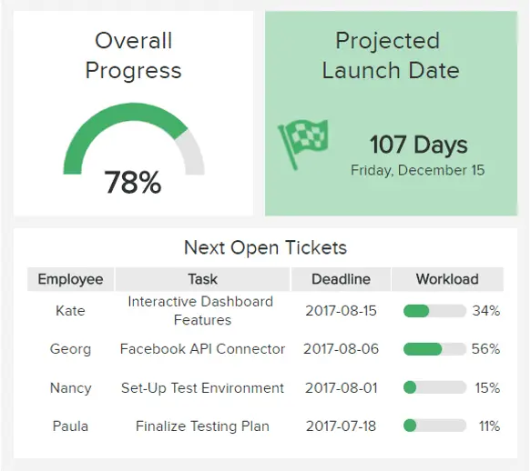

运营 KPI 是一个可量化的值，表示在较短的时间范围内发展。它们用于不同的行业，以跟踪组织流程，提高效率并帮助企业理解和反思结果。

例如，属于运营的[零售 KPI（](https://www.datafocus.ai/infos/kpi-examples-and-templates-retail)例如我们将在本文后面更详细介绍的订单状态）对于每天监控至关重要，因为您将更深入地了解订单不同状态的实时更新 - 它是发货、取消、接收还是仍在包装过程中。根据行业和职能，您需要在正确的时刻跟踪正确的 KPI。

## 战略和运营指标有什么区别？

使用指标和 KPI 进行绩效跟踪是一个复杂的过程，可能会让组织感到困惑。在深入研究我们列出的 22 个强大的运营 KPI 示例之前，让我们看看这些指标在业务环境中的范围。我们将通过说明战略绩效衡量标准和运营绩效指标之间的差异来做到这一点。

为此，了解指标和 KPI 之间的区别也很重要。简而言之，KPI 跟踪更多的长期公司目标，而指标跟踪为实现这些目标而实施的不同措施的进度。这就引出了战略流程和运营流程之间的主要区别。

一方面，战略指标跟踪公司的核心目标，通常是长期的。例如在规定的时间段内将收入增加一定百分比。另一方面，业务指标衡量为实现该战略目标而努力的不同活动的进展情况。例如，潜在客户转化率、净利润率或潜在客户机会比率，仅举几例。

战略和运营指标直接连接以实现成功的分析过程至关重要。这是因为跟踪不同级别的 KPI 可以让您轻松发现改进机会并确保实现目标。例如，如果您的战略目标是提高客户满意度，而您没有达到预期目标，则可以向下钻取到较小的运营指标，并了解缺少哪个领域并影响总体战略。

也就是说，让我们深入研究示例以继续透视所有这些。

## 前 22 个运营指标示例

虽然有许多运营指标可供选择，但公司需要注意哪一个至关重要和价值。话虽如此，我们将讨论可用于业务流程的操作指标示例，并概述最突出的示例，同时使用[业务分析工具](https://www.datafocus.ai/infos/best-bi-tools-software-review-list)作为我们的宝贵帮助。

1\. 营销：每次点击费用（CPC）

建立特定的运营指标并跟踪其效率可以为任何营销活动创造宝贵的结果。让我们通过一个例子来了解这一点。

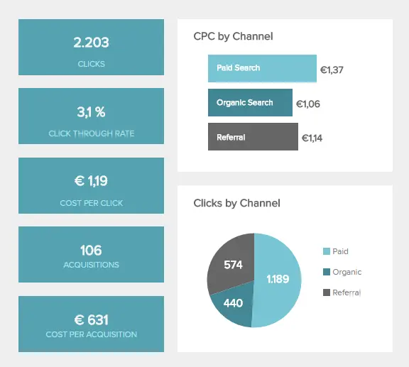

广告系列的CPC（每次点击费用）概览是一个操作指标，阐述了在线广告中的标准定价模型。在比较整体策略的每次点击费用部分中的不同广告系列时，您可以轻松发现哪个广告系列的价格最低，并更深入地了解详细信息。虽然这个[营销KPI](https://www.datafocus.ai/infos/kpi-examples-and-templates-marketing)在广告方面是无价的，但它应该与其他重要的运营指标联系起来看待。在本文的下方，您可以找到标准营销实践中使用的不同类型KPI的整体概述。

2\. 营销：CPA（每次获取成本）

我们可以分析的另一个示例是与特定营销渠道相关的 CPA（每次获取成本），如上面的视觉效果所示。CPA 指标更加基于效果，因为它集中在获取客户的价格上，而不是对网站的点击量。使用这些指标来反映运动的结果并建立未来的进程可能具有宝贵的意义。

3\. 人力资源：缺勤率

另一个例子来自人力资源行业，并考虑了员工的敬业度。这是一个极其重要的人力资源 KPI，因为它专注于建立成功的[人力资源](https://www.datafocus.ai/infos/kpi-examples-and-templates-human-resources)战略所需的主要劳动力行动——打电话生病、缺勤或逃课的员工数量可以告诉组织它将产生什么样的影响从长远来看。

这是可能直接影响公司整体福祉的运营 KPI 之一，与历史数据进行比较以疏散缺勤率是否特定于一个部门或整个公司是有意义的。这样，您将能够采取措施并改善整体情况。

4\. 人力资源：加班时间

员工的工作量是一个运营 KPI，如果劳动力人手不足并承受更大的压力，可能会影响缺勤率。应详细监控该指标，因为可以根据上下文对其进行不同的解释（例如，经济增长或大量订单是否导致加班时间，还是完全不同的原因？

这是指标示例之一，也有助于招聘流程，因为您将知道公司中存在什么样的氛围，并将其用作与潜在候选人进行招聘谈判的论据。如果您想解决更深层次的人力资源主题，您可以阅读我们关于[招聘指标](https://www.datafocus.ai/infos/recruitment-metrics-and-dashboards)的综合指南。

5\. 零售：订单状态

在零售业中，每个订单都很重要，这就是为什么在较短的时间内跟踪订单状态很重要的原因，无论是发货、接收、包装过程中还是取消。这种[临时分析](https://www.datafocus.ai/infos/ad-hoc-reporting-analysis-meaning-benefits-examples)将告诉您，如果他们从未收到包裹，您是否冒着客户投诉的风险，或者您是否需要推动供应链游戏。如果处理速度缓慢，您将立即知道链条的哪个部分需要进一步调整，以及如果您没有操作手段来跟踪大量订单，您是否需要扩展业务。这是确保客户满意的关键运营指标之一，但它也可以让您了解您的业务是否在增长以及您是否需要进一步的帮助。请记住，在订单增长的情况下，您也应该能够看到收入增长，然后将这些运营 KPI 与战略 KPI 联系起来。

6\. 零售：按地区划分销售额

作为建立良好销售流程必不可少的运营指标之一，按区域划分的总销售额将帮助您确定哪些位置具有最佳绩效。这是应在运营和战略层面跟踪的卓越运营指标之一，因为了解您的销售活动是否带来结果或您需要其他调整非常重要。但是，让我们专注于操作。

如果您在较短的时间段（例如每天或每周）内跟踪此操作 KPI，您将了解您的特定广告系列的效果以及它们是否继续带来积极的结果。此外，您的销售经理将有更好的机会优化他们的未来定位并提供更好的结果。更详细地说，您将有可能评估哪些位置表现最佳，您的产品被认为最有价值，并在位置之间进行比较以了解哪些有效，哪些无效。例如，如果您在周五看到不同州的某个峰值，您可以进一步调查，看看您是否也可以在其他地方[实施相同的策略](https://blog.treasuredata.com/blog/2019/08/20/5-geo-targeting-success-stories-and-what-you-can-learn-from-them)。请记住每个位置的差异和特殊性。

7\. 销售：潜在客户与机会比率

在上面的销售示例中，潜在顾客与机会比率提供了销售专业人员或经理需要保持收入目标的线索数量的见解。由于这是销售漏斗的第一部分，因此您可以轻松发现哪些潜在客户已转变为合格的潜在客户并轻松计算比率。深入研究合格潜在客户的确切来源是有意义的，这样您就可以更好地指导营销和销售团队。要充分了解销售流程中的运营绩效指标，您可以查看我们关于[销售图表](https://www.datafocus.ai/infos/sales-graphs-and-charts-for-managers)的综合文章。

8\. 销售：潜在客户转化率

最重要的[销售 KPI](https://www.datafocus.ai/infos/kpi-examples-and-templates-sales)之一是潜在客户转化率 - 它定义了转化为实际付费客户的感兴趣人数 - 确实是一个神奇的销售数字。找到基线后，您将了解需要获得多少潜在客户才能获得健康的销售渠道。如果转化率较低，您可以确定管道和目标指标需要进一步调整。

您的机会：[想要轻松可视化和跟踪运营指标？](https://www.datafocus.ai/console)试用我们的专业报告软件14天，完全免费！

9\. 物流：交货时间

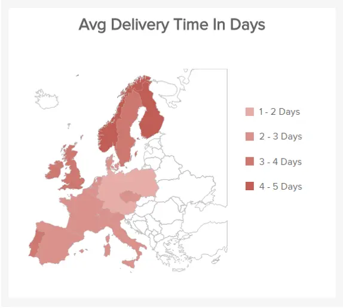

标准[物流 KPI](https://www.datafocus.ai/infos/kpi-examples-and-templates-logistics)，即交货时间，衡量订单下达发货与交付给客户或邮局之间的天数。然后，平均金额将显示您需要在何处减少这些值，并为指定客户可以收到包裹的确切日期提供基础。这是一个重要的指标，您可以将其纳入您的物流运营中，以确保为您的公司获得最佳结果，并与客户建立有利可图的融洽关系。

10\. 物流：运输成本

与运输过程相关的所有成本都可以在上面的例子中看到：订单处理、管理成本、库存结转、仓储，最后是实际运输成本。这将有助于确定平均数量和以百分比表示的分布，这是成功的[物流分析](https://www.datafocus.ai/infos/logistics-analytics)流程优化的关键组成部分。最终目标是降低成本，同时保持高质量的交付流程。物流的运营 KPI 将帮助您确定供应链、运输和仓库绩效的运行状况。

11\. IT：总票证与未结票证

项目的整体进度是要衡量的首要[IT KPI](https://www.datafocus.ai/infos/kpi-examples-and-templates-it)之一。在可视化发布日期相关性的总体进度时，管理层可以轻松发现整个系统是否存在问题。这就是为什么监控员工的工作量和他们的截止日期也很重要，如我们上面的一个示例所示。衡量未结工单与已完成工单可以为项目管理设定基准，并有助于优化整个工单系统。

12\. IT：平均处理时间

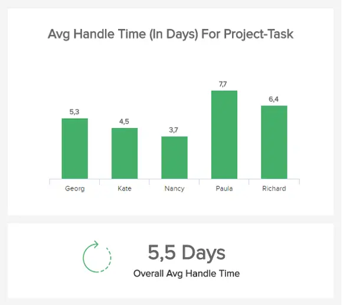

IT项目管理功能的另一个示例是任务的平均处理时间。它有助于监控计划的项目、任务和/或冲刺。通过评估团队的每个成员以及任务的总体平均处理时间，您可以轻松发现系统中是否出现任何缺陷，从而做出相应的调整。这是对项目经理和整个团队至关重要的指标之一，因为您将获得有关分配给项目的人员如何处理其工作量的详细信息。

第13章 制造业：生产量

运营指标的第一个[制造 KPI](https://www.datafocus.ai/infos/kpi-examples-and-templates-manufacturing)示例是生产量。此指标可让您大致了解您的工厂在一个月、学期或一年内能够生产的产品，具体取决于您需要可视化的数据。通过跟踪此运营 KPI，您可以了解机器是否表现不佳并减慢了您的生产过程，或者确定哪些机器以最有效的方式运行并相应地规划您的生产策略。生产量的良好基准应该满足需求，但不要在库存中留下大量库存。

14\. 制造：生产停机时间

接下来，我们有生产停机时间。这是在制造业中跟踪的最相关的运营指标模板之一，因为生产停机意味着您的业务赚的钱更少。为了尽可能减少停机时间，您需要不断监控机器的性能，并在任何低效率问题成为更大问题之前发现它们。还可以安排您的生产停机时间，以防止影响整个生产过程的任何意外。

15\. 物流：拣选准确性

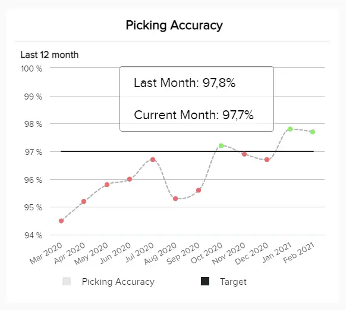

我们的下一个示例旨在监控订单总数中拣选的无差错订单的百分比。它是用这个简单的公式计算的：（订单总数 - 退货到期错误项目）/（订单总数）。这是一个需要跟踪的重要指标，因为低拣选准确性意味着您的客户会收到错误的物品，并且对您公司提供的服务不满意。出于这个原因，您应该始终制定拣选策略，这也将节省重新定位错误运输物品的成本。

16\. 物流：拣货和包装周期时间

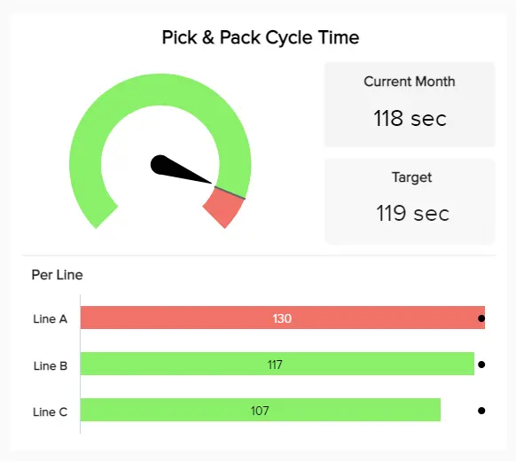

我们运营KPI的下一个是拣货和包装周期时间。此物流指标监控员工从货架上拣选物品到包装并准备发货的分拣和订购时间。在上面的例子中，我们看到周期长度是根据上个月结果的目标在 3 个不同的工作行中跟踪的。单独跟踪每条工作线使您能够在每条生产线上实施不同的拣选和包装策略，并测试哪一条最省时。

17\. 财务：应收账款周转率

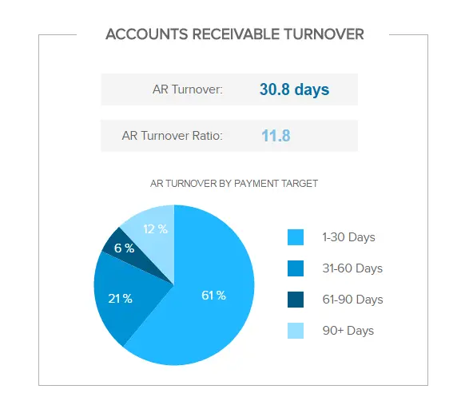

继续以财务分析为例，应收账款周转率是[财务](https://www.datafocus.ai/infos/finance-analytics)和运营经理经常使用的 KPI，用于了解公司收取应收账款的速度。从本质上讲，该指标衡量公司管理其向客户提供的信贷的效率以及收取或支付信贷所需的金额。您的企业越快将其信用转化为现金，您的流动性就越高，因此保持该比率尽可能高非常重要。应收账款周转率低意味着公司信贷政策中的某些内容无法正常工作，需要优化。

18\. 财务：流动比率

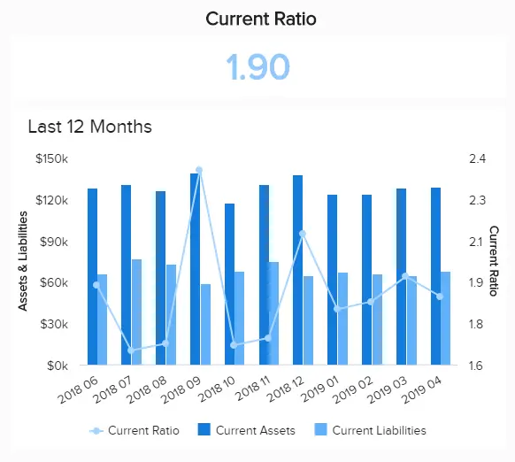

流动比率是另一个专注于流动性的财务运营 KPI。它衡量一个组织在短期内（通常在 12 个月内）支付债务的能力。它通过告诉投资者公司在最大化其现有资产以偿还债务方面的能力，为投资者提供了企业财务状况的更大图景。与其他流动比率不同，流动比率在其计算中包括所有流动资产和负债。理想情况下，您应该将当前比率保持在高于 1 的水平，因为较低的数字意味着您可能无法在债务到来时偿还债务。

19\. 医疗保健：患者等待时间

患者等待时间是最直接的[医疗保健 KPI](https://www.datafocus.ai/infos/kpi-examples-and-templates-healthcare)之一，它在很大程度上说明了医院或护理机构的运营效率。顾名思义，它跟踪患者从注册到实际看医生或接受治疗所需的平均时间。该指标与患者满意度高度相关，因此针对不同的医院部门进行衡量非常重要。例如，急诊室等待时间长可能意味着人手不足。要解决此问题，您可以确定高峰时间并相应地计划人员配备时间表。

20\. 医疗保健：再入院率

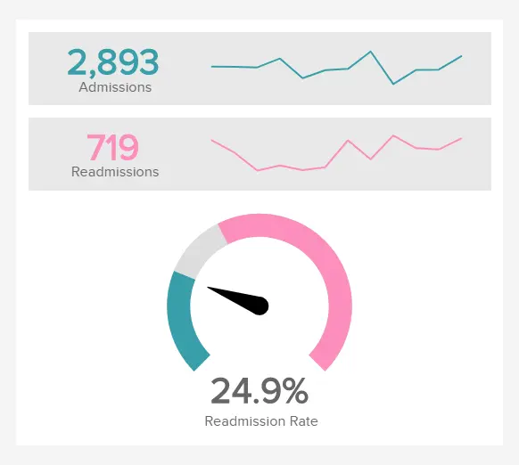

继续研究医疗保健行业的运营指标类型，我们有再入院率。它提供了有关在短时间内出院后返回医院的患者数量的见解。这是一个基本指标，因为它衡量医疗机构为患者提供优质护理的能力。当然，您希望将这个比率保持在尽可能低的水平，较高的再入院率可以揭示许多其他问题，例如缺乏员工或适当的材料或超负荷的员工忽略细节。通过优化您的再入院率，您不仅可以确保为患者提供最好的护理，还可以避免不必要的再入院的额外费用。

21\. 客户服务：首次呼叫解决

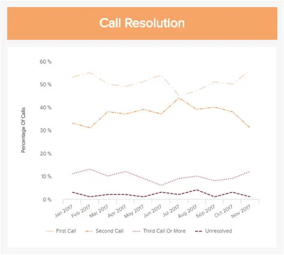

在运营 KPI 和绩效管理方面要跟踪的另一个重要领域是客户服务。为了正确看待这一点，我们选择了第一个呼叫解析指标作为示例。此指示器跟踪在第一个呼叫中解决的支持呼叫的百分比。没有人愿意多次打电话来解决一个问题，因此，不仅跟踪客户满意度而且跟踪团队进度是一个基本的 KPI。在示例中，我们可以看到第二次调用分辨率的百分比很高。优化这一点的一种方法是为支持代理提供培训实例，以快速有效地解决最常见的问题。

22\. 客户服务：平均响应时间

按照我们前面的示例相同的行，平均响应时间是[客户服务 KPI](https://www.datafocus.ai/infos/kpi-examples-and-templates-customer-service)之一，用于监控客户呼叫问题与代理响应问题之间的时间。这是一个需要跟踪的重要指标，因为它会显着影响客户满意度水平。较短的响应时间意味着您尊重客户的时间，并希望为他们提供最好的支持。为了尽可能缩短响应时间，请确保分析客户呼叫最多的时间，并准备装箱时间表以满足需求。

您的机会：[想要轻松可视化和跟踪运营指标？](https://www.datafocus.ai/console)试用我们的专业报告软件14天，完全免费！

## 互联的运营指标和关键绩效指标

在我们提供了来自行业和职能的特定 KPI 之后，现在我们将专注于整体概述，以及它们如何相互关联到整个运营流程中。让我们通过示例来分析这一点。

### 营销：我的预算是否正常？

\*\*点击放大\*\*

上面介绍的运营 KPI 示例侧重于特定活动在运营层面的营销绩效。其意义在于，这种清晰的概述可以帮助营销经理和专业人士制定全面的[数据驱动营销策略](https://www.datafocus.ai/infos/data-driven-marketing-strategy)。更改将提醒营销团队，然后营销团队可以优化广告系列并确保预算保持在正轨上。

### 人力资源：我们的生产力是否步入正轨？

我们将关注的第二个运营指标示例是员工绩效，通过下面介绍的[人力资源仪表板](https://www.datafocus.ai/infos/dashboard-examples-and-templates-human-resources)显示。

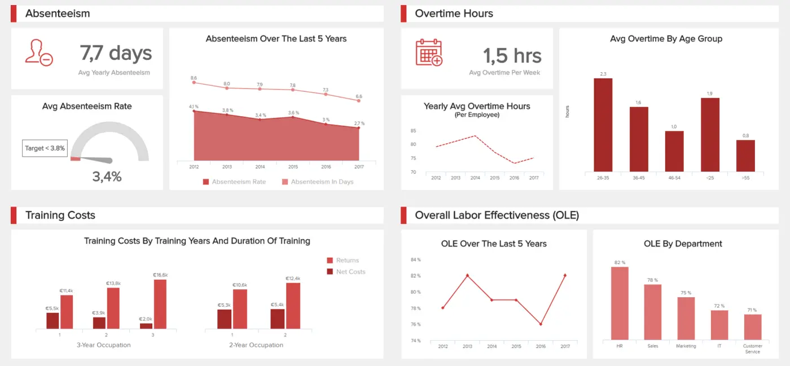

\*\*点击放大\*\*

此[交互式仪表板](https://www.datafocus.ai/infos/interactive-dashboard-features)示例显示了在分析员工绩效和行为时需要密切考虑的相关指标。应监控缺勤率指标，因为它会影响企业的财务状况（整体视图，还记得吗？），但最重要的是，它可以提供对缺勤的潜在原因和原因的见解。然后，这可用于改善业务运营和生产力，从而降低成本。

另一个需要考虑的有趣指标是加班时间。如果员工人手不足或缺乏培训，这种方式很容易被发现，这也会影响生产力。主要重点是不要让工人承受可能导致士气低落的压力。全面的[人力资源报告](https://www.datafocus.ai/infos/monthly-and-annual-hr-report-templates-)可以利用在公司中发展和维护可持续员工队伍所需的所有有效性。

### 零售：我的在线销售业绩如何？

\*\*点击放大\*\*

我们的下一个示例是使用[零售分析软件](https://www.datafocus.ai/infos/retail-analytics)创建的，它侧重于在线销售。这个可视化工具充满了运营指标，为您提供了一年的总订单等方面概览，并搭配完美的订单率，以便您可以评估整个销售和交付流程的成功。较低的完美订单率意味着您的客户在订购过程中的某个时刻面临影响您商业声誉的问题。

与此配对，您将获得与退货和最畅销商品相关的其他零售 KPI。一方面，深入了解退货原因可以帮助您发现流程中的任何低效率问题，并解决这些问题以避免不满意的客户和额外费用。另一方面，清楚地了解您的畅销产品可以帮助您根据预期的销售额计划库存并计划宣传策略以利用最畅销的产品。

### 销售：我应该注意哪些细节？

我们接下来将关注的运营指标示例之一是销售。在考虑销售周期流程时，最重要的是编制一个简洁的运营监控流程，以确保涵盖导致转换的所有销售阶段。

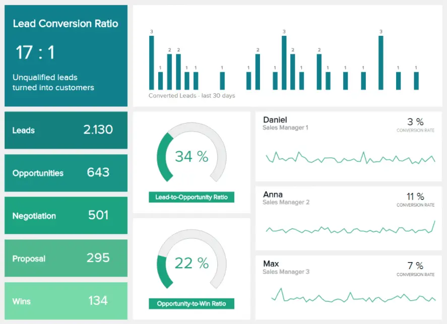

\*\*点击放大\*\*

上面示例中显示的 KPI 提供了编制销售转化率周期整体概览所需的操作详细信息。潜在客户并不总是转化为机会，提案也并不总是产生胜利，但指标的监控过程可以轻松确定整体绩效是否按计划进行。魔力在于细节，此[仪表板演示文稿](https://www.datafocus.ai/infos/dashboard-storytelling-with-kpis-presentation-examples)可以有效地汇总您需要的数据故事。

将信息编译成视觉叙述可以帮助组织破译所有原始数据波，因为人脑处理视觉效果的速度[比数字快 60.000 倍](https://www.emailaudience.com/research-picture-worth-1000-words-marketing)，然后可以实现运营指标、KPI 之间的多维关系连接，并理解部门间和不同的组织级别。

### 物流：我的运输过程效率如何？

我们将讨论的下一个示例集中在运营运输的物流层面。在详细的性能水平上监控车队效率 - 有多少在移动中，有多少在维护中，将帮助您收集制定可持续战略所需的数据，或监控 KPI 是否正常。

\*\*点击放大\*\*

在设定的时间范围内查看的装载时间和重量将为您提供有关运输过程的平均数量和控制点以及您运行运营效率的见解。

### IT 项目管理：我的项目是否达到目标？

\*\*点击放大\*\*

通过深入了解 IT 绩效的项目管理，上面的[IT 仪表板](https://www.datafocus.ai/infos/dashboard-examples-and-templates-it)示例提供了获得可持续效率水平所需的 KPI 和指标的整体视图。项目管理的概述可以提供快速准确的知识，以建立平稳的运营绩效。因此，它将降低成本，因为任何可变性都将在这个简单的交互式仪表板中清晰地可视化。

### 客户服务：我的团队表现如何？

团队在客户服务环境中的表现对于为希望在竞争激烈的经济中生存的公司实现业务增长至关重要。了解什么是业务指标（尤其是客户服务）的重要性在于能够快速做出反应，立即访问信息，以及每个人在正确的时间拥有正确的信息。这就是为什么[客户服务仪表板](https://www.datafocus.ai/infos/dashboard-examples-and-templates-customer-service)是评估销售、订单和整体运营绩效指标的多个接触点的关键工具。

\*\*点击放大\*\*

此类[商业智能仪表板](https://www.datafocus.ai/infos/bi-dashboard-best-practices)使团队能够清楚地了解运营经理最重要的指标，并简化解决方案和响应时间。从首次呼叫解决率、未解决的呼叫、工作日的响应时间和最佳呼叫日期等基本指标，运营团队有权监控和优化其流程，以提高客户满意度。

### 制造：确保高效的生产流程

在制造业中，运营效率是关键。更全面地了解诸如生产量与数量订单以及机器功能等指标，可以帮助您了解面对生产目标的准备情况，并实施尽可能提高生产力的策略。

\*\*点击放大\*\*

效率低下是制造企业的最大敌人，因此，在专业的[制造仪表板](https://www.datafocus.ai/infos/dashboard-examples-and-templates-manufacturing)中同时监控这些运营指标可以帮助您优化流程，发现任何隐藏的趋势或效率低下，并让企业中的每个人都了解生产状态。除了所有生产指标之外，此模板还按原因跟踪退货商品，这将帮助您更深入地研究原因并找到解决方案，以减少退货数量并节省处理损坏物品的大量成本。

### 物流：您的拣选和包装过程的效率如何？

\*\*点击放大\*\*

我们的最后一个例子是[物流仪表板](https://www.datafocus.ai/infos/dashboard-examples-and-templates-logistics)，它直接关注拣货和包装过程的运营效率。通过将运营 KPI 分为 4 大类别财务、有效性、利用率和质量，此模板可让您更全面地了解与订单处理相关的所有相关领域的绩效。

一方面，跟踪包装材料的使用或退货成本等指标可以帮助您实施策略，将成本降至最低。另一方面，跟踪设备利用率以及拣选和包装周期长度将帮助您发现可能影响生产力的任何低效率，并及时找到有效的解决方案。从长远来看，您将能够优化所有相关流程并降低成本，同时仍然提供优质服务。

### 财务：确保高效的现金管理

\*\*点击放大\*\*

我们正在继续使用[财务仪表板](https://www.datafocus.ai/infos/dashboard-examples-and-templates-finance)示例，该示例侧重于实现高效的现金管理流程。它通过应付账款和应收账款、现金余额、流动比率等指标提供您的业务流动性和当前现金流的概述来做到这一点。

为此，仪表板分为两个部分。最重要的是，我们有营运资金，可以深入了解您的企业在短期内偿还债务的能力。这使您可以了解组织的整体财务状况。在底部，我们有直接影响您的业务现金流的现金转换指标。在这里，我们获得了有关应付账款和账户周转率的数据，这些数据分别衡量您支付自己账单的速度以及您收取欠款的速度。

### 医疗保健：你们提供优质的护理吗？

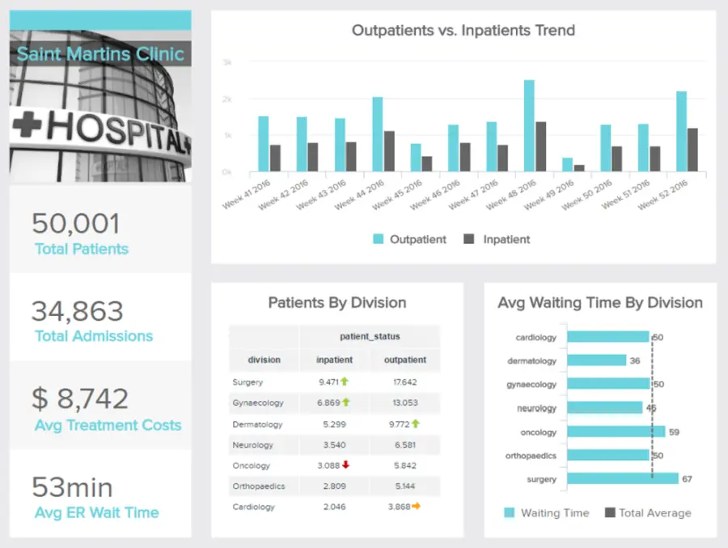

\*\*点击放大\*\*

最后但并非最不重要的一点是，我们有一个[医疗保健仪表板](https://www.datafocus.ai/infos/dashboard-examples-and-templates-healthcare)，用于跟踪有关医院绩效的各种运营指标。此示例是一个集中式工具，允许医院管理人员全面了解每个相关方面，以确保高效的设施管理。通过这种对数据的实时访问，管理人员可以发现趋势和改进机会，以确保设施为患者提供出色的护理。

正如我们在医疗保健示例中的运营 KPI 列表中看到的那样，按部门跟踪患者等指标并将其与平均等待时间进行比较可以揭示一些可以轻松优化的问题。例如，我们可以看到外科部门的住院患者是最高的，这与同一部门的等待时间最长的事实相吻合。因此，需要采取一些措施来确保手术的平均等待时间。

## 如何选择运营指标和关键绩效指标？

由于每个业务都是不同的，因此必须建立特定的指标和 KPI 来衡量、跟踪、计算和评估。如前所述，两者都用于衡量业务绩效，因此我们将讨论哪些场景应该在哪些场景中使用，以及在为您的业务选择合适的场景时要注意什么。

业务管理环境中的关键绩效指标应由需要考虑的 4 个主要参数组成：

- 究竟需要测量什么？
- 谁来衡量它？
- 测量之间的时间间隔是多少？
- 向管理层发送信息的频率如何？

将这些数据集转换为业务仪表板可以有效地跟踪正确的值，并为整个[业务](https://www.datafocus.ai/infos/dashboard-examples-and-templates-)系统提供全面的应用程序。

通过将原始数据转换为整洁的[交互式在线仪表板](https://www.datafocus.ai/infos/online-dashboard)，可以轻松开发使用正确的 KPI 软件分析运营[KPI](https://www.datafocus.ai/infos/kpi-dashboard-software)和指标，提供在创建传统报告和分析方法（如电子表格或简单的书面报告）时容易被忽视的见解。如果没有正确定义和使用，运营 KPI 和指标可能是巨大而无限的，因此在决定使用哪一个时，照顾我们概述的上述基础知识应该是重中之重。稍后我们将讨论示例，以便清楚地概述在行业和功能层面上识别和使用哪个示例。

当企业衡量流程的有效性时，通常会建立指标和 KPI 来执行评估和分析。要考虑的关键因素也是对正在识别和使用的操作指标采用整体视图。一个企业不能只跟踪一个，并期望获得可持续发展。通过使用多种类型的指标和专业的[运营报告](https://www.datafocus.ai/infos/strategic-operational-reporting)工具，公司可以利用更多数据并获得成功所需的见解。为了成功定义指标，我们将重点关注 22 个示例，并展示指标报告在操作级别上的外观。

您的机会：[想要轻松可视化和跟踪运营指标？](https://www.datafocus.ai/console)试用我们的专业报告软件14天，完全免费！

## 指标在业务中的含义 - 关键要点

我们介绍了关键指标定义，重点关注运营管理指标，并提供了可视化示例，然后是它们在某些用例中的互连性。现在，您可以从多个运营 KPI 示例中进行选择，根据您在公司中的职能进行调整，并创建一个运营指标仪表板，其中包含所有重要信息，以产生长期业务成功。

通过收集正确的数据、可视化、利用实时更新以及与相关利益相关者分享见解，团队的每个成员都有机会超越他们的目标，立即对效率低下采取行动，并建立积极的、数据驱动的文化，这将使整个公司受益。运营经理的 KPI 是一种宝贵的工具，可确保企业的运营水平[以健康的方式运作](https://www.fortunebuilders.com/how-to-manage-my-own-business)，并且业务难题的每个部分都有监控、分析、评估和生成可操作见解的手段。这样，公司就可以成长，团队可以确切地知道要关注什么，诸如提高生产力和效率之类的结果将随之而来。

总而言之，如果您设置有价值的指标来跟踪公司的绩效，则可以有效地管理运营指标和 KPI 的各个方面，从不同的行业、运营水平和建立可持续发展所需的特定流程来看。这不仅仅是收集数据，还涉及在正确的背景下解释它们，并组织它们以补充公司的情报绩效，以提供[积极的结果](https://www.prophet.com/2017/09/develop-successful-business-growth-strategy)和增长。要成功定义指标，您需要仔细研究您的业务，并且

为了正确看待事情，以下是来自不同职能和行业的前 22 个运营指标：

- 中国共产党
- 注册 会计师
- 加班时间
- 缺勤率
- 订单状态
- 各地区销售额
- 潜在客户与机会比率
- 铅转化率
- 交货时间
- 运输费用
- 总票证与未平仓票
- 平均处理时间
- 产量
- 生产停机时间
- 拣选精度
- 拣选和包装周期时间
- 应收账款周转率
- 流动比率
- 患者等待时间
- 再入院率
- 首次呼叫解决
- 平均响应时间

要开始您自己的运营数据故事，请试用我们的软件，免费试用[14 天](https://www.datafocus.ai/console)！
