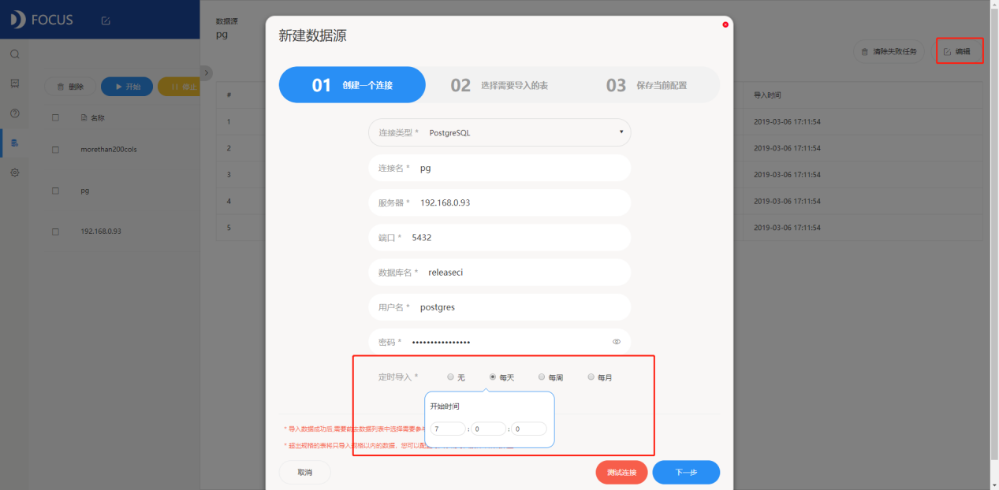

我们经常可以看到大数据、数据可视化、数据分析、数据仓库等词汇，但对他们的具体概念总是很模糊。那商业智能和它们又有什么关系呢？到底什么是商业智能（BI）呢？

相信Excel这个办公软件很多人有用过，毕竟从小学信息课开始我们就接触Excel了。在日常办公中，我们常常使用Excel做简单的统计图像。一般企业会用Excel来处理营销数据。但是随着商业信息化，数据量的暴增和数据来源的复杂化，除了日常的业务结果洞察，我们还希望更深入的了解自己的企业。所以我们需要把多个Excel文件复制粘贴到一块，才能进行全局分析。但是这样操作起来会很麻烦，而且当数据量达到一定数量级时，Excel就无法承载了。所以，我们希望数据的整合清洗都不需要自己手动来操作完成，而是可以自动的完成，希望有人可以定期地给自己发送报告而不是手动重复的分析一张又一张的报表。那么，那么，欢迎来到商业智能系统的世界！

将所有的数据收集到一起，集中为“数据仓库”，商业智能系统可以连接你的每一个业务数据系统，将数据自动引入“数据仓库”。像DataFocus商业智能系统还可以设置数据源自动更新，如此一来只要一旦将可视化报表框架固化以后，就会根据更新的数据源自动更新图表内容，再也不用重复做报表了。

数据可视化是商业智能中的一个很重要的功能，而且越来越自助。像DataFocus就使用了自然语言搜索引擎，对话式搜索分析，数亿级数据秒级响应，很智能，数据分析不再掌握在专业数据分析师手上，普通企业人员也能迅速上手。里面还存有丰富多变的图表，可以进行智能推荐。

可视化大屏，这个词汇是越来越火，也是可以通过商业智能系统制作出来的！我们可以将一组目标业务信息做成可视化图表放进同一个数据看板中，然后进行美化，一张可视化大屏就完成了。DataFocus只需10分钟就可以做完一个数据看板，还支持联动钻取等高级功能，交互式分析让你一眼就发现问题，找到关键，获得决策之道。

现在你知道什么是商业智能了吗？对企业来说，部署商业智能系统真的是很有价值！
