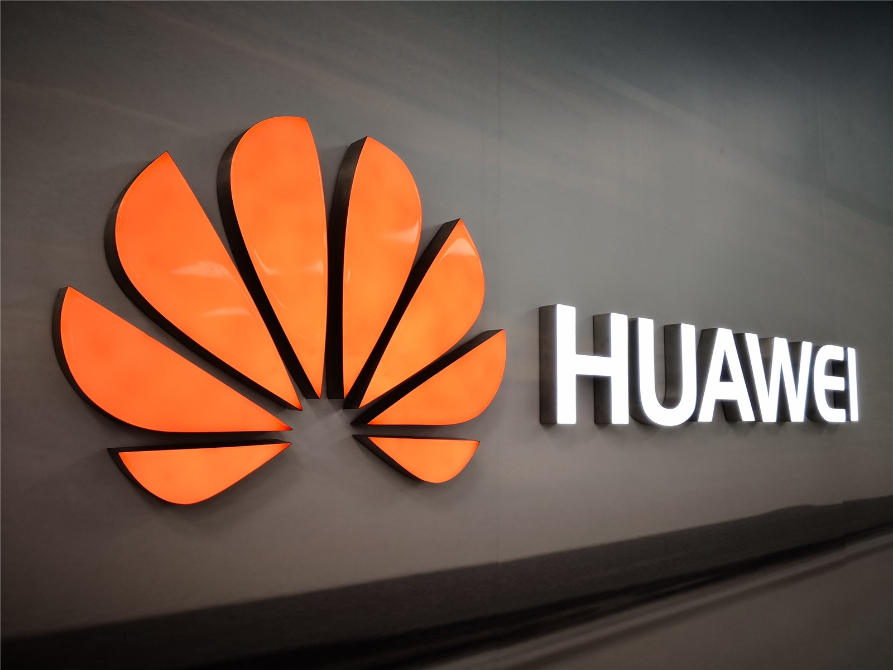
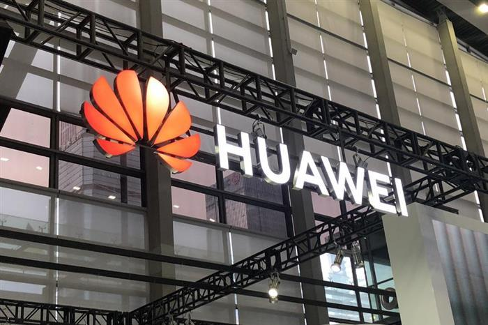

由于长久以来老美的打压，华为始终没法实现独立开发5G手机。和以往相比，华为手机销量大不如前，已经下降近2亿台。

好在华为并没有放弃而是迎难而上，还是在陆续推出新机。只不过华为推出的一些新机虽然被称作5G手机，但并不是真正意义上的5G。

华为的确有麒麟9000这样的5G芯片，也把它用在了P40、Mate40、MateX2等手机上，但**同样关键的5G射频前端被垄断了**，所以生产出来的5G手机却只有4G功能。

要靠外厂供应5G射频前端的华为还是等于被卡脖子，渴望独立的发展被限制了。

但最近市场里传出一则劲爆消息，华为在2022年即将发布的Mate50将整体完全”国产化”。

这可能实现吗？

### 整体完全”国产化”可能性如何？

其实目前华为的国产化程度已经很高了，拿华为P50为例，核心零件除了运行内存外，其它的核心零件都是采用国产品牌。

但实现100%国产化还是有一定难度。

爆料称华为Mate50系列搭载骁龙8+或者骁龙8 Gen1 等4G处理器，不是国产的，也不是5G处理器。

另外华为曾提出的**堆叠封装技术方案**还没有证实完全实现，就算有了技术没有代工也很麻烦，仍有很多元件都需要自主研发。

如果芯片、电池、相机传感器、内存等全部采用国产元器件代替，那么手机整体水平可能会下滑，而华为Mate系列又是走顶端路线。所以这次，Mate50实现整体完全”国产化“的可能性还挺小的。

但是不久的未来还是非常可能的。

### 华为5G手机逆袭不无可能

首先是关于5G芯片问题，华为海思有自主研发的实力，曾经提出的3D堆叠技术如果研发出来，能大幅提升芯片性能。而5G射频前端，则需要国产厂商的共同努力了。

根据机构yole的数据显示，**2021年Skyworks、村田、高通、Qorvo 和博通五大厂商占据了全球射频前端市场84%的份额**。而国产厂商占据10%左右的份额，获得增长15%。

而近期，如**富满威、卓胜威等国产芯片企业宣布5G射频芯片研发成功**，并已实现大规模量产，这一点更是助力华为解决5G手机关键技术难题。

虽说中国在后面追赶技术追的是很辛苦，但是实现逆袭是必然的。

同样在软件领域，现在我国的实力还是有所欠缺的。

尤其是数据分析软件，Windows系统推出的Excel或者是国产的WPS受到不少人的追捧，但由于处理量小，遇到更大的数据就满足不了需求了。于是逐渐在被后来兴起的BI工具替代了。

在众多BI软件中，一款叫做**DataFocus的搜索式国产BI软件**开始崭露头角。

相比其它国内外BI软件而言，**这款软件简单又强大，不需要任何代码也不用拖拽，像谷歌一样搜索关键词，系统就会在短短几秒内以适配的可视化图表回答。**

此外，还能满足各行各业的多种场景，一张可视化大屏即可快速定位业务问题，追踪业务目标，助力每位国人都能转型数据分析专家。当真国人之光！

### 小结

就借余承东最近在消费者业务内部宣讲会上的吉言，希望华为能在”2023年王者归来”。而越来越多的国产软件也能成为国人心中的骄傲。对此，你怎么看呢？欢迎评论区评论、分享。
