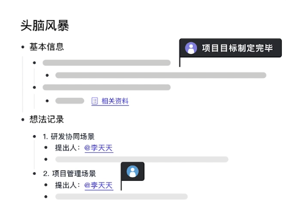
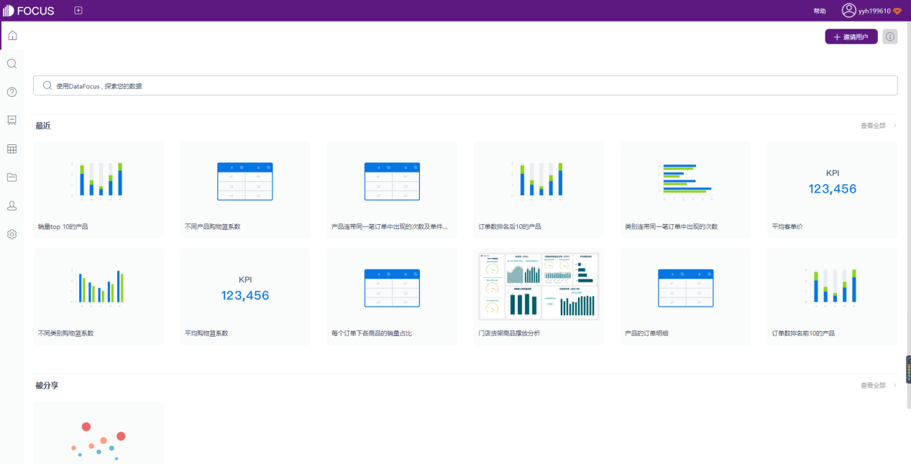
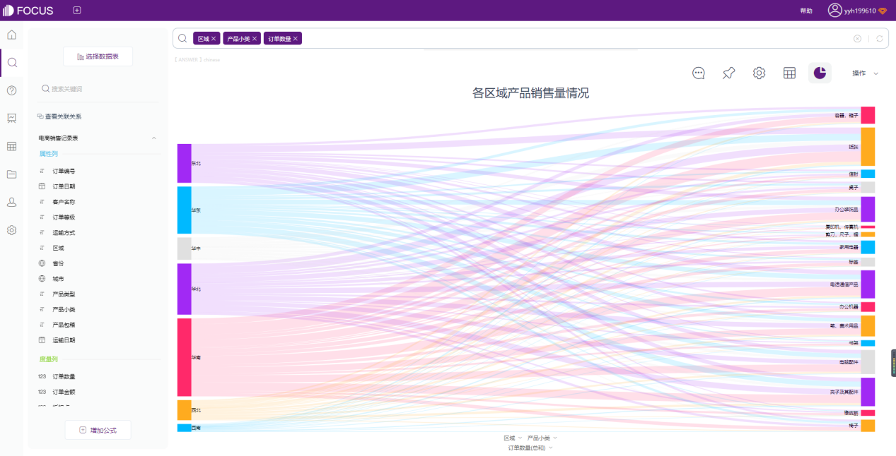

推荐4个工作中必备、专业性又强的良心国产软件，尤其在疫情期间，使用起来工作效率会更高。

话不多说，我们直接进入正题。

**剪映专业版**

剪映专业版，是一款全能易用的桌面端剪辑软件。

****

用过剪映移动端的朋友就很熟悉了，你可以快速导入视频，进行剪辑、添加素材和字幕、后期录音等相关操作，最后再一键导出就可以了。

使用起来完全是傻瓜式操作，想怎么剪就怎么剪，关键剪下来的视频质量还很优。

另外，视频必不可少的素材这上面应有尽有，除了自带的系统素材外，还支持搜索音频、表情包、贴纸、花字、特效、滤镜等，视频呈现起来更丰富了。

最重要的是**用起来一点也不卡，而且免费无广告**。

非常适合新手使用，学习成本很低，可直接上手，剪出来的视频还显得你很专业。

**幕布**

幕布，是一款**可以一键将笔记生成思维导图**的软件。

无论是生活、学习，还是工作，记笔记都是一个不错的习惯。但有时光记笔记，并没有清晰且有逻辑地展现，重温笔记的时候就会一头雾水了。

这上面有非常多的模板，直接套用笔记模板就可以了，往模板里填充内容即可。

不想看长篇大段的文字，那就一键转换成思维导图。**将看起来琐碎的事项条条罗列，把复杂简单化。**

这样简约美观的软件用了简直爱不释手。

**腾讯文档**

腾讯文档是一款**多人可同时在线编辑，内容实时同步的办公协作工具。**

****

它解决最大的痛点在于多人协作，团队成员可以使用在线文档、表格共同编辑，自动汇总，省掉了管理者整理的麻烦，而且每周的信息变动还可以一键同步给团队。

此外，它还可以一键提取图片文字、语音转文字，都不用打字就可以录入信息，懒人必备！

同样，里面也包含了文档、表格、思维导图、流程图、PPT、问卷等等多种形式，好用又强大。

当然，这款软件也是免费的，工作团队成员都使用起来，工作效率都会提升不少。

**DataFocus**

DataFocus，是一款**通过搜索即可完成数据分析的优质国产无代码BI平台**。

**它的界面也是比较简约风，操作起来就一个字“爽”。**

响应速度非常快，完全不会卡，而且能把数据一键可视化，这里面还有各种好看的可视化图表，包括桑基图、弦图等高级图表。

还可以将这些图表汇总到一张大屏中，制作出更多美观好用的可视化大屏，大屏中可以对**实时更新的数据进行联动、钻取等操作，分享的数据观点一目了然**。

当然还可以解决数据中的各种难题，比如储存海量数据、解决数据孤岛、数据预警、消息推送、多人协作、数据权限设置、数据预处理......

不管你是来自互联网行业，还是传统制造业，各个领域都可以通过DataFocus对数据处理分析来实现业务增长。

这款产品对新手同样很友好，不需要懂代码，跟着新手引导即可完成一次数据分析。

最近听说这款产品还上云了，甚至还推出了免费版，这样一来就可以随时随地数据分析了，而且性价比非常高了。这样良心的国产软件，谁用了不心动呢？

**小结**

****不积跬步，无以至千里**；不积小流，无以成江海。**

以上就是四款压箱底的职场必备国产良心软件，若你能长期坚持使用，相信假以时日，工作效率必然增进不少。

最后，如果觉得有帮助，欢迎点赞转发。关注我，更多精彩尽在主页和评论区~
