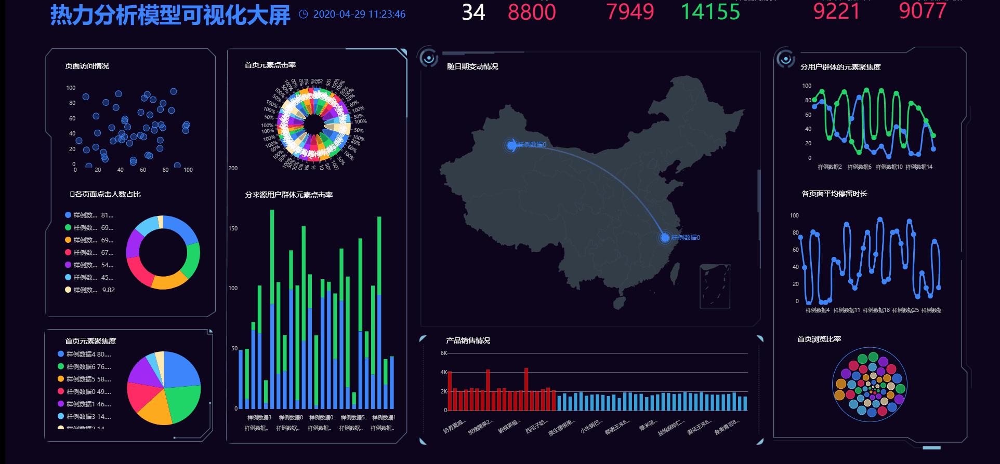

 

 

报表和报告都是企事业单位日常管理中最为重要的信息载体，同时也是企事业单位各层级人员进行信息共享和交流的主要手段。企业经营者要想更好地了解公司整体运营情况，就需要从大量的报表、图表、报告中获取有效信息，为决策提供可靠的参考。

 

然后小编却发现，**在企业目前的各种报表、报告、图表的制作与呈现中，存在着大量问题。这对企业利用大数据做决策是非常不利的。**

 

**问题一：数据孤岛导致效率低下，分析结果可信度低**

 

互联网公司的运营人员都需要在工作中处理大量的数据，但是很多公司的业务数据却处于孤立状态，运营人员无法有效获取自己所需的数据，导致效率低下，也导致做出的分析结果可信度低，没办法真实指导业务发展。

 

**问题二：不同业务部门使用的数据分析工具不统一，图表易读性差**

 

很多公司内部并没有配置统一的数据分析工具，有的部门使用传统的Excel表格，有的部门借助外部的图表制作工具，导致需要协作共同出报告的时候，易读性很差，图表存在各种不规范、不统一的问题。

 

**问题三：数据分析部门业务量大，数据分析结果实时性低**

 

据我所知，目前一些公司的数据支持部门承担着大量基础的数据报表导出与制作的工作，业务量大，但业务价值不高，而业务部门获取数据后还需要进行进一步的筛选核对，如果出现问题还可能推倒重来.....这些都导致数据分析的实时性低，对业务指导的作用有很大伤害。

 

怎么样，扎心了吗？那么这些问题该怎么解决呢？

 

1、统一数据分析工具

改变以往各部门自行使用不同类型的数据分析工具进行处理的模式，统一企业范围内的数据分析工具。这样做统一了相关系统开发商的技术平台，保证制作出来的图表形成一致的风格，同时又便于后期的维护。

 

2、统一图表制作样式

统一工具后，还可以进一步统一图表制作样式，这样可以更方便的对各类图表进行集成，制作多样化的报告，节约所有业务部门的时间，将效率提升几倍。

 

3、统一权限集中管理

对不同部门和业务人员进行权限划分，既有统一角色的协同，也有不同部门的区分。

 

而所有这些难题，其实只需要一个DataFocus就能解决。

 

DaTaFocus集合数据导入、数据处理、可视化分析、账号权限管理、数据安全管理等功能版块，在DataFocus中，你完全可以实现：

 

通过DataFocus建立数据平台，整合企业中不同业务系统内的数据，将数据汇总到同一个数据仓库内，从而可以对所有的数据综合进行分析，告别数据孤岛。

 

**从数据到图形，只需要搜索关键词，即可自动呈现结果，不需要依赖业务人员个人的分析能力和审美偏好，所有人都可以制作出统一、规范、美观的图表。**

 

 

为不同部门和用户配置不同的角色，供企业安全级的细粒度权限控制。既可以满足业务部门的数据需求，又保证企业核心数据的安全。

 

使用DataFocus让企业报表标准化吧，真正让企业数据发挥出更高的价值！！
