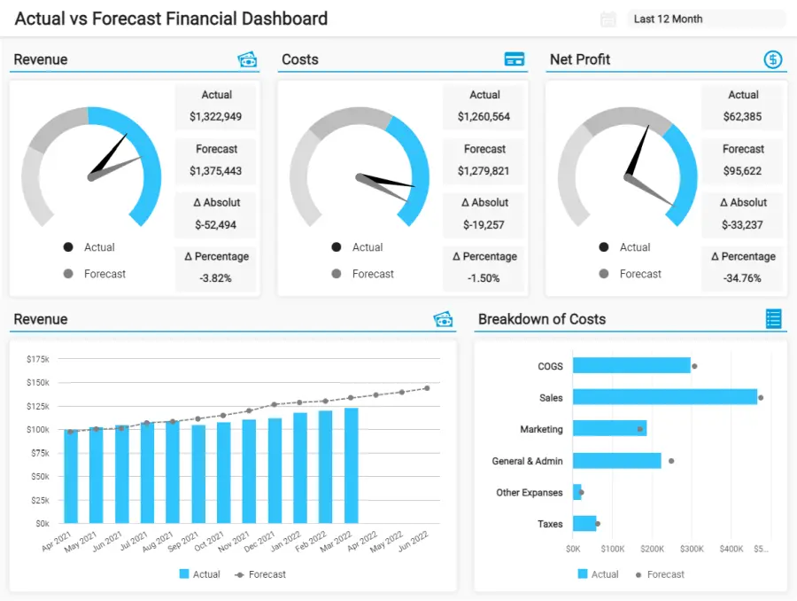
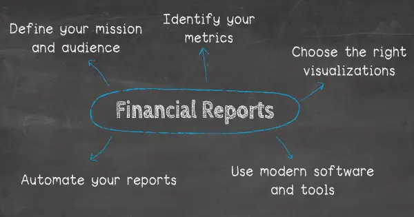
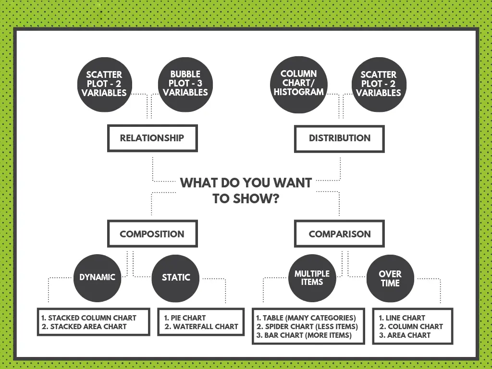

目录

[1） 什么是财务报告？](https://www.datafocus.ai/infos/10-examples-of-financial-reports-you-can-use-for-daily-weekly-monthly-reports#definition)

[2） 财务报告的种类](https://www.datafocus.ai/infos/10-examples-of-financial-reports-you-can-use-for-daily-weekly-monthly-reports#types)

[2） 年度财务报告示例](https://www.datafocus.ai/infos/10-examples-of-financial-reports-you-can-use-for-daily-weekly-monthly-reports#annual-examples)

[3） 月度财务报告示例](https://www.datafocus.ai/infos/10-examples-of-financial-reports-you-can-use-for-daily-weekly-monthly-reports#monthly-examples)

[4） 每周财务报告模板](https://www.datafocus.ai/infos/10-examples-of-financial-reports-you-can-use-for-daily-weekly-monthly-reports#weekly-examples)

[5） 每日财务报告示例](https://www.datafocus.ai/infos/10-examples-of-financial-reports-you-can-use-for-daily-weekly-monthly-reports#daily-examples)

[6） 为什么需要财务报告？](https://www.datafocus.ai/infos/10-examples-of-financial-reports-you-can-use-for-daily-weekly-monthly-reports#benefits)

[7） 财务报告的挑战](https://www.datafocus.ai/infos/10-examples-of-financial-reports-you-can-use-for-daily-weekly-monthly-reports#challenges)

[8） 如何制作财务报告？](https://www.datafocus.ai/infos/10-examples-of-financial-reports-you-can-use-for-daily-weekly-monthly-reports#how-to)

无论您的部门或行业如何，您的财务部门都可能是您整个运营的心脏。没有财务上的流畅性，一个组织就很难蓬勃发展，这意味着保持你的货币事务井井有条是必不可少的。

作为一家企业，您需要频繁的财务报告的可靠性，以更好地了解您当前和未来的财务状况。除了使您能够在公司经济管理方面采取积极主动的方法外，财务报告还有助于通过短期公司财务报表帮助提高长期盈利能力。

 

强大的财务报告通过每日、每周和每月财务报告传达涵盖指定时期的关键会计信息。这些是强大的工具，您可以应用它们来提高内部业务绩效。数据驱动的财务报告也是随时了解财务状况的任何重大进展或变化的有效手段，并帮助您衡量结果、现金流和财务状况。

在这里，我们将更详细地研究这些类型的工具，深入研究每日、每周和年度报告，但主要关注月度财务报告和可用于创建自己的示例，我们将在本文后面介绍和解释它们在当今快节奏、高度互联的商业世界中的相关性。

您的机会：[想完全免费地测试财务报告软件吗？](https://www.datafocus.ai/console/)我们提供 14 天免费试用。立即从出色的财务报告中受益！

## 什么是财务报告？

财务报表（也称为财务报表）是一种用于有效传达关键财务信息的管理工具。通过借助特定的KPI涵盖财务的各个方面，企业可以确保持续增长和收入。

正如您在上面的示例中所看到的，使用专业的财务[商业智能](https://www.datafocus.ai/infos/business-intelligence-finance)解决方案创建，现代财务报告可以拥有触手可及的所有相关信息，提供可视化和分析关键数据的能力;他们帮助发现新的见解，发现关键的财务趋势，确定优势和劣势，并改善整个组织的沟通。我们将在本文后面探讨更多月度对账单的例子。

我们生活在一个数据驱动的时代，利用财务见解和指标为您带来优势的能力将使您与众不同。为此目的而存在的[在线报告工具](https://www.datafocus.ai/infos/online-reporting)。为了全面了解您企业的财务活动，使用年度、每月、每周和每日财务报告模板将根据您的特定目的、目标和目的，为您提供每个关键领域的全面而全面的概述。

您的组织需要这些工具来帮助支持某些财务目标，并使您能够向投资者、决策者和债权人提供有用的信息，尤其是在您作为金融机构工作并需要创建交互式[客户仪表板](https://www.datafocus.ai/infos/client-dashboard-report-examples)时。但不仅如此，因为它还可以支持您的业务确定：

- 如果您可以有效地产生现金以及如何使用现金。
- 显示特定的业务交易详细信息。
- 跟踪您的财务状况，以便您可以识别影响盈利能力的潜在问题。
- 制定显示您业务状况的财务比率。
- 评估您的公司是否可以还清所有债务。

然而，每日报告的影响有限，因为所使用的大多数[财务 KPI](https://www.datafocus.ai/infos/kpi-examples-and-templates-finance)都需要中长期监控，如果仅每天分析，则无法提供准确的信息。

这就是为什么我们仍然提到它们并提供每天可以跟踪和分析的示例，但从长远来看，您应该查看我们的年度、每周和每月报告。每月的数据显示，可以更好地了解所跟踪的指标。

配备[财务分析软件](https://www.datafocus.ai/infos/finance-analytics)，您可以轻松生成这些每日、每周、每月和年度报告。他们将为您的公司提供保持盈利、实现目标、评估您的决策过程并使价值链中的每个人都步入正轨所需的见解。

## 财务报告的类型

如上所述，财务报表是企业的基本工具，不仅可以跟踪其业绩并向投资者报告，还可以遵守法律要求他们响应某些准则的法律法规。也就是说，财务报告有三种主要类型，我们将在下面详细介绍它们！

### 资产负债表

资产负债表是提供有关公司资产、负债和权益的详细信息的财务报表。或者换句话说，公司拥有、欠下和由股东投资的东西。资产负债表应描绘企业在特定日期的财务状况。生成资产负债表没有强制性的频率，一些组织准备月度报表，而其他组织可以编制季度或年度报表。让我们在下面更详细地查看每个元素。

- 资产：这些是您公司拥有的可以提供未来经济效益的物品，可以从现金到家具或设备。

- 负债：它基本上是你的公司欠别人的，它们可以分为长期负债，如你的办公楼租赁或银行贷款，或短期负债，可以是你的信用卡债务或工资给员工。

- 股权：代表股东在公司的股份。要计算股东权益，您需要从总资产中减去总负债。该计算基于一般会计等式公式：资产 = 负债 + 股东权益。权益用于许多不同的财务比率，例如ROA和ROE。

关于这种类型的陈述的一个重要注意事项是，它应该始终是平衡的，因此得名。您的总资产应始终等于总负债和股东权益。如果不是这种情况，那么一定有问题，需要调查。资产负债表的另一个考虑因素是始终将它们与其他类似业务进行比较，因为它们会因行业而异。

### 损益表

顾名思义，损益表描述了销售产生的收入以及产生该收入所涉及的所有运营费用。从本质上讲，你赚了多少钱，花了多少钱。资产负债表提供了企业在特定时间点的货币健康状况的快照，而损益表则显示了企业在会计期间（月、季度或年）的盈利能力。

也称为损益，这是任何企业的基本文件，因为它不仅跟踪绩效，而且需要提交给财政当局以确保遵守法律法规。损益表侧重于 4 个关键要素：收入、支出、收益和损失。

- 收入：收入可分为经营性和非经营性。一方面，经营收入包括与主要活动（例如销售产品或服务）相关的所有收入。另一方面，非经营性业务与非核心业务活动有关，例如银行资本利息收入或商业财产的租金收入。

- 收益：从本质上讲，收益衡量从其他与业务无关且仅是一次性的活动中赚取的资金。例如：出售旧机器或未使用的土地。

- 费用：与核心业务相关的所有费用。就像收入一样，支出可以分为主要和次要。主要费用都是与营业收入相关的费用，次要费用与营业外收入相关。

- 损失：使公司损失资产的所有费用。它们是不寻常的一次性费用，例如诉讼费用。

损益表的底线是净收入，基本上是观察期间的利润。净收入使用以下公式计算：净收入=（收入+收益）-（费用+损失）

### 现金流量表

最后但并非最不重要的一点是，现金流量表（CFS）描述了在特定时间段内进入和离开业务的资金。它基本上衡量公司如何设法产生现金来支付债务义务和支付运营费用。虽然损益表可以告诉你一家公司是否盈利，但现金流可以告诉你它是否盈利。CFS是投资者的基本文件，因为它可以帮助他们了解公司的流动性并做出明智的投资决策。

通常，CFS分为三个主要部分：经营活动，投资活动和融资活动。让我们更详细地了解它们。

- 经营活动：这是指来自常规业务活动的任何现金来源或使用，例如商品和服务的销售、利息支付、员工工资和纳税，仅举几例。

- 投资活动：这包括投资现金的任何来源或使用，包括购买或出售资产、向供应商提供的贷款等。

- 融资活动：这包括投资者和银行的现金来源或使用，例如股息、股票回购付款和贷款。

现在我们对定义和类型有了更好的理解，我们将仔细研究每日、每周、每月和年度财务报告的财务报表示例及其相关的 KPI。这些示例将帮助您的组织以正确的方式打勾。让我们开始吧。

## 年度财务报告示例

我们正在通过年度财务报告一拍即合。顾名思义，这些报表监控企业一年的业绩。它们可以包括资产负债表、损益表、CFS 以及对来年的预测中的任何内容。现在，我们将看一个交互式年度仪表板的示例，该仪表板以损益表的形式比较组织的实际绩效与预测绩效。

\*\*点击放大\*\*

财务预测是使用预测分析技术生成有关未来绩效的准确预测的过程。这是通过分析历史和当前数据的混合并找到可以帮助组织做出更好决策的模式来完成的。

我们上面的模板是用现代[仪表板制造商](https://www.datafocus.ai/infos/dashboard-creator)生成的，就是这样做的。它首先提供有关损益表中三个最重要指标的详细信息：收入、成本和净利润。它们中的每一个都显示在[仪表图](https://www.datafocus.ai/infos/gauge-chart-examples/)上，实际值与预测值进行比较，以及两个值之间的绝对值和百分比差异。这样，用户可以快速识别与预期相比，何时性能不足。

这个高级工具的价值在于，它根据过去 12 个月的表现提供了三个月的预测。这使管理人员能够根据预期成本和收入有效地规划其战略。仪表板还提供了每个指标的细分，以详细分析每个元素。例如，通过查看过去 6 个月的收入细分图表，我们可以看到该业务尚未达到预测金额，这意味着可能需要查看一些事情。另一方面，我们可以看到营销成本略高于预期，这也值得研究，看看这些成本是否合理。

## 月度财务报告示例和模板

月度财务报告是一种管理方式，用于获得上个月财务状况的简明概览，以便在评估未来计划和决策时获得现金管理、损益表的最新报告。

这些财务报告示例提供了组织经济事务的更全面视图，提供了我们每日和每周解释中涵盖的信息元素。通过提供在四周内向下钻取指标的能力，此处的数据主要集中在创建更大、更长期的更改、战略和计划上。

这些功能强大的文档提供了对以下方面的详细视觉见解：

- 现金管理：全面概述您组织的流动性和现有现金流状况。
- 损益：对公司损益表和业务多个关键领域的利润的重要一瞥。
- 更大的图景：企业财务报告格式提供了公司每月核心财务活动的全面概述，提供旨在制定可持续战略和改进的数据，以促进增长和提高盈利能力。

再加上每日和每周报告提供的见解，在线仪表板形式的月度报告不仅对于获得竞争对手的优势而且获得预测性愿景至关重要，这将确保您无限期地达到甚至超过您的财务目标。因此，您的整体效率将变得完美无缺，并且您可能会享受同比利润的健康增长。

在查看月度财务报告样本时，需要考虑大量 KPI。在实际环境中解释它们的最好方法是获得视觉效果。

为了帮助您了解如何从所有这些中受益，这里有 5 个月度报告示例，其中包含解释性见解和对其各自 KPI 的更深入见解。

这些交互式财务报告示例展示了如果您以正确的方式使用它，您可以从[在线数据分析](https://www.datafocus.ai/infos/data-analysis-tools)中获得的详细信息和见解。

### a） 现金管理财务报告模板和关键绩效指标

我们的第一个财务报告示例为您提供了流动性和当前现金流状况的快速概览。良好的现金流管理是成功的基础，因为健康的现金流意味着公司有足够的钱来支付工资和债务，并投资于增长机会。然而，管理不善可能导致业务的终结，因为没有现金意味着没有运营。这个例子对于保持整个组织的财务流动和预测未来的结果至关重要，这将有助于您始终保持领先于财务。

\*\*点击放大\*\*

此仪表板的第一部分检查流动比率，这只是您的流动资产和负债之间的比率。该指标表明您的公司在立即将资金用于收购或偿还债务方面具有灵活性。一个真正健康的流动比率约为2，以确保您的公司能够随时支付流动负债，并且仍然有缓冲。除了这个指标之外，还有速动比率，它与流动比率相似，只是它只考虑了接近现金的资产，这意味着您可以快速转换为现金的所有资产，例如设备或家具。这意味着您的速动比率将始终低于您的流动比率。通过监控这些指标，您可以一目了然地了解您的业务是否具有流动性。

接下来，现金管理仪表板通过两个[财务图表](https://www.datafocus.ai/infos/financial-graphs-and-charts-examples/)更详细地了解企业的财务状况，可视化一年的当前应付账款和应收账款，这样您就可以掌握您的支出和要收取的资金，并避免将来出现会影响您的流动性的问题。

流动比率：企业短期财务状况的核心指标，以及您是否及时收取到期账款。

- 该指标通过将债务和应付账款除以现金库存和应收账款来衡量。

速动比率：如上所述，该指标仅考虑了您可以在 90 天内转化为货币的短期资产，例如您的应收账款。比率越高，您的业务流动性就越健康。您的目标应该是始终将速动比率保持在至少 1，0。

应付账款周转率：这显示了您的组织偿还供应商和其他账单的速度。它还显示贵公司在特定时间段内可以还清平均应付账款余额的次数。

- 例如，如果您的公司在一年内购买了 1000 万件商品，并且平均应付账款为 200 万，则比率为 5。
- 较高的比率向供应商和债权人表明您的公司正在支付账单。

### b） 损益财务报告示例和关键绩效指标

继续我们的财务报告模板列表，损益仪表板清晰地概述了损益表，从赚取的收入到最终净利润，整体都通过相关的绩效比率得到增强。

损益表，也称为损益表，是最有力的例子之一，因为它为您提供了公司财务业绩的详细快照，并告诉您企业在特定时期内的盈利能力。

\*\*点击放大\*\*

上面的仪表板是损益财务报表的完美示例。首先，我们看到损益表，该表首先计算毛利润，毛利润是通过从销货成本中减去您的总收入而获得的。接下来，我们列出了运营费用 （OPEX），其中包括销售、营销和其他一般管理成本。然后从毛利润中减去总运营支出，得出营业利润（EBIT）。最后，从息税前利润中减去利息和税款总额，从而产生企业的最终净利润。通过进行这些简单的计算，您可以快速查看公司的盈利能力以及您的成本和收入是否得到妥善管理。

此外，仪表板还提供了损益表主要指标的绩效百分比：毛利润、运营支出、息税前利润和净利润。这可以进一步用于查找费用的逐月趋势，并提前为费用较高的月份做好准备。

重要的是要考虑到损益表不会告诉您有关财务状况的更详细信息，例如您的公司总共有多少钱或您有多少债务。为此，还有另一种类型的文档称为资产负债表，我们将在下一个财务报表示例中更详细地看到它。

营业利润率（EBIT）：它允许您的企业监控您为每一美元的收入创造了多少利润。该指标也称为“息税前利润”，即“息税前收益”。

- 该指标衡量您的业务模型的盈利能力，并显示支付运营成本后收入的剩余部分。
- 它不包括从投资中获得的收入或税收的影响。

运营费用比率：此月度示例通过比较运营费用和您的总收入来表示您的业务运营效率。

- 从本质上讲，您的运营费用越低，您的组织就越有利可图。
- 这些 KPI 对于将您的公司与其他业务进行比较特别有用。

净利润率：衡量您企业的利润减去运营费用、利息和税款，除以总收入。

- 它是最受监控的财务 KPI 之一。净利润率越高越好。

COGS：商品销售成本是您生产产品或服务所花费的总金额。如果您的销货成本和收入太接近，这意味着您不会在每次销售中获得很多收益。

- 将销货成本与运营费用分开是一个基本步骤，因为它会告诉您您是否在运营流程中超支了收入。

您的机会：[想完全免费地测试财务报告软件吗？](https://www.datafocus.ai/console/)我们提供 14 天免费试用。立即从出色的财务报告中受益！

### c） 财务绩效报告模板和关键绩效指标

这个特定的财务报表模板为您提供了资金支出效率的概述，同时提供了资产负债表上主要指标的快照。

就像损益表一样，资产负债表是了解企业财务业绩的另一个强大工具。正如我们在下面的仪表板中看到的，资产负债表分为三个主要领域：资产、负债和权益。

除了资产负债表，仪表板还显示其他四个重要指标：ROA、WCR、ROE 和 DER。这四个 KPI 可让您立即了解公司资产管理的趋势。良好的资产管理和健康的股权将为您的业务带来新的投资者，并避免您因意外损失或破产而面临灾难。

\*\*点击放大\*\*

资产回报率 （ROA）：这显示了您的业务与总资产相比的盈利能力。资产包括债务和股权。

- 这对任何潜在投资者来说都是一个关键指标，因为它向他们展示了管理层如何有效地利用资产来产生收益。

股本回报率（ROE）：计算公司为股东创造的利润。它用于比较同一行业企业之间的盈利能力。

- 这是通过将您企业的净收入除以您的股东权益来衡量的。

债务权益比率 （DEB）：与可用权益相比，该指标衡量您用于为资产和运营融资的债务量。它是通过将总负债除以利益相关者的权益来获得的。

### d） 财务关键绩效指标仪表板和关键绩效指标

这种由专业[仪表板设计师](https://www.datafocus.ai/infos/dashboard-designer)创建的财务报告格式提供了您企业最关键经济活动的广泛概述，其运营 KPI 专为回答流动性、发票、预算和一般会计稳定性等领域的重要问题而开发。这个令人难以置信的富有洞察力的工具是一个可以应用于几乎所有行业业务的模板，对于保持健康、不断发展的财务状况至关重要。让我们看一下与这个最有价值的示例相关的 KPI。

\*\*点击放大\*\*

营运资金：该指标是专注于财务稳定性的关键绩效指标，将帮助您根据公司的资产和负债监控绩效。

- 在这种财务报告格式的背景下，营运资金至关重要，因为它将帮助您准确衡量企业的运营效率和短期财务状况。

快速比率/酸性测试：该指标是提供即时见解和结果的 KPI，提供有关流动性的关键信息。

- 快速比率/酸性测试值得跟踪——通过衡量这些特定指标，您将能够了解您的公司是否可扩展，如果不是——您需要采取哪些措施来促进增长。

现金转换周期：您的现金转换周期 （CCC） 是任何组织的关键财务指标，因为它深入到公司运营和管理流程的关键领域。

- 使用可视化[BI 报告工具](https://www.datafocus.ai/infos/bi-reporting)跟踪您的 CCC 非常有用，因为它提供了一种可量化的方法，可以了解您的企业将其库存投资以及其他资源转换为销售现金流所需的时间长度。
- 稳定、一致的 CCC 通常是一个好兆头，如果您发现明显的波动，您应该进行进一步分析以确定问题的根源。

供应商付款错误率：每个企业（包括您的企业）都与第三方供应商或合作伙伴合作，尽可能有效地管理这些关系对于任何组织的持续财务状况都至关重要。这就是供应商付款错误率 KPI 的用武之地。

- 通过深入了解与供应商付款相关的潜在错误或效率，您将能够改善资金流量和效率，同时培养您最有价值的专业关系。
- 如果您的供应商错误率很高，您将知道存在采购效率低下，您将能够采取适当的措施来改进您的流程并避免潜在的争议。

预算差异：预算是企业财务健康的基石之一。这个来自这个最关键的财务报告样本的强大 KPI 用于表达特定会计类别的预算数字和真实数字之间的差异。

- 此 KPI 提供特定区域和部门的特定预算是否正常快速可视化，使您能够掌握建议数字和实际数字之间的差异，同时获取在适当领域进行重要更改所需的信息。
- 保持预算预期和提案尽可能准确和现实对于公司的发展至关重要，这使得该指标成为任何企业报告工具包的重要组成部分。

### e） 首席财务官的财务报表示例

最后，我们研究了一份财务绩效报告，重点关注与首席财务官 （CFO） 相关的数据，这些数据需要掌握收入、毛利润、运营费用、净收入、浆果比率、EVA、工资员工比率等高级指标，最后，建立一个强大的团队和客户群，每个人的满意度水平。这个财务管理报告示例不仅可以作为描述公司财务健康状况的路线图，还可以关注团队管理和客户满意度，这不是传统的财务相关指标，但在这种情况下对每个现代首席财务官都很重要。此财务报表示例显示了截至 3 月的年初至今，但它也可以用作我们的月度财务报表示例之一。我们将在下面更详细地解释 KPI：

\*\*点击放大\*\*

浆果比率：该比率在毛利润和运营费用（成本）之间定义。在显示公司是产生健康的利润还是亏损时，该财务指标至关重要。

- 在计算浆果比率时，通常不包括外部收入和利息，但折旧和摊销可能会包括在内，具体取决于您策略的特殊性。
- 指标大于 1 意味着公司正在赚取高于所有费用的利润，而系数低于 1 将表明公司正在亏损。

经济增加值（EVA）：EVA被称为公司的经济利润，是任何财务报告模板中的关键要素，因为它将显示资本市场要求的WACC（加权平均资本成本）的剩余利润。

- 通过深入了解潜在的盈余和公司项目的盈利能力，可以更好地反映管理绩效。此外，它将反映这样一种观点，即企业只有在开始为股东创造财富时才有利可图。
- 简而言之，财务报表应包括EVA，因为它将显示公司创造财富的数量和来源。

成本细分：这个特定的指标在任何财务部门都非常重要，因为成本是组织的财务支柱之一，无论大小。每个组织都需要知道成本来自哪里，以便降低成本，从而对性能产生积极影响。

- 如果您发现大部分成本来自管理活动，则应考虑尽可能自动化任务。通过使用[自助服务分析工具](https://www.datafocus.ai/infos/self-service-analytics)，您团队中的每个专业人员都将有能力自行探索和生成见解，而不会给其他部门带来负担并节省无数的工作时间。
- 一般来说，不应纯粹根据非黑即白来看待成本。如果销售和营销导致成本增加，也许它们也会带来大量收入，因此平衡是健康的，而不是负的。

满意度：C级经理需要在准备财务报告时考虑到满意度。这些指标并非纯粹的财务指标，但它们确实会影响经济并可能导致潜在的瓶颈。

- 如果财务团队的满意度较低，您需要快速做出反应，以避免潜在的人才流失，从而给公司带来巨额资金。例如，通过定期进行反馈谈话，并提供职业发展和有竞争力的薪水来保持团队的满意度，只会以积极的方式影响业务，因为积极性会提高，工作环境的质量也会提高。在这种情况下，您还可以连接到[人力资源仪表板](https://www.datafocus.ai/infos/dashboard-examples-and-templates-human-resources)，并更详细地跟踪团队的绩效和满意度。
- 如果客户不满意，还可能造成来自团队外部的损害，从而影响财务业绩。出于这个原因，[客户服务分析](https://www.datafocus.ai/infos/business-intelligence-service-support)也应该是您的[首席财务官报告中](https://www.datafocus.ai/infos/cfo-dashboard-kpis-report-template/)要涵盖的一个重要方面。

如您所见，上述财务报表示例不仅关注纯数字，还关注团队和客户管理的人性化方面，每个现代首席财务官都需要考虑这些方面，以便使战略受益并实现经济增长。

## 每周财务报告模板和关键绩效指标

每周财务报表可帮助您以每周增量监控所有短期财务活动。它应该每周创建和审查，并提供对您的业务短期表现的全面了解。

现在，我们将查看一些财务报表示例，以更清楚地了解可以每周跟踪的内容。

### a） 营业现金收入、支出、余额

企业预算流程的一部分可能包括现金收支，例如，使用现金收集的实际数据来设计预算或创建损益表。每周的财务报告样本可以帮助公司从基于使用现金收支的准确报告中获得见解。指标和关键绩效指标可以包括：

现金流：表示现金与固定现金的变化，例如一周内现金的使用或产生地点。

- 经营活动：衡量企业的经营现金流动，从而产生经营现金流的净和。
- 融资活动：跟踪支付利息和股息或内部股票购买的现金水平变化。
- 投资活动：跟踪出售或购买长期投资（例如房地产）所产生的现金变化。

经营活动：表示企业内影响现金流的任何活动，例如每周内产品的总销售额、员工付款或供应商付款。

- 直接方法：该指标从与经营活动相关的现金收入和现金支付中获取数据。两个值的总和 = 经营现金流 （OCF）。
- 间接方法：此指标使用净收入并调整用于计算净收入的项目，而不会影响现金流，因此将其转换为OCF。

毛利率： 这使您的企业能够衡量和跟踪总收入减去销售商品成本，再除以您的总销售收入。

- 此 KPI 是衡量组织内生产效率的关键指标。成本可能包括人工和材料的价格，但不包括分销和租金费用。
- 例如，如果你去年的毛利率是30%，你会从赚的每一美元中保留30美分，并将其用于管理、营销和其他费用。每周跟踪此 KPI 以密切关注您的收入发展是有意义的，尤其是在您进行短期促销活动以增加购买次数的情况下。下面是一个可视化示例：

### b） 任何产生的流动应收账款

每周财务报告可以帮助企业掌握发票、计费程序、现金会计基础和会计记录，并确保他们不会落后于客户或供应商欠他们的服务和商品的付款。每周报告指标和 KPI 包括：

- 应收账款周转天数 （DSO）：用于衡量您的企业在完成销售后收取欠款的速度。DSO =（应收账款/赊销总额）x 期间天数。
- DSO与最佳DSO：对齐这两个数字表示及时收回债务。最佳应收账款周转天数=（当前应收账款×一周天数）/每周赊销额。
- 平均拖欠天数：表示业务流程在按时收取应收账款方面的效率。ADD = 应收账款周转天数 – 最佳应收账款周转天数

您的机会：[想完全免费地测试财务报告软件吗？](https://www.datafocus.ai/console/)我们提供 14 天免费试用。立即从出色的财务报告中受益！

## 顶级每日财务报告示例和关键绩效指标

每日财务报告是一种跟踪前一天的活动的方法，这些活动对您的会计状态有影响，但不一定是严格的财务指标。它可以让您了解用于跟踪和衡量潜在错误、内部生产、收入损失和应收账款状态的所有必要数据管理。

正如我们上面提到的，这些提供了有限的视野，但您可以使用以下示例来了解针对有问题因素的一些日常操作如何影响您的最终结果。

### a） 跟踪潜在的员工错误

保持高效、富有成效的工作环境，并确保您可以识别任何员工差异或问题，这对于积极主动地促进业务增长至关重要。监控员工的工作时间和生产力水平可以帮助您快速检测潜在的员工错误，控制这些错误，并避免在一天结束时以及最终对当月的财务结果产生负面影响。

实时管理[实时仪表板](https://www.datafocus.ai/infos/live-dashboards)通过以下指标和 KPI 提供有关员工管理流程的清晰视觉效果：

组织绩效：这些是跟踪和评估影响绩效的一些因素的关键指标。

- 员工加班：每位员工的加班 = 总加班时间 / FTE
- 缺勤：今天缺勤的员工人数

工作质量：这些指标可帮助公司确定员工工作绩效的质量水平。

- 错误量
- 产品缺陷

工作数量：这些指标指示与数量相关的员工绩效，例如销售数字或程序员在给定时间内可以创建的代码数量。当然，数量并不意味着质量，但在日常监控中，它可以揭示瓶颈或生产不足的问题。

- 销售号码：客户联系人的数量、员工拨打的电话数量、活跃销售线索的数量。
- 生产单位：编码过程中产生的线条、护士接待员每分钟可以击中的按键数量等。
- 买家处理时间：例如，在特定时间段内接听了多少买家来电。

### b） 衡量收入损失和应收账款

通过跟踪员工错误，您可以跟踪公司花费的资金（在生产中遇到问题，发现问题并修复它），这将不可避免地最终出现在您的财务报表中，作为您损失的钱。跟踪收入损失对于那些拥有客户账户或经常性收入的公司特别有利。每日记录可帮助企业快速监控与收入相关的因素，从而增加收入。收入损失也可能来自一次性购买、转移到竞争对手的客户或搬出该地区的客户。用于衡量这些因素的指标可以包括：

应收账款周转率：衡量您的企业能够收取平均应收账款的次数，并表明您发放信贷的有效性。下面是一个可视化示例：

- 应收账款周转率低基本上表明您可能需要修改企业的信用政策以更快地收取款项。

您可以在较短的时间范围内（例如每天）监视的其他指标如下所示：

- 每日交易次数
- 平均毛利率
- 每个订单的平均成本

您还可以更具体地了解您的收入损失：对损失的地方进行分类，以确定业务[管理报告](https://www.datafocus.ai/infos/management-reporting-best-practices-and-examples/)实践的哪些部分有重要的改进空间。跟踪诸如产生最多收入的前 10 种产品之类的指标，或者相反，收入最差的前 10 种产品将告诉您需要更多关注的内容。

例如，收入损失也可能来自折扣或销售。每天监控哪些促销活动变得“太”受欢迎可以帮助您在它产生比应该创造的收入增长更多的收入损失之前阻止它。

每日、每周和每月的财务记录有助于传达公司经济流程、战略、计划和进展的持续叙述。如您所见，金融行业的这些[形式的分析报告](https://www.datafocus.ai/infos/analytical-report-example-and-template/)无疑是确保贵公司内部和外部财务活动流畅、活跃和不断发展的有力工具。

## 为什么需要财务报告？

我们看到了一些强大的财务报表模板来增强您的业务能力，但在完成这些工具的旅程之前，我们将向您展示您的企业可以从中受益的一些主要方式。正如我们在本文中多次提到的，使用专业[业务分析工具](https://www.datafocus.ai/infos/best-bi-tools-software-review-list)创建的财务报告可以清楚地了解您企业的财务状况，它们将为您提供规划策略和解决财务可能出现的任何问题所需的答案。以下是前 5 大好处。

o 绩效跟踪：如果您是此博客的忠实读者，那么您就会知道依靠数据获得业务成功的重要性。通过使用现代财务报告，首席财务官和其他相关利益相关者可以快速准确地了解企业的所有财务领域。这将有助于他们做出更明智的决策，并规划战略和预测未来结果以寻找增长机会。

o 减少错误：当我们谈论财务时，每个细节都很重要。使用不准确的财务报表不仅会损害您企业的盈利能力，而且如果您的数字中发现任何差异，还可能使其面临法律问题。市场上的许多[BI](https://www.datafocus.ai/infos/business-intelligence-finance)财务工具都可以确保使用最新可用数据进行准确的报告，这样您就可以持续监控每个领域的财务表现，并在任何错误成为更大的问题之前减少它们。

o 向投资者和利益相关者展示财务状况：如果您有投资者或正在寻找潜在的投资者来扩展您的业务，那么显示您的业务绩效快照的财务报告将是一个基本工具。一方面，它将帮助您向投资者展示他们的钱去了哪里以及现在在哪里，另一方面，它将向潜在的新投资者或其他相关利益相关者展示您的业务物有所值。

债务管理：正如我们在财务报表的一个例子中提到的，错误的债务管理可能会损害企业，以至于无法挽回。投资创新的[BI解决方案](https://www.datafocus.ai/infos/business-intelligence-bi-solutions)以生成包含资产和负债详细资产负债表的专业财务报告，可以帮助您了解流动性并相应地管理债务。

o 遵守税法：最后但并非最不重要的一点是，使用财务报告最重要的好处之一是遵守法律。无论您的公司规模如何，您都必须纳税，税务代理人将使用您的财务文件来确保您支付公平的金额。通过在专业的财务状况文件中跟踪此信息，您将能够减轻税收负担并避免数字上出现任何差异。

您的机会：[想完全免费地测试财务报告软件吗？](https://www.datafocus.ai/console/)我们提供 14 天免费试用。立即从出色的财务报告中受益！

## 财务报表的常见挑战

虽然这些工具对于任何类型的盈利组织的成长和正确运作都至关重要，但这仍然是一个具有局限性的艰难过程。了解即将到来的挑战可以帮助您应对这些挑战，并准备好生成准确的财务报表。让我们看一下其中的一些限制。

- 手动工作：手动任务是成功报告流程的大敌。特别是对于需要始终做出重要决策的财务，对实时报告的需求至关重要。但是，仍然有许多公司手动构建报告，这意味着当它准备好时，数据不再有用。考虑到这个问题，出现了几种[自动报告](https://www.datafocus.ai/infos/automated-reporting-system-and-tools/)工具，以帮助减轻手动任务，并将更多时间用于实际分析。
- 管理各种数据源：数据质量是成功报告流程的基础。在生成财务报告时，有必要从各种来源收集数据，这可能是一项繁琐的工作。当您想要处理和统一所有这些信息进行分析时，问题变得更加严重。幸运的是，现代[管理报告工具](https://www.datafocus.ai/infos/management-reporting-tools)允许您连接各种数据源，只需单击几下即可在交互式仪表板中将它们可视化。
- 可访问性和协作：组织的财务目标很可能会跨部门和团队相关联。成功实现这些目标需要一定程度的协作，而这种协作更难实现，尤其是在共享报告和围绕报告建立讨论时。如果这些文件没有正确共享，很可能在策略中发现差异，这可能会损害最终目标。为了避免这种情况，组织需要依靠具有在线环境的分析工具，使他们能够以快速有效的方式轻松地在不同利益相关者之间共享相关信息。
- 适应法规变化：除了数据管理流程带来的挑战外，还有法规变化一直在发生，这可能会给组织带来挑战。企业需要确保其财务报告严格遵守法规，并对可能出现的任何新变化保持灵活性和响应能力。

## 如何制作财务报告？

要创建全面的财务报表，您需要牢记以下几点：

### 1\. 定义您的使命和受众

无论您是小型企业还是大型企业，您都需要清楚地定义您的目标以及您要通过报告实现的目标。这可以帮助不熟悉您的公司或财务数据的内部和外部利益相关者。如果您只为财务部门创建内部报告，那么包含财务术语和数据是有意义的，否则会给外部各方带来挑战。

通过定义任务和受众，您将知道如何制定您需要呈现的信息，以及行话的复杂程度。创建您想要做出的最重要陈述的草稿，不要急于完成此步骤。慢慢来，数字、图表和演示文稿稍后发布。

### 2\. 确定您的指标

在此步骤中，您需要确定代表公司财务状况的关键绩效指标。根据所选指标，您需要提供以下内容：

资产负债表：显示企业在特定时间段结束时的财务状况。它提供了企业负债、资产和股东权益的概述。

损益表：这表示企业在一段时间内获得的收入，并显示企业的盈利能力。它包括等于收入和收益减去费用和损失的净收入。

现金流量表：详细说明企业在特定时间段内的现金流，并表明企业在此期间是制造现金还是损失现金。

这些财务报表将帮助您入门。此外，您可能需要考虑特定的 KPI 及其关系。毛利率、营业利润率、营业费用率等，在相关的财务数据故事中都有不同的应用和用法。花点时间确定要包含的内容，以避免之后多次重复。

### 3\. 选择正确的可视化效果

继续我们上一点，在指定要添加的财务报表和指标后，是时候包含视觉对象了。这一点很重要，因为普通读者将难以消化原始数据，尤其是在处理大量信息的情况下。

图表的类型很重要，因为视觉对象将立即显示数据的关系、分布、组成或比较，因此，图表的类型将在您的报告实践中发挥重要作用。以下是可视化概述，可帮助您确定要选择哪一个：

\*\*点击放大\*\*

在概述中，我们可以看到散点图和气泡图在描述数据的关系方面效果最好，而柱形图或直方图则在数据分布中。要了解有关特定图表的更多信息以及每个图表的详细信息，我们建议您阅读我们关于前 15 个[财务图表](https://www.datafocus.ai/infos/financial-graphs-and-charts-examples/)的指南。

### 4\. 使用现代软件和工具

为了能够有效地管理您的所有财务报告，您将需要专业的工具。通过无数电子表格进行报告的传统方式不再发挥作用，因为每次导出时，您都会管理历史数据，并且无法访问实时见解。现代[仪表板构建器](https://www.datafocus.ai/infos/dashboard-builder)的强大之处在于有机会随时随地实时访问见解，并具有可根据需要设置的刷新间隔。

此外，专业的[仪表板软件](https://www.datafocus.ai/infos/best-dashboard-software-features)带有内置的模板和交互级别，传统工具无法以如此简单的方式重新创建或提供，但同时，复杂性将使您的报告更具信息性、更易于理解，并最终具有成本效益。

若要与设定目标相比管理财务绩效，您还可以使用新式[KPI 记分卡](https://www.datafocus.ai/infos/kpi-scorecard-examples-templates-to-track-performance/)。这样，您不仅可以监控自己的表现，还可以查看自己的目标和目标。

### 5\. 自动化您的财务管理报告

自动化在当今的公司财务报告创建中起着至关重要的作用。使用传统报告，应用程序中的自动化是不可能的，在这些情况下，专业人员通常会浪费大量时间，因为每周、每月、每季度或每年都需要手动创建报告。另一方面，自动化使用户能够专注于其他任务，因为软件更新报告并留下无数小时的空闲时间可用于其他重要任务。我们将在下面的文章中看到一个简单的财务报表示例，该示例在考虑自动化的情况下创建。

例如，您可以计划每天、每周、每月或每年的财务报表报表，并将其自动发送给选定的收件人。此外，您可以共享仪表板或选择某些只能访问您分配的过滤器的查看者。最后，嵌入式选项将使您能够根据品牌要求在自己的应用程序和白标中自定义仪表板和报表。您可以在我们的文章中了解有关这一点的更多信息，我们将详细解释专业[嵌入式 BI 工具](https://www.datafocus.ai/infos/embedded-bi-tools-and-business-analytics-software/)的使用和好处。

当这些报告通过具有许多[交互式仪表板](https://www.datafocus.ai/infos/interactive-dashboard-features/)功能的在线数据[可视化](https://www.datafocus.ai/infos/data-visualization-tools)工具生成时，它们更容易消化，以确保您的企业拥有正确有意义的财务数据。最后，这些报告将使您的企业能够：

- 跟踪您的收入、支出和盈利能力。
- 根据可信数据进行预测。
- 更有效地规划您的预算。
- 提高流程性能。
- 创建完全可定制的报告。

您的机会：[想完全免费地测试财务报告软件吗？](https://www.datafocus.ai/console/)我们提供 14 天免费试用。立即从出色的财务报告中受益！

## 全面报告，了解您企业的完整财务故事

我们已经解释了如何撰写财务报告，检查了月度、每日和每周财务报告模板的动态，并探讨了与特定业务领域及其相关 KPI 相关的示例以及一些关键优势。现在，是时候从整体上看这个概念了。

[财务报告](https://www.datafocus.ai/infos/financial-reporting-and-analysis/)实践可帮助您的企业清晰、全面地了解您的公司所处的位置以及您应该计划的发展方向。当以[财务仪表板](https://www.datafocus.ai/infos/dashboard-examples-and-templates-finance)的形式增强清晰易读的可视化效果时，您的企业可以快速理解并准确衡量指定时间段内财务状况的关键组成部分。

我们上面介绍的财务报表模板也可以帮助您回答关键问题，例如您的企业可以用额外的 50 万美元现金做什么？您是否能够借更少的钱，投资新技术或雇用训练有素的人员来提高销售额？

使用DataFocus的无缝软件，您的企业将能够看到您公司的完整财务故事，并更好地掌握您未来的财务路径。

当涉及到您企业的财务状况时，在黑暗中射击或使用过时的分析或衡量方法不仅会阻碍您的组织发展，还可能导致错误、错误或效率低下，这将对您的业务健康有害。数据驱动的[仪表板报告](https://www.datafocus.ai/infos/dashboard-reporting)是前进的方向，如果您今天接受它的力量，您将在明天和未来很长一段时间内获得丰厚的回报。

您想改善您企业的财务状况吗？免费试用我们的[14 天试用](https://www.datafocus.ai/console/)版！
