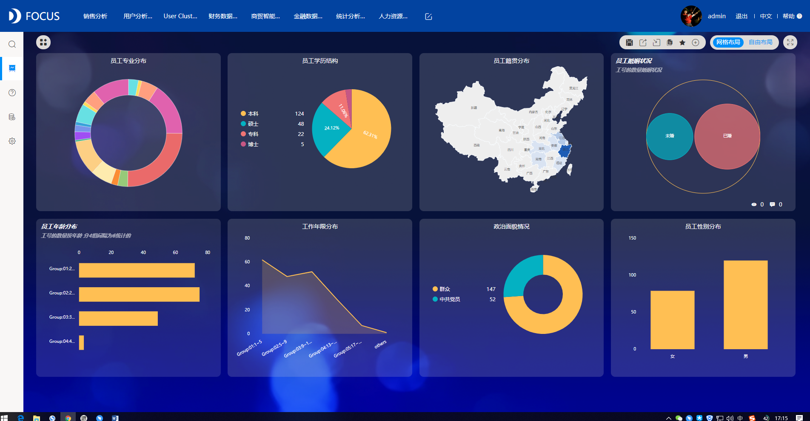
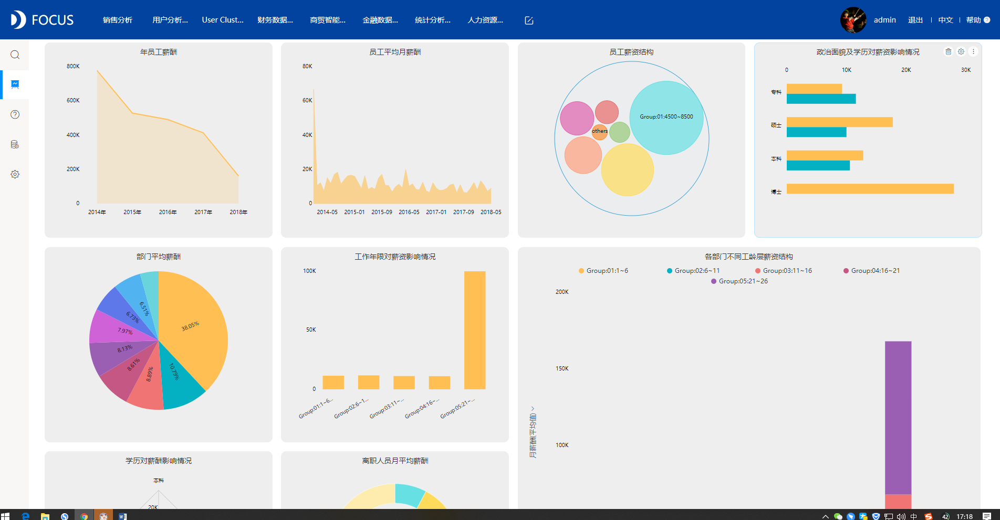
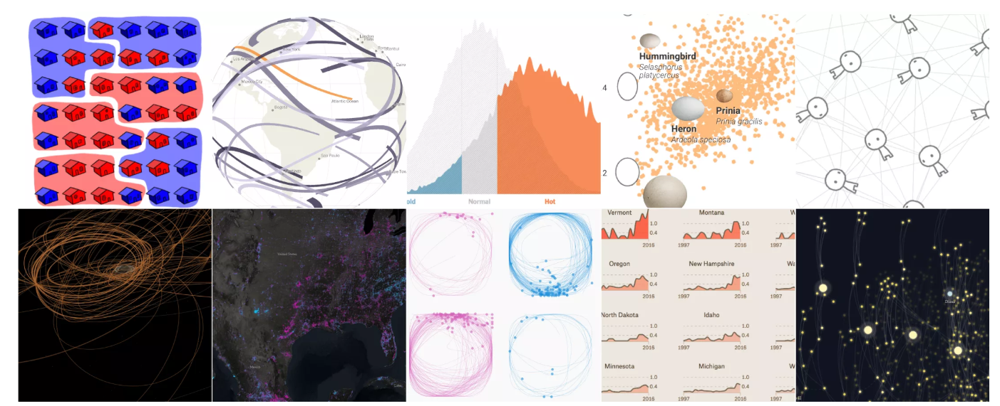
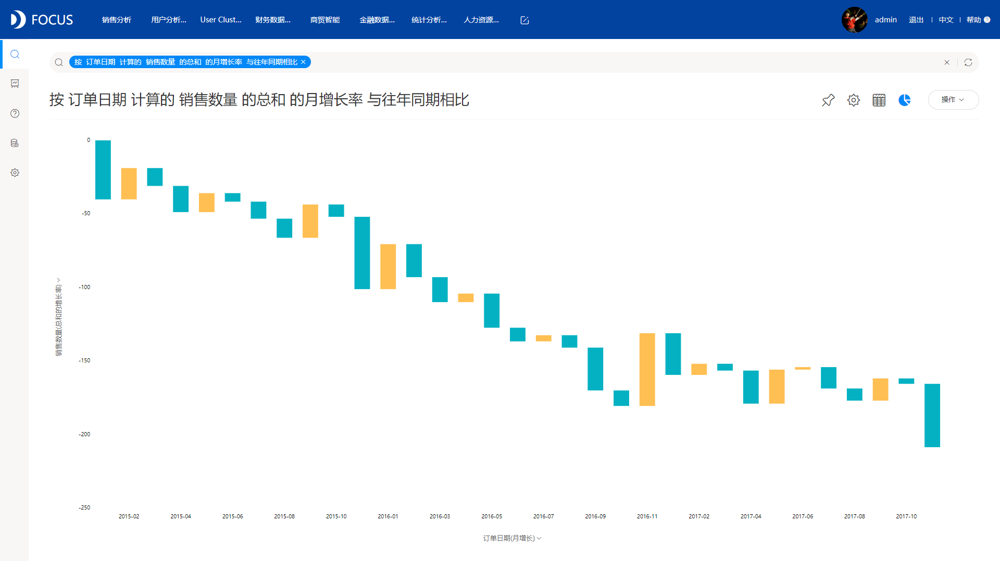
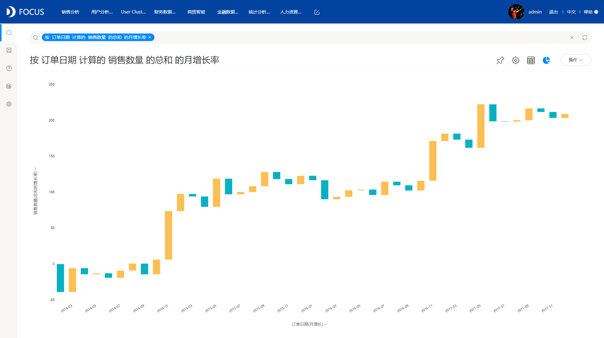
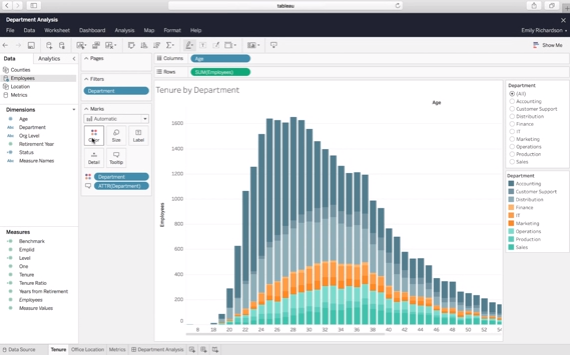

今天，本文主要为大家分享下我个人总结的，关于DataFocus可视化中基础图形的使用。基础图形中包括了几乎常见的所有图表类型，比如柱状图、折线图、饼图、雷达图、位置图等等。现在把我总结的资料推送给大家，一方面是希望也能帮助大家，另一方面也希望有经验的同学可以多提提自己的看法。

DataFocus中基础图形总共有17种，具体图形种类见下图，下面我会介绍每种图形分别适用于什么场景以及图表示例：

柱状图：是一种以长方形的长度为变量的表达图形的统计报告图，由一系列高度不等的纵向条纹表示数据分布的情况，用来比较两个或以上的价值（不同时间或者不同条件）。一般用在比较各组数据之间的差别。效果图如下：

堆积柱状图：堆积柱状图是柱状图的升级版，在日常工作中，堆积柱状图经常会应用在同一个事项的不同形态中。效果图如下:

折线图：在日常的数据分析中，折线图主要用于显示随时间或有序类别而变化的趋势，效果图如下：

面积图：面积图强调数量随时间而变化的程度，也可用于引起人们对总值趋势的注意，例如，表示随时间而变化的销售额的数据，可以绘制在面积图中以强调总销售，效果图如下：

饼图：在日常工作中一般需要计算总费用或金额的各个部分构成的比例，即各个组成部分所占的比例，这种情况通常采用饼图，饼图也可变形为玫瑰图，效果图如下：

环图：与饼图类似，环图也可显示各个部分与整体之间的比例关系，但是环图可以包含多个数据系列，效果图如下：

散点图：考察坐标点的分布，判断两变量之间是否存在某种关联或总结坐标点的分布模式，通常用于比较跨类别的聚合数据，效果图如下：

气泡图：可用于展示三个变量之间的关系，与散点图类似，不同的地方在于气泡图允许在图表中额外加入一个表示大小的变量进行对比，效果图如下：

条形图：用来比较不同类别的离散数值，分类数据，针对的是单一类别中的数量多少，而不会显示数值在某时间段内的持续发展，效果图如下：

堆积条形图：堆积条形图将多个数据集的条形彼此重迭显示，适合用来显示大型类别如何细分为较小的类别，以及每部分与总量有什么关系，效果图如下：

漏斗图：漏斗图便于进行业务流程比较规范，周期长、环节多等分析时，能直观地发现和说明问题在哪里，效果图如下：

帕累托图：按照发生频率大小顺序绘制的直方图，表示有多少结果是由已确认类型或范畴的原因所造成，区分“微不足道的大多数”和“至关重要的极少数”，从而方便人们关注于重要的类别，帕累托图是进行优化和改进的有效工具，尤其应用在质量检测方面，效果图如下：

KPI指标：主要用来展示单个KPI指标，效果图如下：

仪表图：主要用来清晰的看出某个指标值所在的范围，效果图如下：

雷达图：主要用来查看企业的经营状况，从雷达图中我们可以一目了然地找出了企业经营上的薄弱环节，为下一步审计打下基础，效果图如下：

位置图：主要用来查看数据的地域分布情况，可以显示成全国地图，各省市地图以及城市地图，效果图如下：

数据透视表：数据透视表与普通图表的区别主要是因为可以动态地改变它们的版面布置，以便按照不同方式分析数据，而且每一次改变版面布置时，数据透视表会立即按照新的布置重新计算数据，效果图如下：

上述就是DataFocus中所有的基础图形示例。

**可视化图表样式使用大全之基础图形篇**

今天，本文主要为大家分享下我个人总结的，关于DataFocus可视化中基础图形的使用。基础图形中包括了几乎常见的所有图表类型，比如柱状图、折线图、饼图、雷达图、位置图等等。现在把我总结的资料推送给大家，一方面是希望也能帮助大家，另一方面也希望有经验的同学可以多提提自己的看法。

DataFocus中基础图形总共有17种，具体图形种类见下图，下面我会介绍每种图形分别适用于什么场景以及图表示例：

柱状图：是一种以长方形的长度为变量的表达图形的统计报告图，由一系列高度不等的纵向条纹表示数据分布的情况，用来比较两个或以上的价值（不同时间或者不同条件）。一般用在比较各组数据之间的差别。效果图如下：

堆积柱状图：堆积柱状图是柱状图的升级版，在日常工作中，堆积柱状图经常会应用在同一个事项的不同形态中。效果图如下:

折线图：在日常的数据分析中，折线图主要用于显示随时间或有序类别而变化的趋势，效果图如下：

面积图：面积图强调数量随时间而变化的程度，也可用于引起人们对总值趋势的注意，例如，表示随时间而变化的销售额的数据，可以绘制在面积图中以强调总销售，效果图如下：

饼图：在日常工作中一般需要计算总费用或金额的各个部分构成的比例，即各个组成部分所占的比例，这种情况通常采用饼图，饼图也可变形为玫瑰图，效果图如下：

环图：与饼图类似，环图也可显示各个部分与整体之间的比例关系，但是环图可以包含多个数据系列，效果图如下：

散点图：考察坐标点的分布，判断两变量之间是否存在某种关联或总结坐标点的分布模式，通常用于比较跨类别的聚合数据，效果图如下：

气泡图：可用于展示三个变量之间的关系，与散点图类似，不同的地方在于气泡图允许在图表中额外加入一个表示大小的变量进行对比，效果图如下：

条形图：用来比较不同类别的离散数值，分类数据，针对的是单一类别中的数量多少，而不会显示数值在某时间段内的持续发展，效果图如下：

堆积条形图：堆积条形图将多个数据集的条形彼此重迭显示，适合用来显示大型类别如何细分为较小的类别，以及每部分与总量有什么关系，效果图如下：

漏斗图：漏斗图便于进行业务流程比较规范，周期长、环节多等分析时，能直观地发现和说明问题在哪里，效果图如下：

帕累托图：按照发生频率大小顺序绘制的直方图，表示有多少结果是由已确认类型或范畴的原因所造成，区分“微不足道的大多数”和“至关重要的极少数”，从而方便人们关注于重要的类别，帕累托图是进行优化和改进的有效工具，尤其应用在质量检测方面，效果图如下：

KPI指标：主要用来展示单个KPI指标，效果图如下：

仪表图：主要用来清晰的看出某个指标值所在的范围，效果图如下：

雷达图：主要用来查看企业的经营状况，从雷达图中我们可以一目了然地找出了企业经营上的薄弱环节，为下一步审计打下基础，效果图如下：

位置图：主要用来查看数据的地域分布情况，可以显示成全国地图，各省市地图以及城市地图，效果图如下：

数据透视表：数据透视表与普通图表的区别主要是因为可以动态地改变它们的版面布置，以便按照不同方式分析数据，而且每一次改变版面布置时，数据透视表会立即按照新的布置重新计算数据，效果图如下：

上述就是DataFocus中所有的基础图形示例。
