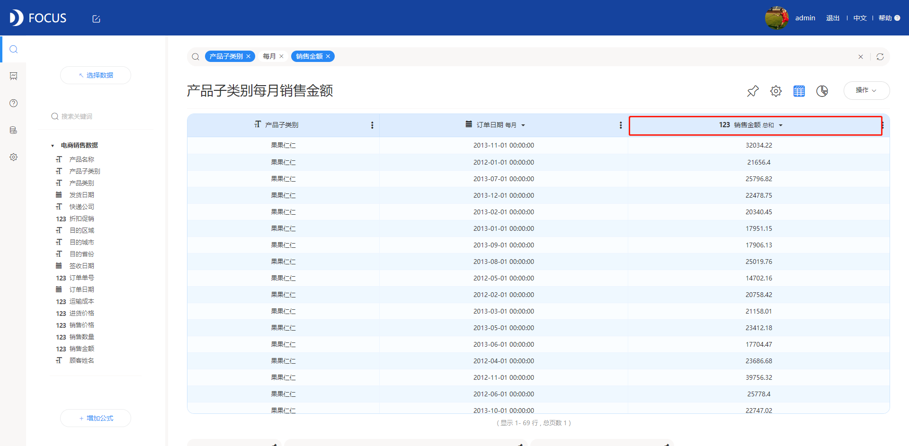
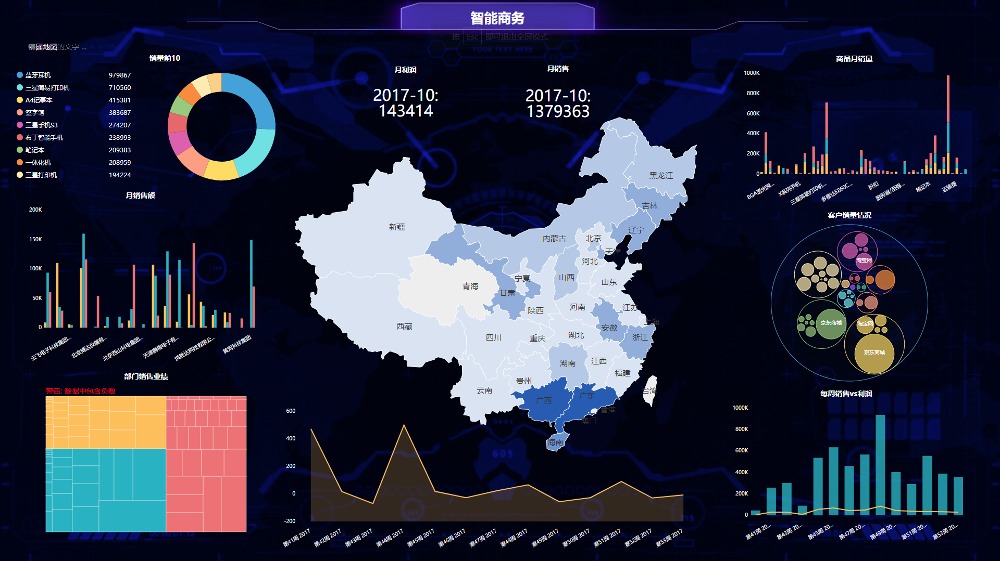

　　从改革开放以来，中国发生了翻天覆地的变化。从一个旧的时代模式完全进入了数据化模式时代，将一切生活应用转化成数据的形式展现出来，把可视化大屏推广到人们面前，对企业和政府实时监控、实时报道。Datafocus的数据化分析在企业中调研、监控、生产、销售。Datafocus几乎在每一个重要阶段发挥着它的重要作用，Datafocus的产生为企业降低了成本、增加了效益、提升了企业的运营效率。那么可视化大屏从哪些方面提升企业的生产力了？

1、Datafocus在一定的程度上降低了对数据的路径

即使阅读者不懂得财务知识，但是可以通过可视化大屏对企业信息一目了然，从而察觉企业存在的一些问题，为企业解决大的麻烦。

2、Datafocus将实时呈现数据

可以将企业的整个生产和销售团队呈现在可视化大屏上，为团队员工增加压力。

3、简化了信息，对信息一目了然

企业的领导者可以在可视化大屏中查看企业的绩效、员工的工资、财务报表等一切用数据来呈现的内容。

4、对数据的处理速度提升发生了重大变化

可视化大屏可以处理传统EXCL解决不了的数据，可以一次性传递很多的信息。

在这样一个人口众多的大国，为了简化生活中带来的不变，可视化大屏为企业和政府带来了很多便利。Datafocus将人口数据、企业、等等简化且方便政府管控，也方便了企业对自身的管控。Datafocus在行业内也成为了可视化大屏的主流趋势。
