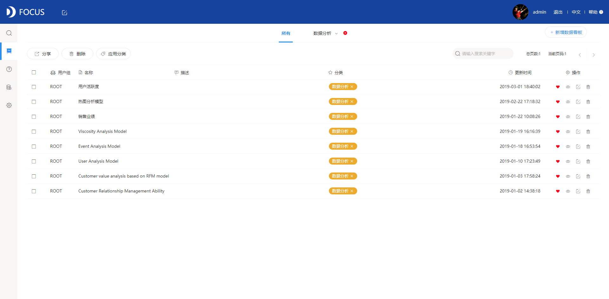

在企业的实际业务当中，由于不同的可视化大屏项目目的、实际数据还有分析需求等等方面的不同，每个可视化大屏都有它独特的方式，但是基本上技巧是不会变的的，把部分企业都用的是datafocus来进行可视化大屏的展现，优秀的可视化大屏都有共同的优点。

**深色背景**——能够让视觉更好的聚焦，增强设计感和张力。

**整体显示**——可视化大屏是不可以进行滚动条等操作的，需要在一个完整的面板当中显示出来所有的信息。

主次分明——每个可视化大屏都需要凸显出鲜明的主题和信息层次。

**图表联动**——可视化大屏当中的所有图表都是有联系的，当一个图表发生变化时与之相关联的图表也要相应的跟进。

**信息全面**——可视化大屏常用于巨幅的显示，根据使用场景的不同要考优化细节的显示，让用户更加清晰合理地接受信息。

想一次完成一个成功的可视化大屏是非常不容易的，许多问题是在多次修改的过程中才渐渐发现的，因此要对可视化大屏不断进行优化从而做到高度还原设计效果，高度贴合使用需求，这就要求可视化大屏软件有实用、便捷的高可塑特性。比如DataFocus这类敏捷的数据分析工具就能够满足企业相应的需求，所以DataFocus不仅仅拥有丰富的图表类型以及各种类型的组件，同时它的操作性也非常强，比较方便用户去学习和使用。
