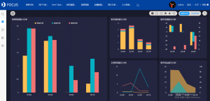
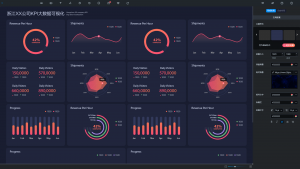

可视化大屏的设计和项目完成只是一个初步阶段，它的后续工作还有很多。在每个阶段都要严格的把控，才能给客户交出满意的成绩，并使可视化大屏能够更好的推向市场最前端，能够完美的跟各用户之间有契合。无论是什么样的产品，它都需要在最后进行检查和测验过程，不合格的产品淘汰，合格的产品进入市场。下面我们了解一下datafocus可视化大屏最后一个阶段——检查测试过程。

Datafocus可视化大屏的检查和测试，可视化大屏的检查和测试是和原型的设计紧密相连、相辅相成，至关重要。

1、可视化大屏的内部检查，按照设计图检查是否满足设计图的需求。

2、现场测试可视化大屏，从现场观摩实际投放效果，是否看的清楚，色差大小、比例大小等一系列的问题。

3、用户对可视化大屏的评审阶段，用户在使用过程中发现问题并及时的联系客服。

4、可视化大屏的修改完善，在用户和自身检测问题之后，缺少功能或者有损坏的返回进行更换。通过会议商讨并找出合理的解决方案，最终形成一个新的可视化版本。

按照我们的习惯性，来评判datafocus可视化大屏的使用好坏，并作为对开发商的反馈，让开发商及时的修改和更进，并不影响我们的工作，反而提高工作效率。这样经过千锤百炼的可视化大屏才称得上是一次完美的研发和设计。
