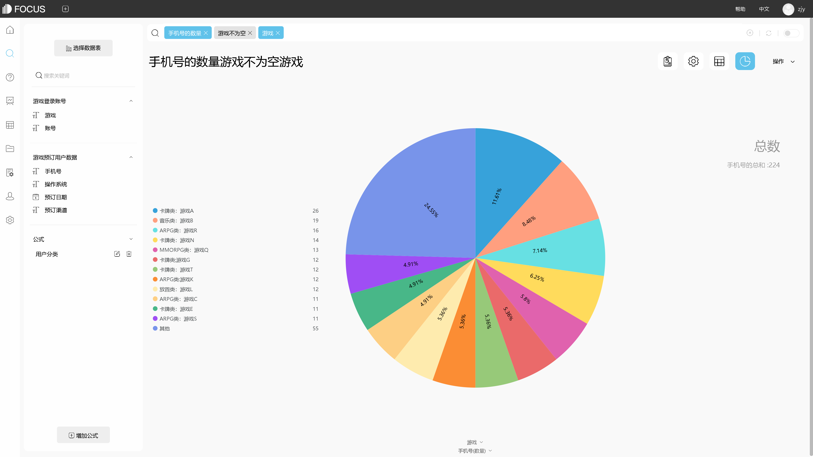
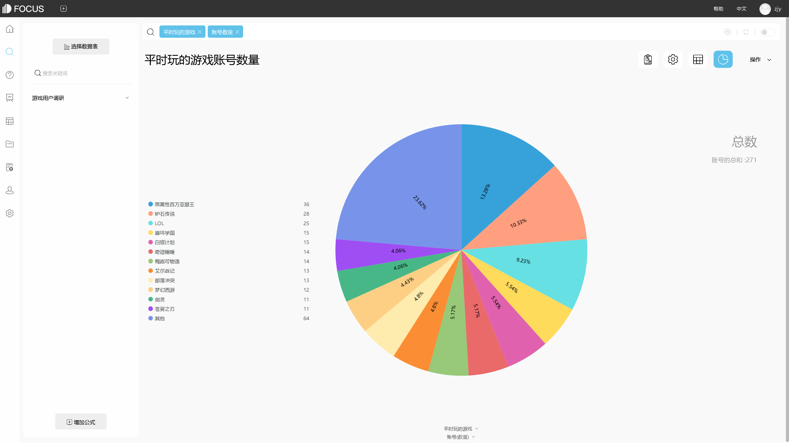

仪表板的目的是引导读者完成多个可视化，讲述每个洞察的故事，并揭示洞察之间的联系。更多使用更好的仪表板设计，用户可以发现正在发生的事情，并了解最重要的信息及其重要性。考虑如何在仪表板上引导用户的视图。那么在设计仪表板布局时我们需要遵循的原则是什么？

1.故事可视化仪表板布局

在设计仪表板之前，我们首先需要了解用户的习惯和阅读需求。一般来说，当用户查看仪表板或阅读视觉作品时，就像读书一样，遵循从上到下从左到右的原则。

换句话说，最重要的核心指标分析（一般可以选择使用更大的数字进行KPI指标汇总），我们可以把它放在左上角或顶部。如果需要为页面级辅助数据过滤添加过滤器控件，则控件的位置通常位于顶部位置。

（DataFocus制作大屏）

其他次要重要指标可以放在左下方，最后是一些相对不太重要的数据或引导分析的最后数据，详细数据，准确数据（如需要反复检查的统计数据）等。可以放置在仪表板的右下方位置。

2.管理驾驶舱/大屏幕看板布局

此外，在做一些管理驾驶舱或大屏幕看板时，我们可能需要在中间放置一些更重要的数据（通常是地图或核心数据可视化分析等）以供显示。管理驾驶舱经常显示整个企业。它通常分为两个层次：主要指标和次要指标。主要指标反映核心业务，次要指标用于进一步分析。所以在制作时给出了不同的关注点，这里有几个常见的布局。

这几种布局不是黄金法则，但通常建议使用主要和次要分布布局，这样可以使信息一目了然。在实际项目中，没有必要使用主要和次要分布，或者可以使用平均分布，或者可以组合这两者以进行适当的调整，比如，如果有多个级别，将根据上述基本原则进行一些微调，效果非常好。

（DataFocus制作大屏）
