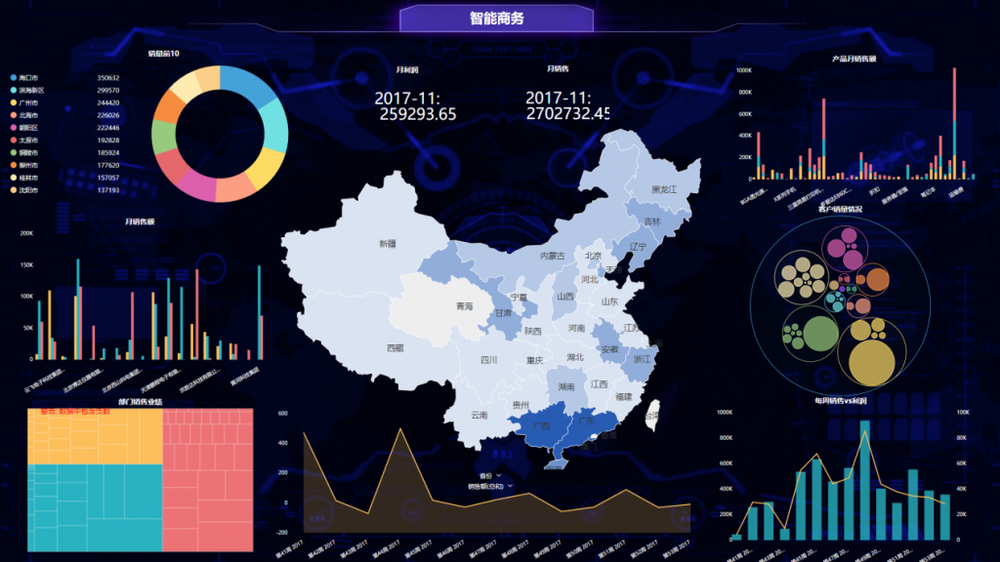

目前，关于一些可视化操控在toC端已经算是有了诸多应用，让很多客户感受到了一些便利，但在专业视听领域，甚至是整个to B端，成熟和大规模的datafocus应用还寥寥无几。那么，可视化控制在视听领域能有所突破吗？咱们今天就一起来探讨一下。

目前，一些国家中有很多中控厂商、处理器厂商、分布式厂商对可视化控制都给予了高度关注，并且因为一个完整的AV可视化控制解决方案应该包括硬件和软件两个部分，这样可以解决硬件设备场景调用的可视化。

最近我们都应该明白，一些实现软件的设计器与组件化。并且很多可视化视屏目前应用在日常使用中，更为重要的是有别于传统的单一AV或IT系统的独立运作，并且够让IT和AV设备更具成本价值和使用效率。

目前，一些可视化控制是未来信息系统的主要应用模式，那么AV厂家应该如何正确布局这一领域呢？作为专业视听的一员，datafocus科技在数年前便开始了可视化控制的产品和技术研发工作。datafocus科技完整、成熟的软硬件研发和产品体系是一个巨大优势。

最后，小编总结可视化控制在专业试听领域是有一定突破空间的，不管是对于可视化研发人员来说，还是对于可视化生产厂家来说，其都是一个值得努力的进发途径！
