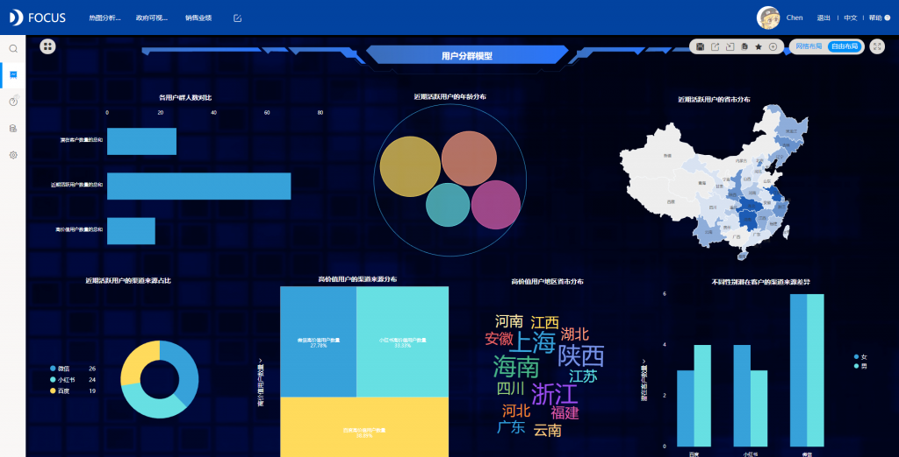
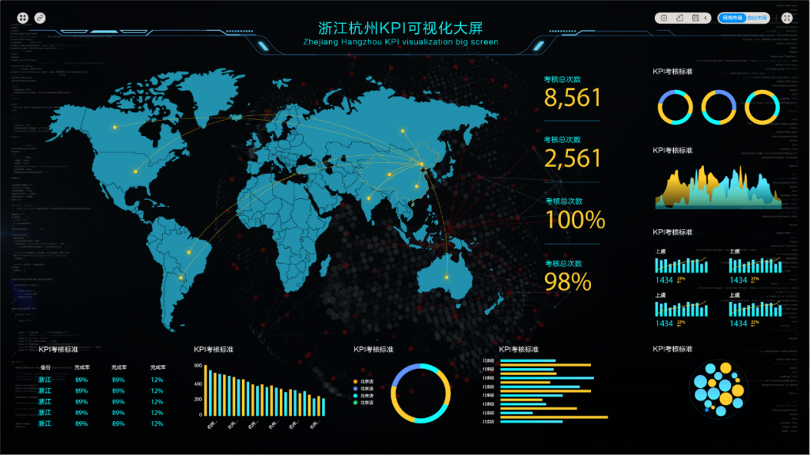

作为一名datafocus可视化数据分析师，在工作中经常会遇到各种各样的问题，但是在遇到这些问题的时候我们不能惊慌，才能完美的解决各种问题。接下来小编给大家介绍一下datafocus可视化数据分析师在工作中经常会遇到哪些误区？

误区一：以多取胜。有些企业在建设数据分析平台时，从业务部门获取到大量的分析指标，开发出成百上千张分析报表，并没有从实际使用者的角度去考虑，容易导致使用者的精力分散。

比如生产车间主任要看某一车间昨日的生产情况，可能就要从产能报表、质量报表、工时效率报表、库存报表等繁多的报表中去寻找自己关心的某一车间某一产品某一工单的信息，费时费力，甚至觉得还不如以前Excel报表方便。

误区二：单打独斗。电子电气制造行业的数据分析平台，往往涉及到多个业务部门的数据，包含采购、生产、仓储、物流、销售在内的供应链流程，以及研发、财务、人事等技术或支撑部门，现在很多企业的一些部门会单独建设某一模块的数据分析工作，过于强调各个业务部门的独立性，往往会忽略管理者的使用场景。

比如企业总裁想看目前公司的产销存情况，他可能要从生产、仓储、销售三个部门的报表中找数据，而且还要自己做对比等分析，不能快速的帮助他获取想要的管理数据和分析结果，他主观上可能就觉得这个平台比较鸡肋。

误区三：依赖工具。对于大多数企业来说，拥有一款强大的数据分析工具可以事半功倍，但是过分的依赖工具和强调工具的作用会让管理工作懈怠下来。做数据分析工作必须包含管理的理念在其中。从经验来看，像帆软这类的数据分析平台，其意义在于辅助管理决策，而其价值在于可以将一些战略化、口号化的管理理念进行分解可执行化。

比如某一企业的阶段性战略目标是降低成本，在分析库存成本时，通过分析往年产销存情况以及期初期末库存和安全库存，调整最佳平衡点、优化库存结构、提高周转效率、缩小库存空间，来达到降低库存成本的目的。现在大家知道datafocus可视化数据分析师经常遇到的误区是哪些了吗？
