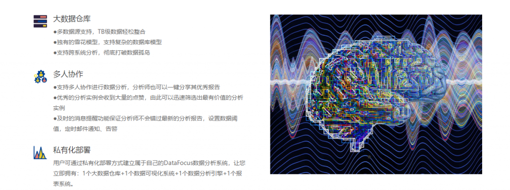

今天，小编主要是想通过自己的理解，并且结合所学的内容，整理出一些关于数据可视化分析的流程。可视化数据分析的主旨是借助于图形化手段，清晰有效地传达与沟通信息。简单来说，就是datafocus将原本枯燥繁琐的数据，用更加生动形象且常人容易看懂的图形化方法表达出来。

可视化基本流程：

可视化流程的基本步骤，就好像一个特殊的流水线，主要步骤之间彼此相互作用、相互影响。

首先是确定分析目标。根据现阶段的热点时事或社会较关注的现象，确定此次可视化的目标，并进行一些准备工作，设计贴合目标的问卷。

接下来是数据收集。依照第一步制定的目标，进行数据收集，可以直接从数据网站中下载所需的数据，也可以通过发放问卷、电话访谈等形式直接收集数据。

其次就是数据处理。对于第二步收集来的数据进行一些预处理，比如筛去一些不可信的字段，对空白的数据进行处理，去除可信度较低的问卷等。

最主要的是数据分析。这是可视化流程的核心，将数据进行全面且科学的分析，联系多个维度，敲定不同的分析思路，对应各个行业等等。这里就不一一详细介绍了。

最后是可视化数据分析的呈现和提出结论建议。用户对最后呈现的可视化数据分析结果进行观察，直观的发现数据中的差异，从datafocus中提取出对应的信息，帮助公司运营提出科学的建议等。

