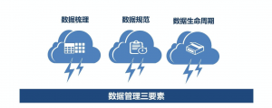
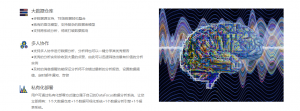

目前，一些可视化数据datafocus自适应功能令可视化数据分析报表能根据展示屏幕大小随意切换，对此即便是在手机上，很多可视化数据也会根据屏幕大小智能排版，为用户提供最舒适浏览页面。，这样将很多的数据能够有效的展示给大家，这样的事项真的算是很值得大家去关注的事项！

除了手势缩放外，在datafocus报表中，浏览者可通过双击钻取、单点联动等方式更深入地浏览报表，这样真的算是多方位的去理解和阐述了一些相关方面的常识，并且很多甚至能实现任意变更字段与维度组合，随意切换不同角度观察分析数据，真正实现了自助式数据分析。

于此同时，我们应该知道很多终端设备像什么Pc、手机、平板等，不管是在哪个终端都能享受秒速打开BI报表的效果，并且大部门都是在一定程度上益于datafocus自适应功能，这样的方式让通过关键信息尽在“掌”中。

可根据不同行业不同主题的特殊性，并且在很大程度上，一些提供更具针对性、更符合分析需求的BI解决方案，这样的事项让很多的海量数据快速智能生成更直观易懂的可视化数据分析报表。

以上，就是关于可视化数据大小屏幕是否能够现实的根据，其实不管怎么讲，一些重要的信息来源都可能是造就信息发展舞台，为此datafocus企业真的算是走到世界的前面，大家说是不是这样的道理！
