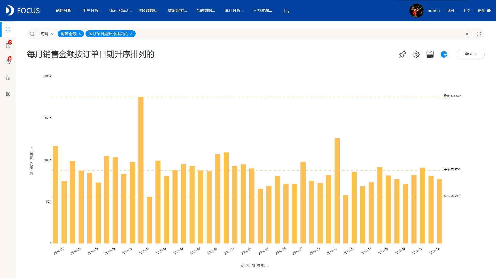
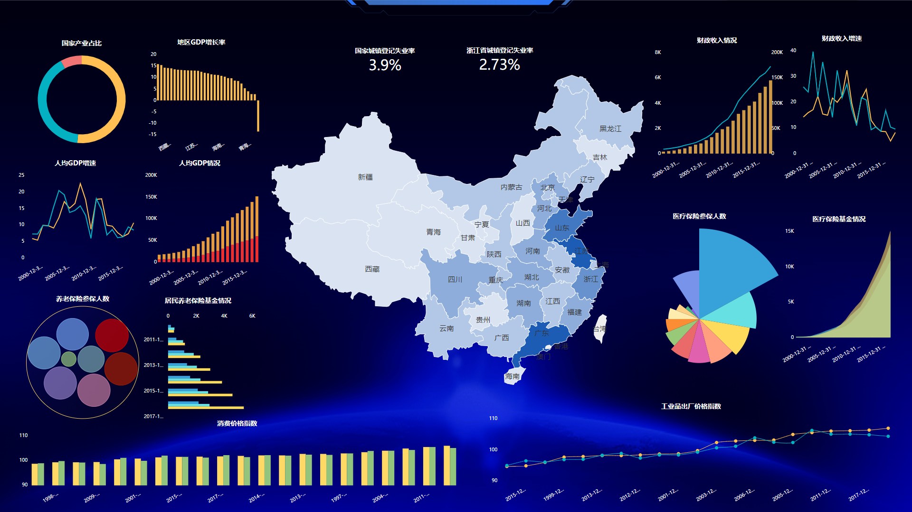
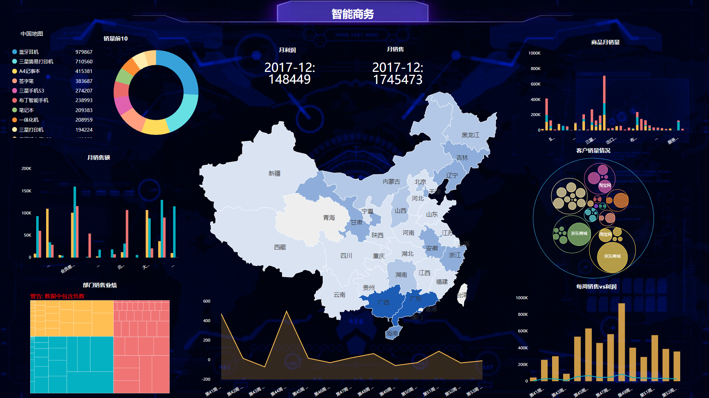

数据可视化，应该很多人都听说过，就是将数据用图表的形式展现出来，让用户能够更快速地了解数据所传达的信息，让管理层能够更有效地制定决策，从而提高企业效益。

可视化有什么特点呢？

1、传达更多的信息。一张图能传达的信息，如果用文字来描述，估计需要上千字才能描述清楚。例如我想要知道企业这一年的财务情况，那么你就需要说明每个月的财务收入和财务支出，每个月财务的资产负债是多少，每个月的营业利润净利润分别是多少，每个月的应收应付是多少等一系列财务指标，而如果用图表来表示，只需要几个柱状图或者折线图，就可以准确地表达上面所提到的所有信息。

2、突出重点，便于理解。图表通过更简单的视觉体验，能够让用户迅速的获取图中的重点信息。就比如上面第一点中的例子，一年的财务收入数据给你，你可能无法马上知晓哪个月份的收入最高，哪个月份的收入最低，但是通过柱状图，你可以迅速抓取到关键信息。

现在随着大数据行业以及技术的发展，用户对可视化的要求也越来越高，在企业的生产经营过程中出现的各类报表，也不再像之前一样单一无趣，更多地是追求“高颜值”的可视化。下图用的是专业的DataFocus可视化工具，从可视化效果来看，DataFocus中图表既可以做到直观易懂，也可以做到酷炫满分，确实是一款不错的可视化工具。

要做如此酷炫的可视化，不仅仅只是做图建大屏，还需要对可视化大屏进行个性化配置，我建议大屏背景都设置成深色系，文字组件颜色等设置成浅色系，这样的配置符合大多数人的阅读习惯，也符合常人的视觉体验。

