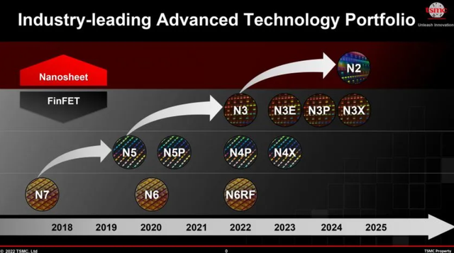
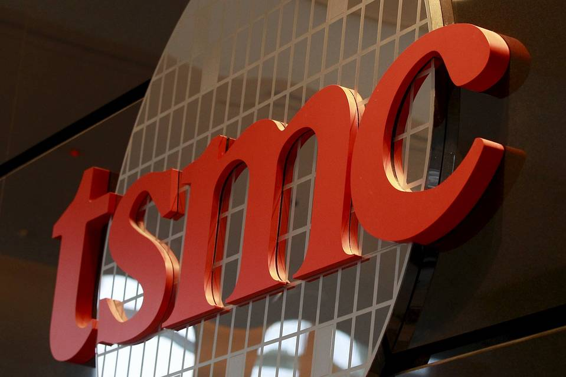

全球缺芯问题长久以来就一直存在，而且这个问题短期内很难解决。

由于芯片涉及到太多科技相关的领域，所以一直都是被大众重点关注的话题。

而台积电作为全球最顶尖的芯片代工企业，最近又出大动作了。

就在2022技术研讨会上，台积电宣布将把N3工艺于2022年量产，还会陆续推出N3E、N3P、N3X等工艺，而N2工艺将于2025年量产。

那么，台积电宣布的新工艺表现如何？

### 1.N2工艺有多强？

正如会上展示的，N2工艺在性能、功率效率和密度等方面都有突破。

相同功耗下，N2相比N3E的速度提升了15%左右，而相同速度下，N2的功耗降低了30%左右。可以说，这次技术水平进步还是挺大的，当然具体效果还是要后续的测试才可知。

要知道目前国内对于5nm工艺还在研制阶段，上海微电子作为国产之光，主要采用的还都是14nm工艺。

当然国内芯片也不必刻意强求，目前14nm芯片也能满足国内大部分需求了。

那么问题来了，台积电的新工艺一出，对全球芯片将会有何影响？

### 2.这意味着什么？

对于台积电而言，离独立自强又更近了一步。

2020年开始，台积电就一直遵从了老美的要求。华为断供、赴美建厂、上交机密数据，都给出了实际行动。

然而这背后也有不少压力。

首先是赴美建厂的补贴迟迟未到，而且在美国的各种成本都比在中国台湾的成本高。

其次是美方对于2nm芯片以及1nm级别芯片的研发，有加速追赶之势。

再加上客户方面又失去华为这样的一个大客户，要知道华为的订单金额曾占台积电整个销售额的15%，所以这在国内市场也受很大影响。因此台积电要想不再受制于人，独立发展是必然的趋势。

对于全球芯片而言，这无疑也是一件好事。台积电目前掌握了最先进的芯片技术，会牵动整个芯片产业发展。当然以它一人之力还无法完美解决目前的芯片短缺问题，但相信不久的将来，整个产业都在升级，芯片生产水平会更上一个台阶。

### 3.国产科技仍需努力

对于国产科技企业而言，也无需急于求成，了解到其它企业的水平进步才能更好地化压力为动力。因此这个消息也是好事。

尽管当今国产科技被制裁，西方技术封锁，但仍旧不必闭门造车，积极面对新挑战，总会开创出属于自己的道路。

国内就有很多企业走出了自己的路，就像这款**无代码的搜索式数据可视化平台DataFocus**一样。

很多其它的BI系统都需要较高的架构成本、学习成本、操作成本，而DataFocus算得上是轻松上手、轻巧又高效的一款BI工具了。

不用学习Sql、Python等代码知识，通过像谷歌搜索关键词一样就能数据分析，系统3秒内就以可视化图表回答。

### 小结

相信终有国产科技迎头赶上的一天，只是时间问题。对此，你怎么看呢？欢迎评论区评论、分享。
