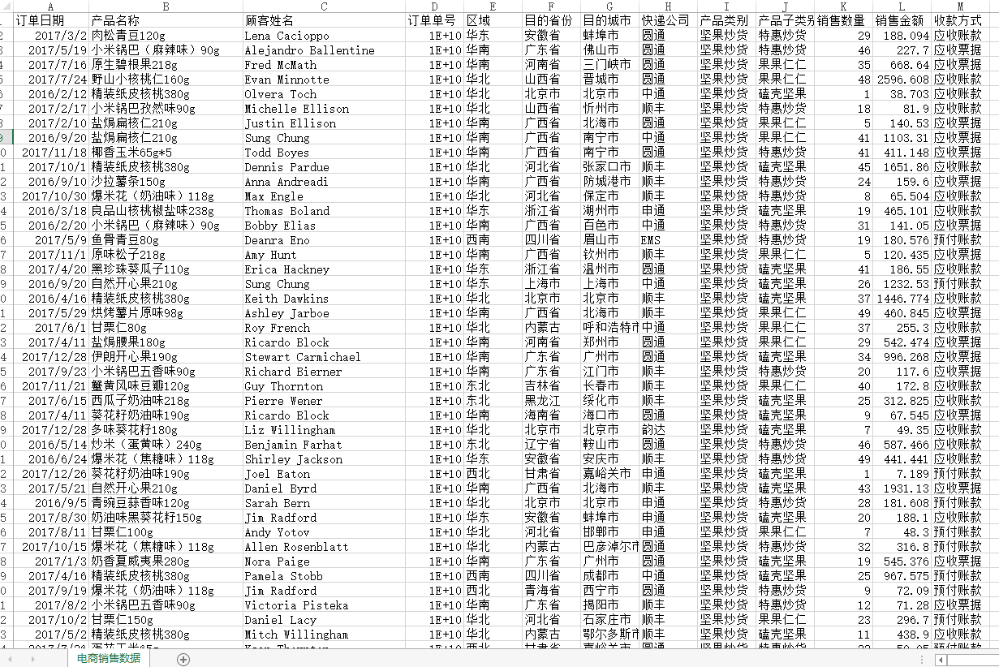
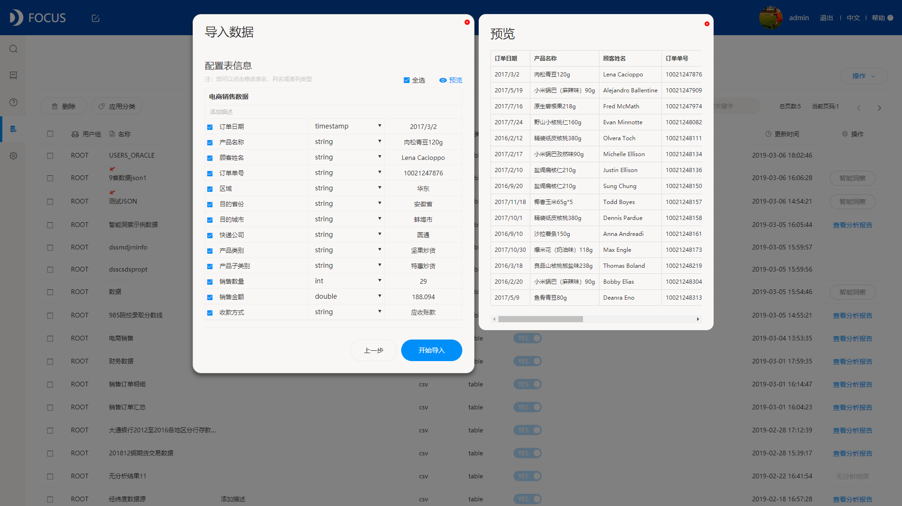
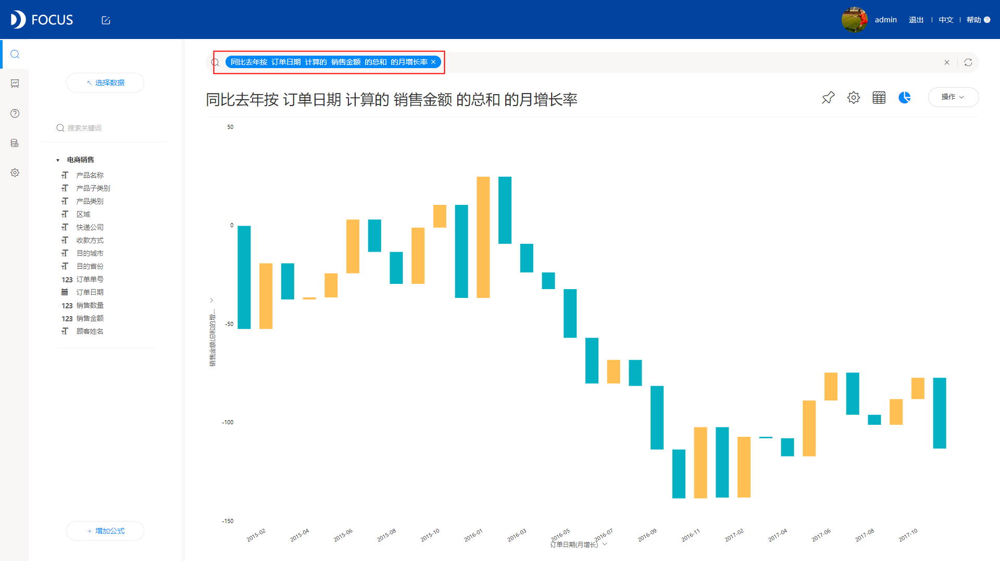

**同比环比最简单的实现方法，想学吗？**

在日常的数据分析中，经常会有需要计算同比增长率或者环比增长率的情况， 大家最常用的辅助工具可能就是excel了，在excel中通过输入“同比：=\[本期数\]/\[上年同期数\]-1”、“环比：=\[本期数\]/\[上期数\]-1”这样的公式进行运算，但是如果是月环比或者季度环比，月同比或者季度同比，而数据是以日为单位的，那就需要先汇总各个月总数，或者各个季度总数，计算就会变得复杂。那有没有什么更简单的方法呢？既然我的标题是同比环比最简单的实现方法，那就肯定有比excel公式更简单的。下面我就为大家推荐一种最简单的方法，这种方法需求借助于一个数据分析工具，DataFocus。

首先呢，我们先准备一份以日为单位的数据（虚拟数据），如下图所示：

其次，我们要将这些数据导入到DataFocus系统中，导入前可以预览数据避免导入错误数据，如下图所示：

接着我们就可以直接求同比或者环比了，我们这里以月同比和月环比为例，在DataFocus搜索框内直接输入其可识别的关键句式：按订单日期计算的销售金额的月增长率，即可实时得到月环比结果，输入关键句式：同比去年按订单日期计算的销售金额的月增长率，即可实时得到月同比结果，非常简单高效，如下图所示：

同比

环比

是不是非常简单？一句简短的话就可以马上得到结果，不管是月环比还是季度环比，或者是年环比都一样。这么简单的方法主要是依赖于DataFocus其独有的搜索式分析，把数据分析变得像百度搜索一样简单，所有需要计算的系统后台全都自动计算好，无需人工操作，智能且高效。当然，DataFocus不仅限于这个功能，还有很多丰富的其他功能，这些功能大大简化了数据分析的复杂度。

你能找到比我这种更简单的方法吗？有的话大家可以互相交流，互相学习学习。
