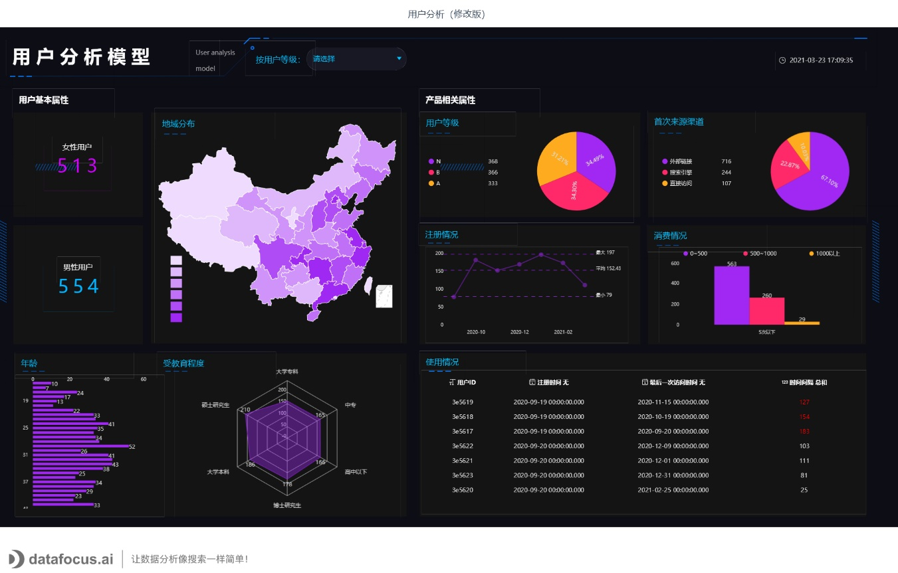
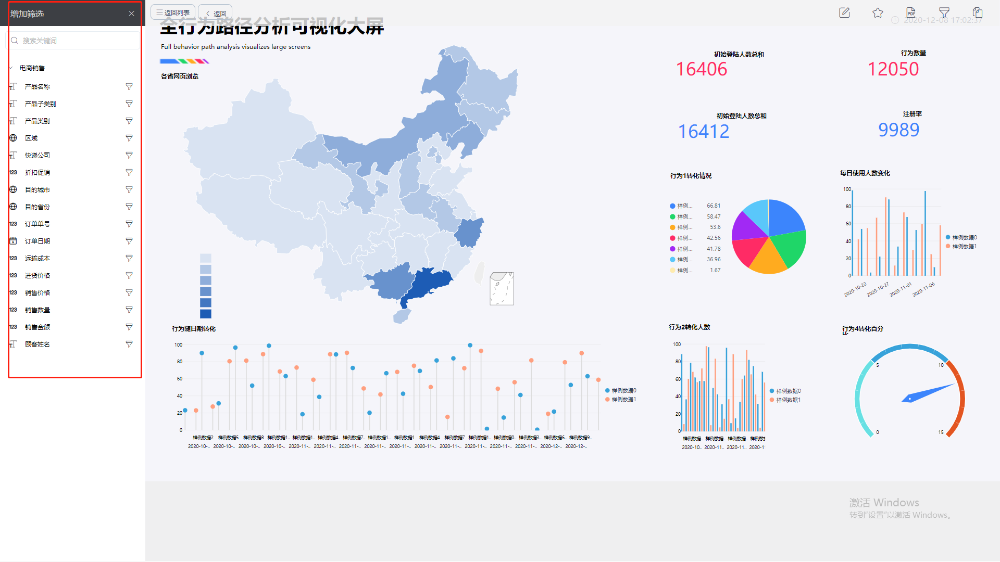

全球都在进入一个“数据大爆炸”的时代，每个企业都将拥有越来越多的数据量。而将数据可视化并呈现在屏幕上进行交互也会成为不可阻挡的商业趋势。

告别Excel、PPT和静态报告，欢迎来到交互式数据看板的世界！

在我们深入研究主题的细节之前，让我们来厘清一些基本问题：什么是交互式数据看板，以及为什么企业需要它？

在这篇文章中，我们将介绍在DataFocus中，数据看板创建和交互操作的细节，比较交互式和静态报告。我们开始吧。

**什么是交互式数据看板？**

交互式数据看板是一种数据可视化工具，可以用来追踪、分析、监控和直观展示关键业务指标，同时允许用户与数据进行交互，使他们能够做出数据驱动的业务决策。

**交互式数据看板VS静态报告**

毫无疑问，交互式数据看板为企业提供了前所未有的洞察力。一张数据看板就能够让你访问数据，共享结果，节省时间并提高效率。等待数据分析师提交报告，然后拥有过时数据的时代已经一去不复返了。虽然Excel和PPT以及各种演示程序仍然是非常重要的工作助手，但它们的交互能力实在有限。

与静态报告相比，交互式数据看板有一些关键优势：

**1.决策的敏捷性**

交互式数据看板能够帮助决策者使用企业最新的数据来做分析。此外，只需点击几下鼠标，就可以从不同的视角查看数据。放大、缩小、选择时间间隔、筛选国家、显示或隐藏不需要的特定参数，数据看板随心而动，能够以前所未有的方式查看数据。

**2.避免冗余报告**

只需要1个具有交互功能的数据看板，就可以替代10张静态的幻灯片。报告可以使用实时数据，还可以实现智能告警。每当数据出现异常时，可以向用户发送告警邮件，即使监控动向。

**3\. 更少的技术投入**

让用户自主执行数据分析，可以帮助公司节省宝贵的IT资源，因为对数据库查询或自定义的需求数量将大大减少。IT部门可以专注于其他更紧迫或有价值的任务，而业务人员也可以快速获得问题的答案，一举两得！

**4.速度**

毫无疑问，对于任何想要在残酷的数字时代生存下去的公司来说，业务发展速度都是至关重要的因素。使用传统的Excel或PPT时，数据每更新一次都必须要手动更新报告。而使交互式数据看板就不一样了，支持实时数据，这就是商业智能的核心所在。

5.生产力

虽然静态报告已成为可靠的工作助手，但随着互联网发展速度越来越快，收集并需要分析的数据量在不断增长，Excel的处理能力就显得吃力了。DataFocus可以帮助用户快速跟踪实时数据，并使用搜索式交互方式，提高生产力。像使用Google一样轻松！

交互式数据看板不仅仅可以用于管理业务绩效指标，还可以被公司的所有团队轻松利用。它可以帮助你可视化你的数据，按需筛选与过滤，并对你的数据进行更深入的挖掘。

你相信交互式数据看板的力量吗？不如更进一步，看看DataFocus提供了哪些交互式功能。

**DataFocus的10大交互式数据看板功能**

1. **全局筛选过滤**

实现交互体验的一个重要特性是点击筛选过滤选项。在查看数据看板时，用户可以点击右上角漏斗形状的操作按钮，弹出左侧筛选框，点击对应列即在顶栏出现对应的筛选项，在下拉框内进行条件筛选即可。

此操作无缝地创建了一个应用于数据看板数据的快速过滤器，并在瞬间提供了新的见解，只需快速点击几下，用户就可以轻松地与数据进行交互。

**2）点击快速筛选**

点击图表中的数值点，实现快速筛选。例如，选择左下角图表中2019年10月的数据，数据看板能够快速筛选出所选项的数据！

**3）向上钻取**

向上钻取是一种交互式数据查看功能，它提供了有关联关系的数据的快速查询方式。假设你查看了威海市的销售数据，可以通过向上钻取获取山东省的数据情况。

**4）向下钻取**

如果你想创建一个交互式数据看板，深入分析应该是你寻找和熟悉的功能之一。向下钻取可以帮助你解决这一问题，让你一键向下探索更多数据详情。和向上钻取类似，鼠标滑到浙江省并点击“向下钻取数据”，就可以一键获得浙江省各市级的数据详情。

**5） 图表缩放**

放大，再放大，缩小……相比静态报告，DataFocus的数据看板缩放功能提供了直观的数据展示机会，允许你简单地将鼠标拖动到需要查看的图表部分，滚动鼠标就可以实现缩放查看，把你关心和想要重点展示的部分，展示在中心位置。

**6）查看原始数据**

当你关注交互式数据看板时，你可能希望能够即时访问你正在探索的图表的原始数据。这就是高级数据选项派上用场的地方了，尤其是当出现额外的问题，需要从原始数据中进行确认的时候。这样，你将有可能以原始形式轻松探索图表的每个部分，并在需要时导出原始数据。

**7）显示或隐藏图表值**

“显示或隐藏图表值”功能是很好地管理数据展示权限的方法。只需单击图例，就可以将图例相关的数据从数据看板中隐藏或显示出来。

例如，假设交互式数据看板的某张图表包含一个有3个不同市场类别的图表，并且你只想查看两个类别。只需取消选择图例中你不想查看的类别，该数据将从所有相关数据可视化中消失！

**8）动态图像/视频**

如果想要你的报告更绘声绘色，你通常需要生动的图像或视频来帮助你。别担心，这个PPT中的常用功能，在DataFocus的交互式数据看板中同样可以轻松实现。

**9） 局部全局展示**

在进行报告时，你通常需要能够让听众更好地抓住重点，聚焦于你想呈现的部分。局部全局展示就是一个很好的功能，帮助你全局展示正在讲解的图表，紧紧抓住用户的注意力。

**10）向下钻取并联动**

若是该数据看板中所有的图表都是依赖于同一个表，或者有关联关系的几个表，则这些图表可以进行向下钻取并联动展示。选择“向下钻取并联动”功能，可以实现数据看板中的所有图表同步进行所选区域的数据展示。够轻松吧？

交互式数据看板工具，如DataFocus，正在通过实时交互式数据看板帮助企业推动业务。

比电子表格更容易使用，比PPT更灵活，并提供了广泛的交互功能和数据展示方式，你可以为你的业务数据准备令人惊叹的交互式数据可视化。只需点击几下鼠标，无需高举技术技能，你就可以轻松完成。

还不确定吧，开始免费试用吧。你可以在几分钟内创建第一个图表和数据看板。
