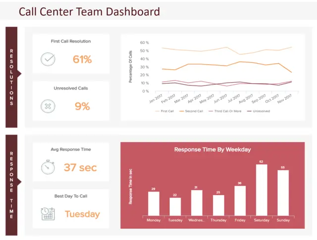
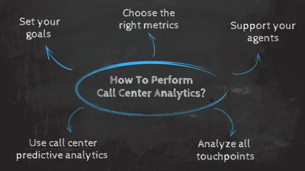
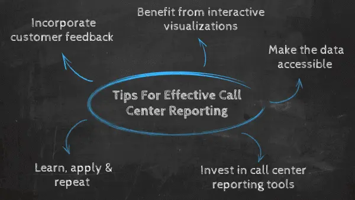
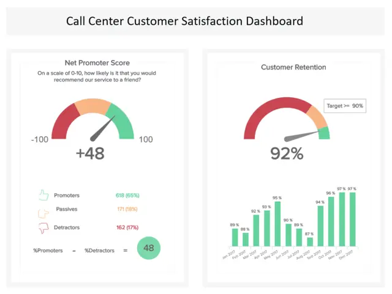

目录

[1） 什么是呼叫中心分析？](https://www.datafocus.ai/infos/call-center-dashboard-reporting-analytics-in-our-data-driven-world#definition)

[2） 什么是呼叫中心仪表板？](https://www.datafocus.ai/infos/call-center-dashboard-reporting-analytics-in-our-data-driven-world#call-center-dashboard-definition)

[3） 呼叫中心仪表板和报告的好处](https://www.datafocus.ai/infos/call-center-dashboard-reporting-analytics-in-our-data-driven-world#benefits)

[4） 如何执行呼叫中心分析？](https://www.datafocus.ai/infos/call-center-dashboard-reporting-analytics-in-our-data-driven-world#how-to)

[5） 呼叫中心报告提示](https://www.datafocus.ai/infos/call-center-dashboard-reporting-analytics-in-our-data-driven-world#tips)

[6） 呼叫中心仪表板示例](https://www.datafocus.ai/infos/call-center-dashboard-reporting-analytics-in-our-data-driven-world#examples)

消费者比以往任何时候都更有能力。随着越来越多的数字接触点与同行联系、进行研究和做出最重要的购买决策，今天的企业需要提供全面的出色服务水平。

不可否认：如果您想享受成功和可持续的商业未来，提供完美的客户服务水平至关重要——而且您的联络中心很可能是您整个面向消费者的运营的跳动心脏。

 

也就是说，为了提高联络中心的整体效率、生产力、性能和智能，您需要利用触手可及的大量数字数据。最好的方法是使用数字仪表板和现代[在线报告工具](https://www.datafocus.ai/infos/online-reporting)。

在了解呼叫中心报告流程的优势、特性和功能之前，重要的是要考虑客户服务中心报告在制定前瞻性、创新性业务战略方面的作用，该战略最终将使您的服务水平从平均水平转变为卓越（并保持这种状态）。

但在我们进一步讨论之前，让我们定义一下基础，什么是呼叫中心分析？

您的机会：[想免费测试呼叫中心仪表板软件吗？](https://www.datafocus.ai/console/)探索我们的 14 天免费试用版，并从出色的呼叫中心报告中受益！

## 什么是呼叫中心分析？

呼叫中心分析是跟踪相关联络中心数据的过程，以识别见解，从而在专业报告和交互式仪表板的帮助下改善客户支持并提高满意度。

通常，呼叫中心因等待时间长、重复解释和未解决的问题而名声不佳。随着许多企业在饱和的市场中工作，客户满意度应该是任何想要成功的组织的主要优先事项之一。如果您的客户对您的品牌不满意，那么销售优质产品或服务将一无是处。

通过利用呼叫中心分析，您将显著提高联络中心的绩效，并为您的企业提供竞争优势。

## 什么是呼叫中心仪表板？

呼叫中心仪表板是一种直观的可视化报告工具，可显示一系列相关的呼叫中心指标和 KPI，使客户服务经理和团队能够监控和优化绩效，并在中心位置发现新兴趋势。

与呼叫中心报告相关的易于理解的可视化显示不仅有助于简化分析过程，从而显着减少数据消耗时间 - 而且这些报告的交互性使用户能够轻松提取宝贵的实时数据。

[在线数据可视化](https://www.datafocus.ai/infos/data-visualization-tools)工具是改善客户服务智能的快速通道，而强大的联络中心仪表板正是为此目的而存在的。

## 呼叫中心仪表板和报告的好处

正如您可能已经收集到的那样，联络中心仪表板对于您企业的客户服务活动的持续健康、凝聚力和成功至关重要。

为了正确看待这些以呼叫客户服务为中心的报告的强大功能，下面简要介绍呼叫中心[交互式仪表板](https://www.datafocus.ai/infos/interactive-dashboard-features/)的优势：

- 基于消费者的分析[报告](https://www.datafocus.ai/infos/analytical-report-example-and-template/)可以帮助您提高整体生产力并改善投诉响应和解决率，从而帮助您成倍地改善面向客户的交互。
- 联系部门仪表板提供的数据将提供一定程度的洞察力，帮助您发现服务效率低下，使您能够简化流程、降低成本、增强服务和员工积极性水平，这是您努力的直接结果。
- 座席指标将帮助您支持那些在其角色的特定领域需要帮助的人，同时通过使用更人性化的方法帮助您的员工参与进来。这些行动将带来更快乐的员工队伍，进而提高您为客户提供的支持水平。
- 借助强大的实时数据分析，您可以发现趋势并在发生任何潜在问题时进行处理，在它们演变成更有害、更耗时的问题之前将它们扼杀在萌芽状态。
- 由于数据以交互式、直观和可视化的格式呈现，因此可以轻松查看、吸收、分析和共享重要数据，从而节省时间并帮助跨部门协作。此外，联络中心技术的完全可定制性质意味着您可以根据自己的特定需求或偏好定制[KPI 仪表板](https://www.datafocus.ai/infos/best-kpi-dashboard-examples)，从而使您的数据驱动的见解更容易全面消化。
- 在考虑如何构建联络中心仪表板时，沟通是关键。由于现代客户服务绩效仪表板可以通过多种媒介（包括移动设备）访问，客户服务主管和支持代理可以通过滑动屏幕或单击按钮 24/7 查看和分析基本指标，只需创建现代[移动仪表板](https://www.datafocus.ai/infos/mobile-dashboards-examples-and-designs/)即可 - 在一个智能数据驱动的仪表板中改善沟通并增强组织透明度。

毫无疑问，要提供真正卓越的客户服务水平，必须更深入地了解您的消费者及其互动——这就是基于联络中心的数据分析的用武之地。

简而言之，客户服务是您整个运营的跳动心脏。一旦您决定在面向客户的努力上投入更多资金并采取措施改进您的策略，您将获得丰厚的回报。

考虑一下：商业历史可以追溯到[150，000 年前，](https://www.ebizwebpages.com/the-history-of-commerce-and-ecommerce)面对面的沟通是唯一可行的客户服务方式。大约 1，500 个世纪后，我们不仅拥有多种沟通方式，而且拥有深入的数字洞察力，可以帮助我们做出基于客户服务的重要决策——客户服务绩效仪表板可以理解这些丰富的可用信息。但不仅如此，由于[在线数据分析](https://www.datafocus.ai/infos/data-analysis-tools)提供了识别您在各个领域的优势、劣势、缺点和胜利的方法，并且您可以使用这些信息来持续改进和增强您的业务——客户服务就是其中之一。

联络中心报告可帮助组织采取纠正措施，以设定内部目标，监控座席绩效水平并分析各个领域的效率，包括投诉解决、响应率和整体生产力水平。

现在，数据生成的速度呈指数级增长。例如，仅通过 Google 每秒执行 40，000 次搜索查询，相当于每天 346 万次搜索和[每年 1.2 万亿](https://www.internetlivestats.com/google-search-statistics/)次搜索。数据就在那里，通过利用它来发挥您的优势，您可以提高服务中心绩效的每个要素。

[75%](https://www.nextiva.com/blog/customer-service-statistics.html)的企业表示，他们正在衡量客户参与度，但无法定义它是什么。利用联络中心报告和呼叫中心分析的强大功能，您将成倍地加速您的业务增长。现在，我们将介绍在以客户为中心的环境中分析数据的最佳步骤、提示和技巧。

您的机会：[想免费测试呼叫中心仪表板软件吗？](https://www.datafocus.ai/console/)探索我们的 14 天免费试用版，并从出色的呼叫中心报告中受益！

## 如何执行呼叫中心分析？

我们已经确定，呼叫中心仪表板提供了大量宝贵的信息，以简化面向消费者的活动。但是，您如何分析呼叫中心的绩效和成功？

在通过呼叫中心数据分析改善您的部门时，需要考虑许多关键因素。在这里，我们将研究为什么以及如何分析您的联络中心以提高绩效和成功 - 从设定目标的重要性开始。

### 1\. 设定目标

一旦您做出投资服务战略并深入研究联络中心指标、分析和报告的执行决策，您将需要设定明确的目标。

虽然您在呼叫中心分析报告方面的最终目标是改进并维护您的客户服务产品，但如果您想产生真正的结果，建立特定的潜在改进领域非常重要。

聚集在一个协作的环境中，问问自己为什么以及如何改进客户服务中心策略。以下是您可能需要考虑的一些问题：

- 我们的座席的响应速度如何，我们能否提高整体响应水平？
- 我们现有的客户服务部门结构效率如何？
- 部门中的每个人都拥有工具和数据来尽其所能地完成工作吗？
- 我的联络中心工作人员是否快乐和积极？
- 我的部门的运营效率如何？
- 我是否应该采取措施改善客户服务部门的沟通和创新？

通过问自己这些基本问题，您将能够设定可操作的目标，进而使用呼叫中心分析仪表板来实现您应得的结果。设定目标后，您将能够选择正确的[客户服务 KPI，](https://www.datafocus.ai/infos/kpi-examples-and-templates-customer-service)为您提供成功所需的视觉智能。

### 2\. 使用正确的指标

一旦您设定了明确的战略目标并更好地了解为实现这些目标而需要使用的 KPI，就该更深入地研究联络中心报告和分析了。

当您考虑“您如何分析呼叫中心的数据？”这个问题时，指标就是答案。如果您在呼叫中心指标仪表板中使用正确的指标，您将获得所需的洞察力，使您的客户服务部门达到最高效率。

以下是您应该考虑包含在呼叫中心仪表板软件中的关键指标：

- 第一反应时间
- 呼叫量趋势
- 呼叫处理时间
- 首次呼叫解决 （FCR）
- 最近支持的质量
- 平均等待时间
- 客户满意度与建议
- 顶级支持代理
- 客户保留
- 支持成本与收入

上图说明了在交互式可视化工具的帮助下显示呼叫中心指标时的外观。要了解有关这些基于客户服务的基本指标及其在联络中心仪表板环境中的重要性的更多信息，请阅读我们关于[呼叫中心指标](https://www.datafocus.ai/infos/call-center-metrics-and-kpis/)、分析和报告的完整指南。

### 3\. 支持您的代理

无论您的客户服务策略多么简化，如果您的支持代理脱离、没有动力或效率低下，您的部门就会受到影响。

使用呼叫中心指标仪表板时，定期分析与支持座席绩效相关的 KPI 和指标非常重要。这样做应该是重中之重。

如果您发现个人或团队绩效存在问题，您将能够更深入地研究问题并采取战略措施来提高敬业度、绩效和动力。

例如，如果您注意到特定座席的表现一直在下降，您可以联系并提供[量身定制的支持或培训](https://www.samewave.com/posts/7-ways-to-improve-work-performance)，使他们能够更好地完成工作。永远不要低估帮助前线人员的力量——特别是如果你有数据这样做的话。

### 4\. 分析所有接触点

在数字时代，消费者拥有触手可及的众多交流平台和接触点。从电话支持到电子邮件和社交媒体，在提供无缝级别的支持时，覆盖所有可能的接触点至关重要。

呼叫中心绩效仪表板提供了大量宝贵的见解，使您能够建立一个定期超出预期的客户服务团队，并且通过允许您的支持人才分析其他相关业务领域的数据，您将[推动自己领先于人群](https://hr.berkeley.edu/hr-network/central-guide-managing-hr/managing-hr/managing-successfully/performance-management/planning/expectations)。

### 5\. 使用呼叫中心预测分析

最后但并非最不重要的一点是，在我们的利用呼叫中心分析的提示列表中，在您的流程中实施预测功能。通过使用呼叫中心预测分析，您将能够发现数据中的趋势并定义基准，以便根据可能的结果进行更好的绩效跟踪和更好的策略。呼叫中心预测分析的一些好处是：

- 呼叫量：借助预测分析，您可以识别呼叫中心需要全部人员的一天或晚上的特定时间的呼叫量趋势，并相应地规划您的员工队伍。从长远来看，这不仅可以提高您的绩效，还可以节省您的公司资源，以免在不必要的轮班中招聘代理。
- 客户行为：呼叫中心预测分析使用历史数据来预测未来结果。通过实施这项技术，您可以更深入地了解客户的行为，例如，他们愿意在通话中等待多长时间？他们更有可能在什么时间打电话？他们最喜欢哪些频道？
- 季节性：您还可以了解哪些重要的假期或商业日期（如黑色星期五或圣诞节）与您的品牌更相关，并提前计划您的策略和人员，以确保在这些日期提供最佳服务。

## 有效呼叫中心报告的 5 个技巧

一旦您定义了目标和主要指标，就该构建质量报告以显示您的结果并开始从呼叫中心数据中提取可操作的见解。在这里，我们将为您提供5个宝贵的技巧，这些技巧将帮助您制作出色的报告，以超越呼叫中心的性能。

### 1\. 将客户反馈纳入绩效分析

我们将从一个看起来很明显但并不总是被考虑在内的观点开始这个列表。在执行呼叫中心报告时，您应该始终使用客户反馈作为衡量绩效的主要指标之一。正如我们之前提到的，客户是决定企业是否成功的人。这就是为什么考虑正面和负面评论是衡量客户满意度和寻找可能的改进机会的宝贵工具。

[研究表明](https://biz30.timedoctor.com/call-center-statistics/)，大约17%的客户表示他们从未有机会提供反馈，37%的客户表示他们只是偶尔提供反馈。因此，您应该提前计划策略并创建有效的调查以发送给客户，以收集所需的数据。调查应简短、简洁，并特定于主要业务目标。它可以在成功通话结束时、通过电子邮件或社交媒体渠道完成。最后，为您的呼叫中心报告流程提供此类信息不仅可以提高座席的绩效，还可以减少客户流失并提高满意度。

### 2\. 从交互式可视化中受益

在本文中，我们已经多次提到了呼叫中心仪表板的强大功能。有了这么多可用的信息，无限的 excel 工作表已经不够了。成功的呼叫中心报告应该易于理解，并讲述一个故事，从座席到经理，每个人都可以用作支持他们讨论的工具。

为此，您应该投资购买提供交互式可视化和实时数据的[仪表板软件](https://www.datafocus.ai/infos/best-dashboard-software-features)。DataFocus的仪表板[制作工具](https://www.datafocus.ai/infos/dashboard-creator)包括带有图形和图表的预制模板，使您能够以专业呼叫中心仪表板的形式创建完整的报告，这些仪表板适用于多种设备。像这样，您将能够在一个屏幕上执行整个分析过程，并根据需要使用数据的人员过滤数据。

使用交互式可视化将使您能够快速识别服务效率低下的问题并及时修复它们。从长远来看，您将节省成本，增强客户服务，并激励员工改进。

### 3\. 使数据可访问

可访问性和协作是成功的呼叫中心报告的两个基本方面。为了使您的努力得到回报，您需要确保组织中的每个人都可以访问这些信息。从用户友好的[数据分析软件](https://www.datafocus.ai/infos/data-analyst-tools-software)开始，不需要分析技能即可充分发挥其潜力，并且可以在多个设备上可视化报告。除此之外，您的报告应该易于共享，并且可以定期运行并发送给相关利益相关者，例如经理或代理商。

通过允许座席访问其绩效数据并授权他们创建自己的报告，您将增强跨部门协作，并在联络中心建立数据驱动的文化。

### 4\. 投资呼叫中心报告工具

数据分析行业正在呈指数级增长。每天都有越来越多的企业在利用其数据方面找到竞争优势，从而导致市场上可用工具的供应增加。在执行呼叫中心报告时，您应该始终考虑投资一种工具，该工具将帮助您从数据中提取最大价值。

我们在上一点中已经提到，呼叫中心报告工具的基本性质应该是其用户友好的界面和可访问性，而无需专业的分析技能。除此之外，您选择的工具需要包括交互式可视化以及将数据的多个接触点连接到一个地方的可能性。

尽管所有这些功能都很重要，但真正使您与竞争对手区分开来的是高级分析功能。[DataFocus 等商业智能工具](https://www.datafocus.ai/infos/best-bi-tools-software-review-list)提供预测分析，借助机器学习和人工智能技术查找数据中的趋势和基准。此外，该软件还包括自助服务和自动化功能，可节省您公司的手动工作时间。

### 5\. 学习、应用和重复

我们有效呼叫中心[数据报告的](https://www.datafocus.ai/infos/data-report-examples/)最后一个技巧是从流程中学习。从数据中获得可操作的见解后，是时候开始工作了。愿意投资于座席培训，实施定期辅导课程，以便您的员工能够始终掌握最新的技术和技巧来与客户打交道，并花时间赋予他们处理数据的能力并衡量自己的绩效。您可以通过每月举行会议来讨论策略并找到可能的瓶颈来做到这一点，这样您的整个团队都将是数据驱动的，您将立即看到积极的结果。

您的机会：[想免费测试呼叫中心仪表板软件吗？](https://www.datafocus.ai/console/)探索我们的 14 天免费试用版，并从出色的呼叫中心报告中受益！

## 查看呼叫中心仪表板报告示例

联系部门报告是现代企业非常强大的工具。为了正确看待这一概念，除了与每个报告相关的关键 KPI 示例外，这里还提供了我们基于客户服务的仪表板的六个[示例](https://www.datafocus.ai/infos/kpi-examples-and-templates-)。

### 1\. 呼叫中心对话仪表板

\*\*点击放大\*\*

我们从呼叫中心对话仪表板开始我们的仪表板示例列表。正如我们之前提到的，呼叫中心的等待时间长，往往结果不成功，声誉不佳。因此，密切关注您的等待时间和通话质量是联络中心成功的基础。

上面的仪表板包含监控和分析呼叫中心呼叫性能所需的主要指标，分为四个更大的区域：不成功的呼入呼叫、效率、活动和质量。像这样，您将获得详细的概述，使您能够从呼叫中心数据中获取高级见解。

对于初学者，您可以将不成功的呼叫与平均排队时间进行比较，并得出更深入的结论来解决问题。您是否需要雇用更多的代理，以便等待时间不会那么长？或者，也许您需要投资培训，以便您的代理能够更快地处理请求？

与此配对，仪表板提供了每个代理活动的详细细分。通过查看这些指标，您可以发现哪些座席缺乏培训，或者哪些座席在流程的哪个阶段表现更好。最后，仪表板提供基于正基准和负基准的质量图表。通过查看数据的波动方式，您可以确定质量较低的时期，并深入挖掘以找到原因。

主要关键绩效指标：

- 呼入呼叫失败
- 代理活动
- 通话效率
- 按日期划分的质量率

### 2\. 呼叫中心团队仪表板

\*\*点击放大\*\*

我们的呼叫中心团队仪表板深入分析您团队的每日、每周或每月绩效，让您深入了解解决时间、响应率和最佳服务时间。此视觉对象使用功能强大的[仪表板构建器](https://www.datafocus.ai/infos/dashboard-builder)创建，将确保您的团队清楚地了解其绩效和结果。

此外，此呼叫报告还提供有关您的客户部门收到的问题数量、定期提供的无价客户反馈以及各个座席绩效指标的信息。

这种平衡的数据组合不仅可以帮助您采取措施培训、吸引和激励最需要支持的员工，同时奖励您的优秀员工，从而提高投诉解决率和响应率，而且通过获得消费者反馈，您还可以对内部流程进行重要更改。

主要关键绩效指标：

- 平均响应时间
- 首次呼叫解决
- 顶级代理商
- 问题数量

### 3\. 呼叫中心客户满意度仪表板

\*\*点击放大\*\*

今天的消费者重视同行的意见胜过其他任何事情，因此让您的客户满意应该是重中之重。

该报告专注于基本指标，包括[净推荐值 （NPS）、](https://www.datafocus.ai/infos/kpi-examples-and-templates-customer-service#net-promoter-score-nps)持续的客户满意度水平、客户努力得分和客户保留率，对于持续改进企业的客户体验活动非常宝贵。

仪表板上显示的每个 KPI 都旨在改进所有面向客户的策略，使您能够对服务策略进行关键更改 - 这种调整将帮助您的客户获得他们想要的东西，同时最大限度地减少他们需要付出的努力。

通过发展您在这些领域的客户服务部门并深入到联络中心数据分析，您将能够在很大程度上改善您的客户战略，提高您的客户保留率以及您的品牌声誉。

主要关键绩效指标

- 客户满意度
- 净推荐值
- 客户努力得分
- 客户保留

### 4\. 客户支持 KPI 仪表板

\*\*点击放大\*\*

虽然这个特定的呼叫中心仪表板侧重于客户满意度和服务水平，但它也提供了对重要客户服务收入和持续支持成本的深入了解。

通过衡量成本占收入的百分比，可以清楚地了解呼叫中心支持团队的投资量相对于您产生的收入。当然，投资于您的客户支持团队、活动和基础设施至关重要，因为这将提高客户保留率和品牌忠诚度，本报告上的显示将帮助您更有效地做到这一点，削减不必要的成本并将重点放在最需要关注的领域。

我们的客户支持业务[仪表板](https://www.datafocus.ai/infos/dashboard-examples-and-templates-)收集了无价的客户反馈，提供了有助于提高支持水平的指标，并提供了一种可持续的方法来增强客户服务中心的底线，使其成为当代面向客户的业务的非常有价值的工具。

主要关键绩效指标

- 服务水平
- 支持成本与收入
- 客户满意度

### 5\. 日常运营 Zendesk 仪表板

\*\*点击放大\*\*

在简化客户服务策略方面， Zendesk 是一个强大的工具。这个动态[的 Zendesk 仪表板](https://www.datafocus.ai/infos/dashboard-examples-and-templates-zendesk)提供了从这个宝贵平台中榨取每一滴价值的宝贵方法。虽然它可用于管理日常客户支持操作，但呼叫中心也可以将其用于其票务系统。

这个最强大的呼叫中心报告样本具有视觉吸引力，格式合理，并配备了旨在提高呼叫中心绩效的重点 KPI，对于跨行业的任何现代组织都是必不可少的。

我们的 Zendesk 仪表板提供基于趋势的数据以及详细的服务见解，是量化和维护日常客户服务运营的有效手段——这证明了呼叫中心仪表板的强大功能。

主要关键绩效指标：

- 门票和门票状态
- 第一响应时间
- 平均解决时间

### 6\. Zendesk KPI 仪表板

\*\*点击放大\*\*

最后但并非最不重要的一点是，在我们的呼叫中心仪表板示例清单中，我们的 Zendesk KPI 平台是简化客户服务策略的宝贵工具。如果您必须处理来自寻求技术支持的人的大量电话，那么集成这样的仪表板可能是一个很好的解决方案。

这个宝贵的[性能仪表板](https://www.datafocus.ai/infos/performance-dashboard-examples/)拥有数据可视化和长期战略 KPI 的完美风暴，提供了满足客户不断变化的需求所需的工具，同时随着时间的推移增强面向消费者的计划，同时在单个屏幕上跟踪您的所有工单状态。

这个有效的工具不仅有助于持续改进您的呼叫中心绩效，而且还提供了更广泛的范围，以改善您在所有面向消费者的平台和接触点上的服务计划。

主要关键绩效指标：

- 客户满意度
- 按类型划分的门票
- 按频道划分的门票

您的机会：[想免费测试呼叫中心仪表板软件吗？](https://www.datafocus.ai/console/)探索我们的 14 天免费试用版，并从出色的呼叫中心报告中受益！

## 呼叫中心仪表板的关键要点

我们已经考虑了“如何衡量呼叫中心绩效”和“如何构建呼叫中心仪表板”等问题。我们还研究了强大的真实世界示例，这些示例展示了基于联络中心的技术在短期和长期内提供的详细程度。信息很明确：通过利用正确的数据和技术，您绝对可以获得一切 - 您的客户也是如此。这是一条双向的街道，通过投资客户服务，您将获得长期成功的回报。

是的，在数字时代，客户根据他们提供的客户服务水平来判断品牌和业务。也就是说，为了在未来的世界中茁壮成长并生存，确保您的呼叫中心以最佳水平运行至关重要。

通过使用数据驱动的报告和分析来发挥您的优势，您可以做出必要的调整、更改和增强，以实现切实的长期成功，使您的客户服务部门在未来很长一段时间内成为高效、多产、智能且运转良好的机器。

您准备好深入研究联络中心分析的有益世界了吗？要了解更多信息并开始您的数据驱动之旅，请尝试我们的[14 天免费试用](https://www.datafocus.ai/console/)版 - 免费！我们期待与您合作。
