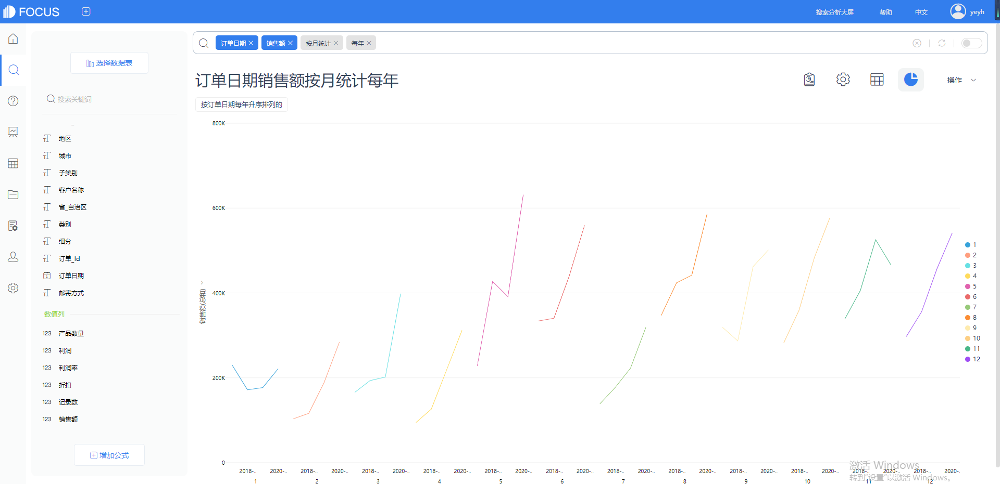

趋势分析几乎是商业分析中使用最为频繁的分析方法。趋势分析与时间维度密不可分。例如，将某个历史时间段的值与当前时间段的值做比较获取商业洞察。

> 一、季节性同比变化

1.商业背景

快速消费品行业往往会受季节性因素的影响，比如水上运动服饰商品，对这类商品进行销售分析时，往往要注重季节性的同比变化。

2.可视化实现

在**折线图**中，可以将多年相同的日期范围放在同一个区间中，从而更有利于分析师发现变化趋势

1. 利用datafocus如何实现

搜索栏输入订单日期、销售额，并将订单日期按月统计，再输入每年，即可将订单日期切分成每月的每年。

图形选择折线图。X轴设为前面是订单日期按月统计，后面为每年，Y轴设定为销售额，图例设定为订单日期按月统计。即可看到每月各年销售额变化情况。

> 二、非季节性同比分析

1.商业场景

对于销售不受季节性因素影响的行业，例如IT行业，使用环比分析有助于分析师洞察企业短期的经营绩效变化状况等。

2.可视化实现

组合图。柱形图可用于显示每个季度的股票平均价格，而折线图则可用于反映当前季度的股票平均价格与当年第1季度的股票平均价格的对比增长情况。

3.解题

（1）得出当年第1季度的股票平均价格。（2）得出当前季度的股票平均价格。（3）得出二者之差。

搜索栏输入订单日期、销售额，销售额的聚合方式改成平均值，再输入每年、每季度，即可看到每年每季度销售额平均值情况。

