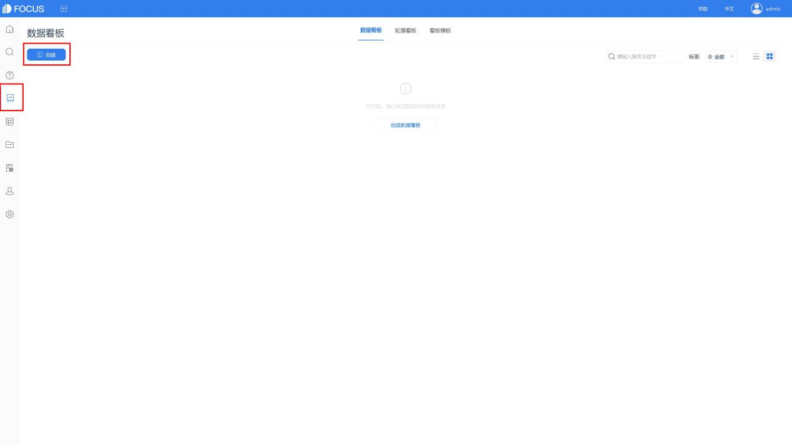
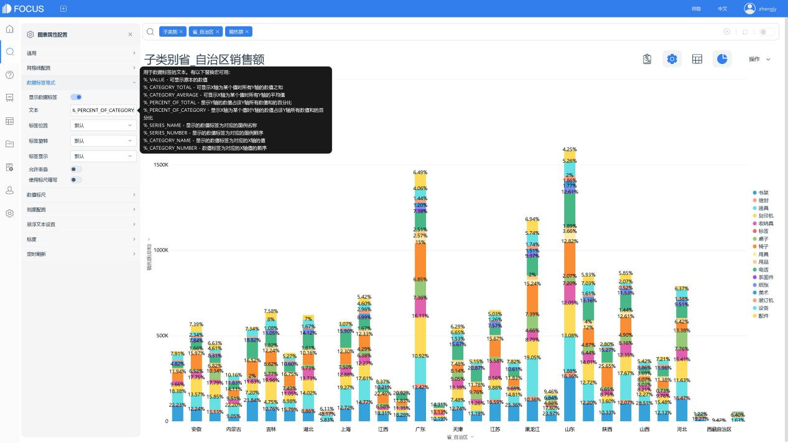
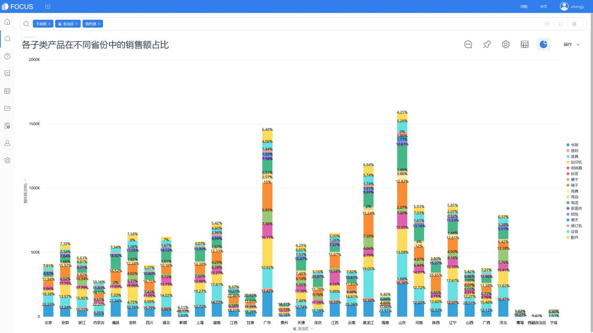
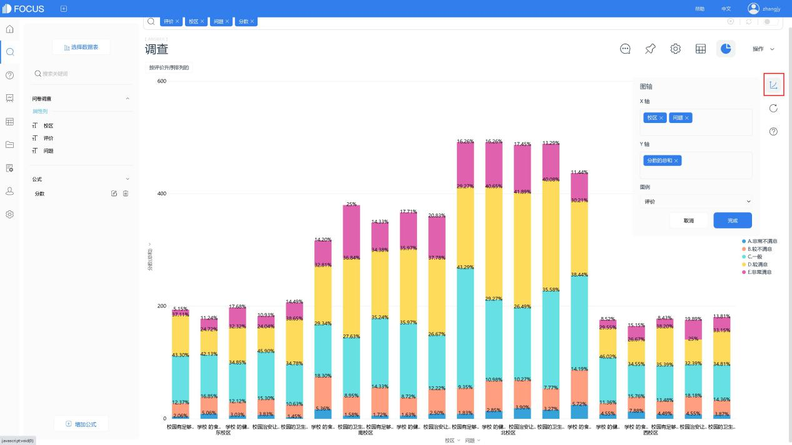

占比分析用于分析不同个体在总体中的占比。之前的文章，我们了解到占比分析中的 人群占比分析、地理位置占比分析。本篇，我们借助DataFocus来了解下“堆积百分比分析”和“占比统计分析”。

# 1 堆积百分比分析

## 分析需求

本节是对地理位置占比分析的进一步延伸，例如子类别产品销售额占比分析、子类别产品销售额堆积百分比分析。

## 在DataFocus中的实现步骤

以“分析各子类产品在不同省份中的销售额占比”为例。

1. 将数据表导入DataFocus系统中，并于搜索模块，选择数据表后，双击列名直接搜索。在图形转换中选择堆积柱状图。

1. 进入图表属性设置，按提示的宏，为堆积柱状图设置标签

1. 即可查看“各子类产品在不同省份中的销售额占比”情况

# 2 占比统计分析

## 2.1 分析需求

例如，查看对某学校学生进行问卷调查的结果，包含各答案的占比和得分情况。

## 2.2在DataFocus中的实现步骤

1. 将数据表导入DataFocus系统，再进入搜索模块选择该表。
2. 点击“增加公式”按钮，进行公式编辑。如图，使用公式if...then...else对调研答案赋分，并保存为公式列。

1. 双击或在搜索框中输入列名，进行搜索分析，并选择组合图。
2. 若x轴和图例的设置不符合需求，点击图表右侧的图轴配置，进行编辑。

1. 最后，可以进入图表属性设置，根据需求，为图表设置标签。

1. 即可查看到各校区学生，对各项问题的回答情况

1. 若需对各评价的人数比例进行统计，则可以使用公式count进行数量的计算与搜索。

在图表属性设置的通用中，可直接将y轴切换为百分比形式显示。

（8）也可以使用关键词“数量”进行计算。

如此，即可查看到问卷调查的答案的占比和得分情况。
