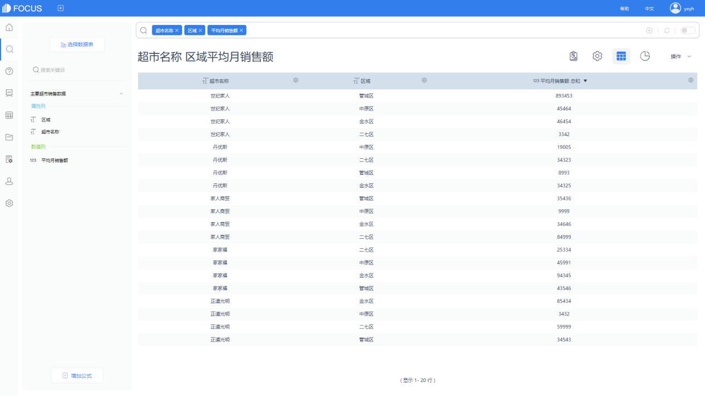
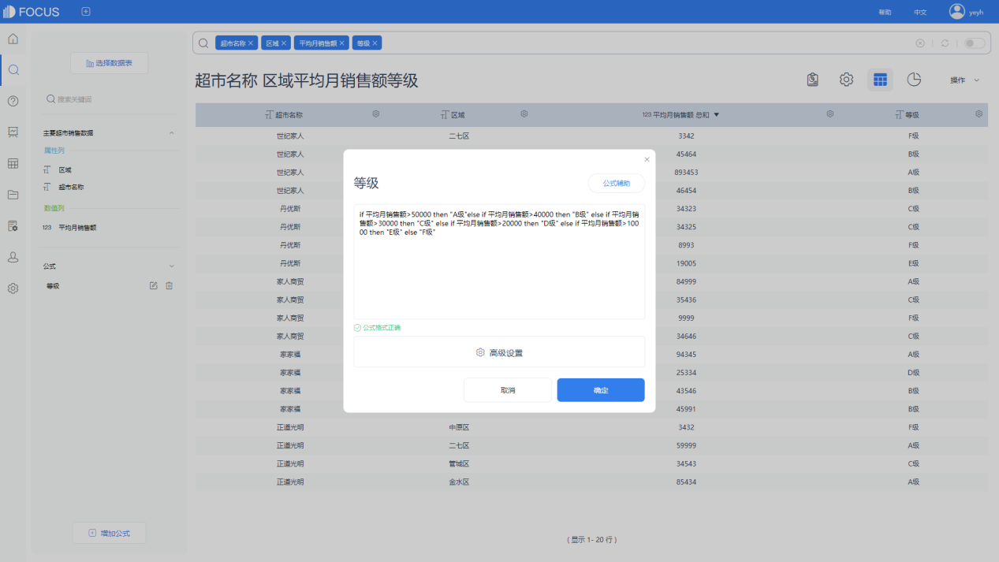
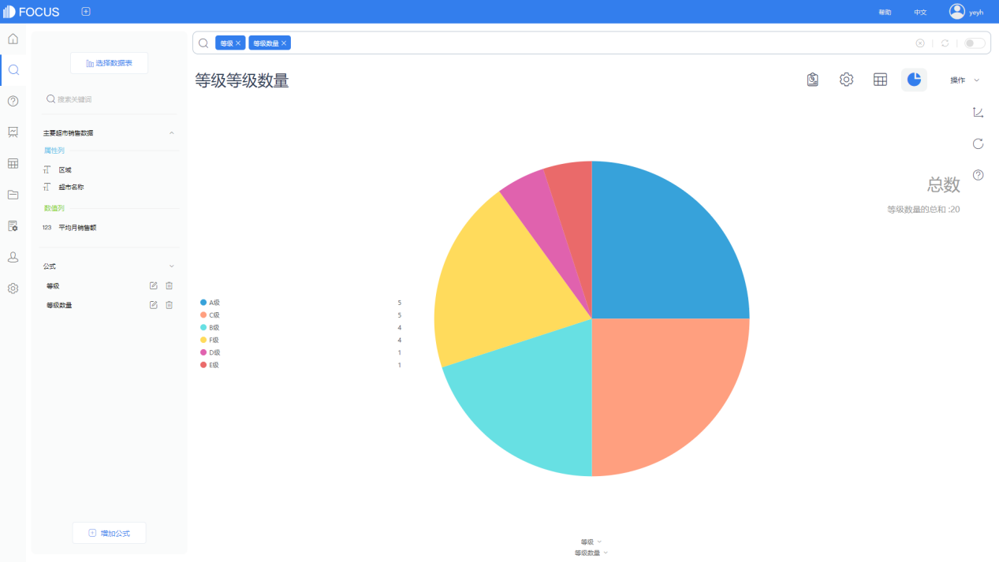
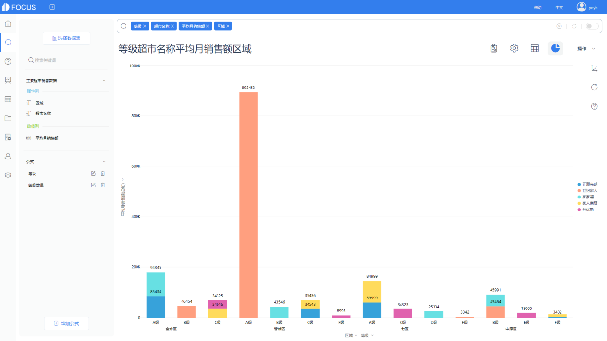
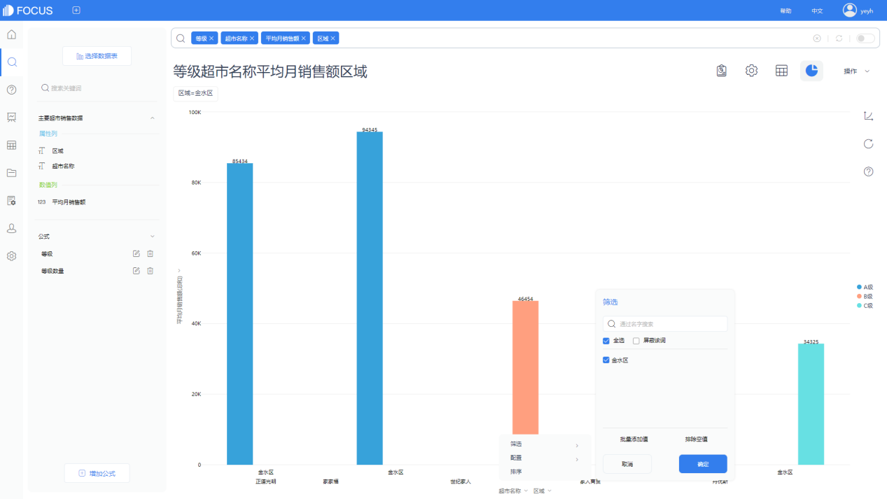
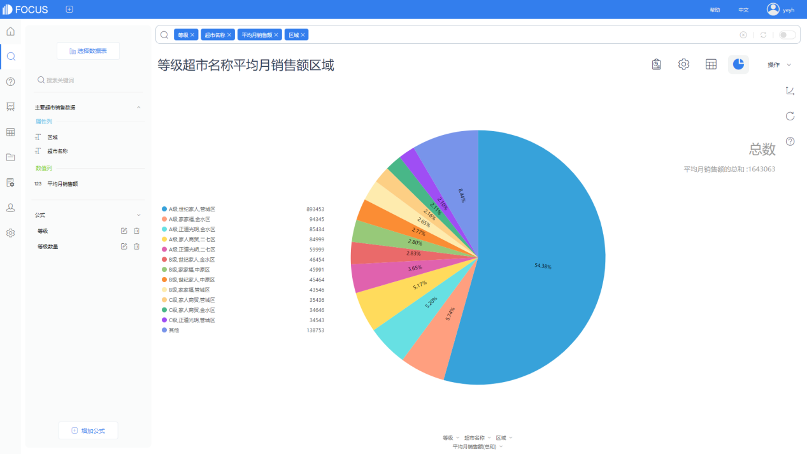

> 1.商业场景

返回客户又被称为老客户，指在当前时间段中非首次购买的客户。返回客户会为企业带来持久的收入来源，是商业分析中的重点分析对象。返回客户指标有助于统计返回客户的人数占比，也可以辅助分析新客户占比。

> 2.可视化实现

柱形图。

> 3.解题思路

（1）求出固定时间段内的所有客户。（2）求出固定时间段内的新客户。（3）用步骤1得出的值减去步骤2得出的值，即得出返回客户的数量。

> 4.DataFocus的实现步骤

首先我们先计算每年的客户总数。

导入数据表超市数据，计算订单日期对应的是哪一年，以方便划分时间段。

建立公式 ，名字为用户购买年份，公式为to\_string(year(订单日期))。

搜索框，输入客户名称订单日期用户购买年份，得出数据表后将表保存为中间表，命名为用户购买情况。目的是为了将这个表中的顾客列取出，计算顾客数量。

选择保存后的数据表 用户购买情况，接下来就是计算顾客数量。

建立公式，不重复计算顾客数量，公式名为用户总数，公式为unique\_count(客户名称)。

搜索框输入 用户购买年份 用户总数，得出以下数据表，我们再次保存为中间表，取名为各年用户总数量，目的是为了和接下来做的新用户数量表关联起来。

用户总数量计算完成，接下来计算新用户数量。

选择源表超市数据，建立公式min(订单日期)，这就是顾客初次购买产品的日期了。同样的，利用year公式将订单日期转换成年份，再用to\_string公式转成字符。

搜索框输入客户名称最初购买日期年份，得出以下数据表，将数据表保存为中间表，我们同样需要对这些列进行处理，中间表命名为新用户情况。

选择我们刚保存好的中间表，新用户情况。

建立公式unique\_count(客户名称)，不重复计算顾客数量，就可以得到新用户的数量。

搜索框输入年份 每年新用户数量，就可以得到每年新用户的情况了。

保存为中间表，命名为每年新用户数量。

进入数据表管理，点击导入表，选择中间表，数据表选择刚刚保存好的“每年新用户数量”、“各年用户总数量”，开始建立关联关系，把两个表中的年份列进行关联，关联方式选择全关联就可以了，两个表的年份都是一样的。

建立完成后，将年份、用户总数、新用户总数都放入新的中间表，进行保存，命名为每年新用户与用户总数。

打开刚建立好的新中间表，每年新用户与用户总数。建立公式老用户数量=用户总数-每年新用户数量，即可得出老用户的数量。

搜索框输入用户购买年份 每年新用户数量用户总数老用户数量，图表转换为柱状图，即可得出最后结果。

总结

需要计算的是总客户数量以及新客户数量，再利用两者之差计算老客户数量，这里需要使用中间表将两者关联。合理巧妙地利用中间表可以帮助你建立表与表之间的联系。
