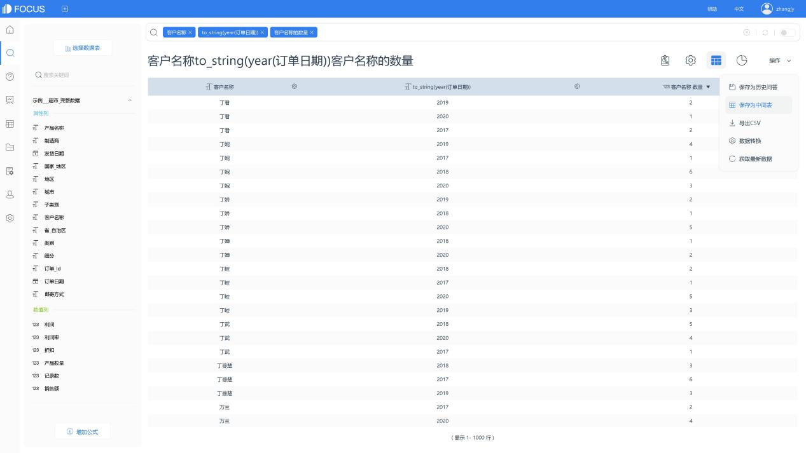
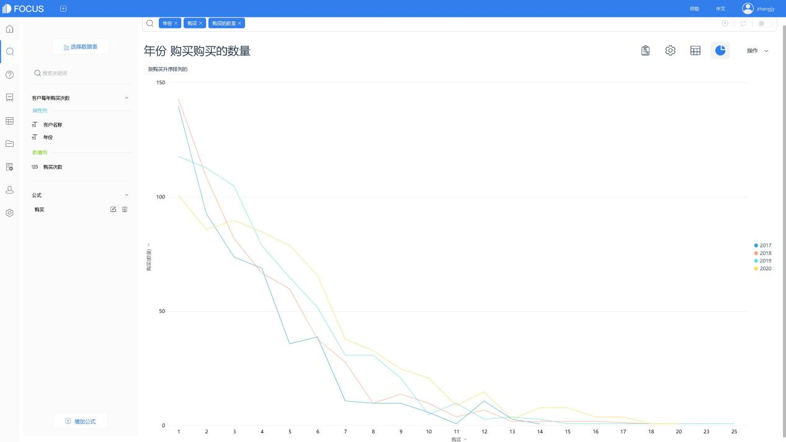
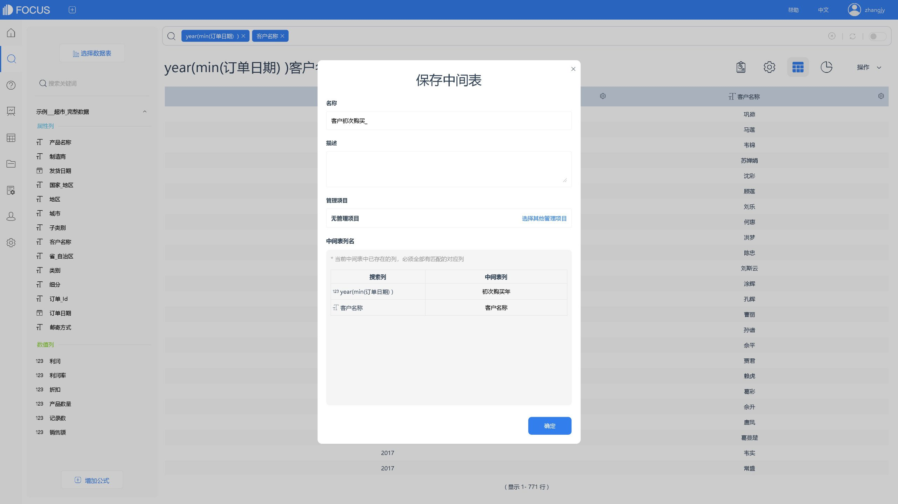
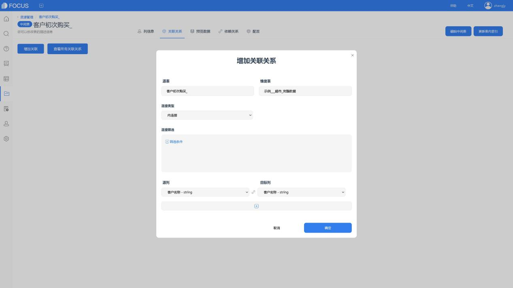
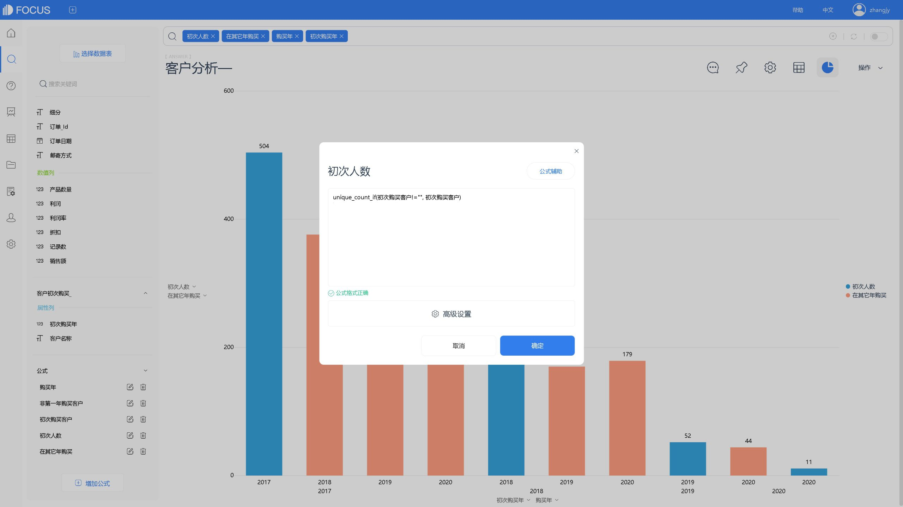
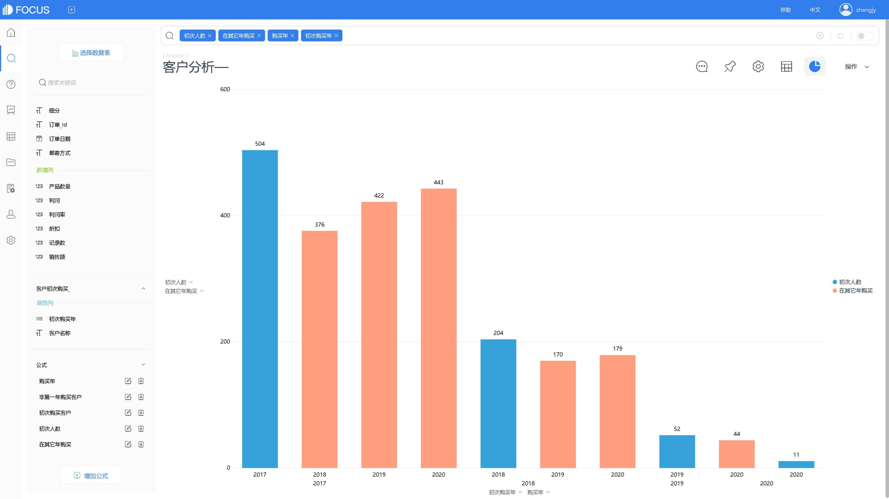

## 1、分析情景

汇总购买次数的客户数，以及计算客户群年度购买频次情况

## 2、分析思路

1. 根据客户信息和订单日期的年份，统计消费订单数。
2. 从客户初次购买年、订单日期年份、订单次数，计算各年度消费的新客户数以及该客户群在其它年份消费的客户数。

## 在DataFocus中的实现步骤

将表导入DataFocus系统，即可进入搜索模块开始搜索式数据分析。

### 3.1 汇总查看各购买次数的客户数。

在搜索模块，选择数据源表后，即可在搜索框中输入列名、关键词和公式进行搜索分析。

#### 3.1.1 汇总各用户在各年度的购买次数

如图，通过关键词“的数量”进行购买次数的统计 ；公式year获取订单日期的年份后，为使后续操作方便，使用公式to\_string将该列转换为属性列。

图表3-1 客户每年购买次数

在操作栏下，将搜索后的结果数据保存为中间表。

图表3-2 中间表

#### 3.1.2 分析各购买次数的客户数

保存成功后，在搜索模块，选择该中间表作为数据源表。

除了使用to\_string进行列类型的更改，也可以在公式编辑界面进行更换，如图所示，将“购买次数”改为属性列，用于制图。

图表3-3 修改列类型

最后，双击对应列名，以将其添加至搜索框中进行搜索，并使用关键词“的数量”计算人数，如图所示。

根据需求，可在“图形转换”、“配置图”、“轴名称”等处进行配置。

图表3-4 图表设置

即可查看到表中，各年度客户购买次数及相同购买次数的人数情况。

图表3-5 各购买次数的客户数

### 3.2 客户群年度购买频次情况

查看各年度消费的新客户数以及该客户群在其它年份消费的客户数。

#### 3.2.1 获取客户初次购买年

使用列名，直接搜索出每个客户的购买日期，再通过公式min和year，计算出该客户第一次购买的年份，即客户初次购买年。

图表3-6 客户初次购买年

将数据保存为中间表。

图表3-7 保存中间表

除了前面提到的两个列类型转换的方法，也可以进入资源管理或数据表管理界面，找到该表，在表详情中切换为measure列或attribute列,即搜索模块的属性列或数值列。

图表3-8 列类型设置

#### 3.2.2 客户购买年份及人数分析

因为需要将客户初次购买年和其它购买年进行比对分析，所以将该中间表与原表进行关联。

如图，关联字段为客户，一般建议使用客户ID。

图表3-9 关联

回到搜索模块，同时选择这两个表作为数据源表。制作如下公式：

公式一：计算客户购买的年份

图表3-10 公式一

公式二：统计在第二年及之后购买的客户

图表3-11 公式二

公式三：统计在第一年购买的客户

图表 3-12 公式三

公式四：嵌套公式二，计算非第一年购买的不重复客户数量

图表3-13 公式四

公式五：嵌套公式三，计算第一年购买的不重复客户数量

图表3-14 公式五

最后，将“初年购买人数”，“次年及以后购买的人数”，“初次购买年份”和“购买年份”信息进行搜索，选择图表，如堆积图，并调节图轴配置。

即可查看到每年的新客户数以及该年客户在其它年份购买情况（2017年为销售第一年）。

图表3-15 客户群年度购买频次情况
