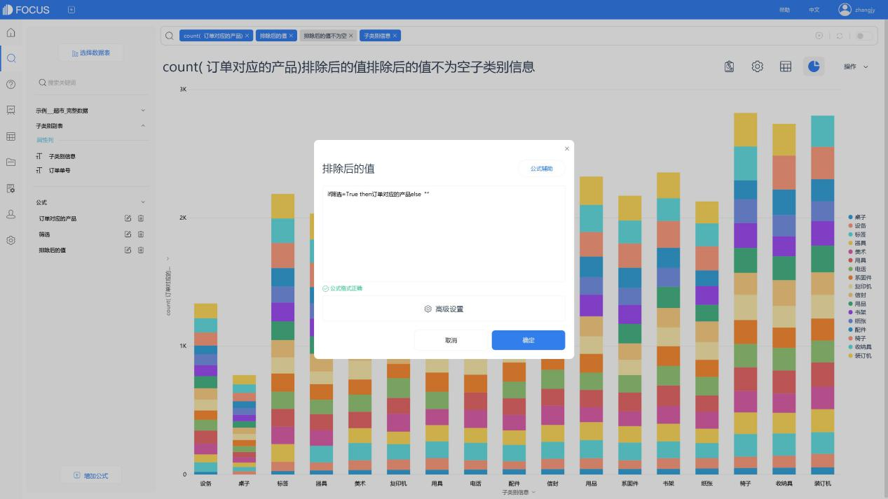
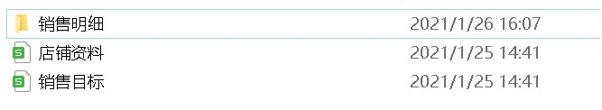

# 篮子分析

篮子分析，适用于在分析与某事物有关联的其他事物。例如经典案例“啤酒与尿布”。从订单中获得商品的信息，找到有关联关系的商品，并以此获得更高的销售收益。

我们先简单回顾一下这个案例，再了解可以如何通过DataFocus对销售订单数据进行篮子分析。

## 1、案例：啤酒与尿布

20世纪90年代，美国沃尔玛超市的管理人员在分析销售数据时发现，男性顾客在购买婴儿尿片时，常常会购买几瓶啤酒，于是他们尝试将啤酒和尿布摆在一起。这个举措使得尿布和啤酒的销量都大幅增加。

原来，在美国的年轻夫妇家庭中，一般是母亲在家照顾婴儿，父亲去超市购买尿布。因此父亲在买尿布时，常常会再买几瓶啤酒犒劳自己。

## 购物篮分析

### 2.1 分析思路

以查看商品各子类别之间是否有关联为例，在DataFocus系统中可以通过以下步骤进行分析：

1. 制作中间表：使用“子类别”和“订单单号”字段制作中间表，并通过订单单号与原表关联。
2. 公式1：依据订单单号，将中间表各子类别与原表中相同订单的其它子类别进行匹配。
3. 公式2：将原表的子类别中，排除与中间表相同的子类别。
4. 公式3：公式1和公式2合并。数据效果如下图。
5. 最后进行搜索分析。

2.1 关联并筛选后的数据效果

### 2.2系统操作

#### 2.2.1 制作中间表

将表导入系统，进入搜索模块，在搜索框中输入列名后，于“操作”栏下保存为中间表。

2.2 保存为中间表

2.3 编辑中间表

#### 2.2.2 表间关联

在“数据表管理”或“资源管理”中找到该中间表，进入表详情的关联关系页面，将该表与源表进行关联。

2.4 添加关联关系

#### 2.2.3 公式制作

回到搜索模块，同时选择源表与中间表，点击“增加公式”按钮，制作如下公式，并保存为公式列。

##### 订单对应，找原订单中，其它产品

2.5 公式1

##### 设置“子类别”相同时，不显示

2.6 公式2

##### 结合前两个公式

2.7 公式3

当然，如果对公式的使用熟练后，可以将以上3个公式结合为一个，并进行使用。

#### 2.2.4搜索分析

最后，搜索框中输入列名、公式、关键词进行搜索分析。

注：公式的使用可以参考公式编辑界面中的“公式辅助”或产品手册。

##### 数值表查看，并按数量降序排列

如图，使用关键词“不为空”排除空值，公式count计算数量。点击数值表中对应列名，即可进行降序排列。

2.8 数值表

##### 堆积柱状图查看，配置好图轴

也可以在“图形转换”中，切换为其它图表，如堆积柱状图。

在“配置图”中，将中间表的“子类别”列定为x轴，关联并筛选后的源表中“子类别”列设为图例，结果如图。

2.9 堆积柱状图
