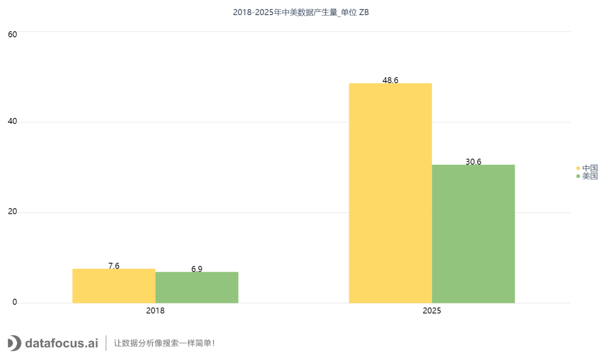
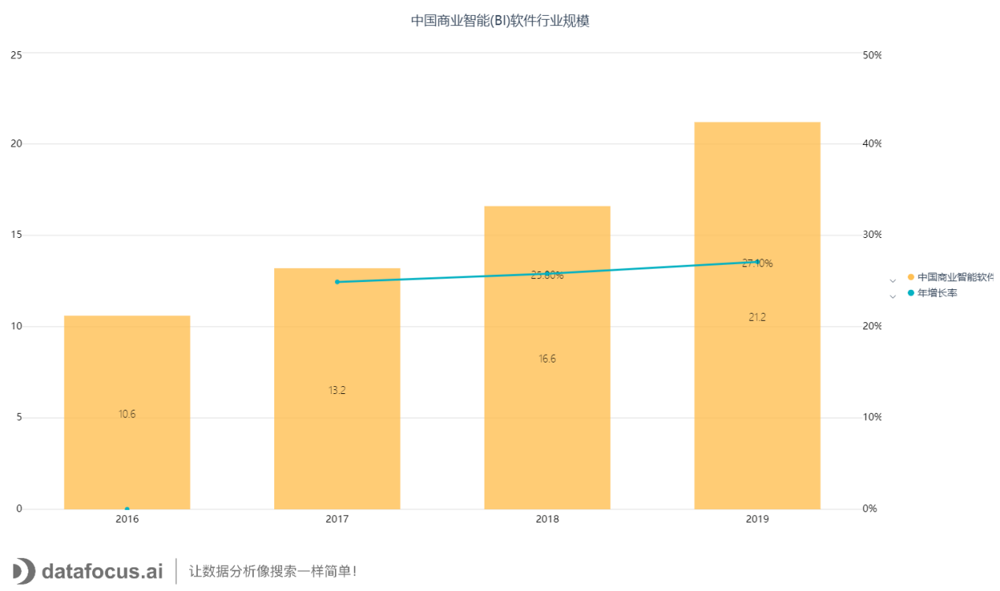
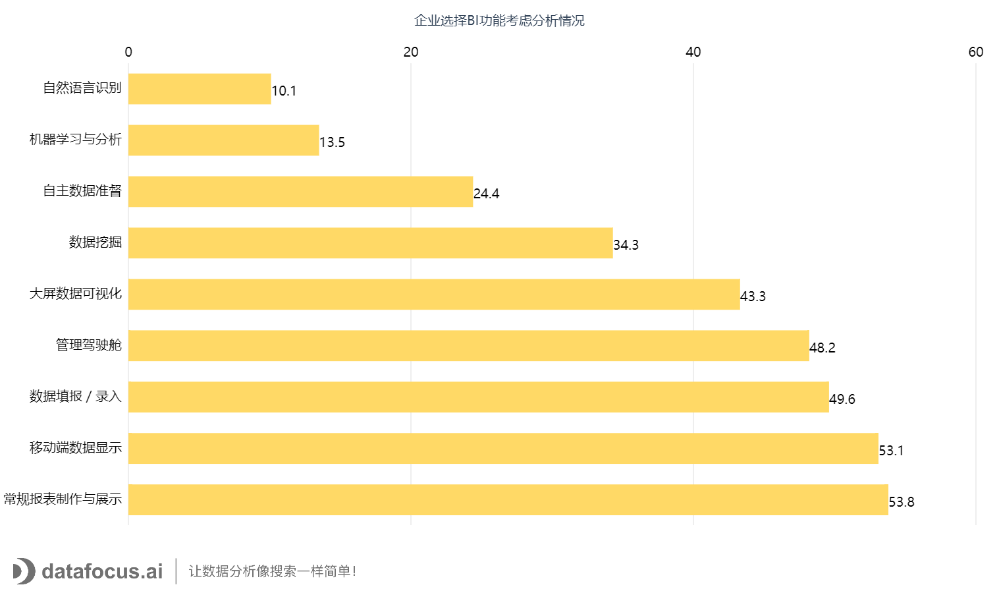

[商业智能](https://www.datafocus.ai)（Business Intelligence）常被人们称呼为“BI”，它提供给企业迅速分析数据的技术和方法，在收集、处理、管理及分析的过程中，将这些数据转化成有用的信息，让企业决策有数据依据，从而驱动企业决策和运营。

从问世到现在，BI已经走过20多个年头了。在数字化转型的浪潮下，BI也随之崭露头角，迎来春天。然而面对复杂的外部环境、多变的用户需求和激烈的市场竞争，BI未来是否仍有较大的市场？

本文，DataFocus带你看中国大数据BI行业市场规模。(数据源自：

**充分的数据基础资源助推中国商业智能行业的发展**

当前，我国正在加速从数据大国向着数据强国迈进。国际数据公司IDC和数据存储公司希捷的一份报告显示，到2025年，随着中国物联网等新技术的持续推进，产生的数据将超过美国。我国产生的数据量将从2018年的约7.6ZB增至2025年的48.6ZB，数据交易迎来战略机遇期。与此同时，美国2018年的数据量约为6.9ZB。到2025年，这个数字预计将达到30.6ZB。

**行业市场趋势**

从我国开始实施国家大数据战略以来，大数据BI行业保持着高速稳定的发展。一方面得益于国家政策的牵引，如《大数据产业发展规划（2016-2020年）》等利好政策，对打造“数据、技术、应用与安全协同发展的自助产业生态体系”做了全方位的支撑和部署。另一方面，持续多年的信息化应用价值教育，企业自身信息化建设的准备，都让更多企业开始使用BI产品，期望通过精细化运营来提升经营效益。

当前我国已进入BI及DA（数据分析）领域的第一方阵，并成为发展最快的国家之一，但仍和美国有一定差距。

2018年中国商业智能(BI)软件行业规模约为16.6亿元，同比增长25.8%，未来中国BI行业的发展潜力巨大。2019年中国商业智能(BI)行业软件收入规模在21亿左右，增长率达到27.1%。

注：市场规模为纯软件销售收入，不含项目实施、项目运维等。

**中国商业智能企业分布结构分析情况**

根据锐观咨询整理所得数据，目前，IT人员主导企业数据分析的模式仍占据主流，也就是IT驱动仍是企业商业智能平台应用现状。从数据调研的受访企业来看，有高达61.62%的企业的数据分析工作仍是第二类型(IT强主导型)，甚至有21.89%的企业的数据分析工作处在第一类型(IT完全主导型)，这显然和业务人员自助数据分析的目标距离遥远。

**超过半数的企业重视常规报表制作与展示和移动端BI功能**

对于BI的功能，企业主要看重报表能力、移动端、填报录入、管理驾驶舱等。

超过半数的企业非常重视常规报表制作与展示和移动端BI功能。近一半的企业期待用数据填报来解决企业内部数据采集和录入的问题，数据填报也是解决数据分散在Excel、Word中的有效方法。

对于机器学习、自然语言识别、人工智能这些未来BI功能，企业关注较少，仅有一成企业表示关注。这些功能目前仍然停留在概念层面，实际使用的场景并不多。

**数据整合是企业应用BI最期待获得的数据价值**

当前国内企业应用BI产品，最期待获得的数据价值，一是数据整合，二是数据展示效率，三是辅助管理决策。

72.8%的企业最想获得的数据价值是整合多系统数据，打通多系统的数据，解决数据壁垒的问题实现信息透明。69.1%的企业想要提高报表的输出效率，期望能够更快更准更省事。53.7%的企业则希望通过数据分析，辅助企业决策，实现科学化、数据化的决策。

