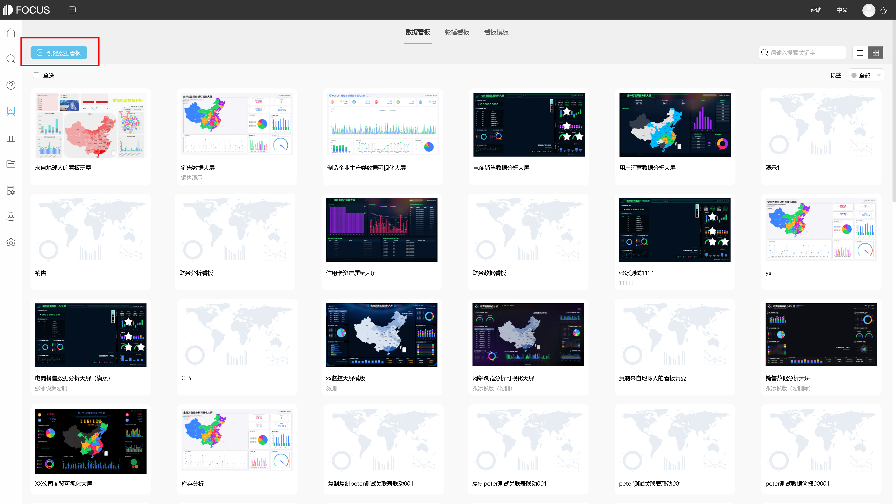

商业智能BI数据分享的架构是很多企业或者一些知名潮流应该具备的一些素质和能力方面的体验，为此大家该怎么样去理解和分析这两者之间区别，对此datafocusatafocus软件带你走进BI主要构架，一起来看看吧！

1、读取数据

datafocus系统可读取多种格式的文件，同时可读取关系型数据库中的数据。在读取文本和数据的基础上，datafocus系统还可以完成：连接文本把2个斌去，并且在一定程度上是可以将所需的数据合并到一个文件。

设置项目类型作为数据的项目类型，除按钮数值项目以外，还可以设置日期表示形式的日期数据项目、多媒体项目和不需要生成按钮但在列表显示中能够浏览的参照项目。

2、分析功能

每个关联的数据是指在很关键地方采用一些关联分析主要用于发现不同事件之间的关联性，即一个事件发生的同时，另一个事件也经常发生并且一些在利用很大程度上采取datafocus系统把这种关联的分析设计成按钮的形式，有时候大家利用datafocus系统的关联分析，可以发现客户的关联购买需要。

以上，就是关于商业智能BI数据工具分析软件，其实很多时候大家都应该明白，一些商业智能BI数据的分析就是整理好一些产品利益效应，为此很是值得大家关注的话题！

