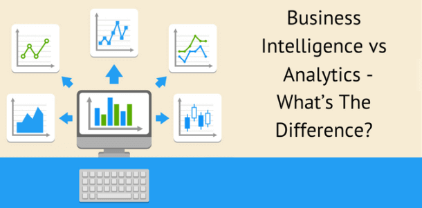
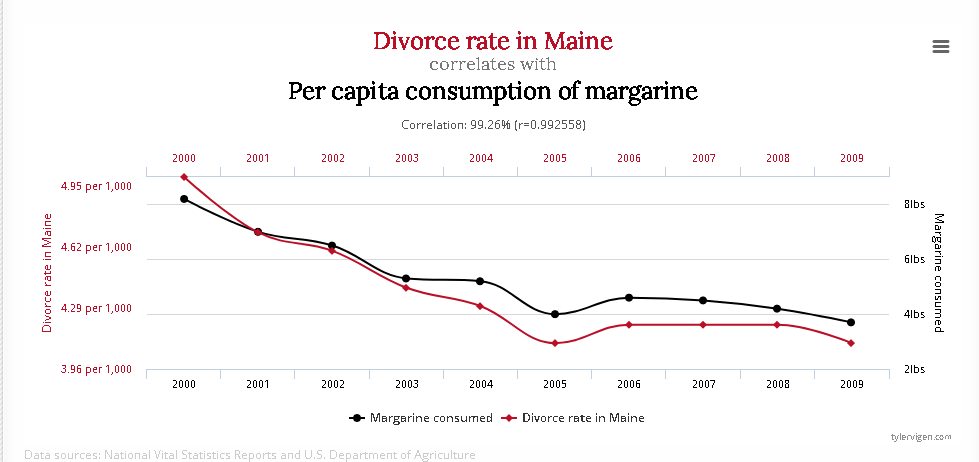

如果有人让你陷入困境，你能告诉他/她商业智能和分析之间的区别是什么吗？您是否对其中的细节感到有点不确定，你不是一个人，专家们也不同意！商业智能和分析之间没有明确的界限，但它们在解决业务问题、提供对过去和现在数据的洞察以及定义未来决策的方法上有着极其密切的联系和交织。虽然一些专家试图强调，BA关注预测建模和高级统计来评估未来会发生什么，但 BI 更关注于当前的数据时刻，根据当前的见解做出决策。但让我们更详细地看看专家们是怎么说的，以及我们如何将两者联系起来并加以区分。

今年早些时候，我们已经看到[了商业智能和商业分析的好处](https://www.datafocus.ai/infos/benefits-of-business-intelligence-and-business-analytics)。现在让我们更深入地挖掘，弄清楚这到底是怎么回事，是什么让它们不同，以及它们如何相互补充。

## 专家怎么说？

在一篇讨论商业智能和商业分析的文章中，Better Buys询问了7位不同的商业智能专家，他们对商业智能和分析之间的区别有何看法。每个专业人士都有不同的看法。以下是他们的一些观点片段：

“商业智能是运营企业所需要的，而商业分析则是改变企业所需要的。” _– Pat Roche，Magnitude Software 工程副总裁_

“BI 正在审视后视镜并使用历史数据；BA就在你面前，看看会发生什么。” _– Mark van Rijmenam，BigData-Startups 首席执行官/创始人_

“商业分析和商业智能有什么区别？正确的答案是：每个人都有自己的观点，但没有人知道，你不应该在意。” – _SAP 创新传播者 Timo Elliot_

那么，如果您确实关心商业智能和数据分析之间的区别，该怎么办？无论您经营的是小型作坊还是企业，如果您必须做出会在短期或长期影响您的决定，两者一起使用是明智的。BI 和 BA 将为组织提供对原始数据的整体看法，并使决策更加成功和更具成本效益。

## 什么是商业智能和分析？

商业智能和分析是在公司和企业中实施的数据管理解决方案，用于收集历史和当前数据，同时使用统计数据和软件分析原始信息，并为做出更好的未来决策提供见解。

让我们面对现实吧：这两个术语都提供了对业务运营和未来决策的洞察，但归根结底，它们在如何进行操作和它们到底提供什么信息方面存在差异。

很明显，对于这两个术语之间的差异，没有一个标准的“正确”定义。专家给出的不同意见就是证据。因此，与其试图找到“正确”的答案，不如在两者之间找到一个有用的区别，可以简单明了地帮助您的工作。商业智能和数据分析之间最直接和最有用的区别归结为两个因素：

1. 我们面临的时间方向是什么；过去还是未来？
2. 我们是否关心发生了什么，它是怎么发生的，或者它为什么发生？

请记住，这完全是一个观点问题，以下是是我们对商业智能与商业分析的简化定义。

**商业智能 (BI) ——**处理过去发生的事情以及它是如何发生到现在的。它可以识别大的趋势和模式，而无需过多挖掘原因或预测接下来会发生什么。

**商业分析(BA) ——**处理过去发生的事情的原因_。_它分解了促成因素和因果关系。它还使用这些原因来预测未来会发生什么。

也就是说，BI 和 BA 有不同的应用。一方面，BI 工具可以帮助组织识别相关趋势，以及对各种过去场景的解释。另一方面，BA 关注更高级的应用程序，例如预测分析和统计建模。这也允许这两个术语相互补充，以提供数据的全貌。通过使用**商业智能和分析 (ABI)**工具，公司可以充分挖掘分析工作的潜力，并根据事实做出改进的决策。

困惑了吗？让我们用一个足球的例子作为比喻来帮助澄清我们刚才提到的一切。

## 从足球看商业智能与商业分析

假设您是一支足球队的教练组成员，您想回顾最近的比赛。这样做是为了了解如何修正错误并复制自己的成功。

使用我们之前的定义，**BI**将是识别导致您的团队获胜的所有统计数据和比赛的过程。它会表明你控球的时间比对手长得多。它还可以识别出你的右路通过出色的传球保持控球权的趋势。

**BA**会更关心为什么你的控球时间比你的对手长，以及为什么你的右边路传球表现如此出色。

是不是因为：

- 你的对手在那边的防守队员比对方的防守队员弱？
- 你的右边队员在球场上的时间比你的左边队员多？
- 你右边的一名球员只是有一场非凡的表现，而这场比赛延续到了其他球员身上？

这些问题很重要。它们使您能够弄清楚如何复制自己的成功，或在以后防止您的失败。提出[正确的商业智能问题](https://www.datafocus.ai/infos/right-business-intelligence-questions)将引导您进行更好的分析。使用业务仪表板时，所有的信息都可以简化到一个地方，从而更快地做出有意义的决策。但首先，我们需要更多地分析差异，因为这将有助于我们了解在一个公司的运营过程中应该做什么，以及如何选择最好的工具来管理你的洞察。

言归正传，让我们深入探讨商业智能和数据分析之间的区别。

## 商业智能和商业分析有什么区别

正如这篇文章的介绍中提到的，BI 和 BA 之间没有明确的区分。虽然这两个术语通常可以互换使用，但有一些元素可以区分它们。让我们分别来看一下。

### 1\. 定义：描述与预测

这两个概念之间的第一个区别在于实际的定义。虽然它们都在分析过程中起到了作用，但它们的作用不同。一个基本的区别因素在于它们各自用作基础的方法。BI 告诉您过去发生了什么以及现在正在发生什么（描述性分析），而 BA 告诉您将来会发生什么（预测性分析）。让我们看一下这两者的概念定义。

- **描述性分析**：顾名思义，这种分析方法用于描述和总结在数据集上发现的主要特征。通过识别模式和关系，这种方法可以传达随时间的变化，并使用趋势和见解来驱动决策过程。在业务环境中，它用于比较前几个月的绩效、实现目标的进度、收集客户反馈等等。
- **预测分析**：这种方法使用来自数据挖掘和机器学习技术的高级统计技术来分析当前和历史数据并生成准确的预测。在业务环境中，此方法可识别模式和趋势，并可以预测库存、预测客户对新产品的反应、评估风险等。

### 2\. 在商业环境中的使用

使用场景是另一个可以帮助我们了解 BI 和 BA 之间区别的因素。在这种情况下，不仅最终用户会发生变化，而且使用目的也会发生变化。正如我们一次又一次提到的，BI 工具用于报告组织当前和过去的绩效，BA 工具通过帮助您决定下一步的流程，让您更进一步。让我们来看一个例子。

想象一下，您拥有一家线上鞋店。有一天，您正在查看您的[销售报告](https://www.datafocus.ai/infos/sales-report-kpi-examples-for-daily-reports)，并注意到过去几周在纽约的一双红鞋的销售额飙升。此信息由您的**BI**工具提供，它让您了解需要生产更多红鞋来满足需求。现在，**BA**可以帮助您了解为什么销售额会在纽约特别高。通过深入了解您的网站数据，您会发现大部分流量来自一位穿着您的红鞋的纽约博主。像这样，你决定把其他一些成功的鞋款发给全国各地的其他博主，根据历史需求准备生产。

最终用户是另一个需要考虑的因素。市场上的大多数[BI 软件](https://www.datafocus.ai/infos/best-bi-tools-software-review-list)都是自助服务的。这意味着，任何不需要技术技能的人都可以使用它们，从而使 BI 分析过程更加直观和易于执行。另一方面，BA更具技术性。它依靠数学模型、机器学习和人工智能技术来做出准确的预测，这使得没有技能的普通用户很难使用它们。然而，随着新工具的出现，这种情况在过去几年中发生了变化，用户只需单击几下鼠标即可执行高级分析。

### 3\. 应用程序

我们的第三个也是最后一个区别因素在于应用程序。根据您是进行 BI 分析还是 BA 分析，您的数据的使用方式会有所不同。虽然 BI 将信息安排在易于理解的报告中，但 BA 比报告更进一步。让我们看看它们各自的应用。

**BI应用：**

- **绩效管理**：BI 工具收集有关客户行为、转化率、销售额等方面的信息。它根据总体目标跟踪绩效，使组织能够发现增长的改进机会。
- **视觉洞察**：借助现代数据可视化，组织以一种交互式的方式监控生产力并发现趋势。[BI 仪表板](https://www.datafocus.ai/infos/bi-dashboard-best-practices)，提供在一个屏幕中过滤所有数据的可能性，以提取更深层次结论。
- **灵活的报告**：BI 还提供了将来不同来源的大量数据收集到一个位置的可能性。这些报告可以以多种格式共享，从而加强不同利益相关者之间的沟通。

**BA应用**：

- **统计分析**：通过使用线性回归、分类、聚类等不同的统计方法进行预测，分析师可以进一步了解购买行为并制定成功的策略。
- **数据建模：**营销人员或分析师可以使用数据建模来评估营销活动的成功并找到改进机会。例如，通过分析行为数据，您可以预测潜在客户从了解渠道向下移动到购买的可能性。
- **财务预测**：通过使用预测分析来分析以前的财务报表，BA 允许您预测销售、收入和费用，以确保财务状况良好。

## BI 和 BA 如何应用于企业？

在这篇文章的下一部分中，我们将从业务角度通过用例和示例来研究 BI 和 BA，但首先，我们需要检查相关性和因果关系之间的区别。

### 相关性不是因果关系

当两件事相关时，这意味着当一件事发生时，另一件往往同时发生。当两件事有因果关系时，就是说一件事直接或间接导致另一件事的发生。

关于这两者之间的差异，一个著名例子是，冰淇淋消费和城市凶杀率高度相关。当然，冰淇淋不会导致人们互相残杀。所以很明显没有因果关系。

这两者是相关的，因为当夏末气温升高时，凶杀率会上升。理论上，由于天气变暖将更多人带到户外，这会导致更多的社交互动，其中一些是暴力的。

### 你不能总是相信你所看到的

随处可见人们混淆相关性和因果关系的例子。例如，健身房里那个总是喜欢给你锻炼建议的肌肉发达的人可能知道也可能不知道他们在说什么。他们给你的建议，虽然与一个肌肉发达的人所知道的相关，但实际上可能不会让你肌肉发达。相反，他们可能只是拥有良好的基因。但实际上尽管他们肌肉发达，但他们可能不是因为他们的知识而肌肉发达。

谈到事物轻松的一面，有一些有趣的例子表明，事物是相互关联的，但显然没有因果关系。其中许多都显示在 Spurious Correlations 网站上。例如，缅因州的离婚率与人造黄油的人均消费量密切相关……也许已婚夫妇应该改用黄油？

 

严肃地说，根据领域的不同，区分相关性和因果关系可能是极其困难的。非常大规模和昂贵的研究试验通常只是为了寻找因果关系的证据。此外，一个著名的例子是蝴蝶效应。但我们不会深入讨论细节，实际上，我们将更多地研究业务方面的事情，因此，我们将专注于商业智能与数据分析的细节，并提供有关业务领域中的相关性和因果关系的见解。

### 这在业务中如何运作？

您能否了解导致您的业务成功或失败的因素，而不仅仅是与您的业务成功或失败有关的因素？如果是这样，您就更有可能预测您的市场接下来会发生什么，并采取相应的行动。然而，重要的是要注意，在知道因果关系之前，您需要知道什么与某事相关。

换句话说，您需要知道发生了什么以及它是如何发生的 (BI)，然后才有能力以合理的确定性说出事情发生的原因_(BA)。_

这就是商业智能和分析之间的区别，这也是为什么它们都至关重要。它们就像拼图中的两块一样——一个有助于您的企业获得更多利润的拼图。定义和使用有助于建立业务目标并执行业务分析与商业智能的相关性和因果关系的[KPI 示例](https://www.datafocus.ai/infos/kpi-examples-and-templates)至关重要。虽然一开始可能听起来很复杂，但您使用[数据分析工具挖掘得越深](https://www.datafocus.ai/infos/data-analyst-tools-software)，建立合格的洞察力并做出更好的决策将更有意义。这就是全部：商业智能和商业分析之间的区别很重要，因为它有助于公司以一种具有成本效益和洞察力的方式调整其运营。在创建成功的[商业智能策略](https://www.datafocus.ai/infos/roadmap-to-a-successful-business-intelligence-strategy)的过程中使用这两种策略，只会让您在市场上更具竞争力。

## BI 和 BA 用例场景？

描述和隐喻已经说够了。让我们用一些商业例子来巩固一下，说明商业智能和商业分析之间的区别。

假设您在一家营销公司工作，该公司使用商业智能和分析来帮助大型电子商务公司推出新产品。为了了解哪些新产品最有可能获得成功（分析），您需要弄清楚：

- 过去最成功是什么（BI）
- 影响过去发布成功的季节性趋势 (BI)
- 顾客购买过去成功的产品的原因 (BA)

例如，假设您的电子商务商店销售精品女装。您将需要使用您的[零售分析](https://www.datafocus.ai/infos/retail-analytics)来了解哪些产品有效。

首先，您要检查哪些类别的服装带来的利润最多。然后，您可以查看这些成功的产品是在一年中的什么时间发布的。最后，您可以进行一系列深入的客户访谈，以找出客户为什么更喜欢这些产品或类别。

如果您进行了足够的[市场调查](https://www.datafocus.ai/infos/market-research-analytics)，并且拥有足够大的样本量，您应该能够非常准确地预测哪些新产品可能会成功。

这可能会导致您对产品的看法出现意外，因为您的客户看待产品的方式通常与您截然不同。

**BI 和BA消除假设**

例如，您的假设是客户主要关心您的服装的价格点。

然而，在您的研究之后，您发现如果您强调您的人道采购实践，例如不使用血汗工厂，您的客户实际上愿意在您的产品上花费更多的钱。

然后，您的重点将是继续在您的营销信息中使用该定位，而不是在产品发布时过多地担心服装的价格点。

上面的示例说明了商业智能和分析的基本要点之一。你对你的组织、客户、市场和产品的假设通常是完全错误的——或者至少是不完整的。在提出正确的问题后，分析可以为您提供帮助 - 无论您的行业或部门是什么，无论是[医疗保健分析](https://www.datafocus.ai/infos/healthcare-analytics)还是[金融商业智能](https://www.datafocus.ai/infos/business-intelligence-finance)，您都需要同时使用 BI 和 BA 才能取得成功。

## 商业智能和分析示例

很明显，两者的区别可以通过现实生活中的例子来检验，所以让我们分析几个可以显示这两个术语价值的行业。

**人力资源：我的招聘选择有哪些？**

在人力资源中，一切都与劳动力有关：员工敬业度、加班时间、培训成本、整体生产力、每次雇佣成本、招聘转换率、填补职位的时间、保留效率、兼职员工等。为您的业务正确的[HR KPI](https://www.datafocus.ai/infos/kpi-examples-and-templates-human-resources)，您需要更深入地挖掘发生了什么和如何发生的(BI)，然后为什么会发生 (BA)，以了解未来如何表现。让我们简单看看一个全面的仪表板，看看商业分析与商业智能的表现如何。

上面的这个[在线仪表板](https://www.datafocus.ai/infos/online-dashboard)是为一个简单而有效的企业招聘过程概述而创建的。它可以被招聘机构使用，也可以在公司内部使用——它适用于需要更多数据和洞察其流程的人力资源经理和专业人士，来定义即将做出的决策并降低成本。目标是找到正确的招聘方法，以最低的成本为您提供最佳候选人。要将其付诸实践，您需要定义招聘过程中发生了什么。以及它是如何发生的 (BI)，下一个问题是为什么它会以您在此仪表板上看到的方式发生 (BA) .

假设填补一个职位的平均时间（一个部门，以天为单位）没有按计划进行。你可以多看一看，招聘专业人员的转化率并没有达到预期，你失去了跟上市场的宝贵时间和资源（你已经使用了你的历史数据，并将其与当下时刻联系起来——发现您正在失去资源）。招聘的平均成本将帮助您确定招聘周期中正在发生的模式。通过使用[在线数据可视化工具](https://www.datafocus.ai/infos/data-visualization-tools)掌握这些数据，可以减少获得这些信息所需的时间，并可用于其他业务流程。

在此示例中，我们可以定义发生了什么、如何发生以及为什么发生。不要害怕进行自己的分析并创建自己的[人力资源报告](https://www.datafocus.ai/infos/monthly-and-annual-hr-report-templates)，这将帮助您展示商业智能与分析的力量。这是很重要的，因为您想了解和定义对您的运营的影响，以考虑未来的工作；你想知道发生了什么，它是如何发生的，以及为什么。这是成功企业的整体公式。

但是，让我们更深入地研究其他行业。

**采购：是否有可能超越我的供应交付流程？**

我们还可以向您展示另一个例子，以便您更好地了解什么是商业智能和分析，然后您也可以自己探索，这是[采购仪表板](https://www.datafocus.ai/infos/dashboard-examples-and-templates/procurement)，阐述了供应商的交付性能。如前所述，在您建立指标（在本例中是[采购 KPI](https://www.datafocus.ai/infos/kpi-examples-and-templates/procurement)）后，您可以更深入地分析业务流程，以建立更好的绩效，并决定未来的成功方面。商业智能分析通常一起使用（甚至在措辞中），它可以帮助您获得整体概览，就像上面显示的仪表板一样。这并不意味着它不能单独使用，但为了做出更好的决策，您需要在这个竞争激烈的市场中使用最好的工具。话虽如此，商业智能与商业分析可以显示上述相关性和因果关系，这将为一般业务运营和重要决策的未来推理提供广泛的价值。

在我们的最后一个示例中，我们将总结商业智能分析可以为公司做什么以及如何使用它。优点很明显，但是简单的可视化概览可以为您提供哪些不可或缺的功能呢？使用您的原始数据并组合所有重要绩效、历史和当前情报的可视化表示，您可以创建一个强大的洞察工具，该工具将收集和连接企业最需要的敏锐度运营，管理其小型、中型和大型规模业务，同时做出平衡的决策并创建可持续的流程。让我们通过一个例子来看看。

**销售：如何减少周期长度？**

销售[仪表板](https://www.datafocus.ai/infos/dashboard-examples-and-templates/sales)上面的可视化反映了执行整个过程所需的销售周期——从潜在机会到支付发票。在编译历史数据（在定义的预设时间计算平均值）时，结合当前过程中发生的见解和趋势，我们可以更深入地挖掘周期的 BI。我们可以检查销售漏斗（也可以根据业务或部门的特定需求进行定制），每个漏斗阶段发生的趋势和模式是什么，它如何影响整个周期，以及团队中表现最好的代表是谁。通过深入研究生产力，超越那些效率较低的流程，公司可以很容易地发现什么是有效的，什么是无效的。如果您看到平均销售周期长度为 18 天，但您的基准告诉您它应该不超过 15 天，那么从BI 角度进行研究，可以为您提供这 3 天表现不佳的答案。这将为下一个周期提供额外的优势，因为您可以轻松查明问题所在，并集思广益解决方案。

通过详细说明导致这些见解的因素（通俗点说，就是为什么事情会发生），添加预测分析，并检查前面提到的这些流程的原因，企业可以利用业务分析的观点——这将有助于收集相互关联的数据转化为一个全面的数据故事。如果您处理原始数据集，并利用统计数据的力量来预测您的未来的绩效，那么您已经利用了商业智能与数据分析领域的整个序列。

**营销：我怎样才能产生成功的活动？**

我们的下一个示例是一份市场[营销报告](https://www.datafocus.ai/infos/daily-weekly-monthly-marketing-report-examples)，概述了不同活动和沟通渠道的总体表现。有了这些信息，你就可以回答一个重要的问题：我们花了多少钱，我们为这个活动有什么计划？这可以让你了解您的预算是否按计划使用，并发现任何可能导致资源和时间浪费的问题。让我们更详细地来看一看。

首先，我们得到四个[仪表图](https://www.datafocus.ai/infos/gauge-chart-examples)，显示您的总成本与计划成本。这使您能够更深入地观察每次广告活动的花费，并将其与您的成本目标进行比较。例如，我们可以看到广告活动 1 几乎达到了全部预算，您可以用广告活动的展示次数、点击次数和获取次数来补充此信息，并了解总体效果如何。如果这个广告活动带来了很多转化，那么它甚至值得扩大预算。如果另一个表现不佳，您可以将这些资源分配给其他成功的活动。在商业智能的帮助下，所有这些见解都可以轻松生成。

现在，您可以使用 BA 进一步获取这些数据。例如，营销人员可以查看过去活动的交互情况，并根据兴趣和人口统计数据细分受众。这使他们可以通过预测用户对特定内容的反应，为不同的细分市场构建有针对性的活动。与此相结合，他们还可以了解将广告支出的重点应该放在哪里。通过查看历史广告表现，营销人员可以确定广告渠道以及某些产品更有可能销售的特定时间。比如夏天卖泳装。

**财务：可以降低财务风险吗？**

我们最后一个商业智能和分析示例是一个[财务仪表板](https://www.datafocus.ai/infos/dashboard-examples-and-templates/finance)，它显示了确保稳定的财务管理和绩效所需的关键 KPI。通过查看当前营运资金、现金转换周期和供应商付款错误率等指标，CTO 可以回答与发票、预算和整体财务稳定性相关的关键问题。

上面显示的[财务报告](https://www.datafocus.ai/infos/daily-weekly-monthly-financial-report-examples)首先提供了您的营运资金除以流动资产和负债的详细分类。在这种情况下，BI 可以让您一目了然地了解公司的流动性，因为高营运资金意味着有资源可以投资和发展。与此同时，我们得到了过去 3 年现金转换周期 (CCC) 的分解。及时跟踪这一指标可以帮助您发现与现金转换相关的问题，并找到解决这些问题的智能解决方案。理想情况下，你的 CCC 应该尽可能低，如果你在过去几年看到了下降的趋势，这意味着你做的事情是对的。

最后，仪表板显示一个图表，跟踪过去 12 个月的供应商付款错误率。这使您可以了解发票和付款流程中发生的任何问题，这可能包括错误地址、重复付款、错误的金额等。在这种情况下，通过查看历史数据，您可以看到 9 月份出现了大幅飙升。这意味着您需要更深入地调查改月发生的事情，并防止它再次发生。如果您不查看这些错误的原因，它们很可能会再次发生。因此，从长远来看，深入了解可以提高效率。

此处显示的示例不仅可以让您区分 BI 和 BA，还可以了解这两个概念是如何协同工作的，从而提供组织运营和性能的完整画面。如果您想查看针对不同行业和功能的其他[仪表板示例](https://www.datafocus.ai/infos/dashboard-examples-and-templates)，可以看看我们包含的多个模板库吧！

## 关键要点和后续步骤！

总结我们在本文中研究过的问题，目的是区分这两个单独使用且相互关联的术语，您现在可以确定在您的决策过程中哪个会表现得更好，以及您可以从这两个术语中得到什么。尽管如此，我们想强调这样一个事实，通过商业智能和商业分析解决方案的互补使用，您可以解开您的假设，并获得更准确和有用的数据。简而言之，BI 和 BA 为您提供了尽可能清楚地看到现实的工具。话虽如此，两者的重要性都会影响公司的业务运营，无论公司是大是小，将两者结合起来的需求肯定会成为一个成功进入市场的运营必备条件。

这是一个不容忽视的竞争优势。[通过30 天免费试用](https://www.datafocus.ai/console)DataFocus 的[在线 BI 工具](https://www.datafocus.ai/infos/online-bi-tools)，开始应用您新获得的关于“BI 与BA”的知识！
