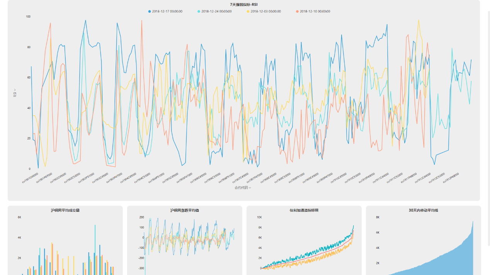

随着科技的进步，越来越多的操作都可以被机器替代。十几年前，手机还是一个奢侈并且笨重的联系工具，只能打打电话发发短信，信号还非常不稳定。谁能想到十年后的现在，我们会用手机进行各种操作，聊天、视频、看剧、直播、支付，还能够遥控打开家里的空调热水器，科技在迅速覆盖我们生活的方方面面。伴随着科技而来的，还有越来越多的数据，每一次的操作，都会产生一条数据，为了准确并且快速分析这些数据，商业智能也开始以一种难以想象的速度快速崛起。国内也有很多主攻商业智能的分析工具，比如DataFocus，首创了中文自然语言搜索，通过搜索就能得出数据的分析结果。那么这一类的公司将其商业智能实际运用于企业后会面临哪些风险与挑战？

风险一：商业智能毕竟只是预测，与现实可能存在差距

商业智能发展到现在，已经可以实现与数据库进行连接，实时监测企业数据，DataFocus就可以帮助企业定制你想要的分析模式，只要你提供分析的目标以及准确的数据，就可以按照你的要求部署环境，定制你所需要的分析业务。

但这毕竟是依照以往数据进行的预测，可能与企业实际发生的情况存在一定的差距。就像天气预报说明天是晴天，但其实明天下雨了。谁也无法做到准确预测，我们能做的就是想尽方法提高预测的准确率，因此企业收益仍会存在不确定性，有一定的风险。

风险二：分析不到位

商业智能分析应该要与企业的业务进行结合，要应用商业智能和使用大数据分析技术，了解企业的市场定位和行业所处环境，并且还要面对不断变化更新的动态市场，要综合外界、企业和工具三部分的各方面影响因素，才能尽量准确的得出分析结果。

风险三：缺乏对比

企业分析一般程度上是运用的企业内部数据，但外部数据一样非常重要。企业所处的市场日新月异，随时都可能产生变动，“闭关锁国”的只分析自己的数据，不了解竞争对手的情况是非常危险的。但这些外部数据是非常难获取的，想要得到这些对比数据可能还要花费很大一番心思。

