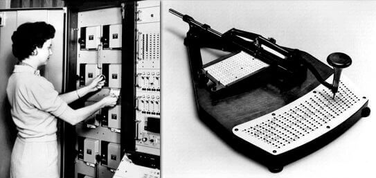
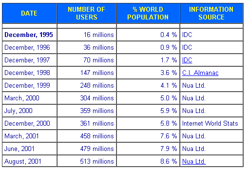

如果不了解更多信息，您会认为商业智能仅在过去 10 到 20 年左右出现。其实您多半都是正确的——至少在非技术性、用户友好、 [自助式商业智能方面](https://www.datafocus.ai/infos/self-service-business-intelligence)是对的。

随着个人电脑的普及，和最近的技术进步，商业智能在 21 世纪的使用肯定有所增加。然而，商业智能的根源也可以追溯到 19 世纪。

在这篇文章中，我们将探讨从 19 世纪到 20 世纪一直到今天的商业智能的发展历史。

## 商业智能及其演变的历史

### 商业智能的起源

第一次有人使用“商业智能”这个词是在 1865 年。

在《商业和商业轶事百科全书》一书中_，_理查德·德文斯用这个词来描述金融家如何成功地击败他的竞争对手；通过比他们更好地了解市场及其周围的条件。这一概念在今天同样适用。

不幸的是，这个问题中的金融家最终不道德地使用了他的商业智慧，成为了一个腐败的银行家。幸运的是，商业智能的下一个大用途将是道德罗盘的正确方向。

### 二战和 1950 年代使用的商业智能

二战期间盟军对密码学的使用是商业智能工具和原则在一个非常不同的环境中应用的很好的例子。

盟军必须收集大量德国通讯资料，研究这些加密通讯资料，从中找到有用的信息。

通过他们不懈的努力，最终使得他们一次又一次地破解了德国人臭名昭著的“谜”密码，从而为盟军带来了情报优势。

### IBM 取得技术进步

_资料来源：__数据经济_

商业智能历史上的下一个重大飞跃是硬盘驱动器的发展。由 IBM 于 1956 年发明的硬盘驱动器或今天所知的硬盘驱动器，允许存储大量数据。这种技术创新奠定了现代商业智能的基础。如果没有数据的数字表示，就很难使用看起来类似现代工具的商业智能工具。IBM 将继续引领商业智能的发展。

例如，1958 年，IBM 员工 Hans Peter Luhn 发表了一篇重要的 BI 期刊论文《A Business Intelligence System 》。这篇论文就未来几年商业智能将会发展成什么样子表达了非凡的远见。该论文评论了组织面临的挑战，由于他们必须处理和使用大量的信息，以作出决定。

Luhn 还展示了他的技术实力，概述了一系列解决方案，这些解决方案可以帮助企业更有效地使用数据。虽然在撰写这篇论文时使用的特定技术已经发生了巨大的变化，但提出的总体概念仍然高度相关:以最容易理解的格式向最终用户提供他们需要知道的信息，以便做出良好的业务决策。今天，我们称之为[数据驱动的决策](https://www.datafocus.ai/infos/data-driven-decision-making-in-businesses)。

IBM 使用本文中概述的技术创建了首批真正的商业智能系统。正因为如此，Hans Peter Luhn 通常被称为“商业智能之父”。

真正了不起的是，Hans 预测了集中当前最尖端的[商业智能趋势](https://www.datafocus.ai/infos/business-intelligence-trends)，甚至预测了信息系统根据用户兴趣进行学习的能力。换句话说，机器学习在20世纪50年代就被预测到了，买一台IBM Superstar!

### 1970 年代 - 数据孤岛正在流行

从商业智能的理论基础开始，20世纪70年代，一些理论得到了应用。

20世纪70年代， SAP 等大公司开始为大型企业客户使用商业智能。他们帮助公司将数据存入数据库，并根据这些数据创建报告。

但是，这些数据库通常非常孤立。由于非常单一，它们的使用灵活性受到限制。在一个数据库中以一种方式输入的数据将在另一个数据库中以完全不同的方式输入。

例如，对于美国各州，一个数据库可能使用诸如“OH, NJ, NY”之类的首字母，而另一个数据库使用全名“Ohio, New Jersey, New York”。如果输入的是美国各州的全名，以首字母表示的数据库将无法使用这些数据。BI系统中的这种僵化使得数据库之间的“交叉对话”具有挑战性。

然而，如果没有这些基础步骤，1980 年代及以后的创新将不可能发生。

**商业智能应用 - 尼尔森数据集市**

BI 的第一个真正应用之一来自 Nielsen。尼尔森是产生尼尔森收视率的公司，它衡量在任何时候有多少人观看一个特定的电视节目。

在 70 年代，他们与 IRI 合作，为零售商提供“立体数据集市”。该数据集市帮助商家了解他们可能错过的销售趋势和[零售分析。](https://www.datafocus.ai/infos/retail-analytics)

### 1980 年代 - 数据通过数据仓库统一起来

在商业智能的历史上，1980 年代被称为大数据发生重大变化的时期。

Bill Inmon（“数据仓库之父”）和 Ralph Kimball 等人物带头将数据组织到数据仓库中，这些数据仓库可用于访问和管理一个地方的数据。

然而，这些数据仓库仍然面临着挑战。它们通常具有很强的技术性。他们需要一个专门负责商业智能平台的IT 人员（昂贵的）来运行报告。普通的商业用户不希望使用这项技术。

此外，由于提出问题的工程挑战和当时计算机的处理限制，报告通常需要相当长的时间来运行。取决于需求的性质，报告在完成时可能已变得无关紧要。

虽然商业智能从简单地把文件塞进文件柜以来已经取得了长足的进步，但它仍有很长的路要走。

**应用商业智能 - 绿条报告**

在 1970 年代后期和 1980 年代，使用了最早的商业智能应用形式之一——绿条报告。这些报告被用于盘点库存物品、列出公司的资产和负债或进行工资核算。

“绿色条形报告”这个名称来自与纸张形成对比的标志性条形。

这些报告是一种新的 BI 技术——决策支持系统 (DSS) 的功能。

决策支持系统是信息存储和管理系统，可为您提供已定义的[关键绩效指标 (KPI)](https://www.datafocus.ai/infos/kpi-examples-and-templates)的定期报告，并能够即时为新查询或 KPI 创建自定义报告。

### 1990 年代 - 商业智能 1.0

1990 年代被称为“商业智能 1.0”时代。

这是商业智能加速发展的时期，从一个非常小众的领域变成了在商业世界中更为人所知的领域。越来越多的公司开始提供[BI 工具](https://www.datafocus.ai/infos/best-bi-tools-software-review-list)。

然而，商业智能的技术方面仍然很原始。90 年代的 BI 解决方案非常昂贵。此外，提出一个 BI 问题可能需要数周甚至数月的时间。一旦一个问题被“设计”出来，你就可以很快地知道答案，但仅限于这个问题。

这些系统不是很灵活，只有最大的公司才能负担得起这些解决方案的预算。由于设置问题需要很长时间，因此公司在使用 BI 时不可避免地会专注于其核心 KPI，而没有其他东西——这在今天是不可想象的，因为我们知道，只有提出正确的[数据分析问题](https://www.datafocus.ai/infos/data-analysis-questions)，你才能从你的数据中获得有价值的东西。

**应用商业智能 - OLAP Cube**

OLAP 代表在线分析处理，这些 OLAP 多维数据集是现代实时分析平台的前身。

在过去，只有 IT 用户能够访问数据库。OLAP 多维数据集允许业务用户使用英语而不是命令行提示符查询数据库。

它们也比数据孤岛更快，因为它们只分析（读取）数据，而不是创建新数据。在微软开发MDX语言与这些OLAP多维数据集进行交互之后，这些OLAP多维数据集于20世纪90年代末开始使用。

### 商业智能历史插曲——个人电脑的兴起

在这一点上值得一提的是，个人电脑和互联网直到 1995 年左右才被广泛使用。

那时微软发布了 Windows 95（Windows的第一个用户友好版），英特尔发布了奔腾 Pro 处理器。从1994年到2001年，个人电脑的销售加速了。个人电脑的年销量从大约2000万台增长到2000年的1.4亿台，增长了700%。

_资料来源：__Ars Technica_

个人电脑的销量与互联网用户数量的指数增长相呼应:

_资料来源：__互联网世界统计_

20世纪90年代中后期，人们可以开始使用互联网进行娱乐相关的活动，而不仅仅是商业活动。

这种转变影响了商业智能解决方案的未来。它标志着更人性化的[数据分析软件](https://www.datafocus.ai/infos/data-analysis-software)的开始。

### 2000 年代 - 商业智能 2.0 及以上

由于处理能力呈指数级增长，以及对更直观的商业智能解决方案的需求增加，21 世纪 BI 平台的灵活性和易用性迅速提高。

例如，2000 年代出现了第一款[云 BI](https://www.datafocus.ai/infos/cloud-bi)软件。这些软件使较小的公司能够使用 BI，因为他们不必使用昂贵的企业解决方案和高额的前期设备费用。

另一项新功能是通过 Hadoop 这样的框架进行实时处理。过去，数据库必须“批量”更新，这可能会带来很大的滞后时间。实时处理允许在业务决策中使用完全最新的信息。

最后，BI 平台开始作为[自助分析](https://www.datafocus.ai/infos/self-service-analytics) 软件提供。这些解决方案允许外行、非专业用户通过单击和拖放界面直观地生成报告和数据，而不是在命令行中输入。

所有这些创新都是由市场需求推动的。一般来说，社交网络的兴起，互联网、智能手机和数据的使用增加，导致世界上的数据量激增。

**BI，应用 - 交互式仪表板**

交互式[业务仪表板](https://www.datafocus.ai/infos/dashboard-examples-and-templates)是最近的一项发展。它们允许业务用户实时“动态地”自定义他们的仪表板视图。

假设一位销售经理想要查看本季度的总体趋势。他们可以查看一个仪表板视图，其中显示了平均成交率、销售周期长度等。但是，如果他们想放大一个级别，他们可以单击他们的[交互式仪表板](https://www.datafocus.ai/infos/interactive-dashboard-features)，查看哪个销售成员在哪个级别上执行任务。

商业智能在不断发展。虽然自“让我们向 IT 提出问题，我们将在几周内得到答案”的日子以来我们已经取得了长足的进步，但仍有许多创新需要进行。

例如，机器学习（计算机自行升级其能力的过程）是最近的 [技术流行语](https://www.datafocus.ai/infos/technology-buzzwords)，这是有充分理由的。随着未来的召唤，我们只有一件事可以绝对确定——不断的变化。

商业智能的历史是最近才出现的，但正在加速发展，并且日益密集。BI 使我们能够在不确定的未来中做出最佳决策。使用 DataFocus安全地开始您的 BI 之旅，并从我们的 BI 软件的30 [天免费试用中受益！](https://www.datafocus.ai/console)
