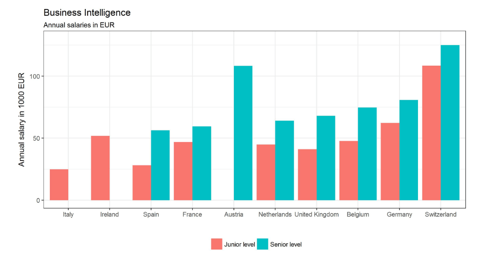

数据会让你感到兴奋、鼓舞甚至惊奇吗？

在大量信息中发现模式的想法是否让您想撸起袖子加油干？您是否觉得计算机科学及其在商业世界中的应用非常有趣？如果您对上述问题中的任何一个回答是肯定的，那么您可能需要考虑从事商业智能 (BI) 行业。在信息时代，商业信息和智能，如果从战略上加以利用，就有能力推动企业远超竞争对手以及成倍地提高品牌知名度、内部参与度、组织效率和盈利能力。到 2021 年底， BI 行业的价值预计将飙升至265 亿美元。此外，使用商业智能分析的公司做出更快、更明智决策的可能性要高出普通企业五倍。

基于这些发现、商业智能不可否认的价值以及对 BI 技能的巨大需求，专业的 BI 数据人员出现严重短缺——仅在美国就短缺150 万。

那就是你的作用。

在当今的商业环境中，要想进入一个令人兴奋的商业智能职业，你首先需要培养一系列特定的BI技能，这些技能数量众多，适用于许多行业，从而使转变变得更容易。

那么，从事商业智能职业需要哪些技能？你是如何进入这个领域的？你需要一份优秀的商业智能简历吗？这个领域的职业是什么样的？您还需要考虑哪些因素才能在基于 BI 的角色中取得成功？在这里，我们将回答所有这些问题，以及更多的问题，首先从转行从事商业智能职业的原因开始。

## 为什么要转行从事商业智能职业？

这个包罗万象的[在线数据分析](https://www.datafocus.ai/infos/data-analysis-tools)分支是一个特别有趣的领域，因为它扎根于两个独立的领域：商业战略和计算机科学。

首先，让我们来看看从事这一职业的好处。

### 1\. 灵活

BI 是一个多样化且广泛的领域，有许多不同的领域需要关注或专攻。这种多样性提供了很大的灵活性，而无需完全改变您的专业领域或技能组合。

例如，您喜欢计算机科学、编程和数据，但过于外向而无法整天编程，那么您可以在更以人为本的商业智能领域工作，可能涉及比大多数程序员在工作中遇到的更多的面对面交流。

正如 BI Cortex的专业人士 Martin 所解释的：

_“有些人被迫花费大量时间编写代码......但是，我很快就变得非常烦躁，渴望进行一些人际互动。做 BI 时有如此多的灵活性和多样性，以至于其他与 IT 相关的路径对我来说似乎过于平淡或精简。”_

另一方面，如果你喜欢深入研究技术方面的事情，通过适当的结合商业智能技能，你可以解决许多令人难以置信的有趣问题，这些问题会让你连续数小时保持流畅。

### 2\. 有丰富的选择

凭借分析能力和商业智能，您还可以选择与特定类型的公司或在特定商机或行业内运营的公司合作。例如，如果您对医疗改革充满热情，您可以成为一名 BI 专业人士，专门使用数据和[在线 BI 工具，借助](https://www.datafocus.ai/infos/online-bi-tools)[医疗保健分析](https://www.datafocus.ai/infos/healthcare-analytics)使医院运行更加顺畅和有效。

或者，如果您喜欢 IT 的其他方面，包括系统管理，您可以与较小的公司合作并身兼数职。例如，除了系统管理员之外，您还可以是“自助式 BI”人员。

### 3\. 丰富的工作机会和薪酬

现在，让我们先谈一谈“肉和土豆”。从事商业智能领域工作的一个重要原因是需求前景乐观。根据美国劳工统计局的数据，到 2026 年，对合格商业智能分析师和管理人员的需求预计将飙升至 14% ，而对数据专业人员的总体需求将在同年攀升至28% 。这超过了几乎所有其他职业的预测。

美国劳工统计局还指出，2015 年，BI 分析师的年薪中位数为 81,320 美元。让我们看看目前商业智能职业在工资和薪酬方面的位置。

在美国，该领域的开发人员年薪约为 8.6万美元，全国分析经理的平均年薪为 10.5万美元。

商业智能职业在欧洲也能得到很高的报酬。在德国，即使是初级 BI 人员的年薪也能达到 62,300 欧元，而在瑞士，您每年可以赚取高达 108,400 欧元。

有关欧洲 BI 平均工资的完整概要，请查看Data Career 中的此资源。还不错吧？确实，商业智能职业道路的薪水似乎很高。但是，您应该始终牢记，对 BI 专业人员的薪水数字和需求高度依赖于地理位置和行业。这是因为根据Recruiter.com的数据，绝大多数 BI 职位都在加利福尼亚、纽约或德克萨斯。如果您居住在这些州之一，您的薪水和对 BI 分析师技能的需求将会更高。

### 4\. 进步的职业道路

正如我们在上面所看到的，BI 是一个随需应变且每年都在增长的职业。这意味着有很多快速发展和升级的机会。在获得 3 到 5 年的经验后，您可以专注于特定的技术或行业，并担任一名分析师、IT 专家，甚至可以通过担任 BI 项目经理进入管理领域。我们将在后面的文章中更详细地介绍 BI 工作岗位，但重要的是，这是一个充满可能性的职业。有了巨大的就业前景，您可以从初级员工开始，逐步提升到高级职位，在那里你可以管理自己的团队和项目。

### 5\. 发展一系列技能

除了获得特定行业的知识外，从事 BI 领域的职业还可以让您获得一系列技能，使您成为更全面的专业人士。例如，您将学到宝贵的沟通和解决问题的技能，以及业务和数据管理经验。除此之外，如果你是一名数据分析师，你可以了解财务、市场营销、IT、人力资源以及与你合作的任何其他部门。这将增加您的知识基础，让您准备好面对 BI 行业的任何类型的工作。

## 什么是必要的 BI 技能？

我们已经确定，该领域的职业具有潜在的回报和丰厚的报酬，但是在这个最有回报的工作领域中工作需要具备哪些技能？让我们一起来看看吧。

商业智能所需的特定技能将根据想成为后端还是前端 BI 专业人员而有所不同。为简化问题，您可以将后端 BI 技能视为更具技术性且与构建 BI 平台相关的技能，例如[在线数据可视化工具](https://www.datafocus.ai/infos/data-visualization-tools)。

前端分析和商业智能技能更倾向于向他人展示和交流数据。无论您做出何种选择，您都可以随着职业的发展而改变方向。如果您在一家较小的公司工作，您最终也可能会担任所有这些角色。但无论您选择哪条道路，以下商业智能技能都是必要的——没有它们，你的职业生涯将建立在非常脆弱的基础上，限制您的前景并增加您失败的可能性。

首先，SQL 编程。SQL（结构化查询语言）是一种在 BI 中常用的编程语言。即使您是前端 BI 专业人士，您也需要指导 SQL 以及如何使用它。

为了帮助您学习，您可以从这里开始列出一些[最好的 SQL 书籍](https://www.datafocus.ai/infos/best-sql-books/)，这些书籍将帮助您将技能提升到一个新的水平。

- **数据分析**：大多数 BI 技能和情报分析师相关技能都是关于使用数据做出更好的决策。你需要善于研究各种不同的数据来源，然后得出准确的结论。
- **解决问题**：商业智能不仅仅是分析数据；它还涉及使用这些数据创建业务策并解决现实世界的业务问题。例如，您可以从需要在会议期间可视化和呈现的特定[零售 KPI中提取可操作的见解。](https://www.datafocus.ai/infos/kpi-examples-and-templates/retail)
- **特定行业知识：**虽然有些只是将会在工作中学到，但您需要牢牢掌握行业动态，尤其是您希望工作的领域。随着时间的推移，您将成为您所在行业的专家，因为这将提高您将数据与业务问题解决相结合的能力。
- **沟通技巧**：除了获得与情报分析师相关的技能外，你还需要能够将你的发现有效地与其他与你共事的专业人士沟通。在某种程度上，如果您在后端 BI 中工作，则不需要进行太多的沟通。但是，如果您在前端工作，您将负责与非技术人员交流技术概念。这种角色需要出色的沟通技巧。
- **数据可视化：**扩展上述观点，为了确保良好的沟通，您还需要具备数据可视化技能。可视化是使趋势和一般见解易于理解的最佳工具。能够清楚地看到数据是如何随时间变化的，这使得从中提取相关结论成为可能。为此，您应该能够区分各种图表和[报告类型](https://www.datafocus.ai/infos/types-of-reports-examples/)，并了解何时以及如何使用它们来使 BI 流程受益。
- **先进的视野和对细节的关注：**就其本质而言，商业智能非常注重细节。作为 BI 分析师或开发人员，您通常会处理最小的信息片段，目的是将其转化为可操作的洞察力。要想在快节奏的商业智能世界中取得成功，你需要具备前瞻性眼光和密切关注细节的能力。
- **统计分析：**统计知识是另一项重要技能，尤其是如果您想成为 BI 分析师。了解各种统计成分，例如平均值、中位数、范围、方差等，可以让您更深入地研究数据并从中提取相关结论。
- **编程知识：**在技术方面，在追求 BI 职业时，拥有编程语言知识也是一项非常有价值的技能。许多解决方案需要使用不同的编程语言来执行高级分析，例如 R、Python、Javascript 等等，了解它们可以显著提高您的技能组合。
- **技术概念：**我们的下一个 BI 技能不是基本的，但它肯定可以让你成为一个更全面、更有准备的专业人士。商业智能是一个高度依赖技术的行业，拥有如何管理这些技术的技术概念可能是一个优势。有了这个，我们并不是说您需要知道如何使用市场上的每一种工具，而是要了解这些技术如何发挥你的优势。
- **商业敏锐度：**在我们的基本 BI 技能列表中，最后但并非最不重要的一点是所谓的商业敏锐度。要在商业智能职业生涯中茁壮成长，您需要具备快速了解公司业务模式的能力，以及如何调整您的努力，不仅从关键绩效指标（和[KPI 管理](https://www.datafocus.ai/infos/kpi-management-and-best-practices/)流程）中获得最大价值，而且还制定出有助于您的组织持续取得成功的战略和决策。

## 入门的第一步是什么？

让我们深入研究一下，除了其他相关的基于bi的工作角色外，开始从事商业智能分析师职业道路的所有重要的第一步，以学生级别的成功为目标。

### a) 如果你是学生

如果您是学生，那么您拥有最重要的优势之一在于你的业余时间。对于那些对商业智能职业感兴趣的人来说，一些最好的学位包括：

- 管理信息系统
- 计算机科学的任何分支
- 商业相关学位

但是，例如，如果您即将获得历史学位，请不要担心。专业领域充斥着许多与他们的大学专业完全无关的领域工作的人。您能做的最重要的事情是在现实世界中获得经验。

这将我们带到了下一个主题……

**获得工作经验**

一种开始的方法是被接受在一家拥有专门分析部门的公司实习，该部门可以教您有关[DSS 软件](https://www.datafocus.ai/infos/decision-support-system)的知识，此类大公司包括 Facebook、Google 和 Linkedin。随着数字技术的不断发展，您还可以找到许多其他公司，在咨询公司获得入门级职位也是一个好主意——大公司包括 IBM、埃森哲、德勤、毕马威和安永。

另一个很好的方法是直接在 BI 提供商的办公室获得经验，例如，担任数据科学家或[数据可视化实习生](https://www.datafocus.ai/infos/jobs/data-visualization-intern)。这样，您将沉浸在核心业务中并获得主要的实践经验。

在申请过程中，请明确表明您对 BI 领域的兴趣，并愿意在您从事项目时在该领域开拓一席之地。

### b) 如果您已经在职

如果您已经进入职场中，那么您将拥有一个学生没有的优势——_经验_。希望还有一些可转移的技能。

例如，如果您已经是一位出色的沟通者、项目经理或商业战略家，那么您就已经拥有了商业智能成功的关键技能。或者，如果您来自与 IT 相关的背景，您将拥有丰富的基于技术的技能，这些技能在 BI 领域非常宝贵。

您的第一步也是最重要的一步将是寻找工作职位，检查这些职位所需的技能和资格，然后分析您需要填补的技能空缺。

这可能涉及从学习 SQL 到购买一些关于数据仓库的教科书的任何事情。如果您想要这方面的一些资源，我们会在相关[商业智能书籍](https://www.datafocus.ai/infos/best-business-intelligence-books/)和[商业智能播客](https://www.datafocus.ai/infos/business-intelligence-podcasts/)上发布帖子，您可以基于它们来开始您的研究。

## 商业智能工作角色

为了帮助你的职业发展，我们现在将探索 6 个热门的商业智能分支，以及他们在专业工作环境中的作用。

**1.商业智能分析师**

BI 分析师负责深入研究大型相关数据集，包括 KPI，企业或组织在开发各种流程、计划和部门时使用这些数据。BI 分析师协助进行战略思考和[数据驱动的决策](https://www.datafocus.ai/infos/data-driven-decision-making-in-businesses/)，以及发现新的、有价值的结论。他们与产品经理密切合作，因为他们可以根据这些发现确定公司设计产品或服务的方向。这是一个主要集中在业务方面的角色，由于 BI 分析师同时具备技术和业务知识，因此再职业道路上有很多选择。是什么造就了一个好的 BI 分析师？我们来看看相关的商业智能分析师技能：

- 在 BI 分析师领域有相关和可论证的经验。
- 优秀的领导能力和人际交往能力。
- 充分掌握业务战略和KPI。
- 对SQL 和 BI 的技术方面有基本的了解。
- 一份精心制作的商业智能简历。
- 对云计算和数据可视化的工作有一定的理解

**2\. BI开发人员**

我们检查了商业智能分析师的技能以及如何成为一名优秀的 BI 分析师。现在，让我们继续开发。在偏重于技​​术驱动的角色中，BI 开发人员负责构建、创建或改进 BI 驱动的解决方案，帮助分析师将数据转换为知识，包括[数据仪表板](https://www.datafocus.ai/infos/data-dashboards-definition-examples-templates/)。BI 开发人员的技能包括根据要求制作和执行数据驱动的查询，以及公司 BI 平台或解决方案的持续技术开发。以下是更具体的 BI 开发人员技能概要：

- 在 BI 开发或数据科学领域有丰富的经验。
- 数据仓库和数据挖掘的背景（或充分掌握）。
- 商业智能行业及其各种语言或系统的最新知识。
- 具有强大的分析头脑，具有成熟的解决问题的能力。
- 一份精心制作的商业智能简历。
- 以计算机科学为中心进行创新的能力。

**3\. BI顾问**

BI 顾问需要提供 BI 和分析工具和系统的设计、开发和实施方面提供专业知识。负责提供具有成本效益的解决方案以实现业务目标，将运营进度与项目开发进行比较，同时协助规划预算、预测、时间表和开发绩效指标报告。他们通常是具有丰富 BI 只是和经验的自身专业人士。这是一个全面的角色，需要数学或科学背景，并充分利用这些（技术）技能：

- 理解、操作数据和统计数据
- 能够熟练使用分析工具和软件
- 熟悉数据可视化工具的专业知识
- 精通项目管理

**4\. BI工程师**

工程师与 BI 分析师和开发人员以及客户、客户和各个内部部门密切合作，不仅负责帮助微调组织内基于 BI 的平台、流程和工具，还负责此类工具的持续战略实施，包括[仪表板工具](https://www.datafocus.ai/infos/online-dashboard)。商业智能工程师的角色非常丰富、多样且要求很高。

要想成为一名成功的商业智能工程师，您将需要获得商业智能分析师技能以及 BI 开发人员技能，通过深入了解 BI 的每个领域来建立这些能力。您还需要具备出色的项目管理能力，才能成功胜任这个角色。此外，由于这是一个竞争日益激烈的角色（相当于商业智能分析师的职业道路），您还需要确保您的“简历 BI 工程师”完美无瑕、引人注目且具有创新性，尤其是如果您想确保自己在一群人中脱颖而出。

为了帮助您改进您的商业智能工程师简历，或者有时称为“简历 BI 工程师”，您应该探索此 BI 简历示例以获取指导，帮助您的申请受到潜在雇主的注意。

**5\. BI项目经理**

正如您所想象的那样，BI 项目经理是一个负责调整所有元素以确保高效交付的角色。这是一项需要高沟通技巧的工作，因为它需要与运营工程师、企业主、开发人员等多个利益相关者建立联系，确保所有团队都与项目的总体目标保持一致，与他们协作以有效地完成任务，确保会议和项目状态的分配以及与管理相关的其他任务。一些商业智能项目经理技能包括：

- 商业智能和数据管理的相关知识
- 项目管理经验/研究（PMP认证或同等学历）
- 沟通和组织能力
- 能够生成了解所有利益相关者利益的报告
- 具备风险管理技能，能够快速适应可能出现的任何问题

**6\. BI 数据科学家**

数据科学家与 BI 分析师的角色相似，但是他们做的事情不同。分析师关注历史数据以了解当前的业务绩效，而科学家则更关注数据建模和规范性分析。他们使用机器学习模型等先进技术来生成对未来业务绩效的预测。它们可以帮助公司预测需求或预测欺诈行为。数据科学家的职业道路类似于分析师，他们应该具备的技能包括：

- 强大的数学和统计技能，可以处理复杂的模型
- 编程语言技能，例如 R 或 Python
- SQL和数据可视化技能

## 商业智能职业的主要挑战

我们已经讨论了很多关于 BI 作为一种职业的很多方面，虽然它在专业和经济上看起来很有前途，但它并非没有挑战。商业智能行业不断发展并变得更具竞争力，这意味着专业人士需要跟上最新的变化和技术，以保持领先地位。在这里，我们将列出您在追求 BI 道路时可能面临的一些挑战。

1. **数字和数据驱动：**当涉及到 BI 和数据分析时，人们有很多期望。然而，重要的是要考虑到这是一个非常技术性的职业，需要您对使用数字和先进技术充满热情。这有时还需要您做一些乏味的工作，例如修复格式问题、标记错误、跟踪丢失的数据等。也就是说，如果您不是一个注重数字的人，那么这条路可能不适合您。
2. **了解业务方面的事情：**除上述要点外，BI 中的另一个挑战点是您还需要了解业务方面的事情。为了帮助公司从其表现中挖掘所需的潜力，您需要了解数据如何推动组织向前发展。这里的另一个重要注意事项是将数据分析应用于业务环境意味着您将需要与在该领域没有任何经验的人一起工作。很多时候，您会发现自己在向他人解释数据。这需要良好的沟通技巧和耐心，因为非技术用户可能对流程的结果抱有很高的期望。
3. **你永远不会停止学习：**BI 行业每年都在发展，越来越多的年轻专业人士有兴趣从事这个行业。这使得工作领域的竞争日益激烈。因此，在投身其中之前，您需要知道您永远不会停止学习和研究。每天都有新技术出现，为了保持领先地位，您需要跟上最新的发展。

## BI行业的主要参与者

当我们到达 BI 旅程的终点​​时，我们需要涵盖最后一点。如果您只是涉足该行业，则需要对其主要参与者有一定的了解。自 BI 开始以来，出现了许多具有不同功能和定价选择的工具。在这里，我们将列出其中的 2个。如果您想更深入地了解市场上顶级软件公司的更多研究方法，请查看我们的[BI 工具](https://www.datafocus.ai/infos/best-bi-tools-software-review-list)文章，其中包括基于定价、功能和用户评论的 14 种顶级工具的概要！

1. **DataFocus：**

DataFocus是一款现代化BI 软件，主打类自然语言搜索式分析。与传统的拖拽式功能相比，搜索式更智能、更方便，普通的基层业务人员也可以很快上手操作，无需提前学习专业的技术知识。这个工具允许您连接来自多个来源的数据，本地数据文件和数据库都可，并可以通过交互式数据看板将结果轻松可视化。DataFocus还为用户提供了丰富富多样的图表类型，轻量级数据处理、行列转换功能，数据权限分配功能等。

**主要特点：**

- 类自然语言搜索分析，借助关键词快速得出分析结果
- 用户友好的智能洞察技术
- 交互式数据看板功能和筛选功能，丰富多样的看板模板
- 数据处理功能，行列转换、列拆分等

1. **SAS BI：**

SAS 可以被认为是所有 BI 工具的“母亲”。该软件成立于 上世纪70 年代，提供一系列产品和应用程序，可用于统计分析、预测分析、数据挖掘、文本挖掘和预测。数据科学家、工程师、管理人员和其他用户可以访问来自多个来源的数据，并执行高级分析从中提取相关见解。该软件专注于 5 大主要支柱：可视化数据探索、用户友好型分析、交互式报告、协作分析和移动分析。

**主要特点：**

- 与其他应用程序集成
- 机器学习支持的可视化数据探索
- 交互式仪表板和自助报告
- 使用移动应用程序进行移动分析

1. **SAP:**

SAP是一款广泛应用于欧洲市场的企业资源规划(ERP)软件，通过有效的数据处理，提供一系列的解决方案来管理业务运营和客户关系。它允许公司集中查看他们的数据，并通过让员工轻松访问实时洞察来简化复杂的业务流程。这样，用户就可以执行高效的报告、生成预测、可视化数据，并在任何位置共享数据。

**主要特点:**

- 企业级报告系统
- 自助服务数据可视化
- 跨部门共享选项
- 预测和实时分析
- 特定于行业的能力

## 关键要点：您需要学习！

无论您是学生还是在职人士，除了想要进入的特定行业外，您还需要尽可能多地了解商业智能知识。

有很多东西需要学习。缩短此过程有一个最佳捷径是登录 LinkedIn，支付 InMail 服务费用，并联系您认为可以为您提供有价值信息或见解的 BI 专业人士，询问他们是否愿意与您喝杯咖啡或共进午餐。

在搜索过程中，您会注意到这些专业人士可能有几个不同的职位头衔。根据Key2Consulting，一些常见的头衔包括：

- 大数据开发人员
- 商业智能顾问
- 数据库应用程序开发人员
- 数据仓库开发人员
- 数据仓库顾问
- ETL 开发人员

发起对话后，您可以向选择的专业人员提出大量深入的问题，就他们的日常任务和职责以及如何参与其中。如果您是学生，还可以联系您现有的人际关系或向您的学院及大学教授寻求建议和推荐。

您还应该考虑参加有关数据科学的聚会。是的，它们存在。

这些将是你的人脉。正如任何真正优秀的招聘人员都会告诉您的那样，原始的技能只能带您到此为止。你认识谁和你知道什么一样重要。

你需要被这些社区所吸引，才能与他们建立联系。朋友或关系是否能马上给你介绍一份新工作并不是重点。重点是开始建立一群朋友、导师和专业关系，您可以与他们讨论数据科学和商业智能。

随着时间的推移，您无疑会发现新建立的社交网络是您最大的职业资产。再加上一份出色的商业智能简历，成功将比您想象的更快。

BI 提供了一个独特的机会，可以将技术技能、业务解决问题的技能和沟通技巧融合到一个有价值、令人兴奋且不断发展的职业中。

对于你想从事的特定行业和你想解决的问题，在商业智能领域工作可以给你很大的灵活性。我们已经看到，餐厅也可以从分析中受益，并且有许多[大数据示例](https://www.datafocus.ai/infos/big-data-examples-in-real-life/)也显示了分析如何帮助[衡量和提高员工满意度](https://www.datafocus.ai/infos/measuring-employee-satisfaction-with-metrics/)。

再加上对工作增长和稳定薪酬的乐观前景，这些因素共同构成了一条值得探索的商业智能职业道路。

如果您想开始使用 BI，首先要专注于发展行业专业人士的关系。他们会给你“实地”指导，让你准确的指导下一步该怎么做。接受他们的建议，同时提高您的 BI 技能，并继续学习。不要害怕问“愚蠢”的问题。在你的 BI 简历上花点功夫也不会有什么坏处。

但最重要的是，如果您对目前的状况不满意，请不要害怕换工作。

总而言之，以下是您在商业智能职业中需要的 10 大技能：

1. 数据分析
2. 解决问题
3. 特定行业知识
4. 沟通技巧
5. 数据可视化和解释
6. 先进的视野和对细节的关注
7. 统计分析
8. 技术概念
9. 编程知识
10. 商业头脑

如果您想开始练习您的技能，但没有太多经验，您可以免费试用我们的软件和交互式教程，选择一个合适和BI工具，进行30天的[试用期](https://www.datafocus.ai/console/)！
