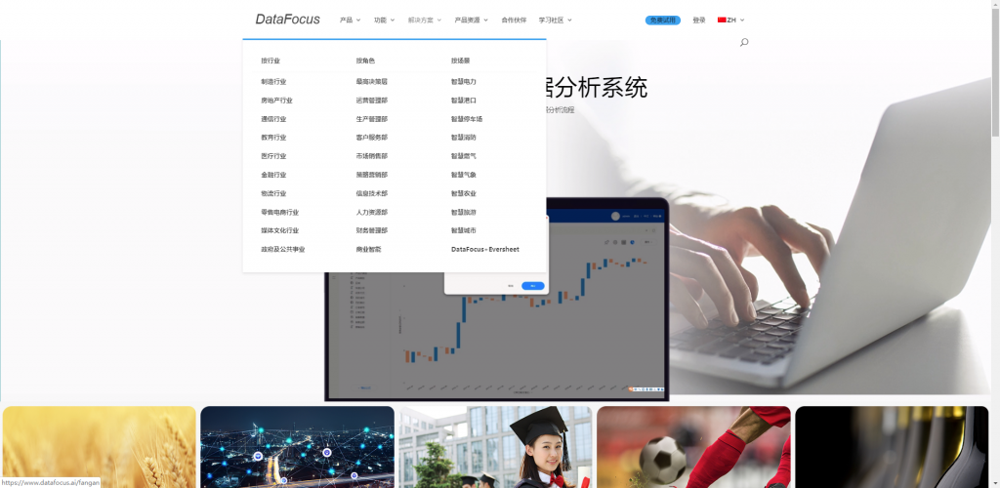

1.DataFocus

DataFocus是国内第一个中英双文类自然语言数据分析系统，自动建模，采用简单的搜索式的交互，系统便可以自动以数据或图表给予回答，支持进行数据筛选、钻取、数据联动等操作，自由、多角度地分析数据。让不具备代码能力、不熟悉数据结构的业务人员也能迅速上手制作出美观深入的数据图形。系统架构包括数据搜索引擎、语义解析引擎、机器学习引擎、可视化引擎、内存计算引擎、分布式集群

2.Tableau

Tableau是连续六年在Gather BI与数据分析魔力象限报告中占据领导者地位的体量巨大的老牌产品。Tableau功能强大，注重细节，倾向于较专业的数据分析师，只要数据预先处理好，就可以制作很多绚丽多彩的信息图。覆盖数据源范围广，拖拽式操作只需把相应的数据拖到对应位置即可将数据信息映射为图形信息。

3.Qlik Sense

qiktech出品的Qlik Sense作为一款典型的敏捷BI桌面软件，有着良好的性能，图形风格简洁清晰很好的突显了数据主体，覆盖数据源类型广且自建的qvd、qvx文件优化了数据加载速度，比直接录入数据文件或接入数据库更快。数据关联是他主打的功能点，运用星形模型联立数据后，查询速度更快。支持脚本语言对图表进行个性化的深入分析和更细致的数据处理。是在Gartner数据分析魔力象限年度报告中占据领导者地位的老牌产品。

4.dataV

dataV是阿里出品的一款专注于数据可视化效果的可视化工具，最早出现时是为了实现淘宝双十一狂欢节场景的媒体大屏。它的可视化制作过程采用的是传统的拖拽组件方式，在选择了图表类型以后将数据列匹配到各个轴上，或者通过代码直接修改对应的轴名、列名以及列中值，配置较为细致所以学习成本稍高一些，还有丰富的大屏组件，内置的电商销售和地理物流模板颜值也很高。相对来说，作为一款优秀的可视化大屏展示工具，基本不具备数据分析能力，可能需要搭配阿里系列的大数据分析产品来达到数据分析的目的。
