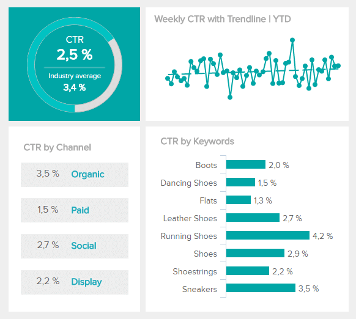

为了确保我们在竞争激烈的数字时代取得可持续的商业成功，提供价值、提高消费者忠诚度并持续超越您的目标至关重要。

一个忠诚的、高价值的回头客比一次廉价销售更有价值，通过实施正确的策略、设定正确的目标并使用正确的 KPI，您将获得您想要的结果。

要在当今的商业战场上取胜，增量销售就是关键。通过采取更具战略性的方法提高企业的盈利能力，随着时间的推移，您将有更大的机会增长和发展您的业务。

在这里，我们探讨了增量销售在商业世界中的意义和价值，以及您应该跟踪以确保持续成功的额外[KPI 示例和指标。](https://www.datafocus.ai/infos/kpi-examples-and-templates)

事不宜迟，让我们开始吧，首先是增量销售的定义。

## 什么是增量销售？

从根本上说，增量销售是由于特定的促销或营销活动而发生的转化。这可以包括从按点击付费 (PPC) 广告到特定内容营销或社交媒体活动的任何内容。

商业领袖确认的三大销售重点是：完成更多交易 (28%)、提高销售漏斗效率 (18%) 和增强销售技术 (11%)。

增量销售的核心是这三个领域中的每一个，甚至更多。

您的营销活动吸引了合格的潜在客户，而销售将这些潜在客户转化为付费客户。反过来，这些付费客户可能会成为重复购买品牌的拥护者——这是企业可以吸引的最有价值的客户类型。

为了将我们的增量销售定义放到现实世界的角度，这是我们创建的一个假设场景以供参考：

_一家绿色服装零售商通常每月销售价值 14,000 美元的合乎道德的毛衣，而无需投资广告。11 月，这家零售商在开展一项花费 1,500 美元的广告活动时，在网上销售了价值 20,000 美元的道德毛衣。业主时这样计算他们的增量销售额的：_

**_增量销售额 ($)：_** _$20,000 - $14,000 = $6,000。_

如果您的增量销售额超过了您的初始营销投资，或间接导致您可以归因于特定营销活动或活动的销售额增长，您将能够持续跟踪您的努力是否成功。为了确保您的增量销售保持成功，您应该遵循一些最佳实践。

## 增量销售：最佳实践

为了帮助您取得成功，并进一步阐明增量销售的定义，您应该遵循以下几个最佳实践：

- **建立消费者关系：建立**稳固的客户关系对于增量销售工作的长期成功至关重要。为此，重要的是通过创建和交付内容来展示您的价值，这些内容不仅适合您的目标受众的需求，而且要为客户（潜在的和现有的）最紧迫的消费者问题提供答案。此外，您还希望通过参与度最高的社交媒体渠道与观众进行有意义的对话。同时，花时间为客户的参与、兴趣或购买提供个性化的感谢。客户忠诚度由喜爱度 (86%) 和信任度 (83%) 驱动——这清楚地表明了花时间培养有意义的客户关系的价值。通过关注整体[客户数据管理](https://www.datafocus.ai/infos/customer-data-management-best-practices)实践，您可以获得额外的洞察力，从而调整您的策略以提供最佳的客户体验。
- **建立您的业务目标和关键绩效指标：**为了获得最佳价值，并定义增量销售业务努力，概述您的最终业务目标是必不可少的。也就是说，尝试各种类型的媒体、渠道、接触点和平台应该是您预算策略中不可或缺的一部分。为确保您获得您想要的结果，首先要确定您的目标，然后确定您需要跟踪的指标以衡量您的绩效。此外，您应该执行一个受控的促销实验，以衡量哪些渠道最能吸引您的目标受众，并了解这些渠道最有效的原因。通过扩大[业务仪表板](https://www.datafocus.ai/infos/dashboard-examples-and-templates)，您的整个策略可以集成到一个交互且整洁的地方，因此，只需点击几下即可轻松跟踪和衡量您的业务绩效。
- **提出有针对性的问题：**在完善您的销售目标时，向自己提出有针对性的问题，这将有助于为您的营销工作指明方向。例如，您可以问自己这样一个问题，“_我怎样才能__提高我的电子邮件营销销售额__？”_ 通过提出这个重点问题，你可以直接通过消费者的电子邮件来监测用户的转化率，并确定哪些地方需要改进以提高销量。
- **保持一致：**要从增量销售的力量中受益，在业务的所有领域保持一致非常重要。这意味着定期跟踪正确的 KPI ，以提取有价值的见解并不断改进，使您的品牌在各个接触点上具有凝聚力，通过您的社交媒体渠道保持活跃的存在感，并提供具有同等吸引力和有用的内容。

## 有助于促进增量销售的 KPI

毫无疑问，使用与您的核心商业目标一致的 KPI 会导致更强大的[商业智能战略](https://www.datafocus.ai/infos/roadmap-to-a-successful-business-intelligence-strategy)以及持续增长和进步。

为了帮助您定义增量销售的成功，下面列出了您应该定期跟踪的基本 KPI。

### 提高您的市场营销 KPI 绩效

首先，我们将重点关注 3 个 KPI指标，它们将帮助您改进营销工作以促进增量销售。

**1\. 目标转化率**

转化是客户或网站访问者所期望采取的行动，由于这是一个特别基于目标的指标，因此转化可能因企业而异。

在大多数情况下，您的转化目标是完成销售，但这种特定类型的指标可以扩展到来自特定博客内容的电子邮件订阅、免费试用注册或电子书下载。跟踪您的转化率是非常关键的，因为您可以快速确定自己的优势和劣势，并发现高转化渠道以进行扩展，以及可以采取的行动来提高特定业务领域的转化率。

**2.登陆页转化率**

很明显，当我们进一步深入研究转化率时，登录页转化率 KPI 是公司应该遵循的最宝贵的[网站指标之一。](https://www.datafocus.ai/infos/website-metrics-and-web-traffic-analytics)它为您提供了网站特定页面性能的全景快照，并为您提供有关如何优化内容以提高销售成功率的见解。

通过进行 A/B 测试并比较您网站不同页面的性能，您将能够采取措施来增强各种登录页的可用性和吸引力，这最终将导致更多的参与和持续销售的增长.

**3.点击率（CTR）**

在衡量各种营销活动随时间推移的价值和成功时，分析您的点击率 (CTR) 至关重要。

点击率是指点击次数与总展示次数的比率，因此可以深入了解您的内容和传播在受众眼中的效果。为了从你的点击率中获得最大的价值，你需要发现你所在行业的平均点击率，并将其作为一个性能基准。

要更详细地探索这些指标，请访问我们的[营销 KPI](https://www.datafocus.ai/infos/kpi-examples-and-templates-marketing)和模板示例页面。

### 使用这些 KPI 示例建立您的销售

在这里，我们将探讨 3 个 KPI 和[绩效指标示例](https://www.datafocus.ai/infos/productivity-metrics-examples)，这些示例将帮助您加强销售工作，以提高增量销售。

**1\. 销售增长**

通过衡量你的销售额增长，你基本上衡量了你的业务增长。

通过跟踪您在预定时期内的销售增长，您将能够监控您的销售代表的表现，同时衡量您是否正在实现您的目标——这是您的商业帝国持续增长和盈利能力的关键指标。

**2\. 销售目标**

深入了解具体的销售目标和指标将帮助您始终如一地实现商业目标。基于对实际收入与预测收入的跟踪，销售目标 KPI 提供了丰富的洞察力，使您能够根据一组预定数字和目标来实现预测收入的能力。

对您的实际收入与预测收入进行评估，很有可能会显示您的业绩超出了预期金额。但如果没有，您将能够在问题证明对您的业务有害之前，制定解决方案。

**3、获客成本**

获得一个客户确实需要付出一定的成本——这正是鼓励客户忠诚度提供如此多价值的原因。

客户获取成本 (CAC) 是指在签约客户时产生的所有成本。该领域的不同投资通常取决于您的行业或业务线。例如，如果您是在线营销人员，您的 CAC 将包括您为交付特定活动所做的各种投资。

有了这个 KPI，最终目标是除了提高每单位或用户/帐户的平均收入之外，还要提高您的客户生命周期价值，同时降低您的整体 CAC 以保持盈利。

要更详细地探索这些指标，请访问我们的[销售 KPI](https://www.datafocus.ai/infos/kpi-examples-and-templates-sales)和模板示例页面。

很明显，通过专注于定义增量销售工作，您将有助于确保您不仅保持盈利能力，而且通过持续跟踪正确的指标，随着时间的推移改善您的业务。这只会提高品牌知名度和客户忠诚度——这是任何一个成功的商业帝国最有价值的两个要素。

如需更多基于业务的见解来帮助您建立增量销售，您可以试用我们的软件进行30 [天试用](https://www.datafocus.ai/console)\- 完全免费！
