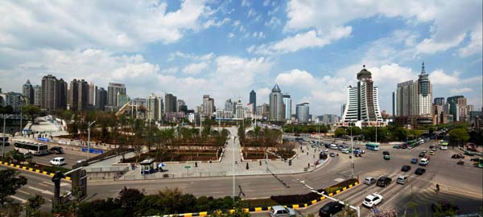

贵阳国家高新区将于8月18日至8月20日，举办大数据文化旅游节暨中国西部众创园第三届创客嘉年华活动。这是全国首个以大数据为主题的旅游节。

旅游节期间，贵阳国家高新区大数据创客公园将正式亮相，包括贵州大数据综合试验区展示中心、国家大数据（贵州）综合试验区产业生态示范基地、启林创客小镇等25个代表大数据产业发展、创新创业及科技文化的旅游景点将全面向民众开放，《大数据创客公园科技旅游地图》同时发布。

旅游节上，围绕大数据商用、民用、政用三大板块，贵阳国家高新区将分别推出“数”林大会、“数”说生活、“数”治社会三个主题活动，全面展示贵阳大数据企业和创客“贵漂”们的风采。

此外，第三届中国西部众创园创客嘉年华活动将开展创客“思享”会、创客沙龙、智能工厂开源家居定制与谷歌创业社区活动、无人机编队飞行表演等近50项大数据文化旅游和创新创业活动。

为方便市民游览，高新区将于8月18日开通循环旅游巴士，1号旅游循环巴士为“大数据文化探索之旅”线路，发车地点为贵阳科技大厦；发车班次为上午9：30、下午14：30。2号旅游循环巴士为“大数据文化智造之旅”线路，发车地点为高新区创业大厦；发车班次为上午9：30、下午14：30。3号旅游循环巴士为“大数据文化创客之旅”线路，发车地点为高新区政务服务大厅；发车班次为上午9：30、下午14：30。

并推出三条大数据特色精品旅游线路——以大数据知识概念普及为主题的探索之旅，以了解人工智能、科技制造为主题的智造之旅，以体验创客乐趣、感受创新文化为主题的创客之旅。
