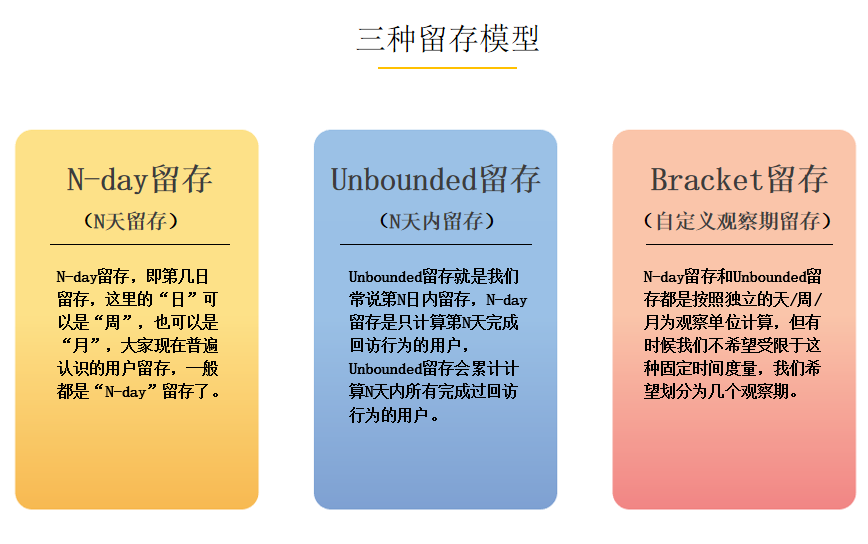
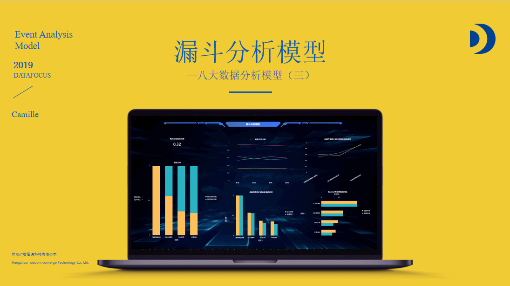
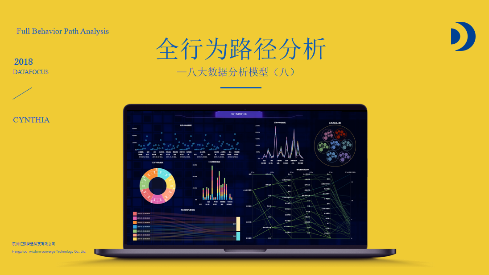
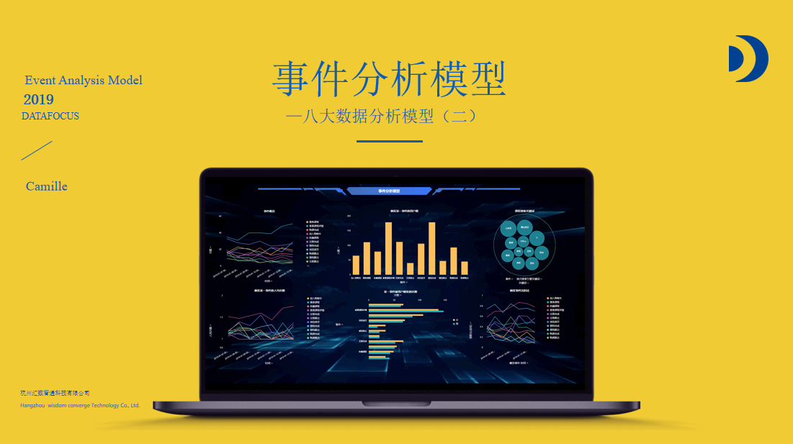
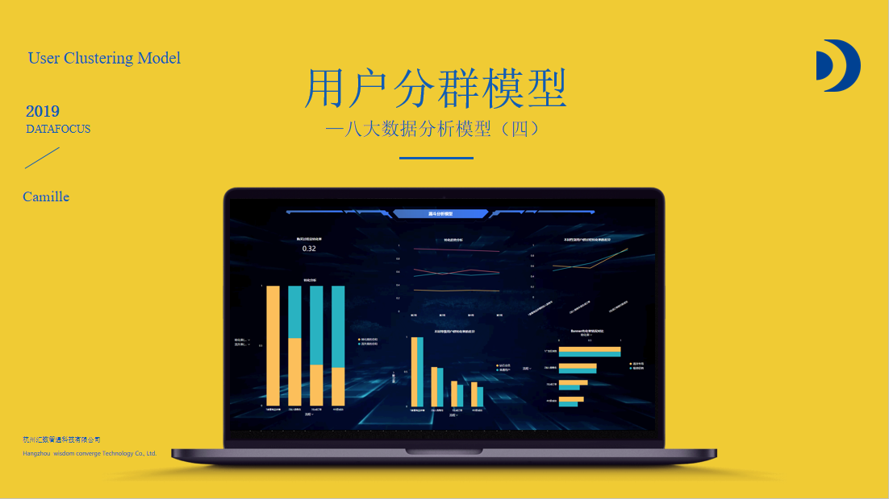
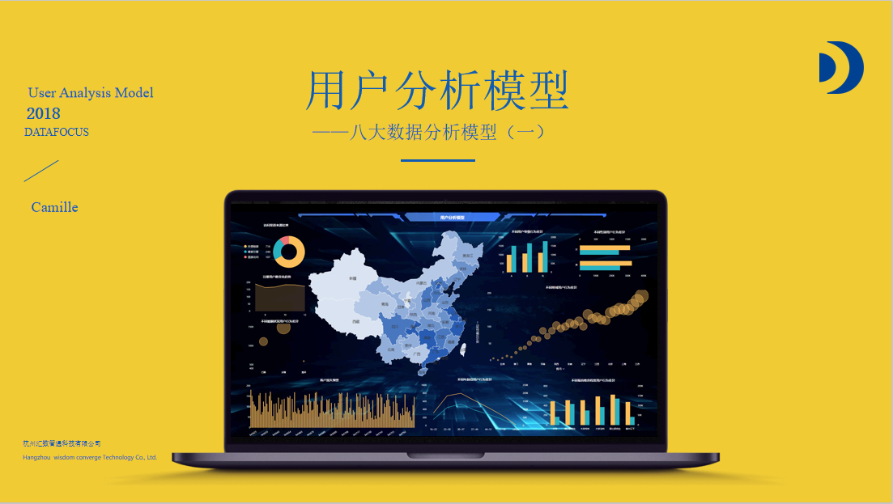

一句话两句话很难说清楚这个问题，放一个链接，是DataFocus出品的关于数据分析八大模型的学习视频，在我学习大数据分析的路上给了我很大的帮助，希望对你也有帮助。

[https://ke.qq.com/course/2706367?taid=9681483353115583](https://ke.qq.com/course/2706367?taid=9681483353115583)

DataFocus教你轻松创建和使用八大数据分析模型 

具体的模型学习可以看视频，接下来就简单介绍一下八个模型

**1.留存分析模型** 

留存分析模型是一种用来分析用户参与情况/活跃程度的分析模型，考察进行初始行为的用户中，有多少人会进行后续行为。这是用来衡量产品对用户价值高低的重要方法。

**2.漏斗分析模型**

 漏斗分析是一套流程式数据分析，它能够科学反映用户行为状态以及从起点到终点各阶段用户转化率情况的重要分析模型。运营人员可以通过观察不同属性的用户群体（如新注册用户与老客户、不同渠道来源的客户）各环节转化率，各流程步骤转化率的差异对比，了解转化率最高的用户群体，分析漏斗合理性，并针对转化率异常环节进行调整。

**3.全行为路径分析**

 全行为路径分析是互联网产品特有的一类数据分析方法，它主要根据每位用户在APP或网站中的行为事件，分析用户在APP或网站中各个模块的流转规律与特点，挖掘用户的访问或浏览模式，进而实现一些特定的业务用途，如对提升APP核心模块的到达率、提取出特定用户群体的主流路径与刻画用户浏览特征，优化与提升APP的产品设计等。

**4.热图分析模型**

 热图分析模型，其实就是指页面点击分析，与一般热力图不同的是，页面点击分析主要应用于用户行为分析领域，分析用户在网站显示页面（比如官网首页）的点击行为、浏览次数、浏览时长等，以及页面区域中不同元素的点击情况，包括首页各元素点击率、元素聚焦度、页面浏览次数和人数以及页面内各个可点击元素的百分比等等。

**5.事件分析模型**

 事件分析模型是针对用户行为的分析模型之一，也是用户行为数据分析的核心和基础。用户在产品上的行为我们定义为事件，它是用户行为的一个专业描述，用户在产品上的所有获得的程序反馈都可以抽象为事件进行采集。

在日常工作中，市场、运营、产品根据所关注的事件不同而关注不同的事件指标。在指标洞察分析的过程中，行为事件分析就会起到重要作用。

**6.用户分群模型**

 产品运营一段时间和投方推广一段时间后，随着用户的留存和新增，用户数量越来越多，那么我们就需要对用户进行精细化运营，用户分群能帮助企业更加了解用户，分析用户的属性特征、以及用户的行为特征，可以帮助运营人员更好地对比多个用户群的数据，找到产品问题背后的原因，并有效改进优化方向。

**7.用户分析模型**

 用户分析模型是基础的分析模型。使用DataFocus数据分析工具，打通CRM数据、历史数据、业务数据以及第三方数据，通过查看用户数量在注册时间上的变化趋势、查看用户按省份的分布情况等等，丰富用户画像维度。将所有维度分析放到同一个可视化大屏中，通过联动、钻取功能，动态化实时查看数据变动，让用户行为洞察粒度更细致。

**8.黏性分析模型** 

黏性分析是在留存分析的基础上，对一些用户指标进行深化，除了一些常用的留存指标外，黏性分析能够从更多维度了解产品或者某功能黏住用户的能力情况，更全面地了解用户如何使用产品，新增什么样的功能可以提升用户留存下来的欲望，不同用户群体之间存在什么样的差异，不同用户对新增的功能有何看法。

黏性分析能帮助更科学全面地评估产品及其功能情况，有针对性地制定留存策略。
