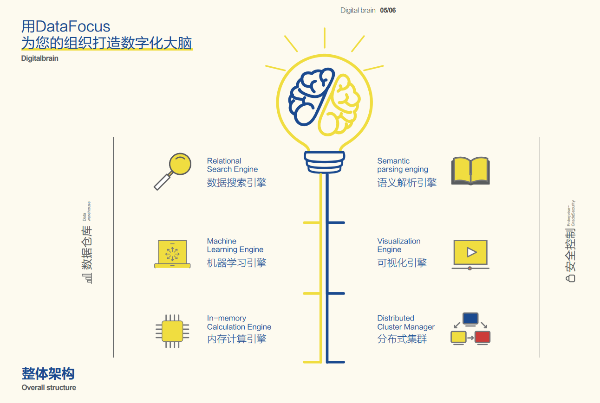
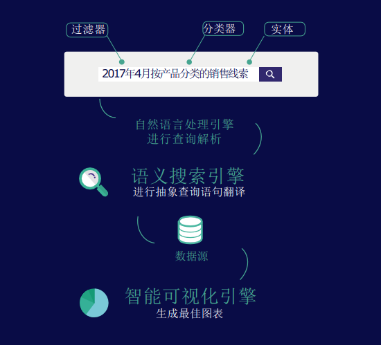

最近接触了一款还挺新颖的BI工具，和大家分享一下——DataFocus。

DataFocus是第一个中文搜索式数据分析系统。DataFocus通过引入自然语言技术，将传统的必须依靠专业程序员和工程师的数据分析工作，转化成通过自然语言提问的方式，将使用门槛进一步降低，使得普通业务人员也能熟练的进行分析工作。

那么具体搜索式分析是什么意思呢，DataFocus是一个可以实现特定业务场景下人机对话的AI系统，该系统尝试理解人类关于数据的问题，并以丰富的图表和数据回答相关问题，与传统的数据分析方式相比，交互更加智能， 效率提高100倍以上。用户不必花费大量心力去学习和了解难懂的计算机语言，而是用自己最 习惯的语言如中文或英文，来使用计算机，就跟谷歌搜索一样简单。

搜索框内输入关键语句，系统即时返回结果，并智能适配图表，什么样的数据，最合适什么样的图表，系统会告诉你。因为DataFocus智通搜索，并且适配图表，无需你再做其他复杂的配置，也不要任何的代码、SQL语句等等，系统全部会在后台自动处理好，而你只需要等待结果就行。

而且DataFocus是个数据分析的多面手，你可以把他当作下一代BI系统，或者创新的报表分析工具使用。它不仅包含了传统商业智能软件系统所具备的全部功能，而且智能数据分析功能可以针对较高维度的大数据集展开分析，并生成智能诊断报告，在此基础上，专家版产品还提供了机器学习开发平台。
