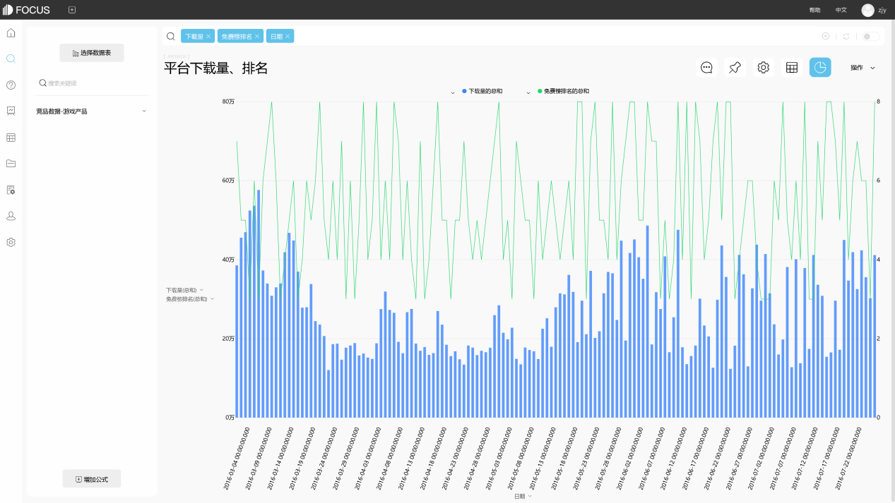

当今时代，越来越多的企业进行了企业信息化的布局。企业信息化带来的大量数据让企业也越来越关注商业智能产品。但是随着日益复杂的IT环境和不断变化的业务，传统的BI产品已经没有办法很好的完成企业对大数据的分析要求。在这个时候，以业务部门为主导的自助式BI也就成为了企业的首选BI产品。

传统的BI所采用的技术架构决定了其海量数据的计算能力相对不足。在传统的数据分析系统中，如果需要处理大量的业务数据，通常会增加硬件计算能力。如大规模并行处理系统的实现，昂贵的硬件无疑会带来更高的成本。

在数据来源方面，虽然传统的BI支持目前的大部分数据库软件，但在云时代，传统的BI不支持云数据库、第三方应用数据源和其他公共数据源，而对于大数据平台，如Hadoop的支持和访问，传统的BI也很难满足。

DataFocus自助式BI产品是大数据时代的产物，自然对海量数据的处理自然有很好的支持。基于内存分析引擎的数据焦点自服务BI产品，PB级数据处理可以实现二级响应，同时内存分析技术也代表了BI产品的未来发展方向。在数据支持方面，它不仅支持市场上的所有主流数据库和数据文件，而且还连接到第三方互联网数据、公共数据服务平台等。

DataFocus可以很好的帮助企业进行数据分析，做到让业务人员能够成为分析的助力。不仅仅能够为企业节约大数据分析的实施成本，还能很好的挖掘大数据的金矿。
