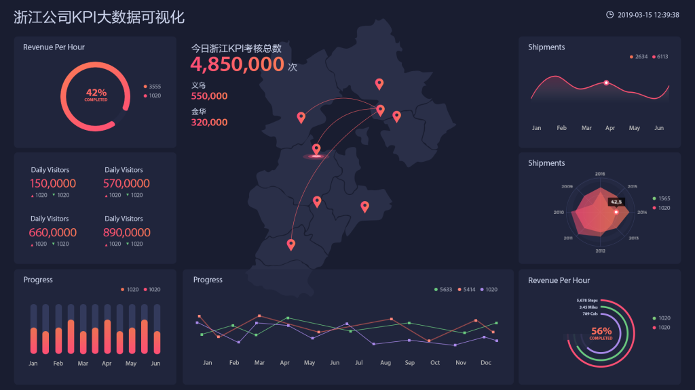

玩，网上购物，订购，移动支付已经成为许多人日常生活的一部分，可穿戴设备，智能家居设备等现在都成为人们关注的焦点，我们吃饭，睡觉，工作，甚至每天娱乐。 “数据”将通过某种方式保留和集中。根据IBM的研究，人类每天生成的数据涵盖了我们发送的文本，上传的照片，各种传感器数据，设备与设备之间通信的所有信息，以及与地球距离的等价物到月球。 将这种级别的数据称为“大数据”毫不夸张。人们喜爱这些数据和数据所生成报告，比如各个应用的年度账单报告，每日的锻炼结果，人似乎天生对与自身相关数据可视化有着浓厚的兴趣。

同样的映射到企业的市场运作中来，就可以看到数据已渗透到当今的每个行业和业务功能领域，并已成为一个重要的生产要素。人们对大量数据的探索和使用表明了一个新的生产力增长和消费者剩余的浪潮的到来。研究公司Gartner给出的定义是“大数据”是一种巨大的，高增长的，多样化的信息资产，需要新的处理模型才能拥有更大的决策，洞察力和流程优化能力;根据维基百科的定义，大数据是指在经济实惠的时间范围内无法通过传统软件工具捕获，管理和处理的数据集合。 我们这里主要采用第三种定义，即涉及的数据量太大，无法在合理的时间内通过当前的主流软件工具获取，管理，处理和组织，成为帮助企业的目的做出商业决策。大数据与传统数据的最大区别：在线，实时和全局。

1在线：首先，大数据必须始终在线，并且在线必须是热备份，而不是冷备份，不在磁带上，可以随时调用。非在线数据不是大数据，因为您没有时间将其导出以供使用。只能立即计算和使用在线数据。

2实时：大数据必须实时响应。我们在淘宝网上输入商品，背景必须在10亿件商品的瞬间展示。如果你要等一个小时出现，我相信没有人会再次去淘宝。 10亿件商品，数百万卖家和1亿消费者即刻匹配并展示。这称为大数据。

3总体来说：大数据具有最大的功能之一，它不再是一个样本思维，它是一个整体思维。当之前提到数据时，第一反应是采样和采样，但是大数据不再采样，没有部分被调用，我们想要所有可能的数据，这是一个完整的图像。实际上，完整数据比大数据更准确。

那大数据对企业有什么好处 ？

近年来由于互联网和信息产业的发展，大数据引起了人们的关注。据统计，公司的内部业务交易信息，互联网商品物流信息，人与人互动信息，位置信息等数据将每两到三年呈指数增长。 信息是现代企业的重要资源，是企业科学管理和决策分析的基础。这些数据包含巨大的商业价值，但公司通常只关注总数据的2％到4％。因此，公司仍然没有最大限度地利用现有数据资源，因此浪费了更多的时间和金钱，并失去了做出关键业务决策的最佳机会。 对于普通企业来说，大数据可视化的作用主要表现在两个方面：

1.帮助公司了解用户 大数据通过相关性分析，将客户与产品，服务关系串联起来，定位用户的偏好，从而提供更准确，更定向的产品和服务，提高销量。一个典型的例子是电子商务。电子商务平台已经积累了大量用户来购买数据。在早期，这些数据繁琐且繁琐，并且存储它们需要大量的硬件成本。但是，这些数据现在是阿里最宝贵的资产。 大数据也会对性能产生直接影响。其效率和准确性远远超过传统的用户研究。除了电子商务，包括能源，电影和电视，证券，金融，农业，工业，交通，公用事业等，都是使用大数据。

2.帮助公司了解自己 除了帮助理解用户之外，大数据还可以帮助您了解自己。企业生产经营需要大量资源，大数据可以分析和锁定资源的具体情况，如储备分配和需求趋势。这些资源的可视化可以帮助企业管理者更直观地了解企业的运营状态，更快地发现问题，及时调整运营策略，降低运营风险。总而言之，了解自己，相互了解，赢得每场战斗，将大数据用于决策。
