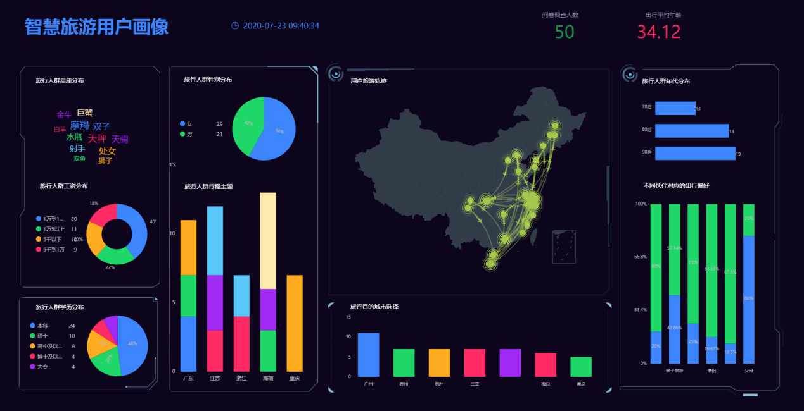

想要知道大数据和数据挖掘之间的关系，必须先对两者的定义进行了解。首先来阐述一下大数据和数据挖掘的定义：

大数据（Big data）的出现最早是媒体的一种宣传噱头，但随着云时代的来临，大数据渐渐吸引了越来越多的关注。专注“大数据”的研究机构Gartner对大数据做出的定义是：“大数据”是需要新处理模式才能具有更强的决策力、洞察发现力和流程优化能力来适应海量、高增长率和多样化的信息资产；而麦肯锡全球研究所给出的定义是：一种规模大到在获取、存储、管理、分析方面大大超出了传统数据库软件工具能力范围的数据集合。大数据的5V特点（IBM提出）：Volume（大量）、Velocity（高速）、Variety（多样）、Value（低价值密度）、Veracity（真实性）。

数据挖掘的定义则是：数据挖掘是指从数据库的大量数据中揭示出隐含的、先前未知的并有潜在价值的信息的非平凡过程。数据挖掘是一种决策支持过程，它主要基于人工智能、机器学习、模式识别、统计学、数据库、可视化技术等，高度自动化地分析企业的数据，作出归纳性的推理，从中挖掘出潜在的模式。

**联系和差异**

在了解基础定义的情况下，大数据和数据挖掘之间的联系就较为明确了。大数据和数据挖掘的战略意义是相同的——都是通过对数据进行深入分析研究，寻找发现更有价值的信息。从技术层面看，大数据的快速崛起和云计算、人工智能、机器学习、数据挖掘有着密不可分的联系，可以说是站在巨人的肩膀上快速成长。

与此同时，两者的差异也相对明显，虽然大数据的战略意义是对含有意义的数据进行专业化处理，但究其本质，大数据仍然属于一种海量的数据资产，是进行分析的基础；而数据挖掘则是开发这些海量数据背后的信息的一个过程，是一种决策支持技术。两者是相辅相成的。

最后进行一个简单的总结，大数据是资产，是数据信息，而数据挖掘是一种提供结果的技术。但是两者的最终目标都是希望能够从海量的复杂数据中找到有意义的信息，帮助决策者调整市场策略，减少风险，作出正确的决策。

现在诞生的众多BI产品，诸如Tableau、FineBI、PowerBI、DataFocus等，其主旨都逃不过大数据和数据挖掘。这些BI产品，如DataFocus等，能够将大数据和数据挖掘完美融合，利用其独特的算法帮助简化数据分析的难度，同时以更美化的形式展示数据分析结果，方便企业高层随时查看公司数据变动情况，及时制定决策。

