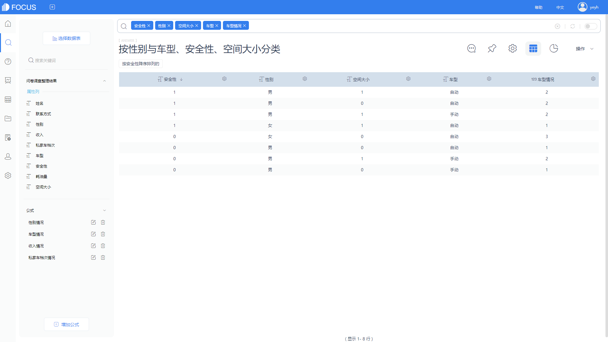
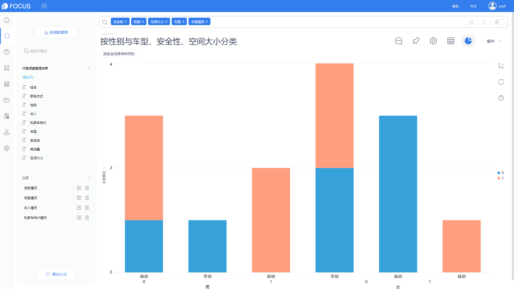

在大数据“泛滥”的时代，新零售行业也追上了数据化营销的脚步，有人说，新零售的目的，就是为了获取大数据。大数据真的如此重要吗？大数据在新零售中又扮演着怎样的角色？

本文，就带大家了解一下，大数据在新零售中的作用。

首先得知道什么是新零售？新零售其实就是零售的其中一种业态，无论零售业态如何变化，无论是现在的新零售，还是以后的某零售，其本质都是围绕“人货场”的改进和优化。

“人”：在新零售的运营中，我们需要尽可能的获取更多的用户信息，通过DataFocus对数据进行科学的分析，可以从中得到用户画像，并将用户按照不同的需求和消费规律，划分成不同的等级，并以每个等级的特点，制定不同的营销策略，从而实现更高的运营效率。

“货”：在新零售行业，如何快速响应数据是关键。数据驱动运营，数据驱动增长，如何驱动，关键在于企业的响应速度要跟上数据的生产速度。在收集所有货物的销售情况，及时地进行分析，要迅速的把分析结果传递给设计生产部门，以便设计部门按照市场的需求喜好，调整货物，能跟得上市场的变化，你就赢了一半。

“场”：新零售时代的消费者，其购物的习惯不再过于强调“零售的场所”，而是更多在于“零售的场景”。在哪里买东西不是最重要的，门店、卖场，专柜，各种线上店都可以，还要满足消费者“店内即时购、店内缺货网上购、网上全球购”等全场景购物。通过监控线上店铺浏览量，流程转化率，付款成功率，好评率来调整优化线上店铺的页面设计，货物展示位置以及客服的服务态度等。也可以通过门店的各项追踪指标，各项门店数据，客单价、成交率、连带率等关键指标来判断线下店铺的运营情况，优化调整线下门店结构等。

用DataFocus工具制作的一个零售相关的数据分析可视化大屏，如上图。

现在，大家知道大数据和新零售之间的关系了吗？
