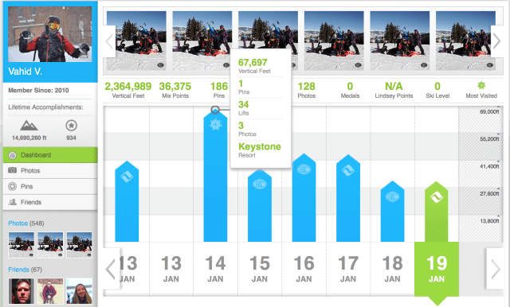

今年的圣诞节假期，我回到了我长大的地方——太浩湖。我有些不情愿地同意在二十年后再次尝试滑雪。我很快就迷上了两件事。首先，肌肉记忆如何持续存在，其次，整个滑雪过程变得更加流畅。从在保存您信息的计算机上输入租赁数据，到有针对性的电子邮件活动，再到防止缆车票欺诈的高级季票扫描，滑雪场已经被数据彻底改变。作为一名数据极客，我迫不及待地想了解数据在多大程度上塑造了现代滑雪体验，以及它如何影响度假村的利润。以下是大数据如何彻底改变滑雪场，以及您可以学到的技巧，无论您的身处哪个行业。

## 利用 RFID 预防欺诈并改善体验

纸质票的时代已经一去不复返了。我上一次滑雪是在 90 年代末，电梯服务员可以使用手持扫描仪，但只有在最繁忙的电梯才会进行安全检查。据《波士顿环球报》报道，滑雪行业没有编制广泛的欺诈统计数据，但 SKI 杂志 2003 年的一项研究估计，总门票收入的 8% 因盗窃而损失。随着 RFID 系统的引入，滑雪场现在可以了解哪些缆车已被使用以及是哪些滑雪者使用过。除了节省滑雪场的资金外，这些系统还改善了滑雪者的体验。RFID代表射频识别；它本质上是一个比一粒沙还小的计算机芯片，可以远距离追踪物品。Biztech报道称，在胡德山牧场的案例中，客户在满意度调查中将缆车等待排在第一位。旋转栅门正在取代人工扫描仪，并节省宝贵的滑雪时间。一些滑雪场，包括我去过的哪个，正在使用 RFID 来增加互动体验。RFID 阅读器会跟踪每一个人，并将他们乘坐的次数、垂直滑行的总高度和在斜坡上的天数制成表格。滑雪者可以在 EpicMix.com 上访问所有的统计数据。他们还可以与朋友和家人竞争，通过实现各种里程碑而赢得虚拟徽章。下面是一个正在运行的仪表板示例。Skier Vahid 是 EpicMix 上得分排名第一的滑雪者。正如您在下图中看到的，Vahid 的仪表板根据垂直脚、缆车、照片和滑雪场位置来划分他每天的行程。他可以与好友竞争，获得特殊徽章，并追踪自己的进度。

## 使用大数据进行预测

还有什么比天气更不可预测的呢？尽管对滑雪场的管理人员来说，有些事情完全失控，但仍有大量数据需要追踪，这些数据可能比雪况更能影响利润。许多顶级滑雪场都在花费宝贵的资源来挖掘消费者行为的大数据。Liftopia 是一家成功的公司，它跟踪和挖掘历史数据以提供动态定价。例如，2013 年 12 月 23 日，Liftopia 分析了 10,300 次关于门票的搜索结果，发现其中 7.3% 的搜索促成了门票销售。首席执行官埃文里斯告诉Eye For Travel公司“获取历史需求数据并将其转换为下一季的数据，然后我们根据度假村、地区等的独特属性，为当季的每一天制定建议的定价策略。” 每天的定价结构都略有不同。另一个使用大数据来增加收入的例子是当你查看季票续订时。Gregg Blanchard，这个广受欢迎的博客——Slopefillers的幕后推手，他们查看季票续订背后的数据，发现每天上山导致续订率增加较高，最佳点在山上 4-6 天之间。那么，您如何鼓励季票持有者多花一两天时间呢？你得有创意。Squaw Valley 向山上的一家餐厅提供了一张免费的礼品卡，给那些低于该续订门槛的季票持有者。礼券的价值只是明年季票价值的一小部分。在市场营销细分方面，斜坡上的大数据起着关键作用。像 Vail 这样的度假圣地，他们利用人们滑雪的天数、他们在哪个滑雪坡上逗留的时间以及他们在度假村的哪些地方花钱等数据，来创建具有高度针对性的电子邮件营销活动。花更多钱在餐饮和水疗上的滑雪者会得到更多的奢侈优惠，而花更多时间在山上的滑雪者会收到通知他们有新的降雪的电子邮件。

## 仪表板的重要性

布兰查德在他的博客中总结了最大的数据挑战，他写道：“无论你找到多么有洞察力的珍宝，它们永远无法告诉你下一步该做什么。” 为了保持竞争力，公司需要利用大数据的力量。麦肯锡报告称，与其他公司相比，数据驱动程度更高的公司生产力提高 5%，盈利能力提高 6%。虽然收集正确的数据至关重要，但仅凭数据本身并不能告诉您什么交易会获得成功。您需要一个了解如何阅读数据、收集见解和进行实验的团队。对于冬季运动、零售或 SaaS 初创公司而言，能够在正确的时间获得正确的数据是关键。在研究这篇文章时，我阅读的几篇采访都谈到了[仪表板软件的重要性](https://www.datafocus.ai/infos/dashboard-software)。您团队中的每个人，从 CEO 到实习生，都需要访问实时数据，以便发现洞察并制定类似滑雪场所强调的策略。我们现在提供30 [天免费试用](https://www.datafocus.ai/console/)。DataFocus使您能够将大量数据转化为有意义的业务洞察力。试一试，然后与我们分享您的成功故事！
