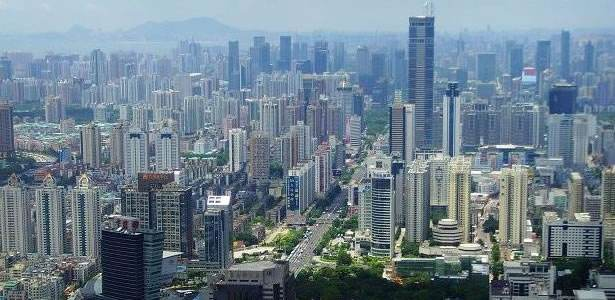

16日—17日召开的深圳市第六届人民代表大会常务委员会第十九次会议，听取并审议了《深圳市2016年度本级预算执行和其他财政收支审计工作报告》。

深圳市审计局局长陈倩雯在作审计工作报告时表示，针对2016年度市本级预算执行和其他财政收支情况，市审计局主要审计了市本级财政管理和决算报表、部门预算执行、重大政策措施贯彻落实、民生项目和重点专项资金管理、国有资本和国有企业运营、政府投资项目建设等方面，市本级财政预算执行良好，财政收支管理总体规范。

不过，在报告审计问题时，陈倩雯也指出了对外股权投资管理不规范、财政实时监控管理不到位、部门决算报表数据不准确等具体问题。

**A 报告**

**市本级财政审计：市财政委对外股权投资管理不规范**

在市本级财政管理审计方面，市审计局主要发现对外股权投资管理不规范、财政实时监控管理不到位、部门决算报表数据不准确等问题。

其中，关于对外股权投资管理不规范，审计报告指出，深圳市财政委2015年12月29日经由深圳市引导基金投资有限公司出资14.99亿元，参股国家中小企业发展基金，超进度支付二、三期出资款10.49亿元。2016年9月23日，国家中小企业发展基金向深圳市引导基金投资有限公司退回上述超付出资款10.49亿元以及产生的利息1752.53万元。市财政委未将上述实际出资的4.50亿元在账上登记为政府对外股权投资，也未将超付出资所产生的利息收缴国库。

关于财政实时监控管理不到位，审计报告指出，深圳市财政委未能有效监管金财核心系统，仍有15家预算单位通过该系统，采用授权支付的方式从单位零余额账户违规向单位自有账户转款，涉及金额57.96万元。市财政委未将市规划国土委的国有土地使用权出让收入和市中级人民法院的诉讼费两项非税收入纳入“深圳市非税收入征收管理系统”统一管理，导致无法实现及时对账、实时查询、全程监控。

**区级财政审计：宝安区政府正在整改投资进展缓慢的项目**

2016年下半年，深圳市审计局对宝安区2015年度财政决算和龙华、坪山两区财政管理情况进行了审计。审计发现的主要问题包括预算编制不够细化完整、结余资金未及时盘活使用、政府投资计划执行进度缓慢等。

报告称，坪山区未按《预算法》要求编制国有资本经营预算。龙华区2015年度财政预算编制有7.88亿元未细化至具体的项目和单位，未下达给区属部门单位。审计指出问题后，坪山区按照《预算法》要求，完成了2017年度国有资本经营预算编制，报区人大批准后实施，国有资本经营预算作为重要组成部分已纳入政府预算。龙华区已将产业专项资金、就业创业专项资金、人才工作专项资金和文化事业发展专项经费纳入区部门预算安排并细化至各相关业务主管单位和项目。

关于政府投资计划执行进度缓慢，报告指出，宝安区2015年由市、区两级下达的政府投资计划项目共计637个，当年安排资金74.07亿元，至2015年底财政实际支付资金22.73亿元，政府投资项目计划整体执行进度缓慢。对此，审计要求宝安区政府加强对政府投资项目计划执行情况的监督检查，加快推进政府投资项目建设。2017年4月，宝安区政府已报送整改进展情况，该区采取了加强投资项目计划管理、督促建设单位按期施工等举措，目前正在落实之中。

**街道财政审计：葵涌17处物业出租无合同**

按照省审计厅的统一部署，深圳市审计局去年组织对街道办事处财政财务收支等情况进行了审计。截至2016年底，共审计了福田区园岭街道、罗湖区莲塘街道等9个街道办事处。审计发现的主要问题包括非税收入管理不规范、预算支出管理不规范、内部控制管理不到位等。

其中，在内部控制管理不到位方面，罗湖区莲塘街道有18项小型工程未以公开招标的方式确定施工单位；大鹏新区葵涌街道和宝安区新安街道有部分工程项目付款审批手续不全；大鹏新区葵涌街道有17处物业对外出租无租赁合同。此外，关于预算支出管理不规范方面，坪山区坑梓街道74个项目预算执行率低于50%，涉及资金2226.18万元；关于非税收入管理不规范，坪山区坑梓街道的非税收入1706.70万元未纳入预算管理，大鹏新区葵涌街道的非税收入110.07万元未及时上交财政。

**政府投资项目跟踪审计：宝荷医院因两次设计失误致投资增加**

2016年，深圳市本级政府投资计划总规模480亿元，涉及800个政府投资项目。2016年7月至2017年6月，深圳市审计局共对轨道交通、水环境整治等310个政府投资项目进行了跟踪审计，审计发现的主要问题包括前期工作不到位造成投资失控、项目施工超合同工期问题较突出、工程建设施工管理不规范等。

关于前期工作不到位造成投资失控，审计报告指出，个别建设项目的概算编制、设计等前期工作中存在失误，造成概算突破，导致投资失控。一是设计单位编制的项目概算不严谨。如葵涌环城西路新建工程项目2010年和2016年概算由同一家设计单位编制，该项目丰树山跨线桥在新设计方案较原方案桥梁长度减少265米、桥跨形式未变的情况下，桥梁钢筋工程量和混凝土工程量反而增加，相应增加工程造价1580万元。二是设计失误导致较大变更。如宝荷医院因设计单位考虑不足，建筑及装饰工程设计变更增加投资1007万元；该项目在概算第一次调整后仍存在较大设计失误，导致地下室等工程施工图设计与初步设计存在较大偏差，增加投资799万元。

**B 特点**

**大数据成审计监督利器**

近年来，在审计任务繁重和审计资源不足的情况下，深圳市审计局将推行联网审计和大数据分析作为实现审计全覆盖的创新手段和独门利器。

本年度审计部门通过市财政委国库集中支付系统数据库，继续对深圳市本级一级预算部门及其下属单位采取联网审计，审计对象扩大到市本级一级预算部门及其下属单位共121个部门475个单位，反映了部分单位违反财经法纪方面的问题。同时，在重大政策措施落实跟踪、专项资金和民生项目等审计实施中，也充分采用大数据分析手段，审计覆盖面和问题揭示力度不断加大，审计工作在发挥保障和监督作用方面取得了更大成效。

**首次反映街道财政收支审计情况**

深圳市今年的审计工作报告突出全省审计一盘棋的工作要求，重点反映了市本级财政管理和决算报表等方面的审计情况，并考虑深圳市人大开展全口径预决算审查监督的要求，在财政管理审计中列表反映了市本级全口径预决算情况，单列章节反映国有土地使用权出让收支审计、国有资本和国有企业审计、政府投资项目跟踪审计的相关情况。

同时，按照市人大要求反映了一般公共预算、政府性基金预算、国有资本经营预算、社会保险基金预算的执行情况，反映了市本级一级预算部门及其下属单位的部门预算执行情况，首次反映了区级财政管理审计和街道财政收支审计情况，有效构建了“横向到边、纵向到底”的财政审计监督体系，财政管理审计进一步得到深化，促进提高财政管理绩效，财政管理审计全覆盖取得了新的进展。

**全面关注国企异地投资**

在中央要求深化国有企业和国有资本审计监督的背景下，深圳市审计局今年加大审计工作力度，审计了2016年度深圳市本级国有资本经营预算执行情况和深圳市投资控股有限公司等10家市属国有企业，重点审计了国有资本经营收益的有关事项，全面关注国有企业异地投资情况。

审计报告在关注往年既有审计内容的同时，聚焦国有企业异地投资运营，重点关注国内投资情况，揭示了国有企业存在对异地投资风险估计不足等问题，要求市属企业加强对异地投资项目的可行性研究和风险评估，严格执行项目评价制度，审慎选择投资合作伙伴，加强投资决策监管和责任追究。审计报告显示，深圳市投控公司下属企业实行债转股改制存在国有资产流失风险等问题，审计要求市投控公司及时处理企业改制后的遗留资产，进一步主张股东权益，抓紧追收债权，确保国有资产安全。

**C 成效**

**整改问题113个涉及资金59.3亿**

审计报告指出，深圳市2016年度本级预算执行和其他财政收支审计事项（不含政府投资项目跟踪审计）共涉及资金5918.12亿元，出具审计报告23份，提出审计意见和建议190条，出具审计决定书10份、涉及问题金额4.90亿元；政府投资项目跟踪审计共审计310个项目，涉及资金203.69亿元，发出审计报告和审计建议函423份，审计核减4.52亿元。共发出移送处理书21份，移送违法违规问题线索32起，涉及金额1亿元。

针对审计发现的问题，被审计单位高度重视，采取措施做好整改工作，截至2017年6月底已整改113个问题、涉及金额59.30亿元。审计报告指出，下一步，被审计单位将继续整改，并将在审计结束后的3个月内向市审计局报送整改情况。深圳市政府将部署落实整改，4个月内向市人大常委会报告整改情况。

**数读**

深圳市2016年度本级预算执行和其他财政收支审计事项（不含政府投资项目跟踪审计）共涉及资金5918.12亿元，出具审计报告23份，提出审计意见和建议190条

出具审计决定书10份，涉及问题金额4.90亿元

政府投资项目跟踪审计共审计310个项目，涉及资金203.69亿元，发出审计报告和审计建议函423份，审计核减4.52亿元。共发出移送处理书21份，移送违法违规问题线索32起，涉及金额1亿元

截至2017年6月底已整改113个问题，涉及金额59.30亿元
