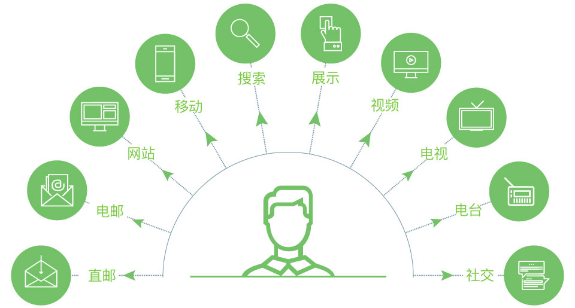
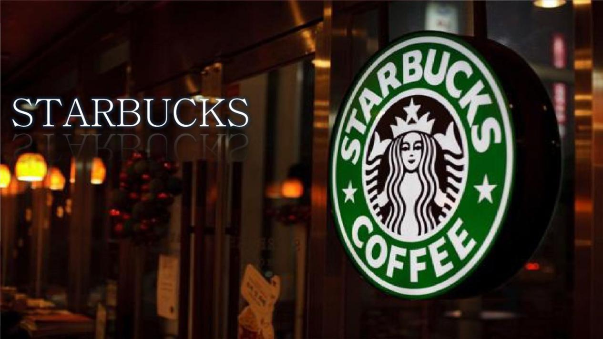
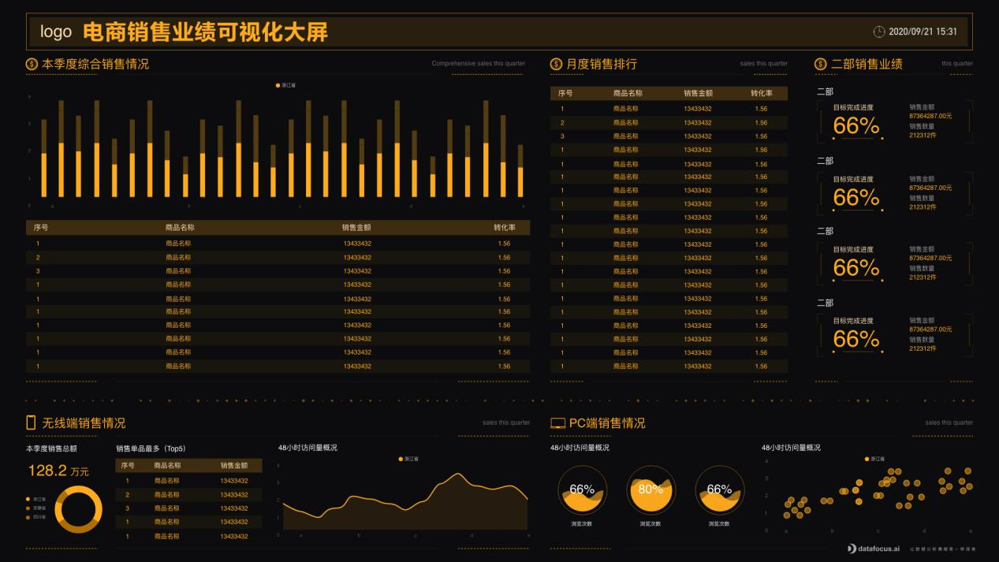

数据是21世纪的石油，分析则是内燃机。

当今信息互联的世界里，大数据无处不在。我们随时会生成一个可以放到网上分析的数据记录，这些数据可以用于帮助跟踪消费者趋势，行为和见解，帮助品牌充分了解每个用户。

这就是说，如果你是一个零售商，那么你需要开始使用大数据，以你的优势，通过数据分析工具掌握和理解它。为了与目标用户建立联系，提供针对其个人需求的有价值的个性化内容，您需要大数据的支持。

大数据提供了有关您的品牌所针对人群的深入信息，并正在以巨大的方式改变零售世界的面貌。

为了帮助您了解大数据对零售业的影响，我们将分享大数据对行业很重要的原因。我们还将深入研究一些有价值的大数据零售使用案例，以生动地描绘这些指标在消费者世界的价值。

**为什么零售领域的大数据很重要？**

我们生活在这样一个时代，大多数消费者不仅精通潮流的科技，还渴望和他们愿意消费的品牌建立情感上的或是经济上的联系。

如今，一招鲜吃遍天的心理是行不通的了。

大数据正在帮助零售商更深入地了解行业前景，使用社交媒体偏好、浏览行为、设备偏好、地理人口统计以及更多的数据指标，品牌正以更有效的方式扩张。

大数据的价值不仅仅是数字零售商独有的。思科发现，仅店内数据分析就为零售业提供了价值 610 亿美元的股权。这意味着，较老的、更传统的实体店获得了新的生机。

通过利用对购物者在店内的消费记录或购买行为的高度精确见解，商业街的实体零售店能够定制他们的销售、交易和营销活动，以满足购物者的需求。它还帮助实体零售商更准确地衡量他们的投资回报率，以帮助商业增长发展。最好的工具，可以帮助你，是一个[零售可视化](https://www.datafocus.ai "零售可视化")大屏，让你很容易地可视化你所有的分析。

很明显，大数据是任何现代零售商的重要组成部分，如果不利用这些信息、见解和指标来获得优势，您就可能面临严重落后于竞争对手的风险。

**使用大数据对您有利**

大数据分析除了能帮助零售行业的人更好地了解他们的客户，使顾客消费生命周期的每个阶段的体验更加个性化之外，它还在其他领域具有显著的好处：

**需求**：通过了解基于数据的客户习惯的见解，零售商可以了解他们的哪些产品和服务最抢手，哪些产品和服务可能停止提供。这些见解不仅可以节省资金和投资地点，而且还将帮助品牌为消费者提供他们想要的东西。

**预测**：趋势预测可以帮助品牌做出关键的市场预测以及预测消费者的消费趋势。由于专业的[数据警报](https://www.datafocus.ai "数据警报")，零售商实时监控需求波动，并可以开发产品，为他们提供最好的投资回报。

**定价**：通过获得有关客户实时交易的见解，零售商可以更好地了解哪些价格能对特定产品产生最佳结果。大数据技术也可用于"减价优化"，即 了解何时应该下降特定产品或服务的价格。零售巨头沃尔玛已经收获了[实时销售](https://www.datafocus.ai "实时销售")的回报，由于它的成功，该品牌正在建设世界上最大的私人云，以深入挖掘其客户的行为。

**跨渠道**：在当今世界，全渠道体验是件大事。随着移动技术和社交媒体变得越来越复杂，消费者渴望通过多种媒体和设备提供价值的零售体验。零售大数据使品牌能够利用从这些各种设备和媒介中提取的见解，创建活动、计划和优惠，创造在数字和物理意义上无缝工作的购买之旅。与不采用全渠道战略的零售商相比，采用全渠道战略的零售商的[年客户保留率要高91%，](https://www.datafocus.ai)这是一个不容忽视的领域。

总之，通过利用大数据分析的优势，您将能够了解客户群的需求和期望，了解需求，预测市场趋势，做出更明智的定价决策，并创造有价值的跨渠道购物体验。反过来，这些努力将以指数级的速度提高您的品牌知名度、客户忠诚度和转化率。

现在，您了解如何使用大数据获得至关重要的竞争优势，让我们来看看零售示例中的一些大数据。

**受益于大数据分析的品牌案例**

在零售领域，许多创新品牌和企业都已经看到利用零售大数据创造优势从而取得巨大成果。以下为您展示受益于大数据分析的具体品牌案例。

**星巴克**

这个咖啡届的巨头不要再怎么隆重介绍了。它的总部设在西雅图的品牌不仅生存，但蓬勃发展，在其几十年的存在。简言之，原因就是创新。

星巴克拥有不可思议的能力，可以在同一街区开设多家分店，并从中获得健康的利润。通过利用大数据分析的优势，星巴克可以通过查看位置、流量、地区人口统计学和客户行为等指标来预测每家新店的增长潜力。

此外，星巴克从每周9000多万笔交易中收集见解，并利用这些数据为客户提供个性化体验，从而激发了创新，包括其量身定制的数字奖励计划，这些奖励计划随着客户购买习惯和购买历史记录而收集的数据越直观。

仅去年一年，星巴克的收入就达[223.9亿美元](https://www.datafocus.ai)，可以说星巴克是一个真正的零售赢家。

## 可视化大屏如何帮助您理解大数据？

正如我们一直以来看到的，利用您的大数据分析将带来更大的业务成功。下面，我们将以您可以理解的方式通过建立重要的零售KPI指标来向您介绍使用这些分析的实际方法：可视化大屏。

随着互联网的出现和普及，消费方式发生了变化，如今96%的中国人在网上购物，而2000年这一数字为22%。这种急剧增加也带来了分析的负载，让您更好地跟踪和理解消费者行为。作为一家零售电商平台，数据收集更容易、更丰富，因此您最好有条不紊地跟踪正确的指标，以避免淹没在信息中，并充分利用信息。

使用上述此类可视化大屏，您可以评估您在订单和销售方面的表现。跟踪您的总订单和每个客户的平均订单，您可以管理库存，以避免产品短缺或溢出。

同样，此仪表板向您展示了完美的订单率，它提供了您业务在交付时的效率（从订单的履行到运输和交付）的见解。这正是您想要跟踪的指标类型，因为它直接影响到客户保留率，并最终影响他们向亲朋好友推荐您的服务的可能性。

最后，您还可以看到产品异常情况以及质量监控，更好地跟进产品质量，为消费者提供更好的服务。

现在，并不是每个零售商都在线上，尽管已经越来越少。但在许多情况下，离线、现实的存在比在线存在更强。它同样重要，需要更多的跟踪，因为数据并不像在线那样容易收集和处理。许多不同的线下实体店，还包括从仓库管理到销售商店本身及其库存。

通过跟踪零售商店中发生的情况，您可以识别某些客户的模式，并根据结果相应地调整策略。了解您的畅销书文章是什么，将让您深入了解什么是时尚的时刻，以及客户喜欢什么。您可以订购类似文章，但也可以通过识别前 10 个项目并监控库存率来防止库存囤积。库存问题是您显然想要避免的情况，因为它会使不满意的客户转向竞争，并损害您的形象。

同样，评估您的总销售额并分解每个类别和每个地点将让您知道您的主要收入点是谁和在哪里。这样，您可以创建自定义活动，这将对受众产生更高的影响，并更好地提升投资回报率。

关键是，大数据是零售业的未来，如果你想在当今乃至未来的世界取得成功，利用丰富的消费者洞察力是必不可少的。如果你不这样做，你站在落后的角落，你的品牌以及你的产品过时得会比你想象的要快。另一方面，使用大数据对你有利，回报可能是无穷无尽的。为了进一步增强您的大数据知识，您可以查看公众号内更多关于零售方面的文章。
