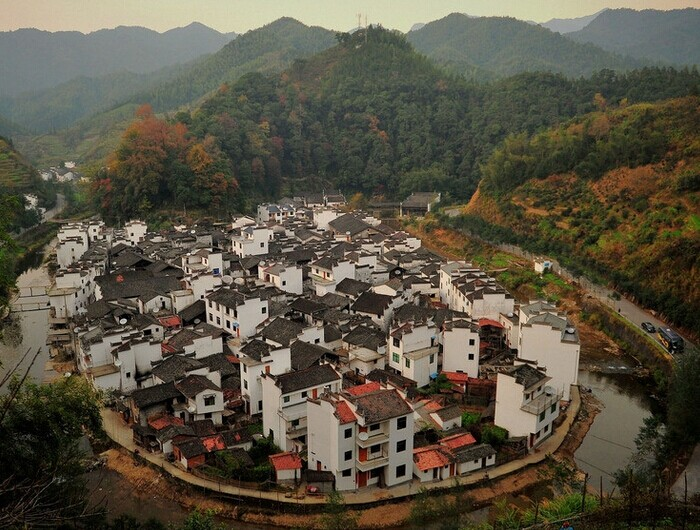

**砥砺前行谋新篇 ，铿锵奋进铸辉煌** 

发展是前行路上不变的真理，过去的五年，在江西是一段全省人民携手攻坚克难、砥砺奋进的不朽征程。

江西省生产总值年均增长9.5%、获省部级以上科技成果788项、全省森林覆盖率达63.1% 位居全国第二、人均可支配收入由2012年的20085元增加到2016年的28673元……过去五年，江西经济发展取得显著成就，生态环境日益优化、民生福祉逐步提升。

如今，江西创新引领、绿色崛起、担当实干、兴赣富民的方针取得可喜成效，一个富裕美丽幸福的“江西样板”形象跃然纸上，江西正在决胜全面建成小康社会的路上奋力迈进。

**关键词：9.5%** 

全省生产总值年均增长9.5%

一直以来，发展不足是江西的主要矛盾，欠发达是江西的基本省情，相对落后是江西的最大现实。

发展经济，犹如逆水行舟，不进则退，慢进也是退，只有不断做大经济总量，才能在前行的路上实现进位赶超。近年来，江西省委省政府紧紧抓住“发展”这个龙头，不断做大经济总量，提高发展质量，经济发展实现新的突破，经济实力显著提高。

2016年，全省生产总值由2012年的12948.9亿元增加到18364.4亿元,跨越4个千亿元台阶。

人均生产总值由2012年的28800元增加到40106元，折合6038美元，实现由2012年的4000美元关口向6000美元大关的重大跨越。

财政总收入由2012年的2046.2亿元增加到3143.0亿元，年均增长11.3%，100个县（市、区）中有86个县级财政收入超10亿元，6个超50亿元。

“年均增长9.5%”，这是五年来全省经济的成绩单，在复杂的国际形势和国内经济下行压力大情况下，江西持续保持中高速增长水平。江西经济变“下行压力”为“逆势而上”，划出了一条条“稳中有进、稳中向好”的上扬曲线，令人振奋。

**关键词：788项** 

获省部级以上科技成果788项

创新是牵引发展的“牛鼻子”，是引领发展的第一动力。只有坚持创新，才能为全省经济社会发展培育新动能、提供强劲的动力引擎。

五年来，江西坚持教育为先、科技为本，大力实施创新驱动发展战略，自主创新能力大幅提高，教育文化等事业全面进步。

近年来，广袤的赣鄱大地，一个接着一个消息令人振奋——

2016年初，国家科技奖励大会在北京举行，江西省12项重大科技成果荣获国家科学技术奖，具有完全自主知识产权的项目数量实现新突破。

“点亮‘中国芯’、不走寻常路！”依托世界一流的国家硅基LED工程技术研究中心，位于南昌的晶能光电，孵化出拥有晶瑞光电、中节能晶和照明等12家企业的硅衬底LED产业集群，年产值高达数十亿元。

2016年底，江风益团队自主研发的硅衬底黄光LED芯片实现突破，黄光LED电光转换效率超20%，远高于国外9.63%的最高水平，使我国LED行业领跑世界。

为培育新动能，江西加大科研经费投入，2016年研究与试验发展（R&D）经费支出207.3亿元，比2012年增长82.4%；获省部级以上科技成果788项，而“硅衬底蓝色发光二极管”技术赫然在列，这是江西省自新中国成立以来科技创新领域的历史性突破。

政府大力构筑、搭建科技创新平台，打造新经济亮点、新产业增长点，2016年，全省搭建创业孵化基地等平台221个，新增国家级创新平台和载体19个，有效的培育新动能。

省发改委专家认为：“江西之所以能实现进位赶超，一个很大的原因就是：近年来，省委、省政府在千方百计做大经济总量的同时，以改革创新为引领，狠抓现代农业，狠抓新兴战略性产业，狠抓现代服务业。经济结构的优化，在抗风险、稳发展上，起到了‘压舱石’的作用。”

变则通，江西经济在促进创新、培育新动能方面已出现了新苗头、新趋势——2016年，江西研究开发经费支出增加25亿元，总量占GDP比重为1.1%；全省专利申请总量增长65.9%，增幅全国第一；专利授权量增长30.3%，增幅是全国平均水平的近3倍。

**关键词：63.1%** 

全省森林覆盖率达63.1% 位居全国第二

吃过早饭，武宁梅香福开始了一天的巡山。51岁的梅香福是九一四林场长坪沟护林点护林员，1986年起就与山林为伴。起初那些年他既护林，也和工人们一起按规定指标伐木，用以解决生计。现在的他，早已放下伐木工具，每天专职巡山护林，查看有无火情、虫害等。

长水村曾是全国林改第一村。“原来是砍树换钱，如今是看树赚钱。游客吃完饭，带点竹笋、香菇、蜂蜜走，生意旺得很。”不少村民表示，加入生态养生旅游行业后，真真切切感受到了“绿水青山就是金山银山”。长水村的“生态饭”吃得有滋有味，靠的就是生态文明这棵枝繁叶茂的大树。

这是江西良好生态环境的一个缩影。近年来，江西省环境质量稳居全国前列，2016年，全省森林覆盖率达63.1%，位居全国第二。

环境秀美一直是江西的优势，保护好“绿水青山”才能有“金山银山”是江西上下的共识。从2013年开始，江西对所有县（市、区）实行科学发展分类考核，建立生态文明建设考核评价体系，逐步提高生态考核权重。2016年，江西再度完善这一综合考核评价方案，提高生态文明类考核指标的权重。

2016年底，在江西省生态文明示范区建设现场推进会上，实行省市县乡村五级河长制，江西省委、省政府主要负责同志分别担任省级“总河长”、副“总河长”，另外7名省领导分别担任赣江、信江、抚河、鄱阳湖、饶河、长江江西段、修河省级“河长”。同时，大力实施“清河行动”，新建改建污水配套管网1535公里。

此外，“保护者受益，受益者补偿”，江西在全国率先实行全境流域生态补偿机制，覆盖全部100个县（市、区），首期筹集补偿资金20.91亿元，成为欠发达地区生态补偿资金筹集力度最大的省份。

把责任落到实处的措施，带来的是全省生态环境进一步优化。目前，主要河流监测断面水质达标率88.6%。全省万元GDP能耗下降4.9%，11个设区市空气环境质量稳定在国家Ⅱ级标准。

7月26日，记者了解到，江西省政府办公厅已正式印发多项有关河长制的工作制度，进一步要求严格落实“河长制”。

**关键词：2637.6万人** 

全省就业人员增加到2637.6万人

发展的最终目的,是为了让百姓过上好日子。五年来，始终坚持民生为先、民生为本，大力推进民生工程建设，促进民生福祉持续增加，人民生活水平有了新提高，民生福祉大幅提升。

2017年2月，井冈山市顺利通过验收，成为全国第一个脱贫摘帽的贫困县，赣鄱齐欢呼，举国同欢腾。这是江西在脱贫攻坚路上的巨大成果，也是江西在脱贫攻坚、助力老百姓走上全面小康路的一个缩影，进一步振奋了赣鄱人民坚决打赢脱贫攻坚战的必胜信心。

江西革命老区是全国扶贫攻坚重点地区，贫困人口数量大，贫困程度深，贫困地区条件差，发展难度大，脱贫攻坚是江西全面小康征程中最艰巨最繁重的任务。为此，江西省委、省政府始终坚持把脱贫攻坚作为最重要的民生工程来抓，大力实施发展脱贫、保障脱贫和健康脱贫“三大攻坚战”，2016年取得了“一个超额、三个显著”的阶段性成效。

此外，2016年，全省就业人员由2012年的2556万人增加到2637.6万人，净增81.6万人。城镇居民人均可支配收入由2012年的20085元增加到28673元，增长42.8%；农村居民人均可支配收入由2012年的8103元增加到12138元，增长49.8%。

每百户城镇居民家庭家用汽车、健身器材、移动电话等新兴消费品拥有量分别比2012年增长1.4倍、54.5%和11.9%，每百户农村居民家庭家用空调、家用电脑、移动电话等新兴消费品拥有量分别比2012年增长1.3倍、66.9%和20.5%。

就在数天前，江西公布2017上半年全省经济运行情况，全省生产总值8961.2亿元，同比增长9.0%，高于全国2.1个百分点；江西省居民上半年人均可支配收入首次破万元。

在一份份枯燥的数据背后，折射的是江西创新引领、绿色崛起、担当实干、兴赣富民的可喜成效，饱含的是前进的力量，未来的希望，江西，过去五年交出的答卷让每一个赣鄱人自豪。

这一份“江西答卷”，反映出江西省委、省政府应对复杂经济局面超强的驾驭力和坚强的领导力；印证了4500万江西人民积极作为、攻坚克难的无畏信念和不懈努力。

如今，一个富裕美丽幸福的“江西样板”形象跃然纸上，江西，正在奋力迈出决胜全面建成小康社会、建设富裕美丽幸福江西的新步伐，以优异成绩迎接党的十九大胜利召开。
