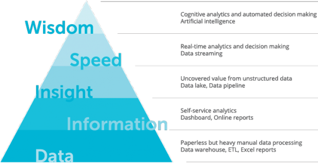

就在几年前，企业组织必须确信大数据是值得投资的现实世界。到2016年，63％的企业领导者表示他们认为大数据和高级分析计划是必要的，以便保持竞争的。今年开始时，Hortonworks和MapR等顶级公司宣布的新大数据项目数量激增，以及一系列新技术上市，包括[Cloudera Kudu--](https://www.cloudera.com/more/news-and-events/press-releases/2017-01-31-cloudera-announces-general-availability-of-apache-kudu-with-release-of-cloudera-enterprise-5-10.html)一种旨在提供企业级可靠性的新工具保持类似NoSQL的性能。

大数据在很短的时间内已经走过了漫长的道路，而且没有放缓的迹象，因此今天的业务领导者可以决定如何在企业环境中[利用大数据趋势](https://www.softserveinc.com/en-us/knowledge-center/machine-learning-big-data-enterprise/)。虽然这不是一件容易的事，但每个新项目的开始可以分为三个部分：初步评估，选择攻击计划，确定具体和可实现的目标。

**评估您的大数据**

当您开始去健身房时，私人教练可以估计您的健康水平，以便根据您的需求建议正确的计划。大数据世界也是如此; 在将更多资源投入新计划之前，在高层次上评估组织的当前数据和决策成熟度级别是有意义的。

数据科学家们提出的[大数据成熟度模型](https://www.softserveinc.com/en-us/blogs/big-data-maturity-model/)探讨了五个级别的数据，从一家已经无纸化但仍然遭受大量手工数据处理的公司开始，包括临时ETL作业和Excel报告，达到“智慧水平”，在有限的监督下自动做出决定。了解您要在哪里确定自己的目标至关重要。

一旦您确定了组织的大数据成熟度级别，现在是时候进一步了解详细信息并找出_组织_的最佳计划以便向前发展。无论您是否仍在将大数据实践集成到您的组织中，或采取分散的方法将大数据和分析作为您的商业智能计划的一部分，在决定哪些方法最有效时，需要考虑两种不同的课程您的目标：自上而下或自下而上的方法。

**自上而下的方法**

大数据程序的真正好处在于您可以使用大量数据。没有资源或适当技能的组织可能发现自己无法充分利用其数据中保存的巨大价值，即使它已妥善存储。在这种情况下，您可以  从“构思和发现”框架开始，在组织内**采用自上而下的方法**。

构思将所有利益相关者聚集在一起，并允许他们生成任何想法，将新方案引入组织的数据或业务数据工作流程。在此会话期间提供的任何内容都应该减轻数据用户的痛点，并使他们更容易操纵数据并为业务增加有意义的价值。

一旦您收集了可以支持您的组织的最具创新性和有益的概念，那么您应该继续进入发现阶段。发现阶段旨在帮助您探索每个想法背后的商业价值，并真正评估在您的环境中实施它的可行性。评估此可行性还包括检查您当前的基础架构是否存在任何差距，确定关键数据源，或者发现将概念从构思阶段转变为行动所需的其他关键组件。当所有利益相关方就可以获得最大商业价值的行动计划达成一致意见时，您可以继续进行验证，实施和部署，确保在必要时获得额外资源以最大限度地提高您的技能。

**自下而上的方法**

查看您的组织后，您可能会认为您的大数据系统更需要刷新而不是整个大修。这是从基础开始，或  **自下而上的方法**，是最有利的。自下而上的方法对于拥有大量现有技术，供应商关系和正在进行的项目的企业公司尤其有用。确保任何新的大数据计划与现有项目和计划一致是至关重要的。

采用自下而上方法的大数据利益相关方应首先评估其传统解决方案以及他们希望改进和优化的实践。自上而下方法的要素可以纳入此处，但核心重点是已经存在的系统，而不是创建新系统来解决从大数据中获取价值的挑战。自下而上和自上而下方法之间的关键区别在于，采用这种基础方法时，重点是系统和功能，而自上而下的方法则侧重于用户及其各自的技能组合。

无论您在查看大数据系统时采取何种方法，都必须制定一个计划，以确保您从保证的大量数据中保留最大价值，以跟上当今新兴产品的生产技术。随着机器学习，人工智能和数据科学在市场采用方面取得巨大进步，您的组织必须制定计划来处理您今天拥有的数据并为明天做好准备。如果您目前没有适当的技能来实施您需要的系统，我强烈考虑引入第三方，既可以协助构思和发现阶段，也可以帮助实施所需的解决方案。

**设定大数据项目目标**

一旦分析了组织的成熟度级别并启动了自下而上或自上而下的方法来了解当前的大数据需求和可能的解决方案，现在是时候启动大数据项目了。我们已经确定大多数项目由于预期定义不正确而失败，因此设置正确的[大数据目标](https://www.softserveinc.com/en-us/blogs/setting-better-goals-for-big-data-projects/)是该流程早期的重要一步。

大数据项目通常利用需要创新方法的现代技术，这也扩展到大数据项目本身的组织。设置大数据项目目标时最常见的错误是试图通过牺牲其余部分来追求大数据系统的其中一个好处，例如，性能有时被认为是最重要的要求，而安全性或数据备份之类的事情明显不属于范围。这可能会导致整个项目的失败。

无论您的公司目前的成熟程度如何，自上而下和自下而上的大数据方法都可以提供全面的数据处理需求视图，并在创建大数据项目路线图期间提供出色的支持。鉴于越来越多的企业在日常运营中利用大数据和高级分析这一事实，投资于能够将组织推向更高水平的[大数据成熟度的项目](https://www.softserveinc.com/en-us/blogs/big-data-maturity-model/)可能是当今企业领导者所做出的最明智的决策之一。在市场上产生巨大的竞争优势。
