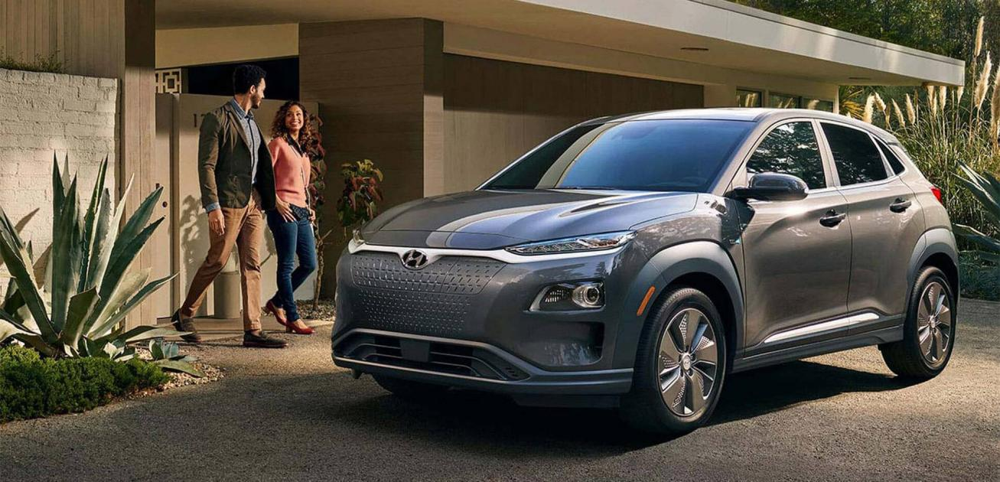
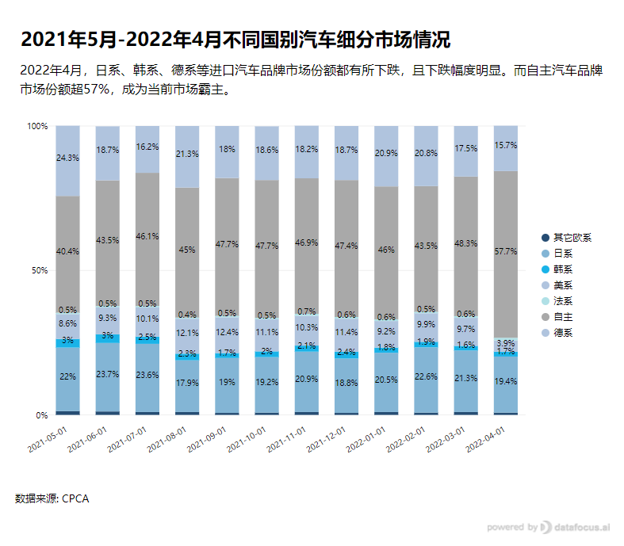
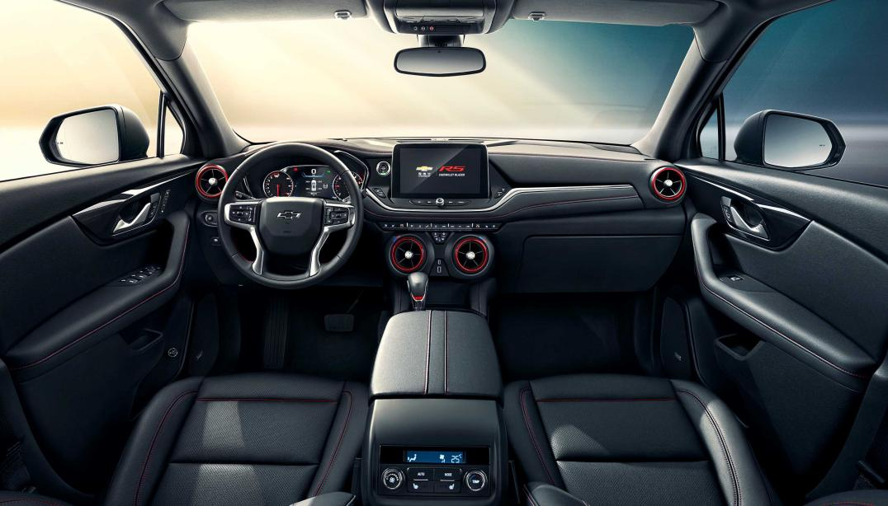
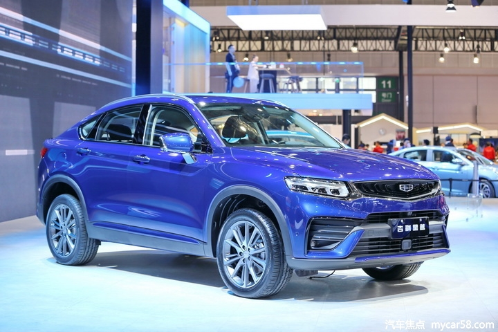

近日，汽车市场又爆出重磅消息。

美系车、日系车乃至德系车集体惨遭“滑铁卢”，而国内自主品牌稳坐市场霸主宝座。

懂车的朋友都知道，之前国内汽车市场基本上一直呈现出的是德系车、日系车和国产车三足鼎立状态。

日系车一直以耐油、高性价比深受车友的青睐，能进销量前十强的汽车基本都是日系，而德系车不用多说，以奔驰奥迪宝马为代表的高端豪车一直受非常多车友的追捧。

那如何会出现当今这样的局面？

小编立马去扒了扒数据，然后用搜索式BI工具DataFocus分析数据看看情况是否属实。

1. **进口汽车品牌市场集体下沉，国产自主品牌上来了**

首先，乘联会公布了最近的各大国别汽车市场数据，利用DataFocus制成的图表中可以清晰地看到，今年4月自主品牌汽车的市场份额已经高达57.7%了。

相比之下，德系的市场份额下跌较大，德系品牌汽车的市场份额下跌至历史最低15.7%。美系汽车原本还在10%的市场份额浮动，现在也下跌至3.9%。而日系品牌汽车的市场份额下跌至19.4%。韩系市场份额都不足2%，法系就更惨了，只有0.7%。

另外，从2022年1-4月狭义乘用车零售销量Top15榜单中可以看到，国产品牌比亚迪是增长幅度最大的，同比增长达169.4%。而销量第一的是一汽大众，销量超50万辆，市场份额高达8.4%。

值得注意的是，在这榜单中，国产自主汽车品牌已经“霸榜”了。

丰田、本田为代表的日系车虽然在榜单中出现不少，但它们的销量也是一跌再跌。以现代、起亚为代表，也曾一度风光的韩系车逐渐被“边缘化”，如今转型新能源也依然没找到出路。而宝马为代表的德系车，虽说也出现在榜单中，可销量和市场份额也在逐渐下滑。

种种迹象都让人不禁疑问，难道是进口汽车不香了？

1. **进口汽车不香了？国产品牌做对了什么？**

其实还真不是进口汽车实力退步了，而是国产汽车实力变强了，导致选择的人更多了。

国产汽车进入国内和国际市场后，各方面条件都很合适，有人就是会愿意买，那就是会抢占原本属于进口汽车的市场份额，从而改变原本的市场格局。

这里总结了几点国产车的优点，吸引了一大批新一代年轻人购买。

1. **动力性能更强大**

以前选择德系车和日系车，是因为确实国产车满足不了需求，动力性能没跟上。但现在国产车手动挡自动挡、不同的排量都更丰富了。像涡轮增压和双离合的搭配原本只有德系车能做到，而现在国产品牌汽车一样能做到了。

1. **配置更丰富，装饰更好看**

在同级别车型中，国产车内部的配置通常是最丰富的。很多人可能不太看重这一点，但实际上丰富的配置还有好看的装饰，往往是最能提升生活幸福感的。

1. **设计感大幅提升，颜值变高了**

性能配置当然是一方面，可现在买车和以前买车可不一样。现在有非常多的年轻人都在考虑买车，车的外观也是很重要的考虑条件。如今汽车的外观设计进步巨大，颜值高也容易吸引到不少人。

1. **性价比高，价格更低**

当然，选车首要考虑的因素当然是钱，大多数人买车还是根据性价比来，毕竟都是工薪阶层，除非真不差钱。不过就算真的有钱，那如果能用更少的钱体验到和进口汽车差不多的体验，又何尝不这么做呢？

时代不同了，如今的国产汽车成了“真香”。

1. **这一届年轻人以国货为光**

现在大家生活水平都变高了，买车的年龄越来越低了，大多数年轻人也不会掏太多钱去买进口车，价格区间基本就在十万左右，而这一价格档的汽车都是国产车居多。

而且当代年轻人的买车消费观也不再是只看牌子了，不是非要奥迪宝马奔驰才叫有面子，不是非要进口车才质量好。能满足日常需求的，手里有的钱又正好够，条件都很合适了自然就会立马下单。

国产品牌并不意味着就低进口品牌一等，毕竟今日的国产品牌早已不是多年前的了。不仅是汽车，还有手机、服饰、护肤品等等，都已经被越来越多的年轻人选择了。

不少年轻人都在以各自的方式支持着国货，当然，只有优质的产品才能在国潮竞争中脱颖而出。

**结语**

最重要的是咱国人的民族自信心更强了，不少人都在高呼，国产的才是最牛的。相信终有一天，会有一批国产品牌涌入国际市场，并拥有不可撼动的地位。对此，你怎么看呢？欢迎评论、转发。
