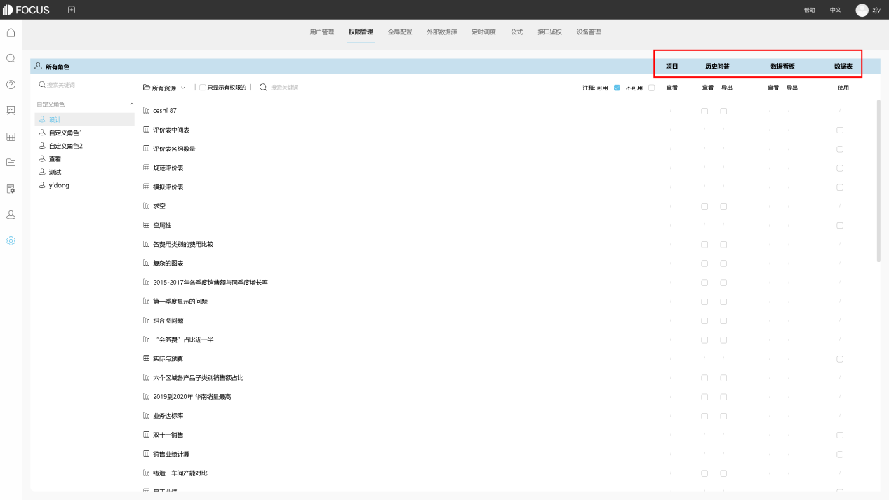

女王节快到了，营销前做数据梳理了吗？

在这个新零售崛起的时代，同样崛起的还有各个平台大促，这些大促大多演变成了属于自己的节日，或者叫大促节日化。比如耳熟能详的双十一大促，变成了狂欢节，3月8日妇女节变成了大促的女王节，还有年中促、新风尚等等关键词。每一个平台大促所驻足的每一家企业都会疯狂抓住这些大促的机会进行营销，以给到用户最好的购买体验和最大的利好。但是营销前的准备工作还是必须的，很多商家对于营销前的数据准备是不充分的，而DataFocus作为数据分析的老司机，在这里分享给各位商家几点大促前的数据梳理建议。

数据梳理主要是客户的数据梳理，然后进行SNS、EDM等营销。用比较土的话可以归纳为一句话：选什么人？发几波？什么时候发？。目前商家大致分三种：1、一波流型。此类多半是拍到脑袋决定，无规划，活动前临时拉一波人群。2、过度细分型。把客户数据过度细分，没有明确目标，工作量大，无从下手分析。3、合理规划型。根据店铺活动内容对应店铺合适的客户人群进行筛选。

那么前两类商家要怎么优化呢，还是三点，1、查看去年女王节回购的客户群画像。2、去年女王节客户人群哪些进入流失期。3、明确今年店铺优质的高转化的人群特点，警惕流失群。

接下来是如何进行梳理分析，第一是复购分析。关于这一点的详细分析思路和维度可以参考以前的文章。这里只做一些提炼。1、大占比人群，分拨个性互动，加深品牌粘度；2、回购低人群，需要提前做唤醒，加深品牌印象；3、回购高人群，重点引导0点购物，赛马保证；

第二是流失分析。1、流失量大地区，重点做区域维护关怀，出针对性政策，利用38策划地区活动；2、流失率高地区着重关注客户声音，预防流失。

最后不要忘记像我们以前说过的那样将客户标签化，比如像下图这样：

最后祝各位女王节大卖！
