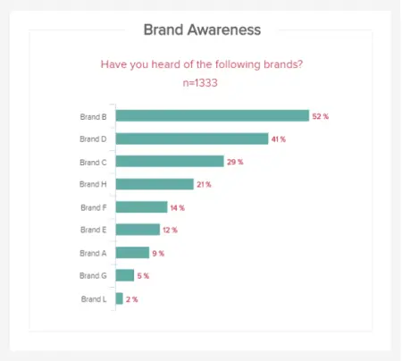
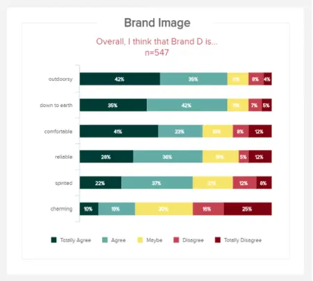
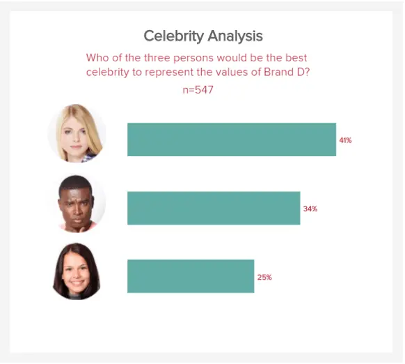
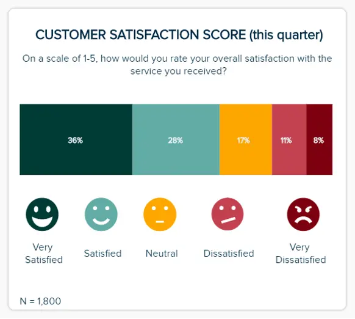
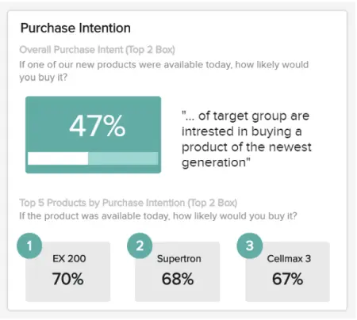
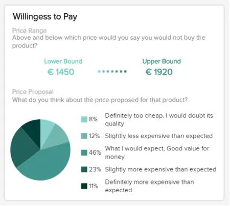
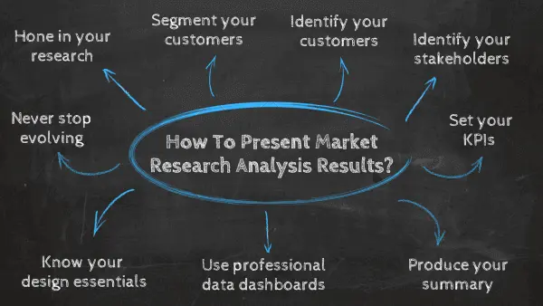

市场研究分析是许多专业人士的首选解决方案，这是有充分理由的：它们可以节省时间，提供新的见解，并明确您的重点业务市场。反过来，市场研究报告将帮助您完善和完善您的策略。此外，精心制作的市场研究报告将使您的工作更具可信度，同时为您向客户或高管提供的任何营销建议增加权重。

但是，尽管情况确实如此，但当今的商业世界仍然缺乏一种有效呈现基于市场的研究结果的方法。PowerPoint的静态，过时的性质使其成为展示市场研究发现的糟糕选择，但它仍然广泛用于呈现结果。

 

幸运的是，事情正朝着正确的方向发展。有[在线数据可视化工具](https://www.datafocus.ai/infos/data-visualization-tools)，可以轻松快速地构建强大的市场研究仪表板。它们在管理结果方面派上用场，但也是任何分析中最重要的方面：所述结果的呈现，没有它就很难做出准确、合理的决策。

在这里，我们考虑进行研究分析的好处，同时研究如何撰写和呈现市场研究报告，同时探索市场研究分析的价值，并最终通过使用专业的[市场研究软件](https://www.datafocus.ai/infos/market-research-analytics)从您的研究结果中获得最大收益。

让我们开始吧。

## 什么是市场研究报告？

市场研究报告是一种[在线报告](https://www.datafocus.ai/infos/online-reporting)工具，用于分析公众对公司、产品或服务的看法或可行性。这些报告包含有价值且易于理解的信息，例如客户调查回复、社会、经济和地理见解。

在典型的市场研究结果示例中，您可以与有价值的趋势进行交互，并深入了解消费者行为，以及使您能够进行有效竞争对手分析的可视化。完整的市场研究报告模板不是将脆弱的数据流添加到静态电子表格中，而是将市场驱动的研究结果变为现实，为用户提供数据[分析工具](https://www.datafocus.ai/infos/data-analyst-tools-software)，以根据一系列消费者驱动的见解创建可操作的策略。

借助数字市场分析报告，您可以使您的业务更加智能、更高效，并最终满足目标受众的需求。反过来，这将大大加速您的商业成功。

## 如何展示您的结果：4 个基本市场研究报告模板

在共享大量宝贵信息时，研究仪表板非常宝贵。

任何值得一提的市场分析报告示例都将使每个人都可以轻松地在单个页面上牢牢掌握他们的结果和发现。这些动态[在线仪表板](https://www.datafocus.ai/infos/online-dashboard)还具有交互式功能，使用户能够深入挖掘特定信息，同时更改人口统计参数，包括性别、年龄和地区，快速过滤结果以专注于与手头任务最相关的信息。

这四个市场研究报告示例不同，但同样重要，涵盖了市场调查报告成功所需的关键要素。您还可以修改每个，并将其用作[客户端仪表板](https://www.datafocus.ai/infos/client-dashboard-report-examples)。

虽然您可以选择多种[类型的仪表板](https://www.datafocus.ai/infos/strategic-operational-analytical-tactical-dashboards)来调整和优化结果，但我们选择了前 3 个仪表板，它们将告诉您有关它们背后故事的更多信息。让我们仔细看看。

### 第1章 市场研究报告：品牌分析

我们的第一个示例分享了品牌研究的结果。为此，对 1333 人的样本进行了调查，我们可以在板的左侧详细查看这些信息，总结了性别、年龄组和地理位置。

在仪表板的中心，我们可以看到市场驱动的研究发现，首先是关于有和没有帮助的品牌知名度，以及主题和名人建议，以了解受众与品牌相关的形象。

此类仪表板非常方便在快照中共享最重要的信息。此外，由于具有交互性（但在图像上看不到），根据某些标准过滤结果甚至更容易，而无需制作数十张PowerPoint幻灯片。例如，我可以通过只选择女性答案来轻松过滤数据，或者只选择25至34岁的人，或者仅选择25-34岁的男性（如果这是我的目标受众）。

主要关键绩效指标：

a） 独立品牌知名度

在这个最强大的报告示例中，第一个[市场研究 KPI](https://www.datafocus.ai/infos/kpi-examples-and-templates-market-research)以独立品牌知名度的形式出现。这个特定的市场研究报告样本 KPI 以逻辑折线式图表呈现，非常宝贵，因为它可以让您清楚地了解人们如何在他们的利基市场中加入您的品牌。

从我们的示例中可以看出，基于特定的调查问题，您可以看到您的品牌在知名度方面如何与竞争对手相提并论。根据这些结果，您可以制定策略来帮助您在行业中脱颖而出，并最终扩大您的受众群体。

b） 辅助品牌知名度

本市场调查报告样本 KPI 侧重于辅助品牌知名度。可视化提供了对某些利基或类别中想到的品牌的大量见解，在这里，您将了解目标消费者正在关注和参与哪些活动和消息。

通过获得这种级别的洞察力，您可以进行有效的竞争对手研究，并为您的产品、促销活动和营销信息获得宝贵的灵感。

c） 品牌形象

在研究报告方面，了解他人如何看待您的品牌是您可以获得的最黄金信息之一。如果您了解人们对您的品牌形象的感受，您就可以采取明智且非常具体的行动，以增强人们查看您的业务和与您的业务互动的方式。

通过提出一个重点突出的问题，这个最直观的 KPI 将让您明确了解受访者是否同意、不同意或未决定与您的品牌形象相关的特定描述或看法。如果您希望以某种方式（可靠、迷人、充满活力等）展示自己和您的信息，您可以看到您如何在竞争中脱颖而出，并了解您是否需要调整您的图像或语气 - 任何现代企业的宝贵信息。

d） 名人分析

该指标是我们顶部的研究[KPI 仪表板](https://www.datafocus.ai/infos/best-kpi-dashboard-examples)的重要组成部分，因为它可以让您直接了解您最有价值的消费者在考虑（或与）您的品牌互动时考虑的名人、影响者或公众人物。

这个有用的指标以易于理解的条形图样式格式显示，不仅可以让您深入了解消费者如何看待您的品牌信息（取决于他们与您的品牌相关的名人类型），还可以指导您应该联系哪些名人或影响者。

通过与您的利基市场中的合适影响者合作，您将显着提高营销活动的影响力和覆盖范围，并在此过程中提高您的商业知名度。这是市场研究报告KPI将实现这一目标。

### 第2章 顾客满意度的市场调查结果

在这里，我们有一些公司应该关心的最重要的数据：他们已经存在的客户以及他们对与品牌关系的看法。当我们知道获得新消费者的成本是留住新消费者的5 倍时，这一点至关重要。

这就是为什么跟踪客户努力得分或净推荐值（消费者推荐您的产品和服务的可能性）等指标至关重要的原因，尤其是随着时间的推移。您需要提高这些分数才能拥有满意的客户，这些客户对他们的朋友和亲戚的影响总是比您任何出色的广告系列都要大得多。查看其他满意度指标，如质量、定价和设计，或他们收到的服务也是一种最佳实践：当涉及到[客户满意度指标](https://www.datafocus.ai/infos/customer-satisfaction-metrics-effort-score-nps-csat)时，您希望全面了解您的绩效。

对于没有太多时间因此需要有效使用它们的管理人员来说，这样的研究结果报告是一个很好的工具。借助这些仪表板，他们可以随时控制长时间运行的项目的数据。

主要关键绩效指标：

a） 净推荐值 （NPS）

任何信息丰富的市场研究报告的另一个关键部分是，您的NPS分数将告诉您客户向同行推荐您的品牌的可能性。

以整体客户满意度为中心，您的 NPS 分数可以涵盖许多部门的职能和输出，包括营销、销售、客户服务，还可以作为[呼叫中心仪表板](https://www.datafocus.ai/infos/call-center-dashboard-reports-and-data-analytics)的构建块。当您考虑如何有效地呈现市场研究时，这种平衡的 KPI 提供了一个大师班。这是合乎逻辑的，它有一个有凝聚力的配色方案，并且可以快速访问重要信息。使用 NPS 分数，客户分为三类：促销员（对您的服务打分 9 或 10 分）、被动者（对您的服务打分 7 或 8 分的人）和批评者（对您的服务打分 0 到 6 分的人）。游戏的目的是获得更多的推广者。通过获得NPS分数的准确快照，您可以创建智能策略，随着时间的推移提高结果。

b） 客户满意度得分

我们市场研究报告 KPI 示例中的下一个示例以 CSAT 的形式出现。绝大多数体验不好的消费者不会回来。如果您想让受众满意并鼓励长期的消费者忠诚度，那么磨练您的 CSAT 至关重要。

这份宏伟、完整的市场研究报告 KPI 将向您展示客户对您的产品或服务特定元素的满意度。掌握这些分数将使您能够在利用现有优势的同时查明非常具体的问题。因此，您将能够采取措施提高您的 CSAT 分数，同时在您的社交媒体平台和网站上分享积极的推荐以建立信任。

c） 客户努力得分 （CES）

在展示市场研究结果时，跟踪您的 CES 分数至关重要。CES 分数 KPI 将让您即时访问有关受众发现互动或发现您的公司的难易程度的信息，基于一到十的简单等级。

通过明确衡量客户如何找到与您的品牌互动的指标，您可以消除用户体验 （UX） 产品中的任何弱点，同时发现任何摩擦、瓶颈或误导性消息。通过这样做，您可以提高您的 CES 分数，满足您的受众需求并提高您的底线。

您的机会：[想测试市场研究报告软件吗？](https://www.datafocus.ai/console/)探索我们的 14 天免费试用并从市场研究报告中受益！

### 第3章 产品创新的市场调研结果

这份最终的市场驱动型研究示例报告侧重于产品本身及其创新。这是一份有用的报告，用于未来的产品开发和市场潜力，以及定价决策。

他们使用与第一份以市场为中心的[分析报告](https://www.datafocus.ai/infos/analytical-report-example-and-template)相同的调查人员样本，回答有关其潜在使用和购买所述产品的问题。这是关于市场将如何接受您将推出的新产品的良好主要反馈。然后是支付意愿，这有助于设定一个价格范围，这个范围不会太便宜而不受信任，也不会太贵。这将是您的定价策略的主要信息。

主要关键绩效指标：

a） 使用意向

我们第一个基于KPI的产品创新市场研究示例以使用意图的形式出现。当您考虑如何撰写市场研究报告时，包括以消费者意图为中心的指标至关重要。

这种简单而有效的可视化不仅可以让您了解用户如何看待您的产品，还可以了解他们是否更喜欢以前的型号或竞争对手的版本。虽然您不应该将所有基于产品的研究都基于此 KPI，但它非常有价值，您应该经常使用它来发挥自己的优势。

b） 购买意向

在查看如何呈现市场研究数据时要考虑的另一个方面是受众购买您的产品的意愿或动机。提供基于百分比的信息，这个有效的 KPI 提供了丰富的一目了然的信息，可帮助您以产品和服务为中心做出准确的预测。

定期分析这些信息将为您提供信心和方向，以制定策略，引导您走向更繁荣的未来，持续满足受众不断变化的需求。

c） 支付意愿

我们的最终市场研究示例 KPI 基于客户根据一组特定参数为特定服务或产品付费的意愿。这种动态可视化以易于遵循的饼图表示，将允许您重新调整产品的价值（USP、功能等），同时设置最有可能带来转化的价格点。这是一个市场研究演示模板，每个现代组织都应该使用它来发挥其优势。

### 4\. 客户人口统计仪表板

这个特殊的市场研究报告模板由现代[仪表板创建器](https://www.datafocus.ai/infos/dashboard-creator)生成，是一个强大的工具，因为它在一个直观的空间中显示了关键人口统计信息的凝聚力组合。

通过分解这些以消费者为中心的信息，您可以获得开发更具影响力的客户沟通的能力，同时在每个渠道或接触点个性化目标受众旅程的各个方面。因此，您可以将理论见解转化为可操作的策略，从而带来显着的商业增长。

这份响应式营销研究报告的每个部分都协同工作，以建立核心受众的档案，从而自信地指导您公司面向消费者的战略。借助基于性别、教育水平和技术采用的深入视觉效果，您可以触手可及地直接与观众交谈所需的一切。

让我们更详细地看一下这个宝贵的市场研究报告示例的关键绩效指标 （KPI）。

a） 按性别划分的客户

此市场研究数据 KPI 高度可视化，可清晰地表示贵公司随时间推移的性别份额。通过访问这些重要信息，您可以为特定受众群体提供更加个性化的体验，同时确保您的消息传递公平、引人入胜且具有包容性。

b） 按教育程度划分的客户

下一个市场分析报告 KPI 提供了客户教育水平的逻辑细分。通过将其用作人口统计标记，您可以改进产品以满足受众的需求，同时以真正与不同客户群产生共鸣的方式制作内容。

c） 按技术采用情况划分的客户

如果您是一家销售技术商品或服务的公司，则特别有价值，此线性 KPI 将向您展示您的客户在技术知识或使用方面的位置。通过随着时间的推移掌握这些信息，您可以以一种为消费者提供直接价值的方式开发您的产品或服务，同时使您的发布或促销活动尽可能成功。

d） 客户年龄组

通过详细了解客户的年龄分布，您可以深入了解他们的偏好。这正是本市场研究报告样本 KPI 的作用。此 KPI 以条形图格式呈现，将为您提供客户年龄范围的完整细分，使您能够建立详细的买家角色并有效地细分您的受众。

## 为什么需要市场研究报告？

正如谚语所说，“在你跳跃之前先看看”——这正是研究报告的目的。作为汽车的前灯，它们将向您展示成功道路上的陷阱和快车道：对特定地理区域内特定细分市场的好恶、他们的期望和准备情况。除其他事项外，研究报告将使您：

- 全面了解市场：了解有关目标市场的更多信息，并了解购买决策中涉及的各种因素。获得更广泛的市场视野可以让您对你不关注的其他公司进行基准测试。反过来，这将使您能够收集最重要的行业数据。这就引出了下一点。
- 以动力策划行业信息：无论您是想重塑品牌、改进现有服务还是推出新产品，时间都至关重要。通过使用现代[BI 报告工具](https://www.datafocus.ai/infos/bi-reporting)创建的最佳市场研究报告，您可以可视化您的发现和数据，以一种不仅可以挖掘隐藏见解而且可以讲述故事的方式格式化它们 - 一种叙述，可以更深入地了解您的利基或行业。市场分析报告的特性和功能将帮助您迅速掌握对您的组织最有价值的信息，从而在此过程中推动您领先。
- 验证内部研究：进行内部分析是一回事，但与第三方进行仔细检查也极大地有助于避免被自己的数据所蒙蔽。
- 使用可操作的数据并做出明智的决策：一旦您了解了消费者行为以及市场、竞争对手以及未来影响行业的问题，您就可以更好地定位您的品牌。将所有这些与收集的定量数据相结合，将使您能够进行更成功的产品开发。要了解有关不同方法的更多信息，我们建议您阅读我们的[数据分析技术](https://www.datafocus.ai/infos/data-analysis-methods-and-techniques)指南。
- 战略规划：当您想要制定全局组织目标、启动新产品开发、规划地域市场扩张甚至并购时，所有这些战略思维都需要坚实的基础来应对随之而来的各种挑战。
- 全面一致性：以更智能、更具交互性和更具凝聚力的方式收集、呈现和分析您的市场研究数据，将确保您的客户沟通、营销活动、用户旅程和产品始终如一地满足受众的需求。结果呢？更快的增长、更高的客户忠诚度和更多的利润。
- 更好的沟通：正确的市场研究分析模板（或多个模板）将使公司中的每个人都能够访问有价值的信息 - 相关且易于理解的信息。当每个人都随着同一鼓点的节奏前进时，他们将更有效地协作，并最终通过强大的[在线数据分析](https://www.datafocus.ai/infos/data-analysis-tools)技术推动企业向前发展。
- 集中化：在最后一点的基础上，使用[商业智能仪表板](https://www.datafocus.ai/infos/bi-dashboard-best-practices)形式的强大市场研究报告模板，将使向外部利益相关者和客户展示您的发现更加有效，因为您可以从一个集中的、高度可视化的交互式屏幕上展示丰富的指标、信息、见解和宝贵的反馈。
- 品牌声誉：在数字时代，品牌声誉就是一切。通过在上述所有关键领域进行重要改进，您将始终如一地满足客户的需求，同时找到从竞争对手中脱颖而出的创新方法。这些是长期成功的关键因素。

您的机会：[想测试市场研究报告软件吗？](https://www.datafocus.ai/console/)探索我们的 14 天免费试用并从市场研究报告中受益！

## 如何呈现市场调研分析结果？

在这里，我们来看看您应该如何展示您的研究报告，考虑与成功所需的结果联系起来所需的步骤：

- 磨练您的研究：

在查看如何在演示文稿中获取消费者研究时，您应该关注两个领域：主要和次要研究。主要研究来自您的内部数据，例如，监控现有的组织实践、销售的有效性以及用于沟通的工具。初步研究还通过评估竞争对手的公司计划来评估市场竞争。次要研究侧重于第三方收集的现有数据、用于执行基准测试的信息和市场分析。这些指标有助于决定公司应该集中精力关注哪些细分市场，或者品牌在消费者心目中的位置。在开始报告过程之前，您应该设定目标，将您的研究细分为主要和次要部分，以掌握您需要处理的信息类型以获得有效的结果。

- 细分您的客户：

为了为您的市场研究报告数据提供更多背景信息，您应该根据调查或反馈结果中概述的偏好或通过检查行为或人口统计数据将客户分为不同的组。

如果您细分客户，您可以定制市场研究和分析报告，以仅显示信息、图表或图形，这些信息、图表或图形将提供有关他们的需求或基于行业的痛点的可操作见解。

- 确定您的利益干系人：

深入分析市场研究分析并细分消费者群体后，重要的是要考虑组织内将从您的信息中受益最大的关键利益相关者。

通过查看内部和外部利益相关者，您将为您的结果提供有效演示的途径，获得了解哪些反馈或数据领域最有价值以及最冗余的工具。因此，您将确保您的结果数据简洁，并满足流程中涉及的每个利益相关者的确切信息需求。

- 设置您的关键绩效指标：

首先，请记住，您的报告应该简洁准确 - 直截了当，不要遗漏任何基本信息。努力确保您的见解干净有序，参与者按相关类别（人口统计、职业、行业、教育等）分组。组织研究、设定目标并清理数据后，应设置 KPI，以确保使用正确的可视化效果填充报表以完成工作。探索我们完整的交互式[KPI 示例](https://www.datafocus.ai/infos/kpi-examples-and-templates)库，获取灵感。

- 生成您的摘要：

为了补充您之前的努力，建议写一份一两页的执行摘要，解释报告的总体思路。然后是通常的身体部位：

- 介绍背景信息、目标受众和目标;
- 定性研究描述了研究的参与者以及他们与业务相关的原因;
- 调查研究概述了所问和回答的问题;
- 用于得出结论的见解和指标的摘要、选择的研究方法以及原因;
- 根据您进行的研究介绍研究结果，并对这些结论进行深入解释。

- 混合使用可视化效果：

在展示您的市场研究结果和发现时，您应该致力于使用文本、图形、图表和交互式可视化的平衡组合。

使用摘要作为指导，您应该决定哪种类型的可视化将最有效地呈现每个特定的市场研究数据（通常，越容易理解和越容易访问越好）。

这样做将允许您创建一个故事，将您的研究信息置于生动、呼吸的环境中，提供您将行业、竞争对手或消费者信息或反馈转化为可操作战略和计划所需的洞察力。

- 使用专业数据仪表板：

要优化以市场研究为中心的数据和发现，您必须使用动态[业务仪表板](https://www.datafocus.ai/infos/dashboard-examples-and-templates)。现代仪表板不仅可呈现和可自定义，而且还将为您提供准确、交互式并产生持久结果的过去、预测性和实时见解。

所有收集行业或消费者信息的市场研究报告公司或企业都将受益于专业数据仪表板，因为它们提供了一种非常强大的方法，以每个人都能理解的方式呈现您的数据。当这种情况发生时，每个人都是赢家。

你知道吗？DataFocus 等现代仪表板的交互性质还提供了轻松快速过滤特定信息口袋的能力，从而可以快速访问宝贵的见解。

- 了解您的设计要点

当您向内部或外部利益相关者展示您的市场研究报告样本时，牢牢掌握基本设计原则将使您的指标和见解更具说服力和吸引力。

通过以平衡和逻辑的格式排列指标，您可以引导用户在需要时准确地找到关键的信息。反过来，这将改善决策和导航，使您的报告尽可能具有影响力。

有关基本提示，请阅读我们的 23[项仪表板设计](https://www.datafocus.ai/infos/dashboard-design-principles-and-best-practices)原则和最佳实践，以增强您的数据分析。

- 不断改进和发展

每次收集或获得新的市场研究报告或市场研究报告情报时，您都应该致力于完善现有的仪表板，以反映您周围不断变化的环境。

如果您根据您进行的新研究和您连接的新见解更新您的报告和仪表板，您将从您的指标中榨取最大价值，并在此过程中享受一致的发展。

## 市场研究报告的类型：初级和次级研究

面对如此多的市场研究示例和如此少的时间，知道如何在压力下最好地呈现您的见解可能会很棘手。

为了从您的市场研究信息中榨取最后一滴价值，并使每个人都能够访问正确的信息，您应该将您的信息分为两大类：初级研究和次级研究。

A. 初步研究

主要研究基于获取与您的行业或部门以及与之相关的客户的直接或第一手信息。

探索性初步研究是信息收集的一种初始形式，您的团队可能会着手确定与您的业务或行业相关的潜在问题、机会和痛点。这种类型的研究通常以一般调查或开放式消费者问答的形式进行。

具体的初步研究是确定的，根据您的业务已经发现的问题、信息、机会或痛点收集的信息。在进行此类研究时，您可以深入了解特定的客户群，并寻求相关机会、问题或痛点的答案。

当您进行初步研究以纳入您的市场研究报告工作时，找到可靠的信息来源非常重要。最有效的主要研究来源包括：

- 基于消费者的统计数据
- 社交媒体内容
- 民意调查和问答
- 基于趋势的洞察
- 竞争对手研究
- 第一手访谈

B. 二次研究

二次研究是指您必须深入了解您的市场和目标消费者的每一条相关数据或公共记录。这些来源包括趋势报告、市场统计数据、以行业为中心的内容以及您可以使用的销售见解。二次研究是收集有关竞争对手的宝贵情报的有效方法。

您可以从以下位置收集非常精确、有见地的二级市场研究数据：

- 公共记录和资源，如人口普查数据、政府报告或劳工统计数据
- 商业数据资源，如 Gartner、Statista 或 Forrester
- 文章、纪录片和采访记录

初级和次级研究的另一个重要分支是内部情报。当涉及到将使您的组织受益的有效市场研究报告示例时，向内看是一个强有力的举措。

现有的销售、人口统计或营销绩效见解将引导您得出有价值的结论。策划内部信息将确保您的市场研究发现是全面的，同时帮助您与最终让您全面了解目标市场的信息建立联系。

通过了解这两种类型的研究以及它们如何为您的业务提供价值，您可以仔细选择正确的信息来源，收集与您的特定利基相关的广泛情报，并最终为您的特定需求选择合适的市场研究报告样本。

如果您根据所进行的研究类型定制市场研究报告格式，您将以一种为合适的人提供正确见解的方式呈现您的可视化，而不是将成堆的事实和数据扔在墙上，希望其中一些坚持下去。

花充足的时间探索一系列主要和次要来源将为您的发现提供真实的背景。通过这样做，您将在组织发展的每个阶段获得大量可操作的消费者和竞争对手见解（在竞争日益激烈的数字时代，这是无价的武器）。

动态市场研究是业务发展的基石，[而仪表板构建](https://www.datafocus.ai/infos/dashboard-builder)器是将这些最重要的见解变为现实的容器。一旦你进入这种心态，你将确保你的研究结果始终提供最大的价值。

## 市场研究报告和分析的常见挑战和错误

我们探索了不同类型的市场研究分析示例，并考虑了如何进行有效的研究。现在，是时候看看市场研究报告的关键错误了。让我们从错误开始。

### 错误

- 策略

阻碍公司市场研究工作成功的最大错误之一是战略。如果不花时间从各种来源收集足够的见解组合并定义您的关键目的或目标，您的流程将变得脱节。您还将严重缺乏组织愿景。

为了使您以市场研究为中心的战略发挥作用，公司内的每个人都必须在同一页面上。您的核心目标和目标必须在整个企业中保持一致，每个人都必须清楚自己的具体角色。如果您努力制定协作战略，并从旅程的一开始就决定您的信息来源，那么您的战略将带来真正的增长和智慧。

- 测量

另一个典型的市场研究错误是测量 - 或者更准确地说，缺乏精确的测量。在开始市场情报收集过程时，许多公司未能选择正确的KPI并为手头的任务设定正确的基准。如果没有明确定义的目标，许多组织最终会得到一种市场分析报告格式，在决策或市场洞察力方面几乎没有价值。

为了通过市场研究工作推动增长，您必须设置明确定义的 KPI，以符合您的特定目标、目的和期望的结果。

- 竞争

许多新公司或规模化公司的一个常见错误是未能探索和检查竞争对手。这会给您留下巨大的信息盲点。要真正从市场研究中受益，您必须从每个可用的关键来源收集有价值的信息。与其只关注您的消费者和更广泛的市场（这非常重要），不如花时间看看您的直接竞争对手在掌握内容和沟通时采用了什么方法。

最有效的方法之一（并避免如此巨大的市场研究错误）是注册竞争对手的邮件列表，下载他们的应用程序并检查他们的社交媒体内容。这将为你自己的努力提供灵感，同时让你利用竞争对手未能填补的市场空白。

### 挑战

- 信息质量

我们可能触手可及的几乎无限丰富的信息见解，但是在市场研究方面，知道要信任哪些信息可能会被证明是一场艰苦的斗争。

在使用指标时，许多公司冒着与不准确的见解连接的风险，或者导致徒劳的信息兔子洞，在此过程中浪费宝贵的时间和资源。为了避免这种事故，与值得信赖的现代市场研究和分析样本合作是唯一的出路。

- 资深人士认同

阻碍组织发展的另一个紧迫的市场研究挑战是高级支持这一简单案例。虽然几乎每个高级决策者都知道市场研究是成功商业战略的重要组成部分，但许多人不愿意投入大量的时间或金钱。

克服此类挑战的最佳方法是构建一个案例，准确定义您的市场研究策略将如何为组织的每个关键方面提供健康的投资回报率，从营销和销售到客户体验 （CX） 等。

- 回复率

低访谈、焦点小组或民意调查回复率会对您的市场研究策略的成功和价值产生严重影响。即使有足够的高层支持，你也不能总是保证你会从早期的面试或民意调查请求中获得足够的回应。如果你不这样做，你的市场研究发现就会有肤浅或提供很少的可操作见解的风险。

为了克服这一共同挑战，您可以提高为市场研究前景提供的激励，同时在更广泛的平台上建立网络以发现新的联系机会。改变广告或电子邮件的语气也有助于提高消费者或客户的回复率。

您的机会：[想测试市场研究报告软件吗？](https://www.datafocus.ai/console/)探索我们的 14 天免费试用并从市场研究报告中受益！

## 让您的报告更进一步

即使它仍然普遍用于市场式的研究成果展示，在这个阶段使用PowerPoint也很麻烦，并且存在许多缺点和复杂性。当总是忙碌的经理或时间紧迫的高层管理人员获取报告时，他们想要一个快速的概览，让他们了解结果，了解实现目标的大局：他们需要一个仪表板。这可以应用于需要快速和交互式数据可视化以支持其决策的业务的所有领域。

我们都知道，图片比简单的文本或数字传达的信息更多，因此设法将它们放在可操作的仪表板上将更有效地传达您的信息。此外，市场研究仪表板具有始终保持最新状态的令人难以置信的优势，因为它们具有实时见解：数十张PowerPoint幻灯片的同步/更新噩梦不再存在。这对于跟踪随时间推移进行的研究特别有用，这些研究经常需要使用更新的数据进行更新。

在当今快节奏的商业环境中，公司必须在新机会出现时识别并抓住它们，同时远离威胁并快速适应。为了始终更进一步并做出正确的决策，进行市场调查以获得所需的信息并自信地做出重要决策至关重要。

我们问过这个问题，“什么是市场研究报告？”，研究了现代市场研究报告示例的动态，有一件事是肯定的：视觉市场研究报告是了解客户的最佳方式，从而通过正面满足他们的期望来提高他们的满意度。

通过查看市场研究报告的样本，很明显，现代仪表板可以帮助您清楚地了解影响您业务的因素，了解您的品牌在市场中的位置，并在产品或服务发布之前衡量您的利基或行业的温度。完成所有研究后，您需要有效地呈现它们，以确保企业中的每个人都能做出正确的决策，从而取得真正的进展：市场研究报告是您在这一问题上的关键盟友。

要开始通过高效、交互式的动态研究报告展示您的结果并在未来的商业战场上获胜，请尝试我们的[仪表板报告软件](https://www.datafocus.ai/infos/dashboard-reporting)，并通过我们的[14 天免费试用](https://www.datafocus.ai/console/)版测试每个功能！
