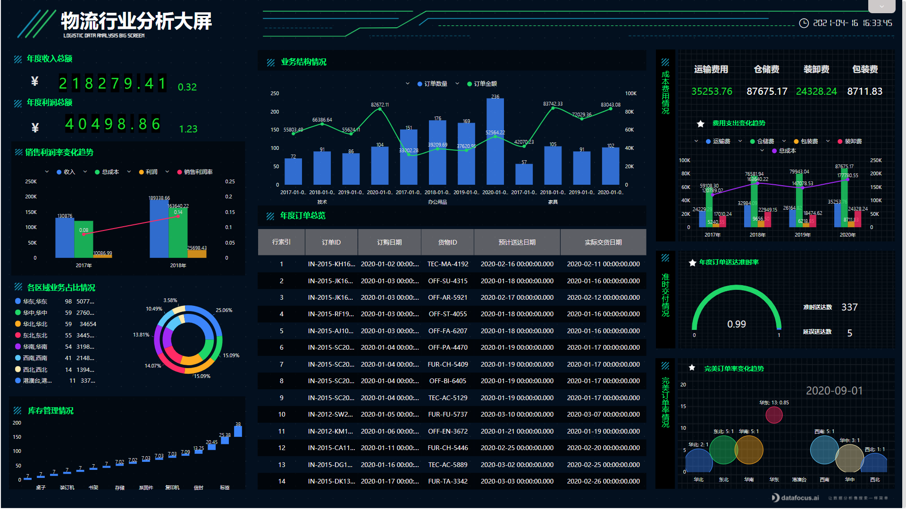

分享一个之前在DataFocus培训中学习用户行为分析的一个分析模型，关于客户价值体系的分析——RFM分析。

在零售行业中，RFM模型是衡量客户价值和客户创利能力的重要工具和手段。该模型通过一个客户的近期购买行为、购买的总体频率以及花了多少钱三项指标来描述该客户的价值状况。

RFM包含以下三个指标：

R（Recency）：客户最近一次交易时间的间隔，最近一次消费时间越近的顾客是最有可能对提供的商品或是服务也最有反应的群体，在互联网产品指标中代表最近一次登录。

F（Frequency）：F代表客户在最近一段时间内交易的次数，最常购买的顾客，也是满意度最高的顾客，在互联网产品指标中代表登录频率。

M（Monetary）：客户在最近一段时间内交易的金额。消费金额是所有数据库报告的支柱，客户的交易度量越大越好，在互联网产品指标中代表在线时长。

个人进行上述三个指标的综合状态分析，可以描绘出个体的状态。而整个用户群体进行上诉三个指标的综合分析，就可以可到产品用户的消费特征群像。

以下图为例

流水号计数代表着客户的消费频次，在观察消费频次和消费金额的基础上，计算出R值，R值代表的是分析节点距离最后一次消费时间的时间间隔。R值越小，代表最后一次消费时间距离分析时间点越近，客户活跃程度高。

在上方的散点图中可以看到，Y轴代表消费次数，X轴表示R值，圆圈大小代表消费金额的多少，一个圆点则代表一个客户。

在这个基础上，你还可以你对你的客户进行分类，研究不同群体的消费特征等，有针对性地开展营销活动，提高企业的经营效益。

具体的RFM模型分析可以参照[https://www.datafocus.ai/16567.html](https://www.datafocus.ai/16567.html" \t "https://www.zhihu.com/question/_blank)
