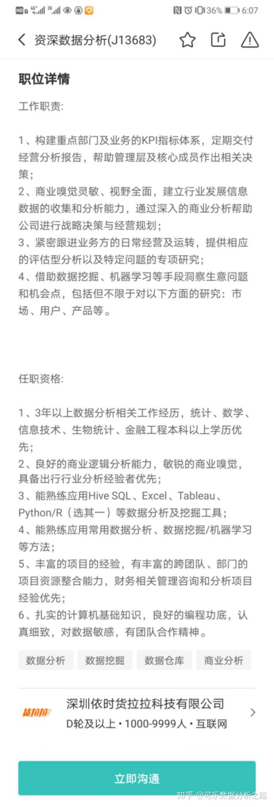

针对不同的对象，我会给出不同的答案。

如果你是数据分析小白，并且对你要分析的领域也知之甚少的话，我建议你先学习下数据分析的基本方法；可以上网找一些别人分析的具体案例，多看几个，也许就能找到共性。比如下面这样的：

如果你是数据分析小白，但是很懂业务；其实你内心已经知道要分析啥了，可恨技术不够、没有办法把你想要表达的数据化、图形化的话。我建议你去找一款容易上手的软件，可以支持你快速地实现想法。比如下面这样的：

搜索式分析，只要你会用百度们，就可以轻松上手！业务员版的三天课程可以说是很贴心了~

如果你不是数据分析小白，但对业务领域不清楚。那没啥办法，赶紧抓紧时间去调研吧！像你题目中提到的运营领域，其实也可以细分为好多不同的类型（新媒体运营、用户运营等等），你得去了解业务模式，根据不同的业务场景定制化你的指标。我觉得前文的帆软老兄所分享的思路还蛮好的。

最后，如果你不是数据分析小白，也对业务领域超级清楚。那我觉得你不太可能来问这个问题...也许只有一种可能，你觉得目前使用的方法和工具不够顺手！既然如此，不妨让DataFocus成为你的新助手！这是国内第一款搜索式大数据分析软件，问答式的交互非常容易激发灵感的，更能帮助你做出更深度的分析报告！当然，性能也是很不错的，具体的产品架构可去官网看下！

[https://www.datafocus.ai/](https://www.datafocus.ai/)

